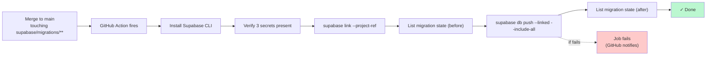

# Tangerine — applying migrations

The Tangerine P1 build adds 18 migrations under `supabase/migrations/`. These do NOT auto-apply on Vercel deploys. They have to be run against the Supabase project explicitly.

## P2 Chunk 5 — one-time Supabase Storage bucket setup

The M29 Document Management module stores file bytes in Supabase Storage bucket `tangerine-documents`. The bucket is NOT created by a SQL migration (the admin role does not own `storage.buckets`); create it once via the dashboard:

1. Supabase Dashboard → **Storage** → **New bucket**
2. Name: `tangerine-documents`
3. Visibility: **Private**
4. Click **Create bucket**
5. Open the bucket → **Policies** tab → add a policy:
   - **Allow authenticated** (or **Allow anon** for the SPA pattern):
     - SELECT / INSERT / UPDATE / DELETE: `(auth.uid() IS NOT NULL OR auth.role() = 'anon')`
   - (Tightening to entity-scoped storage policies is a P10 follow-up; for now the bucket follows the same trust model as the rest of the DB — RLS at the table level is the canonical gate.)

Until the bucket exists, `documentsAPI.attach()` calls will fail with `storage_upload_failed`. The schema migration (`documents` + `document_versions`) can apply independently — only file uploads fail.

## Two paths

### Option A — Supabase dashboard (one-shot, simplest)

1. Open the Supabase dashboard for the project that backs your Vercel deploy.
2. Navigate to **SQL Editor → New query**.
3. Paste the entire contents of [`apply-all-p1-migrations.sql`](apply-all-p1-migrations.sql).
4. Click **Run**.
5. Watch the Results panel for `NOTICE` messages — they confirm row counts (e.g. "Tangerine 4.5: flipped 247 item rows to is_apparel=true").
6. Refresh `https://design-calendar-app.vercel.app/tangerine`. All 6 panels should now load.

The bundle is idempotent (uses `IF NOT EXISTS`, `DROP IF EXISTS`, `COALESCE`, `ON CONFLICT DO NOTHING` throughout). Re-running it is safe — already-applied chunks no-op.

### Option B — Supabase CLI (preferred for ongoing work)

```bash
npm install -g supabase           # one-time
supabase login                    # one-time, opens browser
supabase link --project-ref <ref> # one-time per project
supabase db push                  # applies any new migrations in supabase/migrations/
```

Run `supabase db push` after every Tangerine PR merges. Tracks applied migrations in `supabase_migrations.schema_migrations` so it never double-applies.

## What the 18 migrations do

| # | File | Adds / changes |
|---|---|---|
| 1 | `20260521010000_p1_entities_extensions.sql` | `entities` table: code, currency, fiscal_year, basis, lock, country, metadata cols |
| 2 | `20260521010100_p1_entity_users.sql` | New `entity_users` junction (auth.users ↔ entities) |
| 3 | `20260521010200_p1_entity_id_propagation.sql` | Adds `entity_id` to 13 transactional + master tables; backfills to ROF |
| 4 | `20260521010300_p1_rls_entity_scope.sql` | Canonical `auth_internal_*` RLS policies on all 13 |
| 5 | `20260521020000_p1_gl_accounts.sql` | `gl_accounts` (COA) table |
| 6 | `20260521020100_p1_gl_periods.sql` | `gl_periods` + 120-row bootstrap (FY 2021–2030 × 12) |
| 7 | `20260521020200_p1_journal_entries.sql` | `journal_entries` + lines + triggers (balance/period/control/postable/immutability) |
| 8 | `20260521020300_p1_gl_subledger_balances_view.sql` | Read-only balance aggregation view |
| 9 | `20260521020400_p1_gl_rls.sql` | GL RLS + closed-period trigger |
| 10 | `20260521030000_p1_gl_post_rpc.sql` | `gl_post_journal_entry` + `gl_link_sibling_je` RPCs |
| 11 | `20260521040000_p1_style_master.sql` | `style_master` table + backfill |
| 12 | `20260521040100_p1_ip_item_master_matrix.sql` | 5 matrix dim cols on `ip_item_master` + style_id FK + style_code sync trigger |
| 13 | `20260521040200_p1_category_3level.sql` | 3-level taxonomy on `ip_category_master` |
| 14 | `20260522010000_p1_chunk4_5_apparel_check.sql` | Bottoms-heuristic backfill + `apparel_dims_required` CHECK |
| 15 | `20260522020000_p1_vendors_erp_extensions.sql` | `vendors` ERP cols: code, tax_id, payment_terms, GL FKs, status, address, etc |
| 16 | `20260522020100_p1_entity_vendors_code.sql` | Per-entity `vendor_code` override |
| 17 | `20260522020200_p1_customers_promotion.sql` | RENAME `ip_customer_master` → `customers` + ERP cols + view alias |
| 18 | `20260526010000_p1_t1fix_ensure_rof_entity.sql` | T1-fix: defensive ROF code assignment |

## How to know which migrations are already applied

Run this in Supabase dashboard:

```sql
-- Check each chunk's signature column/table/view
SELECT
  EXISTS (SELECT 1 FROM information_schema.columns WHERE table_name='entities' AND column_name='code')      AS chunk1_entities,
  EXISTS (SELECT 1 FROM information_schema.tables  WHERE table_name='entity_users')                          AS chunk1_entity_users,
  EXISTS (SELECT 1 FROM information_schema.columns WHERE table_name='invoices' AND column_name='entity_id') AS chunk1_propagation,
  EXISTS (SELECT 1 FROM information_schema.tables  WHERE table_name='gl_accounts')                          AS chunk2_gl_accounts,
  EXISTS (SELECT 1 FROM information_schema.tables  WHERE table_name='gl_periods')                           AS chunk2_gl_periods,
  EXISTS (SELECT 1 FROM information_schema.tables  WHERE table_name='journal_entries')                      AS chunk2_journal_entries,
  EXISTS (SELECT 1 FROM information_schema.routines WHERE routine_name='gl_post_journal_entry')             AS chunk3_post_rpc,
  EXISTS (SELECT 1 FROM information_schema.tables  WHERE table_name='style_master')                         AS chunk4_style_master,
  EXISTS (SELECT 1 FROM information_schema.columns WHERE table_name='ip_item_master' AND column_name='inseam') AS chunk4_matrix,
  EXISTS (SELECT 1 FROM information_schema.columns WHERE table_name='vendors' AND column_name='code')       AS chunk6_vendors,
  EXISTS (SELECT 1 FROM information_schema.tables  WHERE table_name='customers')                            AS chunk6_customers,
  EXISTS (SELECT 1 FROM entities WHERE code='ROF')                                                          AS t1fix_rof_exists;
```

Every column should return `true`. If any returns `false`, that chunk's migrations haven't applied — run the bundle.

## Going forward — automated via GitHub Action

Tangerine T1-fix-3 ships `.github/workflows/supabase-db-push.yml`. Every merge to `main` that touches `supabase/migrations/**` triggers it; the workflow runs `supabase db push --linked --include-all` against the project. Manual run via the Actions UI is also supported (with an optional dry-run mode).

### One-time setup

The workflow needs three repo secrets. Set them in **GitHub → repo → Settings → Secrets and variables → Actions → New repository secret**:

| Secret name | Where to get it |
|---|---|
| `SUPABASE_ACCESS_TOKEN` | https://supabase.com/dashboard/account/tokens → **Generate new token** → copy. This is a personal access token, scoped to your user. |
| `SUPABASE_PROJECT_REF` | Open your project in the Supabase dashboard → URL is `https://supabase.com/dashboard/project/<ref>/...` — copy the `<ref>` segment. |
| `SUPABASE_DB_PASSWORD` | Supabase dashboard → your project → **Project Settings → Database → Connection string** → reveal the password. (Or reset it there if you don't have it.) |

### Bootstrap (run-once on the existing prod DB)

Your prod DB currently has migrations applied via the one-shot bundle (Option A above) but Supabase's CLI doesn't know about it — its `supabase_migrations.schema_migrations` tracking table is empty / out-of-sync. Before the GitHub Action's first run can succeed, you need to tell the CLI that the 18 P1 migrations are already applied:

```bash
# One-time, from your dev machine. Install CLI first:
npm install -g supabase
supabase login   # opens browser, paste your access token

# Link to the project:
supabase link --project-ref <your-ref>

# Mark each existing migration as already applied (idempotent):
for v in 20260521010000 20260521010100 20260521010200 20260521010300 \
         20260521020000 20260521020100 20260521020200 20260521020300 20260521020400 \
         20260521030000 \
         20260521040000 20260521040100 20260521040200 \
         20260522010000 \
         20260522020000 20260522020100 20260522020200 \
         20260526010000; do
  supabase migration repair --status applied "$v"
done

# Verify:
supabase migration list --linked
# All 18 should show ✓ Applied
```

After bootstrap completes, the GitHub Action takes over: future Tangerine migration PRs auto-apply on merge.

### What the Action does on each merge



### Manual trigger (for testing or out-of-band runs)

GitHub → **Actions** tab → "Supabase DB push" → **Run workflow** → optionally check "Dry run" → Run. Dry-run mode lists pending migrations without applying.

### Failure recovery

If the Action fails mid-push (e.g. a migration's syntax has a bug, or it conflicts with prod state):

1. Inspect the workflow logs to see which migration failed.
2. Fix the migration in a follow-up PR (still under `supabase/migrations/`).
3. The repair step (idempotent) can also be invoked from your dev machine if a migration was partially applied:
   ```bash
   supabase migration repair --status applied <version>     # mark as done
   supabase migration repair --status reverted <version>    # mark as needing re-run
   ```
