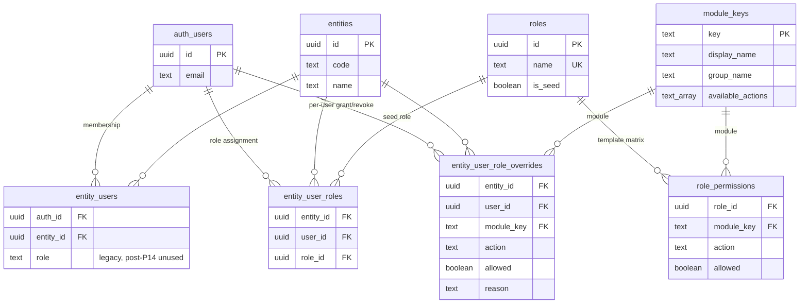

# Tangerine P14 — RBAC Architecture Pass (User Access Setup)

Status: **DRAFT** (2026-05-30). Author: Tangerine architecture stream, branch `plan/rbac-architecture`. Auto-merges on CI green per the standing plan-approval-not-implementation rule.

Operator ask #10 — verbatim: *"Add users access set up so admin can give users limited or full access in detail."*

P14 layers a fine-grained **role-based access control** matrix on top of the multi-tenant scaffold already shipped in P1 (`entity_users`) and P10 (entity switcher + `resolveCallerEntity`). The goal is a single admin panel where the CEO (or any future entity admin) can grant a user `read` / `write` / `post` / `void` / `export` on each of the ~25 top-level modules the Tangerine suite exposes — with default deny and a full audit trail of every grant change.

This is a **DOCS-ONLY** pass per `feedback_plan_approval_not_implementation`. No migrations, no handler edits, no UI code. The deliverable is this single markdown file, an updated MEMORY.md index line, and an operator-confirm gate before any chunk in §6 lands.

---

## 0. Scope guardrails

**In scope (this phase):**

- Per-`(user, entity)` permission matrix sliced as `module × action`.
- Three seed roles — `admin`, `accountant`, `viewer` — with overrideable per-user grants (a user can hold a role *and* still have specific module/action toggles flipped).
- A single admin UI (`InternalUserAccess`) for granting / revoking access in detail, plus a separate role-template editor.
- Middleware enforcement in `api/_lib/auth` so every authenticated internal handler is gated by an `(module_key, action)` check before the handler body runs.
- Client-side menu hiding so users never see panels they can't `read`.
- Audit trail of every grant change written through the existing T11 `row_changes` ledger.
- A staged rollout so day-1 enforcement is silent (log-only) and the cutover to "reject on missing permission" happens only after a parallel-shadow window confirms no false denies.

**Explicitly OUT of scope (deferred or rejected):**

- **Delegation** ("admin A delegates user-management to admin B for 7 days") — punted to P15+.
- **Time-bound grants** (`expires_at` on a grant) — punted; v1 grants are open-ended.
- **IP allowlists / device-bound permissions** — out of scope; security in v1 stays at the auth layer.
- **Field-level RBAC** (e.g. hide `salary` on a customer record) — flagged as an open question in §7; recommendation is to defer to P15.
- **Per-row ACLs** ("user X can only see customer Y's invoices") — explicitly rejected. The entity is the row-isolation primitive; row-level ACL inside an entity is a complexity trap.
- **Replacing `entity_users`** — P14 *extends* P1's junction; it does not replace it. `entity_users (auth_id, entity_id, role)` stays as the membership row; P14's new `entity_user_roles` table is the role assignment layer on top.
- **Vendor portal RBAC** — vendor users already use a different auth path (`vendor_users` + `entity_vendors`) and are isolated per-vendor. P14 covers internal users only; vendor portal RBAC is a separate phase if it ever becomes a need.
- **SSO group → role mapping** — listed as an open question in §7; not built in v1.

**No breaking changes to existing API surface** — every existing handler keeps working. P14 chunks 1 + 2 are additive (schema + silent middleware); chunk 3 flips enforcement and any handler that doesn't declare `module_key` + `action` is treated as "admin-only" until it does.

---

## 1. Existing state (one-paragraph map)

P1 shipped `entity_users (auth_id, entity_id, role)` with `role` as a free-text column constrained to `admin | accountant | staff | readonly`. The T3 OAuth provisioning handler at [`api/_handlers/internal/auth/provision.js`](../../api/_handlers/internal/auth/provision.js) auto-creates an `entity_users (auth_id, entity_id=ROF, role='admin')` row on first Microsoft-OAuth sign-in, which is why every signed-in user today has full access to everything. P10 added [`resolveCallerEntity`](../../api/_lib/auth/resolve-entity.js) — the dispatcher resolves the request's effective entity from the `X-Entity-ID` header (validated against `entity_users` membership) before any handler runs. Client-side, [`src/utils/internalApiAuth.ts`](../../src/utils/internalApiAuth.ts) auto-injects both the bearer token and `X-Entity-ID` on every `/api/internal/**` fetch. There is **no per-action enforcement anywhere** — once you're authenticated and entity-resolved, the handler body trusts you completely. The single existing knob is `entity_users.role`, which gates ~zero handlers in practice. T11's `row_changes` ledger (cross-cutter, ~15 entities covered) is the canonical audit surface and P14 hooks into it for free.

---

## 2. Goals & non-goals

### 2.1 Goals

1. **Admin grants limited or full access per user, in detail.** Operator ask #10 verbatim.
2. **Per-`(user, entity)` scoping.** A user can be `admin` on ROF and `viewer` on SANDBOX; the switcher honors role-per-entity, P14 honors action-per-entity.
3. **Default deny.** A grant that doesn't exist is a denial. No "everything works unless explicitly blocked" mode.
4. **Audit trail.** Every grant added, removed, or changed is captured by T11's universal trigger (`entity_user_roles` opts in via `CREATE TRIGGER ... EXECUTE FUNCTION audit_row_changes_trigger()` in chunk 1).
5. **No breaking change to existing API surface.** Existing handlers keep working; chunk 2 logs silently; chunk 3 flips to reject. Day-1 admin-bypass keeps the CEO unblocked.
6. **One admin UI.** A single `InternalUserAccess` panel (in `Analytics & Admin`) lets the CEO see every user, every module, every action — and edit any cell with one click.
7. **Cheap to extend.** Adding a new module = one row in a config + one declaration on the handler; no schema migration.

### 2.2 Non-goals (v1)

- Delegated user management (admin A → admin B for N days).
- Self-service access requests ("user clicks 'request write on Periods', admin approves in queue").
- Time-bound grants, IP allowlists, device fingerprinting.
- Per-row ACL inside an entity (entity remains the isolation primitive).
- Replacing the `entity_users.role` column — P14 keeps it for back-compat and uses it as the seed-role pointer (see §3.3).
- SSO/SCIM group sync.
- Field-level redaction.

---

## 3. Granularity recommendation — per-MODULE × per-ACTION matrix

### 3.1 The recommendation

Grants are stored as a sparse boolean matrix keyed by `(role_id, module_key, action)`. A user inherits the union of their assigned role's grants plus any per-`(user, entity)` overrides in `entity_user_role_overrides`. Default is deny.

**Modules** (the ~25 top-level menu groups the Tangerine + PO WIP suite exposes today, from a sweep over `src/TandA.tsx` + the Tangerine top-nav):

| `module_key` | Surfaces |
|---|---|
| `style_master` | Tangerine Style Master CRUD |
| `product_master` | Tangerine Product Master |
| `vendor_master` | Vendor directory, vendor portal admin |
| `customer_master` | Customer directory |
| `coa` | Chart of accounts |
| `gl_periods` | Period close panel |
| `je_entry` | Journal entries (draft) |
| `je_post` | Journal entries (post / void) |
| `ar_invoices` | AR invoice list, create, edit |
| `ar_receipts` | AR receipts / cash receipts |
| `ap_invoices` | AP invoices (bills) |
| `ap_payments` | AP payments / runs |
| `bank_recon` | Bank reconciliation |
| `inventory` | Inventory snapshot, adjustments |
| `po_wip` | Tanda PO WIP grid + detail |
| `procurement` | PO origination, receiving, bookkeeper queue (P13) |
| `ats` | ATS allocation / planning |
| `sales_comps` | Sales comps report |
| `costing` | Costing module |
| `gs1` | Prepack label module |
| `tech_pack` | Tech pack (when shipped) |
| `shopify` | Shopify mirror panels (P11) |
| `marketplaces` | FBA / Walmart / Faire (P12) |
| `parallel_run` | P9 parallel-run dashboards + variance |
| `workflows` | Workflow rules + executions / approvals |
| `notifications` | Notification preferences, digest config |
| `users_access` | THIS panel — RBAC admin |
| `audit_log` | T11 cross-entity audit stream |
| `analytics` | Analytics + spend reports + insights + benchmark |
| `compliance` | Compliance docs + automation + audit trail |
| `sourcing` | RFQs + marketplace inquiries |
| `finance_misc` | SCF + virtual cards + FX + tax + discount offers + payments |
| `tenancy_admin` | Entities panel, entity switcher admin |

That's ~32 modules. The list is captured as data in `module_keys` (see §4.6), **not** baked into a CHECK constraint, so adding a module is a single INSERT.

**Actions** (5 verbs, applied uniformly):

| `action` | Meaning |
|---|---|
| `read` | List + detail view. Default deny means the menu item is hidden. |
| `write` | Create + edit drafts. Includes "save as draft." |
| `post` | Move a document from draft → posted / approved / finalized. Used by JE, AR/AP invoices, periods, payments. |
| `void` | Reverse / void / cancel a posted document. The single most audited action; T11 already requires a `reason` for voids per `feedback_t11_reason_required_on_voids`. |
| `export` | Run the universal `<ExportButton>`. Separately gated because export is the data-exfiltration vector — an accountant might be `read` but not `export`. |

Not every (module, action) pair is meaningful — e.g. `analytics × post` is a no-op. The seed table only INSERTs the meaningful pairs (see §3.4); the matrix UI in §5 greys out irrelevant cells.

### 3.2 Why this shape (justification)

| Shape | Why not | Why this is better |
|---|---|---|
| **Coarse role-only** (`admin`/`accountant`/`viewer`) — what we have today | Two accountants in real life have different needs — one posts JEs, the other only enters drafts; one exports the GL, the other can't | Per-action override on top of the seed role keeps the role as the 90% answer and the override as the 10% escape hatch |
| **Per-row ACL** (e.g. "this user can only see customer X's invoices") | Massive complexity, blows up the RLS surface, no operator demand | Entity is the row-isolation primitive; per-row inside an entity has never been asked for |
| **Per-handler ACL** (one grant per `/api/internal/**` endpoint) | ~600 handlers; operator can't reason about the matrix; new handler = new grant row | The handler declares its `(module_key, action)` — one declaration per handler, but the admin UI is still 32 × 5 |
| **Per-table CRUD on the DB** (Postgres row-level GRANTs) | Doesn't model the action layer (`post` vs `write` aren't SQL verbs); doesn't survive RLS; doesn't match the menu mental model | Application-layer enforcement matches the operator's mental model 1:1 — "I see what's in the menu, I can do what the button shows" |
| **Xoro-style coarse role + module-per-role table** | Effectively what we're shipping; we add `action` as a 5-way slice on top | Matches the convention the operator already knows from Xoro, plus the fine-grained verb slice they asked for |

**The headline:** per-module is what every ERP the operator has used does (Xoro, NetSuite, QuickBooks). Per-action on top is the "in detail" half of the operator ask. Default deny + admin bypass on day-1 means the operator never gets locked out while we tune.

### 3.3 Inheritance + override resolution

For a request from `(user U, entity E)`, the effective permission set is computed as:

```
effective_grants(U, E) =
    role_grants(role_of(U, E))     -- the role assigned to U in entity E
  UNION                            -- override file
    overrides(U, E)                -- explicit allow per (module, action)
  MINUS                            -- subtract revocations
    revocations(U, E)              -- explicit deny per (module, action)
```

In other words: the role is the seed; overrides ADD permissions; revocations REMOVE permissions. The "revocations" half lets the admin say *"this accountant should NOT be able to void anything"* without inventing a new custom role.

Cached per-request, computed once at dispatch time, attached to `req.context.permissions`. Cost: one indexed query per request — ~1–3ms based on similar patterns in the codebase.

### 3.4 Seed role shapes

| Role | `read` | `write` | `post` | `void` | `export` |
|---|---|---|---|---|---|
| `admin` | all modules | all modules | all modules | all modules | all modules |
| `accountant` | all modules | all accounting + procurement modules | accounting modules (`je_post`, `ar_invoices`, `ap_invoices`, `ap_payments`, `bank_recon`, `gl_periods`) | accounting modules only | all modules |
| `viewer` | all modules | none | none | none | none |

The `accountant` row is the one the operator will customize most — adding `users_access` (no), `costing` write (maybe), etc. The role template is just a starting point; per-user overrides handle the long tail.

The current `entity_users.role` text column maps 1:1 to the seed role assignment (`role='admin'` → seed `admin` role). The chunk-1 migration backfills `entity_user_roles` from `entity_users.role` so day-1 every existing user gets the same access they have today, no behavior change.

---

## 4. Schema sketch (NOT shipped this PR)

Three new tables. All are entity-scoped (the `_entity_user_roles_` row carries `entity_id`); the `roles` + `role_permissions` tables are entity-agnostic (a role template applies across entities and is shared org-wide).

### 4.1 `roles`

```sql
CREATE TABLE roles (
  id           uuid PRIMARY KEY DEFAULT gen_random_uuid(),
  name         text NOT NULL UNIQUE,           -- 'admin' | 'accountant' | 'viewer' | custom names later
  description  text,
  is_seed      boolean NOT NULL DEFAULT false, -- true for the 3 seed roles; protects against accidental delete
  created_at   timestamptz NOT NULL DEFAULT now(),
  updated_at   timestamptz NOT NULL DEFAULT now(),
  created_by_user_id uuid REFERENCES auth.users(id) ON DELETE SET NULL,
  updated_by_user_id uuid REFERENCES auth.users(id) ON DELETE SET NULL
);
CREATE INDEX idx_roles_name ON roles (name);
```

### 4.2 `role_permissions`

```sql
CREATE TABLE role_permissions (
  role_id     uuid NOT NULL REFERENCES roles(id) ON DELETE CASCADE,
  module_key  text NOT NULL REFERENCES module_keys(key) ON DELETE RESTRICT,
  action      text NOT NULL CHECK (action IN ('read','write','post','void','export')),
  allowed     boolean NOT NULL DEFAULT true,   -- explicit deny is a row with allowed=false; absence is also deny
  created_at  timestamptz NOT NULL DEFAULT now(),
  updated_at  timestamptz NOT NULL DEFAULT now(),
  PRIMARY KEY (role_id, module_key, action)
);
CREATE INDEX idx_role_permissions_role ON role_permissions (role_id);
```

### 4.3 `entity_user_roles`

```sql
CREATE TABLE entity_user_roles (
  entity_id    uuid NOT NULL REFERENCES entities(id) ON DELETE CASCADE,
  user_id      uuid NOT NULL REFERENCES auth.users(id) ON DELETE CASCADE,
  role_id      uuid NOT NULL REFERENCES roles(id) ON DELETE RESTRICT,
  created_at   timestamptz NOT NULL DEFAULT now(),
  updated_at   timestamptz NOT NULL DEFAULT now(),
  created_by_user_id uuid REFERENCES auth.users(id) ON DELETE SET NULL,
  updated_by_user_id uuid REFERENCES auth.users(id) ON DELETE SET NULL,
  PRIMARY KEY (entity_id, user_id)             -- one role per (user, entity); overrides table handles the deltas
);
CREATE INDEX idx_entity_user_roles_user ON entity_user_roles (user_id);
CREATE INDEX idx_entity_user_roles_role ON entity_user_roles (role_id);

-- T11 audit hook — every INSERT/UPDATE/DELETE here writes a row_changes row.
CREATE TRIGGER trg_entity_user_roles_audit
  AFTER INSERT OR UPDATE OR DELETE ON entity_user_roles
  FOR EACH ROW EXECUTE FUNCTION audit_row_changes_trigger();
```

### 4.4 `entity_user_role_overrides`

```sql
CREATE TABLE entity_user_role_overrides (
  entity_id    uuid NOT NULL REFERENCES entities(id) ON DELETE CASCADE,
  user_id      uuid NOT NULL REFERENCES auth.users(id) ON DELETE CASCADE,
  module_key   text NOT NULL REFERENCES module_keys(key) ON DELETE RESTRICT,
  action       text NOT NULL CHECK (action IN ('read','write','post','void','export')),
  allowed      boolean NOT NULL,               -- true = grant, false = revoke
  reason       text,                           -- optional; appears in audit + matrix tooltip
  created_at   timestamptz NOT NULL DEFAULT now(),
  updated_at   timestamptz NOT NULL DEFAULT now(),
  created_by_user_id uuid REFERENCES auth.users(id) ON DELETE SET NULL,
  updated_by_user_id uuid REFERENCES auth.users(id) ON DELETE SET NULL,
  PRIMARY KEY (entity_id, user_id, module_key, action)
);
CREATE INDEX idx_eur_overrides_user ON entity_user_role_overrides (entity_id, user_id);

-- T11 audit hook
CREATE TRIGGER trg_eur_overrides_audit
  AFTER INSERT OR UPDATE OR DELETE ON entity_user_role_overrides
  FOR EACH ROW EXECUTE FUNCTION audit_row_changes_trigger();
```

This is the "in detail" half of operator ask #10 — the admin picks a user, sees the seed role's matrix, and adds/removes individual `(module, action)` cells. Each toggle is one row here.

### 4.5 `entity_users` — kept, deprecated `role` column

`entity_users` stays untouched. Its `role` text column is read once by the chunk-1 backfill to seed `entity_user_roles`, then left in place for back-compat. No application code reads it after chunk 1; a v2 chunk could drop it.

### 4.6 `module_keys` — canonical module list

```sql
CREATE TABLE module_keys (
  key          text PRIMARY KEY,               -- 'je_post', 'ar_invoices', etc.
  display_name text NOT NULL,                  -- 'Journal Entries — Post', 'AR Invoices'
  group_name   text NOT NULL,                  -- 'Accounting', 'Vendors', 'Operations' — matches TandA.tsx VENDOR_MENU_GROUPS
  sort_order   smallint NOT NULL DEFAULT 0,
  description  text,
  available_actions text[] NOT NULL DEFAULT ARRAY['read','write','export']::text[]
                                                -- which of the 5 actions are meaningful for this module
);
```

`available_actions` is what lets the admin matrix UI grey out `analytics × post` while still showing `analytics × read` and `analytics × export`.

### 4.7 Mermaid — entity relationships



### 4.8 Seed roles + permissions (chunk 1 INSERTs)

The chunk-1 migration:

1. Creates `module_keys` rows for all ~32 modules listed in §3.1.
2. Creates the 3 seed `roles` rows (`admin`, `accountant`, `viewer`) with `is_seed=true`.
3. Fills `role_permissions` per §3.4 — `admin` gets every meaningful `(module, action)` pair set to `allowed=true`; `viewer` gets only `(module, 'read')` rows; `accountant` gets the middle band.
4. For every existing `entity_users` row, INSERTs an `entity_user_roles (entity_id, user_id, role_id)` row mapping `entity_users.role` to the seed role of the same name (defaulting to `admin` if NULL or unknown, to preserve day-1 behavior — the operator's "no breaking change" rule).

No `entity_user_role_overrides` rows are seeded; the override table is empty until an admin starts editing the matrix.

### 4.9 RLS

All four new tables (`roles`, `role_permissions`, `entity_user_roles`, `entity_user_role_overrides`, `module_keys`) carry the canonical RLS template from P1 §3.3:

- `anon_all_*` — internal SPA via anon key reads everything (the menu-render path needs to read `module_keys` and `role_permissions` to decide what to show).
- `auth_internal_*` — authenticated reads scoped to `entity_users` membership (so a user signed in only on ROF can't list users on SANDBOX).
- **Plus a tighter write policy** on `entity_user_roles` + `entity_user_role_overrides`: only callers whose effective permission set includes `users_access × write` may INSERT/UPDATE/DELETE. Enforced via a SECURITY DEFINER helper `has_permission(auth_id, entity_id, module_key, action) RETURNS boolean` that the policy `WITH CHECK` clause calls. (The helper is the same one the middleware uses — defined once, called from RLS + middleware.)

---

## 5. Enforcement path

### 5.1 Server middleware — `api/_lib/auth/permissions.js`

New module, called by the dispatcher after `resolveCallerEntity`. Shape:

```
// pseudocode — actual implementation is chunk 2
loadEffectivePermissions(authId, entityId) -> Set<`${module_key}:${action}`>
  -- one indexed read; cached on req.context.permissions for the request lifetime

requirePermission(req, moduleKey, action) -> 200 | { status: 403, error: 'permission_denied', module, action }
  -- called at the top of every handler; chunk-2 logs only, chunk-3 rejects
```

The dispatcher resolves `req.context.permissions` once per request. The cost is a single indexed query against a 3-table view `v_effective_permissions (user_id, entity_id, module_key, action, allowed)` — materialized by a SQL function (`compute_effective_permissions`) that applies the role → role_permissions → override resolution from §3.3.

### 5.2 Handler declaration pattern

Each handler declares its `(module_key, action)` via a thin wrapper. Two options, chosen by what reads cleanest:

**Option A — wrapper function (recommended):**

```js
// api/_handlers/internal/journal-entries/post.js
module.exports = withPermission('je_post', 'post', async (req, res, ctx) => {
  // handler body — runs only if requirePermission passed
});
```

**Option B — directory convention:**

`api/_handlers/internal/<module_key>/<action>.js` — the dispatcher infers `(module_key, action)` from the file path.

Recommendation: **Option A**. Directory convention is brittle (file-rename = silent permission change); explicit declarations are auditable via grep.

A one-time codemod (chunk 2) wraps every internal handler with `withPermission`, defaulting to `(matching_module, 'read')` for non-mutating handlers and the operator-curated mapping otherwise. The codemod ships as a script + a static-analysis report listing every handler and its inferred `(module_key, action)` for operator review.

### 5.3 Client — menu hiding

`src/TandA.tsx` `VENDOR_MENU_GROUPS` (and the Tangerine top-nav) read `effective_permissions` from `useEffectivePermissions(currentEntityId)` — a hook backed by a single `/api/internal/users/me/permissions` endpoint that returns the user's permission set for the current entity. Menu items hide when the user lacks `read` on the corresponding `module_key`. Buttons inside panels (the `Post`, `Void`, `Export` buttons) hide on missing `post` / `void` / `export`.

Per-component pattern:

```jsx
{can('je_post', 'post') && <button onClick={postJE}>Post</button>}
```

The `can()` helper is a thin wrapper over the permissions Set returned by the hook — no client-side trust; the server enforces the same check on every request.

### 5.4 Why two layers (server + client)

The server is the only enforcement that matters; the client hide is for UX (don't show a button that will 403). Per the CLAUDE.md domain rules ("Enforce this at the middleware layer, not inside route handlers"), the auth/permission decision happens once at dispatch and the handler body trusts the dispatcher.

---

## 6. Admin UI sketch — `InternalUserAccess.tsx`

A new panel under the `Analytics & Admin` menu group (joining `analytics`, `spend`, `workflow_rules`, `workflow_executions`, `entities`).

### 6.1 ASCII sketch

```
┌──────────────────────────────────────────────────────────────────────────────────┐
│ 🔐 User Access — entity: ROF                                          [Save] [×] │
├──────────────────────────────────────────────────────────────────────────────────┤
│ Users                  │  eran@ringoffireclothing.com    Role: [admin       ▼]   │
│ ┌────────────────────┐ │  ┌────────────────────────────────────────────────────┐ │
│ │ 🔍 search…         │ │  │ Module                  │read│write│post│void│exp│ │
│ │                    │ │  │─────────────────────────┼────┼─────┼────┼────┼───│ │
│ │ ★ eran@ringoffi…   │ │  │ ▾ Accounting                                       │ │
│ │   accountant@…     │ │  │   COA                   │ ■  │ ■   │ ─  │ ─  │ ■ │ │
│ │   designer@rof…    │ │  │   GL Periods            │ ■  │ ■   │ ■  │ ■  │ ■ │ │
│ │   viewer@rof.co    │ │  │   JE Entry              │ ■  │ ■   │ ─  │ ─  │ ■ │ │
│ │                    │ │  │   JE Post/Void          │ ■  │ ■   │ ■  │ ■  │ ■ │ │
│ │                    │ │  │   AR Invoices           │ ■  │ ■   │ ■  │ ■  │ ■ │ │
│ │                    │ │  │   AR Receipts           │ ■  │ ■   │ ■  │ ■  │ ■ │ │
│ │                    │ │  │   AP Invoices           │ ■  │ ■   │ ■  │ ■  │ ■ │ │
│ │                    │ │  │   AP Payments           │ ■  │ ■   │ ■  │ ■  │ ■ │ │
│ │                    │ │  │   Bank Recon            │ ■  │ ■   │ ■  │ ■  │ ■ │ │
│ │                    │ │  │ ▾ Master Data                                      │ │
│ │                    │ │  │   Style Master          │ ■  │ ■   │ ─  │ ─  │ ■ │ │
│ │                    │ │  │   Product Master        │ ■  │ ■   │ ─  │ ─  │ ■ │ │
│ │                    │ │  │   Vendor Master         │ ■  │ ■   │ ─  │ ─  │ ■ │ │
│ │                    │ │  │   Customer Master       │ ■  │ ■   │ ─  │ ─  │ ■ │ │
│ │                    │ │  │ ▾ Operations                                       │ │
│ │                    │ │  │   PO WIP                │ ■  │ ■   │ ■  │ ■  │ ■ │ │
│ │                    │ │  │   Procurement           │ ■  │ ■   │ ■  │ ■  │ ■ │ │
│ │                    │ │  │   ATS                   │ ■  │ ■   │ ─  │ ─  │ ■ │ │
│ │                    │ │  │   Inventory             │ ■  │ ■   │ ■  │ ■  │ ■ │ │
│ │                    │ │  │ ▾ Admin                                            │ │
│ │                    │ │  │   Users Access          │ ■  │ ■   │ ─  │ ─  │ ■ │ │
│ │                    │ │  │   Audit Log             │ ■  │ ─   │ ─  │ ─  │ ■ │ │
│ │                    │ │  │   Tenancy               │ ■  │ ■   │ ─  │ ─  │ ■ │ │
│ │                    │ │  │   Workflows             │ ■  │ ■   │ ─  │ ─  │ ■ │ │
│ │                    │ │  └────────────────────────────────────────────────────┘ │
│ └────────────────────┘ │  Legend: ■ allowed   □ denied   ─ N/A   ◆ override     │
└──────────────────────────────────────────────────────────────────────────────────┘
```

**Interactions:**

- **Left column** — searchable user list (the rows are `entity_users` for the current entity). Star marks the currently signed-in user; orange dot marks users with overrides.
- **Right column** — module × action matrix. Modules are grouped by `module_keys.group_name`. Sections are collapsible.
- **Role dropdown** at the top right — picks the seed role. Switching seed roles rebuilds the matrix to the new template; existing overrides survive (with an "overrides preserved" toast).
- **Click any cell** — toggles allow/deny. The toggle is recorded as a row in `entity_user_role_overrides`; the cell border turns orange (◆) to signal "override active." Clicking again removes the override (back to role default).
- **Save** — batch persists overrides + role changes. T11 trigger captures every row.
- **Entity context** — the header shows which entity is in scope (driven by the existing `EntitySwitcher`). To edit a user's permissions on a different entity, switch entity first.

### 6.2 Separate role-template editor — `InternalRoleTemplates.tsx`

A second panel for editing the `role_permissions` matrix of each seed role. Same matrix shape but the scope is the role, not the user. Editing here changes every user assigned that role (with a "12 users affected" confirmation). The 3 seed roles are protected from delete; admins can create new custom roles here (`is_seed=false`).

### 6.3 Day-1 admin bypass

While chunks 1–3 land, every existing `entity_users` row is mapped to the `admin` seed role, which has every cell green. The CEO sees no behavior change. Chunks 2–4 ship enforcement progressively; the CEO can revoke admin from a specific user via the UI at any time after chunk 3.

---

## 7. Migration / rollout plan

| Chunk | What lands | Behavior change | Verification |
|---|---|---|---|
| **P14-1** | Schema (5 tables: `roles`, `role_permissions`, `entity_user_roles`, `entity_user_role_overrides`, `module_keys`), `has_permission()` helper, `compute_effective_permissions()` view, T11 trigger hooks, seed data per §4.8. Backfill: every existing `entity_users` row gets an `entity_user_roles` row mapping its `role` text to the seed role of the same name (or `admin` if NULL/unknown). | **None.** Tables exist, every user maps to seed `admin`, no enforcement layer yet. | SQL probe: `SELECT count(*) FROM entity_users eu LEFT JOIN entity_user_roles eur USING (entity_id, user_id) WHERE eur.role_id IS NULL` returns 0. RLS: anon-keyed read of `role_permissions` returns 3 × N rows. T11 row_changes captures a test INSERT to `entity_user_role_overrides`. |
| **P14-2** | Middleware `loadEffectivePermissions` + `requirePermission` + `withPermission` wrapper. Codemod every internal handler with operator-reviewed `(module_key, action)`. **Log-only mode** — failed permission checks write to a new `permission_denials_log` table but do NOT 403. Includes the `/api/internal/users/me/permissions` endpoint for the client. | **None for users.** Operator can monitor `permission_denials_log` for 1–2 weeks and tune the seed roles before flipping enforcement. | All existing handlers continue to respond. `permission_denials_log` count over a representative workload is reviewed by operator before P14-3 ships. Codemod report (one PR per ~50 handlers) is review-merged independently. |
| **P14-3** | Flip enforcement: `requirePermission` returns 403 on missing grant. Ship `InternalUserAccess` admin UI + `InternalRoleTemplates` role-template editor. Add the `users_access` and `audit_log` modules to the menu (admin-only by default). | **Enforcement live.** Users without `read` on a module get 403 from the API. Admins use the UI to grant/revoke. CEO still has `admin` role and is unaffected. | Negative test: a `viewer`-role user gets 403 on `/api/internal/journal-entries/post`. Positive: `admin` user posts JE successfully. T11 audit log shows the grant changes made during the test. |
| **P14-4** | Client-side menu hiding + per-panel button hiding driven by `useEffectivePermissions`. | UX cleanup — users no longer see menu items they can't access. | Manual: sign in as `viewer` on SANDBOX, confirm the menu shows only `read`-allowed modules. Sign in as `admin` on ROF, confirm full menu. |

Each chunk is a separate PR with its own CI green + auto-merge. P14-1 + P14-2 can ship in parallel (P14-2 imports the helper P14-1 defines, but the codemod itself is independent of the schema). P14-3 + P14-4 must follow P14-2.

**Rollback plan:** every chunk is reversible. P14-1 = drop 4 tables + 1 view + helper. P14-2 = unwrap handlers (the codemod's reverse pass is part of the chunk-2 PR). P14-3 = flip middleware back to log-only. P14-4 = remove the menu-hide guard.

---

## 8. Open questions for operator (mark before P14-1 ships)

| # | Question | Recommended default if no answer | Why it matters |
|---|---|---|---|
| **Q1** | **Should a super-admin role exist (cross-entity)?** E.g. the CEO is `admin` on every entity automatically without needing an `entity_users` row per entity. | **No.** Stay with one `entity_users` row per (user, entity); the operator gets `admin` rows on every entity at provision time. Avoids a "magic backdoor" that bypasses the audit trail. | Affects schema (`roles.is_super_admin` flag) and the resolver. If yes, the answer is simple but it must be designed in chunk 1, not bolted on later. |
| **Q2** | **Self-service request flow vs. admin-only grants?** Should a user be able to click "Request `write` on Periods" and create a queue entry the admin reviews, or are grants admin-initiated only? | **Admin-only for v1.** Self-service adds a queue panel, notification path, and approval UI — easily a P15 chunk on its own. v1 ships the admin matrix; self-service requests come later if needed. | If yes, we need `permission_requests` table + admin queue panel + notification wiring. Easy to add later if not built now (purely additive). |
| **Q3** | **SSO / SCIM integration timing?** When the operator adds users via Microsoft Entra / Okta in the future, should group membership auto-map to a Tangerine role? | **Punt to P15.** Provisioning today is Microsoft OAuth at first sign-in, which auto-creates an `entity_users` row with `role='admin'` (see [`api/_handlers/internal/auth/provision.js`](../../api/_handlers/internal/auth/provision.js)). For v1, every new auto-provisioned user lands on `admin` (preserving today's behavior); admin then downgrades them via the matrix UI. | If yes in v1, we need a `sso_group_role_map` table + a provisioning-time lookup. Punting is safe because the manual downgrade path covers the gap. |
| **Q4** | **Field-level RBAC — in scope or P15+?** E.g. hide `salary` on the employee record, hide `bank_account_encrypted` on the vendor record, redact PII columns from `export`. | **Punt to P15+.** v1's `export` action gates the entire export; column-level redaction is an order of magnitude more complex (per-column allow lists, per-render redaction in `<RowHistory>`, per-handler response masking). The two PII columns that exist today (`tax_id`, `bank_account_encrypted`) are already AES-encrypted at rest per CLAUDE.md; v1 enforcement is "can/can't see the record at all." | If yes, the schema gains `field_permissions (role_id, module_key, field_name, action, allowed)` and every response handler needs a redaction pass. Significant work; recommend deferring until a concrete operator demand surfaces. |

---

## 9. Verification — "P14 is done" gate

P14 is complete when:

1. **Schema applied:** 5 new tables exist, RLS policies match the canonical P1 template, T11 triggers fire on `entity_user_roles` + `entity_user_role_overrides`, seed data is in place.
2. **Backfill clean:** every existing `entity_users` row has an `entity_user_roles` row. Negative test SQL returns 0 orphans.
3. **Middleware enforcement:** a `viewer`-role user gets 403 from a `post`-action endpoint; an `admin` succeeds; the override path works (admin grants `viewer` user a one-off `je_post:post` → succeeds).
4. **Admin UI:** `InternalUserAccess` panel renders the matrix, search + select work, toggles persist, T11 audit shows the change with the admin's `auth_id`.
5. **Client menu hide:** signed in as `viewer`, the user sees only `read`-allowed modules in the top nav.
6. **No regression:** every existing E2E flow (sync, PO grid, ATS, costing, JE entry) works for an `admin`-role user end-to-end.
7. **Audit coverage:** T11 `row_changes` ledger captures grant adds + removes + role reassignments with `before_jsonb` / `after_jsonb` / `actor_auth_user_id` / `changed_fields` populated.
8. **Open question gate:** Q1–Q4 above are answered (or explicitly deferred) before chunk 1 ships.

---

## 10. Risk register

| Risk | Likelihood | Severity | Mitigation |
|---|---|---|---|
| Codemod mis-classifies a handler's `(module_key, action)`, locking the operator out post-flip | Med | High | Chunk 2 ships in log-only mode; operator reviews the codemod report (printed at PR time) before chunk 3 flips enforcement. Also, the CEO's `entity_users` row stays on seed `admin` (every cell green) at all times unless they explicitly downgrade themselves. |
| Performance — permission lookup on every request | Low | Low | Single indexed query against `compute_effective_permissions` view; cached per request. Worst case 1–3 ms on the cold path. Re-validated under load in chunk 2. |
| RLS policy on `entity_user_role_overrides` blocks the admin UI itself | Med | Med | The `has_permission()` helper used by the policy is the same one the middleware uses; the seed `admin` role gets `users_access:write` from chunk 1. End-to-end test in chunk 3 verifies the admin can edit before the migration is considered "applied." |
| Audit log volume from grant changes balloons | Low | Low | T11 already handles per-row writes for ~15 high-write entities. Grant changes are low-frequency (operator-initiated). Same retention window applies. |
| Operator wants to grant access to a module that doesn't exist in `module_keys` | High | Low | `module_keys` is a single INSERT to extend. Document the workflow in the admin UI ("Add module" link → SQL bundle template). No migration churn. |
| `entity_users.role` text column still referenced by a forgotten handler | Med | Med | Chunk 2 grep audits every reference; one-time replacement to read from `entity_user_roles` instead. Coverage tracked in chunk 2 PR body. |

---

## 11. References

- [P1 Foundation Architecture](./P1-foundation-architecture.md) — `entity_users`, the canonical RLS template, the role-text column.
- [P10 Tenancy Architecture](./P10-tenancy-architecture.md) — `resolveCallerEntity`, the entity switcher, `entity_access_audit`.
- [T11 Audit-Log Architecture](./T11-audit-log-architecture.md) — `row_changes`, `audit_row_changes_trigger()`, `<RowHistory>` primitive.
- [`api/_lib/auth/resolve-entity.js`](../../api/_lib/auth/resolve-entity.js) — current entity resolution, the hook point for permissions middleware.
- [`src/utils/internalApiAuth.ts`](../../src/utils/internalApiAuth.ts) — client-side bearer + `X-Entity-ID` injection.
- [`src/TandA.tsx`](../../src/TandA.tsx) — `VENDOR_MENU_GROUPS` — the menu structure P14 hides per-permission.
- [`api/_handlers/internal/auth/provision.js`](../../api/_handlers/internal/auth/provision.js) — auto-provision path; chunk 1 backfill reuses this row to seed the new role.
- Standing rule: `feedback_plan_approval_not_implementation` — this is a plan doc; implementation is chunked separately.

---

## 12. Approval handshake

Per the standing plan-approval-not-implementation rule, no implementation chunk lands until §8 Q1–Q4 are answered (or deferred with operator sign-off). On approval, chunk P14-1 is the schema + backfill PR; the chunk PR will cite this document by section number.
