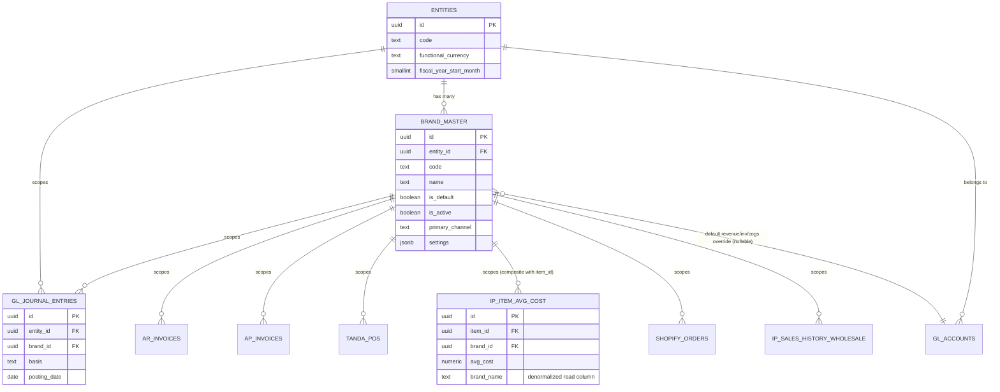
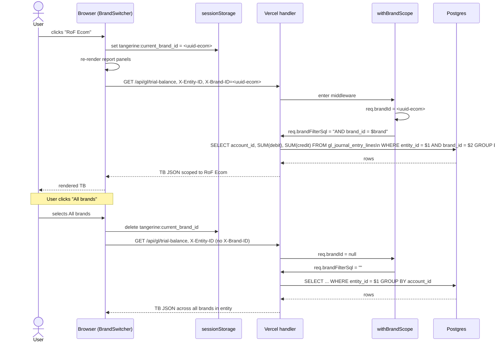

# Tangerine P15 — Brand Master + Cross-Cutter Brand Filter

**Codename:** Tangerine
**Phase:** P15 Brand Master (new cross-cutter, parallel to T4/T6/T7/T9)
**Modules touched:** M1 Tenancy · M2 GL · M3 AP · M4 AR · M5 Inventory · M34 Product/Style Master · cross-cutter filter middleware
**Status:** Architecture only — no code, no migrations. Per `feedback_plan_approval_not_implementation`, this document is the deliverable.
**Date:** 2026-05-30
**Operator ask:** #18 — "Brand master + ability to filter any report by brand (financial reporting, AR invoices, AP invoices, GL entries, inventory reports, balance sheet). In Xoro it's modeled as 'store' which keeps separate inventory so ecom doesn't mix with wholesale."

---

## 0. TL;DR

Brand is a **sub-dimension of entity**: a 1:N child of `entities`. We add a single `brand_master` table, FK every transactional table to it, and ship a global brand picker (sibling to the entity switcher) that injects `WHERE brand_id = $1` via middleware. Inventory rows are scoped by `(sku, brand_id)` so ecom and wholesale stock don't mix — exactly the Xoro "store" model. Every existing entity gets a default brand seeded so legacy rows backfill cleanly to non-NULL.

The key architectural question — **is brand orthogonal to entity, or a child of entity?** — resolves to **child**: brand inherits from entity (legal/tax/fiscal year are the entity's), and each brand belongs to exactly one entity. No cross-entity brand sharing.

---

## 1. Goals & non-goals

### Goals

1. Model "brand" as a first-class master record so reports, dashboards, and integrations can pivot on it.
2. Allow any transactional row (GL line, AR invoice, AP invoice, PO, SO, marketplace order, inventory layer, sales history) to carry a `brand_id`.
3. Ship a global brand picker (header pill, sibling to entity switcher) so any internal user can drill any report to a single brand or see "All brands".
4. Keep inventory separated by brand — ecom stock and wholesale stock are different rows of `ip_item_avg_cost` / on-hand, indexed by `(sku_id, brand_id)`. This is the Xoro "store" promise.
5. Make trial balance, balance sheet, GL detail, AR/AP aging, inventory snapshot, and sales reports automatically respect the brand context.
6. Backfill-safe: every existing entity gets a default brand at seed time so the FK can be made NOT NULL after one migration cycle, without orphans.

### Non-goals

- **Cross-entity brand sharing.** A brand belongs to exactly one entity. If Ring of Fire LLC and a future sister legal entity both want a "RoF" brand, they each create their own.
- **Channel separation.** We are *not* modeling ecom-vs-wholesale-vs-marketplace as a separate `channel` axis in P15. We are folding that distinction into brand (one brand per channel partition that needs its own books/inventory). If the operator later wants a true M*N channel axis, it lands in a future phase. See open question §9.
- **Brand-level fiscal years / tax IDs.** Anything tax-shaped stays on `entities`. Brands inherit.
- **Inter-brand pricing rules.** Out of scope. Pricing/promo lives in M14 (P14).
- **Per-brand RLS.** RLS stays at the entity level (existing pattern). Brand is a query filter, not a security boundary. A user inside Ring of Fire LLC can see all RoF brands; the picker just narrows the view.

---

## 2. Architecture recommendation — brand is a sub-dimension of entity

### Decision

Add `brand_master` with `entity_id uuid NOT NULL REFERENCES entities(id)`. Every brand belongs to exactly one entity. Brand becomes a second filter axis on every transactional table, stacked under the existing entity filter.

### Why this beats the alternatives

| Alternative | Verdict | Reason rejected |
|---|---|---|
| **Sub-entity** (a second-tier `entities` row, using the existing `parent_entity_id` self-ref) | Rejected | Brands don't get separate tax IDs, fiscal years, COAs, period locks, or AP/AR control accounts. Forcing brands into `entities` would double the count of every per-entity construct (COA, periods, RLS junctions) for zero accounting benefit. Entities are *legal/tax* units; brands are *marketing/inventory partitions* inside one entity. |
| **Tag-only** (a `tags` JSONB column or a generic `tags` table) | Rejected | Brand needs separate inventory rows (Xoro "store" model) — that requires a real FK on `ip_item_avg_cost` / inventory layers, not a tag lookup. Tag-only also can't enforce a default-brand-per-entity fallback. |
| **Orthogonal matrix** (brand × entity as M*N — one brand can span entities) | Rejected for launch | Adds a `brand_entities` junction with no current use case; the operator explicitly framed brand as living *inside* a legal entity ("RoF Wholesale" and "RoF Ecom" are both inside Ring of Fire LLC). If a real cross-entity brand emerges later, we can promote `brand_master.entity_id` to a junction with a 6-line migration. |
| **Brand on `style_master` only** (brand is a style attribute, no separate master) | Rejected | Brand needs to scope GL lines, AR invoices, AP invoices — none of which join to `style_master`. A bill from a landlord has no style; it still needs a brand. |

### Inheritance model

```
entities (legal/tax/fiscal)
   │
   └── brand_master (marketing/inventory partition; inherits entity's COA, periods, currency, tax_id)
          │
          └── transactional rows (GL lines, AR/AP, POs, SOs, inventory, sales history)
```

Brand inherits everything from its parent entity that isn't brand-specific. Brand-specific settings (logo, Shopify store domain, marketplace channel mappings, default GL account overrides) live in `brand_master.settings` JSONB.

---

## 3. Schema sketch (NOT shipped this PR)

### 3.1 `brand_master`

```
brand_master (
  id                 uuid PK DEFAULT gen_random_uuid(),
  entity_id          uuid NOT NULL REFERENCES entities(id) ON DELETE RESTRICT,
  code               text NOT NULL,             -- short code: 'ROF-WS', 'ROF-EC'
  name               text NOT NULL,             -- display: 'RoF Wholesale', 'RoF Ecom'
  legal_name         text NULL,                 -- distinct from name if DBA differs
  is_active          boolean NOT NULL DEFAULT true,
  is_default         boolean NOT NULL DEFAULT false,   -- one default per entity
  display_order      smallint NOT NULL DEFAULT 100,
  -- channel/operational hints (informational; not a hard constraint at launch)
  primary_channel    text NULL,                 -- 'wholesale' | 'ecom' | 'marketplace' | 'showroom' | 'mixed'
  -- default GL account overrides (override the entity-level defaults)
  default_gl_revenue_account_id  uuid NULL REFERENCES gl_accounts(id),
  default_gl_inventory_account_id uuid NULL REFERENCES gl_accounts(id),
  default_gl_cogs_account_id     uuid NULL REFERENCES gl_accounts(id),
  -- integration knobs
  shopify_store_domain text NULL,               -- 'rof-ecom.myshopify.com'
  settings           jsonb NOT NULL DEFAULT '{}'::jsonb,  -- logo URL, brand colors, etc.
  -- audit
  created_at         timestamptz NOT NULL DEFAULT now(),
  updated_at         timestamptz NOT NULL DEFAULT now(),
  created_by_user_id uuid NULL REFERENCES auth.users(id),
  updated_by_user_id uuid NULL REFERENCES auth.users(id),
  deleted_at         timestamptz NULL,
  UNIQUE (entity_id, code) WHERE deleted_at IS NULL,
  UNIQUE (entity_id) WHERE is_default = true AND deleted_at IS NULL  -- exactly one default per entity
)

INDEX brand_master_entity_id_idx ON brand_master(entity_id);
INDEX brand_master_active_idx ON brand_master(entity_id, is_active) WHERE deleted_at IS NULL;
```

### 3.2 `brand_id` propagation — transactional tables

Add `brand_id uuid NULL REFERENCES brand_master(id)` to:

| Table | Notes |
|---|---|
| `style_master` | A style "lives" in one brand (RoF Wholesale and RoF Ecom can sell the same style — both rows are needed if both books carry it). |
| `ip_item_master` | Variant inherits brand from style by default; can be overridden if a SKU is brand-exclusive. |
| `ip_item_avg_cost` | **Already has `brand_name` text.** Promote to a real `brand_id` FK; keep `brand_name` as a denormalized read column for the costing report parity. Composite-unique on `(item_id, brand_id)` so ecom and wholesale carry distinct cost rows. |
| `tanda_pos` | PO is brand-scoped — a PO buys for one brand's inventory. |
| `po_line_items` | Inherits via parent PO; column added for read-locality. |
| `gl_journal_entries`, `gl_journal_entry_lines` | Lines are brand-scoped. Header carries brand_id as the "primary" brand; lines may override (e.g. an inter-brand transfer JE has two brand_ids). |
| `ar_invoices`, `ar_invoice_line_items` | AR invoice is brand-scoped (one invoice per brand). |
| `ap_invoices`, `ap_invoice_line_items` | AP invoice is brand-scoped (a landlord bill split across brands becomes N lines with N brand_ids, or N invoices — operator picks; see open question §9). |
| `ar_receipts`, `ap_payments` | Inherit brand from the invoices they apply to. |
| `shopify_orders`, `shopify_order_line_items` | Brand = which Shopify store domain matched. |
| `fba_orders`, `walmart_orders`, `faire_orders` | Brand = which marketplace credential the order came from. |
| `ip_sales_history_wholesale`, `ip_sales_history_ecom` | Sale rows are brand-scoped. |
| `gs1_label_runs` | A label run targets one brand's pack. |

**Initially nullable** so the column can land without backfill pressure. Backfill in two stages:

1. Phase A: every existing row → its entity's default brand (single `UPDATE` per table, scoped by `entity_id`).
2. Phase B: `ALTER COLUMN brand_id SET NOT NULL` once Phase A reports zero NULL rows for ≥7 days.

GL header lines (`gl_journal_entries.brand_id`) can stay nullable forever to support company-wide entries (rent on the legal entity not allocated to any one brand) — see open question §9.

### 3.3 Seed: default brand per entity

For every row currently in `entities`, the migration inserts:

```
INSERT INTO brand_master (entity_id, code, name, is_default, is_active, primary_channel)
SELECT id,
       e.code || '-DFLT',
       e.code || ' Default Brand',
       true,
       true,
       'mixed'
FROM entities e
ON CONFLICT DO NOTHING;
```

For Ring of Fire LLC specifically, the operator-curated initial brands are seeded by data fixture (not migration), so the codes are meaningful (`ROF-WS`, `ROF-EC`) instead of `ROF-DFLT`. The `ROF-DFLT` row is then either renamed to `ROF-WS` or kept as the catch-all.

### 3.4 Inventory separation — composite key

`ip_item_avg_cost` carries `UNIQUE (item_id, brand_id)` so ecom and wholesale stock are *physically* separate rows. On-hand quantity (wherever it lives — `ip_inventory_levels` or equivalent) gets the same treatment. The cost-resolution helper that today looks up `ip_item_avg_cost.avg_cost by item_id` now takes `(item_id, brand_id)` and falls back to the entity's default brand if not found.

This is the Xoro "store" model: a SKU in ecom has its own avg cost and its own on-hand, distinct from the same SKU in wholesale.

### 3.5 Indexes

Every `brand_id` column gets an index. The high-traffic ones get composite indexes paired with `entity_id` and the existing hot filter (e.g. `(entity_id, brand_id, posting_date)` on `gl_journal_entries`, `(entity_id, brand_id, status)` on `tanda_pos`).

---

## 4. Filter cross-cutter UX

### 4.1 Global brand picker

A new header pill, rendered below the existing `EntitySwitcher`, shape:

```
[ Brand: RoF Wholesale ▾ ]    options: All brands · RoF Wholesale · RoF Ecom · ...
```

- Visible to every internal user on every page that lists transactional data.
- Hidden on non-scoped pages (settings, master-data CRUD for global tables, etc.).
- Default option **"All brands"** at first launch — operator preference can flip this to "remember last brand" per open question §9.
- Picker only shows brands belonging to the *currently selected entity*. Switching entity resets the brand picker to "All brands".

### 4.2 State + transport

- Selected brand stored in `sessionStorage` under key `tangerine:current_brand_id` (mirrors the existing entity pattern).
- Every internal API request includes `X-Brand-ID: <uuid>` header (or `null` / omitted for "All brands").
- Header is read by the same auth middleware that today reads `X-Entity-ID`.

### 4.3 Server middleware

A new `withBrandScope` middleware wraps every handler in the modules listed in §3.2:

```ts
// pseudo-code; not shipped in this PR
export function withBrandScope(handler) {
  return async (req, res) => {
    const brandId = req.headers['x-brand-id'] || null;
    req.brandId = brandId;             // null = "All brands"
    req.brandFilterSql = brandId
      ? `AND brand_id = '${brandId}'`  // parameterized in real impl
      : '';                            // no filter
    return handler(req, res);
  };
}
```

Handlers append `req.brandFilterSql` to their list queries. Aggregations (trial balance, balance sheet, AR/AP aging) include `brand_id` in their `GROUP BY` when "All brands" is selected so the report can render a brand-by-brand breakdown.

### 4.4 Silent-mismatch logging during rollout

During Chunk 2 (see §7), the middleware sets `req.brandId` but does **not** filter. Instead it logs every query whose result includes mixed `brand_id` values into a `brand_mismatch_log` table. The operator reviews the log; once it's clean and queries look right, Chunk 3 flips the middleware to actually filter.

This avoids breaking reports the moment the brand picker ships.

---

## 5. Inventory separation (Xoro store model)

The defining feature of the Xoro "store" abstraction is that stock doesn't flow between stores without an explicit transfer document. P15 replicates that:

- `ip_item_avg_cost` rows are unique on `(item_id, brand_id)`. Same SKU, different brand → different avg cost.
- On-hand qty (wherever it's tracked) is the same: composite-unique on `(item_id, brand_id, location_id)` if a `location` axis also exists, or `(item_id, brand_id)` otherwise.
- Sales history rows already carry the brand context via the sale's `brand_id` (set by the originating SO or marketplace order).
- Inter-brand transfers within an entity are **JE-only**: a manual journal entry debits `Inventory:RoF-Ecom` and credits `Inventory:RoF-Wholesale`, with two `brand_id` values on the two lines. No physical movement document; the SKU just changes brand bucket. (Future phase may add a formal "inventory transfer" document type — see open question §9.)
- Reports filter inventory by brand or "All brands". "All brands" view sums quantities across brands per SKU.

Backfill: at the point we add `brand_id` to `ip_item_avg_cost`, every existing row gets the entity's default brand. If the operator wants to split existing inventory between RoF Wholesale and RoF Ecom, that's a one-time manual data step (a CSV with `(item_id, brand_id, qty_ecom)` plus a script to materialize the split), not part of the schema migration.

---

## 6. GL impact

### 6.1 Trial balance + balance sheet

Both reports compute *per (entity_id, brand_id)*. The UI offers three views:

| View | Filter | Use |
|---|---|---|
| Entity-level | `WHERE entity_id = $1` (brand = "All brands") | Consolidated legal-entity report — the only one that ties to the tax return. |
| Brand-level | `WHERE entity_id = $1 AND brand_id = $2` | Operator view — "how is RoF Wholesale doing this month?" |
| Side-by-side | `GROUP BY brand_id` within the entity | A multi-column TB showing each brand and the total. |

The math is the same; only the `WHERE` / `GROUP BY` differs.

### 6.2 P&L

Same three views. P&L is the most demanded brand-scoped report ("which brand is profitable?").

### 6.3 GL detail / GL register

Filter by brand. A drill-down from "Inventory account, RoF Ecom, May 2026" shows only the lines whose `brand_id` matches. Lines without a `brand_id` (the company-wide rent expense, for example) appear only in the entity-level view, never in a brand-filtered view. (See open question §9 on whether brand should be required on all JE lines.)

### 6.4 AR / AP aging

Both already pivot by entity. Adding a brand dimension is a single extra `GROUP BY` and a `WHERE brand_id = $1` filter. Aging buckets stay the same.

### 6.5 Control accounts

AR and AP control accounts are entity-level (one AR account per entity, not per brand). Brand acts as a **sub-grouping within the control account**, not a replacement. This keeps the GL tie-out clean: the AR control account total = sum across all brands within the entity.

### 6.6 Inter-brand transfers

A JE with two lines, both inside the same entity, with two different `brand_id`s and a $0 net P&L impact. No new document type needed at launch. The journal entry UI lets the accountant set `brand_id` per line.

---

## 7. Migration / rollout plan — 4 chunks

| Chunk | Scope | Risk | Verify |
|---|---|---|---|
| **C1: Schema + seed** | Create `brand_master`. Seed one default brand per entity. Add nullable `brand_id` FK to every table in §3.2. Backfill every existing row to its entity's default brand. | Low — additive only, no NOT NULL yet. | Every transactional table has 0 NULL `brand_id` rows. Default-brand-per-entity constraint passes. |
| **C2: Picker UI + silent middleware** | Build `<BrandSwitcher>` (sibling of `<EntitySwitcher>`). Add `X-Brand-ID` header plumbing. Middleware reads brand context but **does NOT filter** — it logs query brand-cardinality into `brand_mismatch_log` instead. | Low — observability only. | Operator reviews 7 days of logs and confirms no surprise behavior. |
| **C3: Enable filter on AR/AP/inventory reports** | Switch middleware from silent-log to active-filter on AR/AP/inventory module handlers. Reports show brand-scoped data. | Medium — reports change shape. | A/B: brand="All brands" returns the same totals as the unfiltered entity-level report. |
| **C4: Enable filter on financial reports + NOT NULL on new writes** | Active-filter on TB, BS, P&L, GL detail handlers. New `INSERT` paths require `brand_id`. Existing nullable columns stay nullable for legacy rows but enforced for new writes. | Medium — accountant workflows depend on TB/BS. | Trial balance "All brands" view = sum of per-brand views = legacy entity-only TB. |

A future C5 (out of P15 scope) could flip the FK to `NOT NULL` after a clean year — that requires a one-time backfill for any rows that snuck in NULL during the transition. Not blocking.

---

## 8. Mermaid diagrams

### 8.1 ER — entities → brand_master → transactional tables



### 8.2 Sequence — user switches brand → header → middleware → query filter



---

## 9. Open questions for the operator (CEO sign-off)

These need a yes/no from the operator before C1 starts. Each has a recommended default we'll proceed with on silence.

1. **Channel as a separate axis later?** Today we're folding ecom-vs-wholesale-vs-marketplace into `brand`. If the operator later wants a true M*N matrix (e.g. one "RoF" brand sold through three channels with shared inventory but separate P&L), we'd add a `channel` column orthogonal to brand. **Recommended for P15:** brand only. **P16+ candidate:** channel as a separate axis if a real use case emerges.

2. **Brand picker default — "All brands" or "last used"?** Both are common. "All brands" matches the entity-level financial view the accountant expects on first load. "Last used" matches an operations workflow ("I live in RoF Ecom most of the day"). **Recommended:** default to "All brands" on every fresh session; remember last used within a single browser session.

3. **GL line scoping — brand-required or brand-optional?** Strict mode blocks JEs that don't tag a brand (forces every entry to live somewhere). Optional mode allows truly company-wide entries (e.g. legal-entity-level interest income, parent-company rent allocated across brands separately). **Recommended:** brand-optional on `gl_journal_entry_lines.brand_id`. Brand-required on AR/AP invoice headers (every customer/vendor invoice ties to a brand).

4. **Inventory separation — hard or soft?** Hard means a brand can never read another brand's on-hand without an explicit inter-brand transfer JE. Soft means reports can sum across brands but operationally each brand sees its own stock. **Recommended:** soft (current pattern, just with brand context). Hard separation is a P16 candidate once the operator decides whether the brands truly run as independent businesses or as views of the same fulfillment pool.

5. **Default brand naming.** The auto-seed names every entity's default brand `<CODE>-DFLT` so the column can be NOT NULL safely. Does the operator want us to rename `ROF-DFLT` to `ROF-WS` (RoF Wholesale) at seed time, and create `ROF-EC` (RoF Ecom) alongside it as a second non-default brand? **Recommended:** yes — seed `ROF-WS` as default + `ROF-EC` as second brand on day one, so the picker has something interesting in it from the first launch.

---

## 10. Verification criteria — "P15 chunk is done" gates

Per chunk (also recapped in §7):

- **C1 done when:** `brand_master` exists, every entity has exactly one default brand, every transactional table has a `brand_id` column with zero NULL rows in production.
- **C2 done when:** `<BrandSwitcher>` renders in the header on every transactional page, `X-Brand-ID` reaches the middleware, `brand_mismatch_log` is populated, and the operator has reviewed 7 days of logs.
- **C3 done when:** AR aging, AP aging, and inventory snapshot show brand-filtered data with zero regressions vs unfiltered totals (sum-of-brand-views = unfiltered-entity-view).
- **C4 done when:** Trial balance, balance sheet, P&L, and GL detail all respect the brand context. New AR/AP invoices require a brand. Side-by-side brand TB matches the entity total.

---

## 11. Risk register

| Risk | Likelihood | Severity | Mitigation |
|---|---|---|---|
| `ip_item_avg_cost` already has `brand_name` text; promoting to `brand_id` FK may surface stale brand names that don't map cleanly | High | Low | Pre-flight: `SELECT DISTINCT brand_name FROM ip_item_avg_cost`; operator approves the brand_name → brand_id mapping table before migration. Unmapped rows fall back to entity default. |
| Backfilling `brand_id` on every transactional table is a lot of UPDATEs | Med | Med | Each backfill is a single statement scoped by `entity_id`; runs in seconds. Stagger across migration files so each is reviewable. |
| Operator changes mind on channel-as-separate-axis after C3 ships | Med | Med | The `brand_id` FK doesn't preclude a future `channel_id` column. Adding channel later is additive. The only thing brand+channel together would re-shape is the inventory composite key — promote to `(item_id, brand_id, channel_id)` in a future migration. |
| Reports that today aggregate by `entity_id` only might double-count when "All brands" is selected and the same row appears in two brands' default seeds | Low | High | The seed inserts one default brand per entity, not multiple. Composite unique on `(entity_id, code)` prevents duplicate seeds. |
| `brand_id` becomes NOT NULL too early; rare integration-write paths break | Med | Med | Stay nullable through C1–C4. Flip to NOT NULL only after a clean year of zero-NULL writes — out of P15 scope. |
| RLS conflict: someone assumes brand is a security boundary | High | Low | This doc explicitly states brand is a query filter, not RLS. Code review enforces. |

---

## 12. What this pass does NOT cover (explicit non-scope)

- The Brand admin CRUD UI (lives in P15 implementation pass; this doc is architecture only).
- Per-brand Shopify multi-store credentials (touched by `shopify_store_domain` on `brand_master` but the OAuth/sync wiring is in P11 follow-ups).
- Per-brand marketplace credentials.
- Inter-brand transfer document type (JE-only at launch; document type is a future phase).
- Brand-level approval rules (a P14-style ApprovalEngine extension).
- Per-brand 1099 / tax reporting (tax is the entity's, not the brand's).
- Per-brand RLS or per-brand user roles.
- Channel axis as a separate dimension (covered as open question §9, not built here).

---

## 13. Approval handshake

Per `feedback_plan_approval_not_implementation`: implementation cannot start until this document is explicitly approved by the operator. On approval, C1 (schema + seed + nullable FK backfill) is the next pass.
