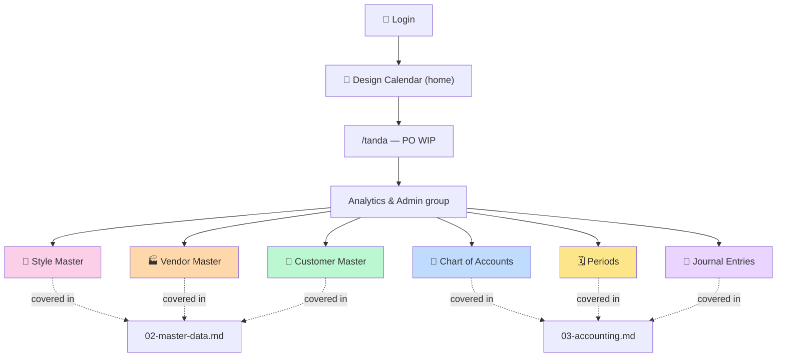

# 1. Getting started

## Who this guide is for

Two personas:

- **Internal operator** (CEO, ops manager) — maintains master data (styles, vendors, customers) and reviews period status. Uses Style/Vendor/Customer Master + Periods every week.
- **External accountant** (contractor or CPA firm) — owns the Chart of Accounts, posts manual journal entries and adjustments, manages period close. Uses Chart of Accounts + Periods + Journal Entries every month.

Both share the same login surface and the same `/tanda` URL — access is gated by role on the data itself (RLS + the `entity_users` junction).

## Logging in

1. Open your browser to the design-calendar-app URL (production: your Vercel domain; dev: `http://localhost:5173`).
2. Sign in with your work email + password.
3. You land on the Design Calendar home page by default. From there, navigate to **PO WIP** (the Tanda module).

Direct URL: `https://<your-domain>/tanda`

> **Note.** If you bookmark `/tanda` and refresh inside one of the new panels, you'll bounce back to the Tanda dashboard. The 6 admin panels use internal state-based navigation, not URL routes — re-click the menu entry to return.

## The Tanda nav layout

Tanda groups its menu items by function. The Tangerine admin panels all live in the **Analytics & Admin** group, near the bottom of the left-side menu.



The full **Analytics & Admin** group:

```
Analytics & Admin
├── 📊 Analytics
├── 💰 Spend
├── ⚙️ Workflow Rules
├── ✅ Approvals
├── 🏛️ Entities
├── 🎨 Style Master       ← Tangerine
├── 🏭 Vendor Master      ← Tangerine
├── 🤝 Customer Master    ← Tangerine
├── 📒 Chart of Accounts  ← Tangerine
├── 🗓️ Periods            ← Tangerine
└── 📓 Journal Entries    ← Tangerine
```


<!-- screenshot needed: nav sidebar with Analytics & Admin expanded showing all 6 new entries -->

## Reading these docs

| You want to… | Go to |
|---|---|
| Edit styles, vendors, or customers | [02-master-data.md](02-master-data.md) |
| Set up the Chart of Accounts, manage period status, post a journal entry | [03-accounting.md](03-accounting.md) |
| Understand multi-entity, dual-basis, control accounts, matrix dims | [04-concepts.md](04-concepts.md) |
| Walk through a common end-to-end workflow (month close, manual adjustment, etc.) | [05-workflows.md](05-workflows.md) |
| Decode an error message you saw in the UI | [06-troubleshooting.md](06-troubleshooting.md) |

## Quickstart smoke test (10 minutes)

If you've never opened Tangerine before, the fastest way to confirm everything works in your environment:

1. **🎨 Style Master** — click the menu entry. The table should populate with hundreds of style codes from `ip_item_master`. Confirm search works.
2. **🏭 Vendor Master** — same pattern; should populate with your existing portal vendors.
3. **🤝 Customer Master** — same pattern; should populate with your existing planning customers (renamed from `ip_customer_master` in Chunk 6).
4. **📒 Chart of Accounts** — likely **empty** until your accountant supplies the COA list. To test, click "+ Add account" and create:
   - Code `1100`, Name `Cash`, Type `asset` (the form auto-fills `normal_balance=DEBIT`)
   - Code `5000`, Name `Test Expense`, Type `expense` (auto-fills `normal_balance=DEBIT`)
5. **🗓️ Periods** — should show fiscal years 2021–2030 grouped, 12 periods each, all status `open`. Flip one period to `soft_close` and back — confirm the status color cycles green → yellow → green.
6. **📓 Journal Entries** — click "+ Post manual JE". Pick **basis = ACCRUAL**, today's date, description "Smoke test". Add two lines: line 1 hits Cash with credit `100.00`; line 2 hits Test Expense with debit `100.00`. Footer should show **● Balanced** in green. Click Post. The new entry appears in the list with status `posted`. Click **Reverse** on the row — accept the default reversal date. The original turns red/reversed; a new reversal entry appears with status `posted`.

If steps 1–6 all work, your Tangerine install is healthy.

## Why you're seeing some things and not others

- **PII fields** (vendor `tax_id`, vendor `bank_account_encrypted`, customer `tax_exempt_certificate`) are **never** rendered in the admin UI. Dedicated PII workflows are planned but not built yet — see [04-concepts.md § PII handling](04-concepts.md#pii-handling).
- **Account picker in JE entry** filters to `status='active' AND is_postable=true`. Roll-up parent accounts (which you may have created in COA with `is_postable=false`) don't appear in the picker by design.
- **Period status badges** change color: green=open, yellow=soft_close, red=closed. Clicking the inline dropdown changes status in real-time (with a confirm prompt).
