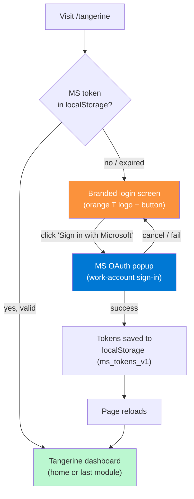
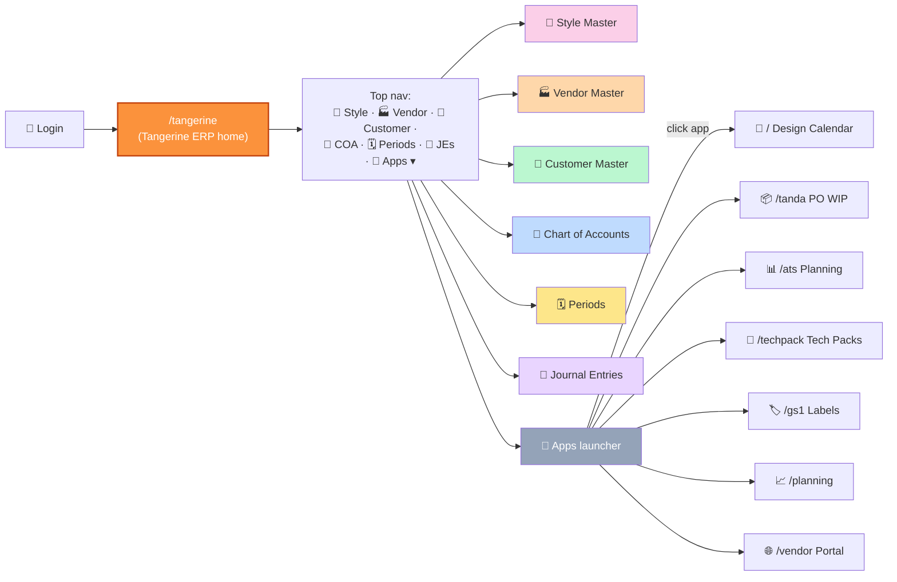

# 1. Getting started

## Who this guide is for

Two personas:

- **Internal operator** (CEO, ops manager) — maintains master data (styles, vendors, customers) and reviews period status. Uses Style/Vendor/Customer Master + Periods every week.
- **External accountant** (contractor or CPA firm) — owns the Chart of Accounts, posts manual journal entries and adjustments, manages period close. Uses Chart of Accounts + Periods + Journal Entries every month.

Both share the same login surface and the same `/tangerine` URL — access is gated by role on the data itself (RLS + the `entity_users` junction).

## Logging in

1. Open your browser to `https://<your-domain>/tangerine` (or local dev: `http://localhost:5173/tangerine`).
2. If you don't have a Microsoft sign-in session yet, you'll see the **Tangerine-branded login screen** — orange "T" logo, "Sign in to continue," and a "Sign in with Microsoft" button.
3. Click the button. A Microsoft popup opens — sign in with your work account (same one you use for Design Calendar / Tanda / etc.).
4. The popup closes; the page reloads; you land on the Tangerine home dashboard.

Direct URL: `https://<your-domain>/tangerine`

> **Note (Chunk T2, 2026-05-26):** Tangerine has its own auth gate — even though the underlying Microsoft OAuth is shared with the other PLM-suite apps, you must explicitly sign in to use Tangerine. If you've already signed in via Design Calendar / Tanda in this browser, Tangerine reuses that session and skips the login screen entirely. The signed-in email appears in the top-right of the top nav with a "Sign out" button next to it.
>
> **Earlier note (Chunk T1, 2026-05-26):** Tangerine is its own top-level app at `/tangerine` — previously the 6 admin panels were buried inside the Tanda PO WIP app's Vendors flyout. Bookmarks to `/tanda` will no longer find them. Update yours to `/tangerine`.

### The login screen

<!-- screenshot needed: /tangerine when not signed in, showing the orange-T logo card with the Microsoft sign-in button -->

### Auto-provisioning (Chunk T3, 2026-05-27)

The **very first time** an operator signs into Tangerine with their work Microsoft account, the app now auto-provisions everything you used to need to set up by hand:

1. **`auth.users` row** — a matching Supabase Auth user is created (email_confirm=true, no password — sign-in remains via MS OAuth).
2. **`entity_users` row** — the new user is bound to the ROF entity with role `admin`.
3. **Employees link** — if the seeded `EB001` (CEO) employee row is unlinked, its `auth_user_id` is filled in.
4. **Cached auth_user_id** — the resolved uuid is saved to `localStorage` under `tangerine.auth_user_id` so the panels that historically prompted for a uuid (Approval Inbox, Notification Center, Notification Preferences) now pre-fill it automatically.

The call is **idempotent**: signing in again does nothing destructive — entity_users uses `ON CONFLICT (auth_id, entity_id) DO NOTHING`, and the employee link only fires when `auth_user_id IS NULL`.

The auto-provision call is **non-blocking** — if it fails (network glitch, server misconfig), the MS sign-in still succeeds and you can still use Tangerine; you'll see a console warning, and you can paste a uuid manually into the relevant panel inputs as a fallback.

> **What this replaces:** the old workaround was three manual steps — open Supabase dashboard → Auth → Add user → paste email → click Create; then SQL editor → `INSERT INTO entity_users (auth_id, entity_id, role) VALUES (...)`; then `UPDATE employees SET auth_user_id = ... WHERE code='EB001'`. All three are now automatic on the first sign-in.

### Signing out

In the top-right of the Tangerine top nav, you'll see your signed-in email with a "Sign out" button next to it. Click "Sign out" → confirm → tokens are cleared and you're returned to the login screen.

Signing out of Tangerine **does not sign you out of the other PLM-suite apps**. They share the same MS token but each has its own session lifecycle.

## The Tangerine nav layout

Tangerine has its own **independent top nav** with the 6 module buttons across the top + an Apps launcher dropdown on the right that links out to the other PLM-suite apps.

**Layout:**

- **Top-left:** Tangerine logo + "ERP" subtitle. Click anywhere on the logo to return to the home landing.
- **Center:** 6 module buttons. Click any to open that panel. The active one is highlighted.
- **Right:** **🧩 Apps ▾** dropdown — opens a grid of the other apps in the suite (Design Calendar, PO WIP, ATS, Tech Packs, GS1, Planning, Vendor Portal). Clicking any link navigates the browser to that app's URL in the same tab.

**Home landing** (when no module is selected, e.g. just after login): shows module cards grouped by **Master Data** (Style / Vendor / Customer) and **Accounting** (COA / Periods / JE), plus a "Other apps in the suite" grid at the bottom.

<!-- screenshot needed: /tangerine landing page showing top nav + module cards + apps grid -->

<!-- screenshot needed: Apps ▾ dropdown open showing the 7 app links -->

### What happened to the old "Vendors ▾ flyout" location?

Through Chunks 7/7b/7c/8a/8b/8c (May 25-26) the 6 admin panels temporarily lived in the Tanda PO WIP app's "Vendors ▾" dropdown — a poor architectural home for ERP master data. Chunk T1 (2026-05-26) moved them to their own `/tangerine` app and removed them from Tanda's menu entirely. If you have muscle memory pointing at Tanda, retrain it: **the panels are at `/tangerine`** now.

## Reading these docs

| You want to… | Go to |
|---|---|
| Edit styles, vendors, or customers | [02-master-data.md](02-master-data.md) |
| Set up the Chart of Accounts, manage period status, post a journal entry | [03-accounting.md](03-accounting.md) |
| Understand multi-entity, dual-basis, control accounts, matrix dims | [04-concepts.md](04-concepts.md) |
| Walk through a common end-to-end workflow (month close, manual adjustment, etc.) | [05-workflows.md](05-workflows.md) |
| Decode an error message you saw in the UI | [06-troubleshooting.md](06-troubleshooting.md) |

## Quickstart smoke test (10 minutes)

If you've never opened Tangerine before, the fastest way to confirm everything works in your environment:

0. **Open Tangerine.** Navigate to `https://<your-domain>/tangerine`. You'll see the home landing with module cards.
1. **🎨 Style Master** — click the module button (or the card on the home landing). The table should populate with hundreds of style codes from `ip_item_master`. Confirm search works.
2. **🏭 Vendor Master** — same pattern; should populate with your existing portal vendors.
3. **🤝 Customer Master** — same pattern; should populate with your existing planning customers (renamed from `ip_customer_master` in Chunk 6).
4. **📒 Chart of Accounts** — likely **empty** until your accountant supplies the COA list. To test, click "+ Add account" and create:
   - Code `1100`, Name `Cash`, Type `asset` (the form auto-fills `normal_balance=DEBIT`)
   - Code `5000`, Name `Test Expense`, Type `expense` (auto-fills `normal_balance=DEBIT`)
5. **🗓️ Periods** — should show fiscal years 2021–2030 grouped, 12 periods each, all status `open`. Flip one period to `soft_close` and back — confirm the status color cycles green → yellow → green.
6. **📓 Journal Entries** — click "+ Post manual JE". Pick **basis = ACCRUAL**, today's date, description "Smoke test". Add two lines: line 1 hits Cash with credit `100.00`; line 2 hits Test Expense with debit `100.00`. Footer should show **● Balanced** in green. Click Post. The new entry appears in the list with status `posted`. Click **Reverse** on the row — accept the default reversal date. The original turns red/reversed; a new reversal entry appears with status `posted`.

If steps 1–6 all work, your Tangerine install is healthy.

## Why you're seeing some things and not others

- **PII fields** (vendor `tax_id`, vendor `bank_account_encrypted`, customer `tax_exempt_certificate`) are **never** rendered in the admin UI. Dedicated PII workflows are planned but not built yet — see [04-concepts.md § PII handling](04-concepts.md#pii-handling).
- **Account picker in JE entry** filters to `status='active' AND is_postable=true`. Roll-up parent accounts (which you may have created in COA with `is_postable=false`) don't appear in the picker by design.
- **Period status badges** change color: green=open, yellow=soft_close, red=closed. Clicking the inline dropdown changes status in real-time (with a confirm prompt).
