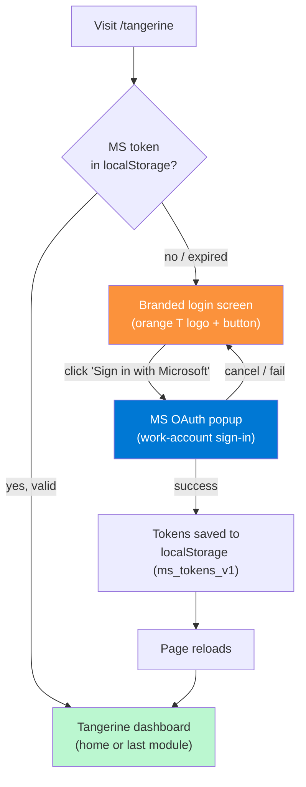
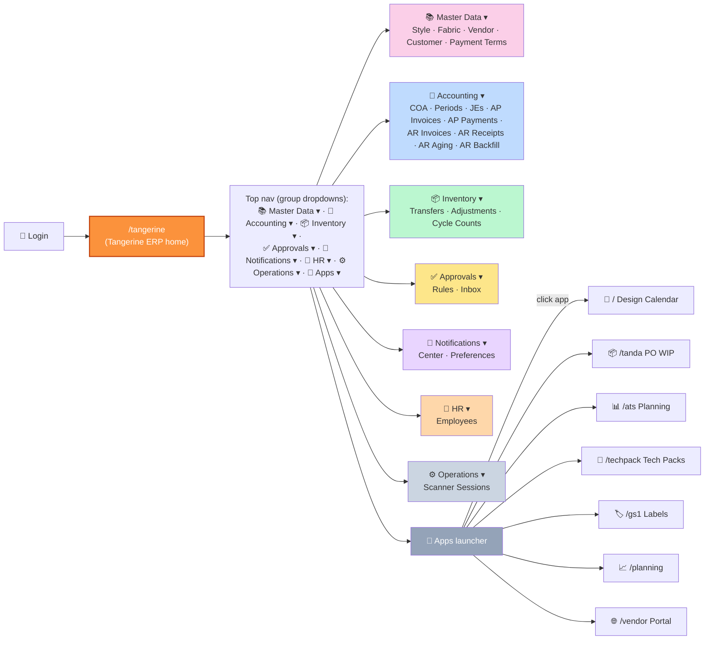

# 1. Getting started

## Who this guide is for

Two personas:

- **Internal operator** (CEO, ops manager) — maintains master data (styles, vendors, customers) and reviews period status. Uses Style/Vendor/Customer Master + Periods every week.
- **External accountant** (contractor or CPA firm) — owns the Chart of Accounts, posts manual journal entries and adjustments, manages period close. Uses Chart of Accounts + Periods + Journal Entries every month.

Both share the same login surface and the same `/tangerine` URL — access is gated by role on the data itself (RLS + the `entity_users` junction).

## Logging in

1. Open your browser to `https://<your-domain>/tangerine` (or local dev: `http://localhost:5173/tangerine`).
2. If you signed into the suite through the **PLM launcher** (username + password) and open Tangerine from a launcher card or 🧩 Apps menu, Tangerine opens **directly** — it adopts that session and you are **not** asked to sign in again. The Microsoft login screen below only appears when you reach Tangerine with **no** existing suite session (e.g. opening `/tangerine` cold as the standalone front door).
3. In that no-session case you'll see the **Tangerine-branded login screen** — orange "T" logo, "Sign in to continue," and a "Sign in with Microsoft" button.
3. Click the button. A Microsoft popup opens — sign in with your work account (same one you use for Design Calendar / Tanda / etc.).
4. The popup closes; the page reloads; you land on the Tangerine home dashboard.

Direct URL: `https://<your-domain>/tangerine`

> **Note (Chunk T2, 2026-05-26; updated 2026-06-29 — no second login):** Tangerine has its own auth gate, but it no longer forces a **redundant second sign-in** on someone who already authenticated through the PLM launcher. When you open Tangerine and there is no Microsoft token yet, Tangerine adopts your existing **PLM session** (the username/password sign-in cloned into the app tab) and goes straight to the dashboard. The dedicated **Sign in with Microsoft** screen is shown only to direct, no-session entrants (the standalone front-door case). Microsoft sign-in is still what mints the per-user JWT and pulls your Graph profile photo; when Tangerine runs off the PLM session those are best-effort and simply absent until you sign in with Microsoft — nothing is blocked, because the internal API stays gated by its own server token. The signed-in user appears in the top-right of the top nav (avatar + name) with a "Sign out" button next to it.

> **Nav UX refresh (2026-06-05):** the top-right user area now shows a small **circular avatar** before your name — your Microsoft profile photo if you have one set, otherwise your initials on a coloured circle (the redundant "Signed in" label was removed). Hidden **Procurement** and **Pricing** module groups are now visible in the nav (see below), and every group dropdown lists its panels **alphabetically by name**.
>
> **Earlier note (Chunk T1, 2026-05-26):** Tangerine is its own top-level app at `/tangerine` — previously the 6 admin panels were buried inside the Tanda PO WIP app's Vendors flyout. Bookmarks to `/tanda` will no longer find them. Update yours to `/tangerine`.

> **Standalone front door (`/login`, 2026-06-04):** there is now a dedicated, Tangerine-branded sign-in page at **`/login`** (Microsoft-365 only). It's the planned single entry point for the whole suite — sign in once, then launch every app from the 🧩 Apps menu. It's reachable directly today; an already-signed-in browser passes straight through. When the operator flips **`VITE_TANGERINE_AS_HOME=true`** (Vercel), the root `/` redirects here and the legacy PLM launcher is retired (see OPERATOR-TODO). A `?next=<path>` param controls the post-login destination (default `/tangerine`).

### The login screen

<!-- screenshot needed: /tangerine when not signed in, showing the orange-T logo card with the Microsoft sign-in button -->

### Auto-provisioning (Chunk T3, 2026-05-27)

The **very first time** an operator signs into Tangerine with their work Microsoft account, the app now auto-provisions everything you used to need to set up by hand:

1. **`auth.users` row** — a matching Supabase Auth user is created (email_confirm=true, no password — sign-in remains via MS OAuth).
2. **`entity_users` row** — the new user is bound to the ROF entity with role `admin`.
3. **Employees link** — if the seeded `EB001` (CEO) employee row is unlinked, its `auth_user_id` is filled in.
4. **Cached auth_user_id** — the resolved uuid is saved to `localStorage` under `tangerine.auth_user_id` so the panels that historically prompted for a uuid (Approval Inbox, Notification Center, Notification Preferences) now pre-fill it automatically.

The call is **idempotent**: signing in again does nothing destructive — entity_users uses `ON CONFLICT (auth_id, entity_id) DO NOTHING`, and the employee link only fires when `auth_user_id IS NULL`.

The auto-provision call is **non-blocking** — if it fails (network glitch, server misconfig), the MS sign-in still succeeds and you can still use Tangerine; you'll see a console warning. Panels resolve your identity from the cached sign-in — there are no UUID boxes to paste into; if a user-scoped panel can't find your identity, sign out and back in to refresh it.

> **What this replaces:** the old workaround was three manual steps — open Supabase dashboard → Auth → Add user → paste email → click Create; then SQL editor → `INSERT INTO entity_users (auth_id, entity_id, role) VALUES (...)`; then `UPDATE employees SET auth_user_id = ... WHERE code='EB001'`. All three are now automatic on the first sign-in.

### Signing out

In the top-right of the Tangerine top nav, you'll see your avatar + name with a "Sign out" button next to it (hover the name for your email). Click "Sign out" → confirm → you're returned to the **login screen**. Because Tangerine can run off either the Microsoft token **or** the cloned PLM-launcher session, sign-out clears **both** (the MS tokens + cached per-user JWT/identity *and* the `plm_user` session for this tab) and navigates to the launcher login — otherwise the PLM session would silently sign you straight back in (which looked like sign-out just refreshing the page).

Signing out of Tangerine **does not sign you out of the other PLM-suite apps**. They share the same MS token but each has its own session lifecycle.

## The Tangerine nav layout

Tangerine has its own **independent top nav** with **section dropdowns** across the top (Master Data · Accounting · **Treasury** · Vendors · **Procurement** · Inventory · Sales · Customers · **ESG** · Admin) + an Apps launcher dropdown on the right that links out to the other PLM-suite apps. Each section dropdown nests its module groups; clicking a module navigates and closes the dropdown. Within any dropdown, **modules are listed alphabetically by name** so destinations are easy to scan. The **browser tab title follows the open module** — e.g. opening Journal Entries sets the tab to "Journal Entries · Tangerine" — so multiple Tangerine tabs are easy to tell apart.

> **Right-click any menu entry → open in a new tab (2026-07-02):** in the left navigation drawer, **right-clicking** a menu entry (Favorites, search results, or any module row) opens that same view in a **new browser tab and focuses it**, leaving your current tab untouched. Left-click keeps its normal in-app behavior (navigate in place). Each row shows a "Right-click: open in new tab" tooltip on hover. This works because every view is deep-linkable via `?m=<module_key>` — the opened tab lands directly on that panel.

> **Procurement & Pricing now visible (2026-06-05):** the **🚚 Procurement** section (Purchase Orders · Receiving · QC Inspections · Customs Entries · Broker Invoices · 3-Way Match · Procurement Recon · Bookkeeper Approval · EDI) is its own top-level dropdown, placed right after **Vendors**. The **Pricing** group (Price Lists · Promotions) now appears inside the **🛒 Sales** dropdown. Both were built but previously hidden because their groups weren't mapped into any nav section.

> **26 more panels surfaced (2026-06-05):** another wave of built-but-hidden Tangerine panels is now reachable from the nav:
> - **💰 Treasury** (new top-level section): **Payments · Reconciliation · FX · Virtual Cards · Supply Chain Finance · Discount Offers · Tax**. "Reconciliation" is the parallel-run recon dashboard (AP/AR/Cash/GL/Inventory variance tracking).
> - **🌱 ESG** (new top-level section) → **ESG & Compliance** group: **Sustainability · ESG Scores · Diversity · Compliance Audit · Compliance Automation**.
> - **Workflow** group folded into the **🔧 Admin** dropdown: **Workflow Rules · Approvals Queue · Workspaces**.
> - **📊 Reports** dropdown gains **Analytics · Insights · Anomalies · Benchmark · Preferred Vendors**.

> **Vendor Health moved to Vendors (2026-06-05):** the old **Reports → Health Scores** panel is now **🏭 Vendors → ❤️ Vendor Health** (same panel, same `?m=health_scores` route — just relocated and renamed). Each vendor's overall health score also now appears as a tile in that vendor's **Vendor Scorecard** header.
> - **🚚 Procurement** gains **RFQs** (the RFQ list; an individual RFQ's detail view still opens from a row).
> - **🛒 Marketplaces** (inside Sales) gains **Marketplace** (vendor-sourcing listings) and **Marketplace Inquiries**.
> - **🔧 Admin** gains **Entities** (entity registry; edit branding from a row) and **Onboarding**.

Immediately to the **right of Favorites** (before the section dropdowns) is a **🔍 Find a panel** type-ahead box — start typing a panel name and the closest matches appear; <kbd>↑</kbd>/<kbd>↓</kbd> move, <kbd>Enter</kbd> opens the top hit, <kbd>Esc</kbd> clears. It matches on **panel names** (so "master" shows Style/Vendor/Customer Master, not every panel that happens to live in the *Master Data* group); if nothing matches a panel name, it falls back to matching a **group name** so you can still jump by section.

### Universal search — the always-visible search bar (2026-07-15)

At the **far left of the top bar**, right beside the navigation drawer, is an **always-visible universal search box** (placeholder *"Search everything…"*). Where **Find a panel** jumps to *screens*, universal search finds **records anywhere in the database** — type any term and it searches, in parallel, across:

**Customers · Vendors · Styles · Items/SKUs · Sales Orders · Purchase Orders (both the native Tangerine POs and the Xoro-mirrored POs) · AR Invoices · AP Bills · Journal Entries · Parts · Services · Build Orders · Fabric Codes · Employees.**

How it works:

- Matching is **substring, case-insensitive** — you can type a fragment of a code, name, number, or memo (e.g. `ross`, `JE-2026`, `CTN`, `PO-40`) and don't need the whole value.
- Results appear in a **dark dropdown grouped by entity** with a count beside each group heading. Each row shows the record's **code in blue** (e.g. `CUST-01042`, `JE-2026-00318`, `PART-00077`) followed by its name/description; the part of the text that matched your term is highlighted.
- **Keyboard:** <kbd>↓</kbd>/<kbd>↑</kbd> move the highlight across all groups, <kbd>Enter</kbd> opens the highlighted record, <kbd>Esc</kbd> closes the dropdown. You can also click any row. The **✕** clears the box.
- **Clicking a result takes you straight to that record** — it opens the record's module with the search box pre-filled to that code, so you land on the row (Xoro-mirrored POs open in the PO WIP app on their milestones view). No new tab, no lost session.
- It starts searching once you've typed **2+ characters** and waits a moment after you stop typing, so it stays snappy.

> This is separate from the **⌘K / Ctrl-K** search palette (a centered modal). Both search your data; the top-bar bar is always on screen, the palette is a power-user shortcut. Use whichever you reach for.

> **Nav now fits any screen (2026-06-05):** with Treasury, ESG and Procurement added, the top nav had grown wide. It's now **responsive** — the section-dropdown row flexes, tightening its spacing and (on narrower screens) **wrapping to a second line** so every group button stays reachable without a horizontal page scrollbar at common widths (1280–1920). **Favorites, 🔍 Find a panel, 🧩 Apps, and your avatar/name stay fixed and always visible**; the Find-a-panel box also moved to sit right after Favorites (see above).

> **Nav layout changed 2026-05-27 night:** the original flat row of 22 module buttons got too crowded after P4 shipped (the Accounting group alone grew to 9 modules). Modules are now grouped under: 📚 Master Data · 💼 Accounting · 📦 Inventory · ✅ Approvals · 🔔 Notifications · 👥 HR · ⚙️ Operations. The active module's parent group is highlighted, so you always know where you are. Click outside or press <kbd>Esc</kbd> to close a dropdown without selecting.

**Layout:**

- **Top-left:** Tangerine logo + "ERP" subtitle. Click anywhere on the logo to return to the home landing.
- **Center:** 7 group buttons. Click a group to expand a dropdown of its modules. The group whose currently-active module you're on is highlighted. Click outside or press <kbd>Esc</kbd> to close without selecting.
- **Right:** **🧩 Apps ▾** dropdown — opens a grid of the other apps in the suite (Design Calendar, PO WIP, ATS, Tech Packs, GS1, Planning, **Costing**, Vendor Portal). Clicking any link **opens that app in a new browser tab** (so the shell you're in stays put). The same applies from the PLM home launcher and the Design Calendar header links (T&A, Costing).
- **Tangerine on the PLM launcher:** the PLM home launcher now also shows a gated **🍊 Tangerine ERP** card (opens `/tangerine` in a new tab). Like every other launcher app it carries a per-user permission — admins grant or revoke it under **PLM → User Management → Tangerine ERP** (default: granted, consistent with the other apps). A user explicitly denied `tangerine` access sees the 🔒 locked tile and is blocked at the `/tangerine` route too. (Microsoft-365 direct sign-in to Tangerine — for users who never touch the PLM launcher — is unaffected.)
- **📈 Planning (M31):** the standalone Inventory Planning app (forecasting, supply reconciliation, scenarios, accuracy, execution) is reached from the **🧩 Apps** menu (it's one of the suite apps listed there) and from a **Planning (M31)** section on the home landing that deep-links each screen (Wholesale / Ecom / Supply / Scenarios / Accuracy / Execution) — opening in a new tab. (The former duplicate top-nav / sidebar "Planning" links were removed as redundant with the Apps menu.) It appears only for users with the shared **planning** access permission. Note: Planning still reads its own Xoro/Shopify-backed data; it is not yet wired to live Tangerine sales/inventory/PO data. **Buy plan → Tangerine PO (M31):** in the planning **Execution** screen, an approved buy plan can be turned into **draft native Tangerine purchase orders** (one per vendor) with the **🍊 Create Tangerine POs** button — they land in **Procurement → Purchase Orders** as drafts for you to review + issue. (Requires each planning vendor to be linked to a Tangerine vendor via `ip_vendor_master.portal_vendor_id`.)

**Home landing** (when no module is selected, e.g. just after login): shows module cards organized by the same group structure (Master Data / Accounting / Inventory / Planning / etc.), plus a "Other apps in the suite" grid at the bottom.

<!-- screenshot needed: /tangerine landing page showing top nav + module cards + apps grid -->

<!-- screenshot needed: Apps ▾ dropdown open showing the 7 app links -->

### What happened to the old "Vendors ▾ flyout" location?

Through Chunks 7/7b/7c/8a/8b/8c (May 25-26) the 6 admin panels temporarily lived in the Tanda PO WIP app's "Vendors ▾" dropdown — a poor architectural home for ERP master data. Chunk T1 (2026-05-26) moved them to their own `/tangerine` app and removed them from Tanda's menu entirely. If you have muscle memory pointing at Tanda, retrain it: **the panels are at `/tangerine`** now.

## UI conventions

### Search filters as you type

Every master-data panel (Style Master, Vendor Master, Customer Master, Genders, Countries, Fabric Codes, Factors, Payment Terms, Season Master, Size Scales, Style Classifications, Employee Departments/Titles, B2B Accounts/Price List, Price Lists, Promotions, Purchase Orders, Sales Orders, Prepack Matrix, PIM Catalog, Pack GTIN Master, …) filters **live as you type** — there's no need to press **Enter** or click a **Search** button. Results refresh automatically about a fifth of a second after you stop typing. Any **Search** button still present simply forces an immediate refresh; you can ignore it. Press **Esc** in a search box to clear it.

## Reading these docs

| You want to… | Go to |
|---|---|
| Edit styles, vendors, or customers | [02-master-data.md](02-master-data.md) |
| Set up the Chart of Accounts, manage period status, post a journal entry | [03-accounting.md](03-accounting.md) |
| Understand multi-entity, dual-basis, control accounts, matrix dims | [04-concepts.md](04-concepts.md) |
| Walk through a common end-to-end workflow (month close, manual adjustment, etc.) | [05-workflows.md](05-workflows.md) |
| Decode an error message you saw in the UI | [06-troubleshooting.md](06-troubleshooting.md) |

## Quickstart smoke test (10 minutes)

If you've never opened Tangerine before, the fastest way to confirm everything works in your environment:

0. **Open Tangerine.** Navigate to `https://<your-domain>/tangerine`. You'll see the home landing with module cards.
1. **🎨 Style Master** — click the module button (or the card on the home landing). The table should populate with hundreds of style codes from `ip_item_master`. Confirm search works.
2. **🏭 Vendor Master** — same pattern; should populate with your existing portal vendors.
3. **🤝 Customer Master** — same pattern; should populate with your existing planning customers (renamed from `ip_customer_master` in Chunk 6).
4. **📒 Chart of Accounts** — likely **empty** until your accountant supplies the COA list. To test, click "+ Add account" and create:
   - Code `1100`, Name `Cash`, Type `asset` (the form auto-fills `normal_balance=DEBIT`)
   - Code `5000`, Name `Test Expense`, Type `expense` (auto-fills `normal_balance=DEBIT`)
5. **🗓️ Periods** — should show fiscal years 2021–2030 grouped, 12 periods each, all status `open`. Click **Run checks** on the current period; all blocking rows should be green. Click **Soft close** — confirm the status badge flips yellow. Then click **Reopen**, enter a short reason ("smoke test"), confirm; the badge returns to green. (You'll be prompted for `actor_user_id` only if auto-provisioning didn't cache it — it should have, from your first sign-in.)
6. **📓 Journal Entries** — click "+ Post manual JE". Pick **basis = ACCRUAL**, today's date, description "Smoke test". Add two lines: line 1 hits Cash with credit `100.00`; line 2 hits Test Expense with debit `100.00`. Footer should show **● Balanced** in green. Click Post. The new entry appears in the list with status `posted`. Click **Reverse** on the row — accept the default reversal date. The original turns red/reversed; a new reversal entry appears with status `posted`.

If steps 1–6 all work, your Tangerine install is healthy.

## Why you're seeing some things and not others

- **PII fields** (vendor `tax_id`, vendor `bank_account_encrypted`, customer `tax_exempt_certificate`) are **never** rendered in the admin UI. Dedicated PII workflows are planned but not built yet — see [04-concepts.md § PII handling](04-concepts.md#pii-handling).
- **Account picker in JE entry** filters to `status='active' AND is_postable=true`. Roll-up parent accounts (which you may have created in COA with `is_postable=false`) don't appear in the picker by design.
- **Period status badges** change color: green=open, yellow=soft_close, red=closed. Clicking the inline dropdown changes status in real-time (with a confirm prompt).

## Ask AI

A floating **✨ Ask AI** button (bottom-right of every Tangerine screen) opens a chat assistant. Ask it two kinds of question and it picks the right source:

- **Your data** — "What's our total open AR right now?", "List the open purchase orders by vendor", "How is customer X trending?" It queries the live database read-only (it never invents numbers; if a figure isn't available it says so).
- **How to use the app** — "How do I post a manual journal entry?", "Where is the fixed-asset register?", "What does GR/IR mean?" It searches **this user guide** (the `search_user_guide` tool) and answers from the relevant chapter.

The Tangerine assistant runs on **Claude Opus** for stronger reasoning across the full accounting/inventory schema; the other apps' assistants stay on the faster Haiku model. Answers stream in live. It cannot see PII columns (bank/card/tax-id) — those are excluded server-side.

> **For maintainers:** the assistant reads a bundled snapshot of this guide at `api/_lib/ai/userGuideContent.js`, generated by `scripts/gen-user-guide-ai.mjs`. Re-run `node scripts/gen-user-guide-ai.mjs` after editing the guide so the assistant stays current (same discipline as keeping `menuKeys.js` in sync).
