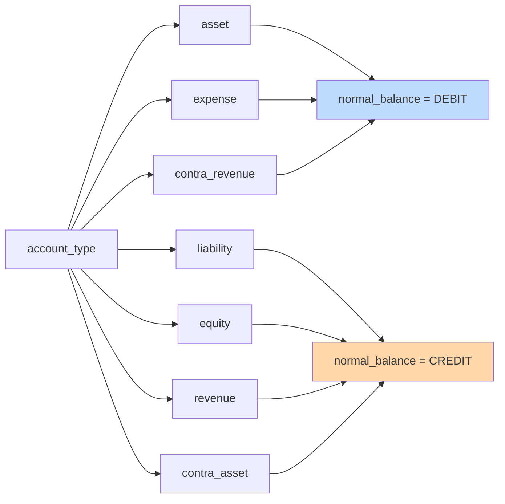
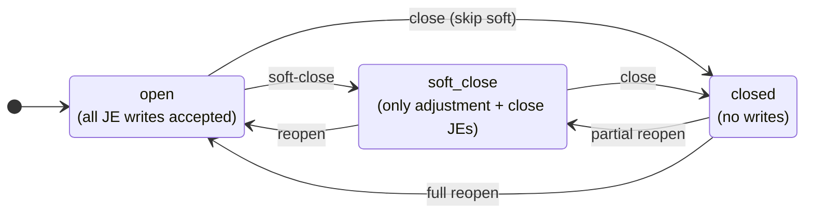
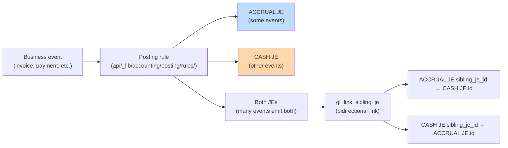
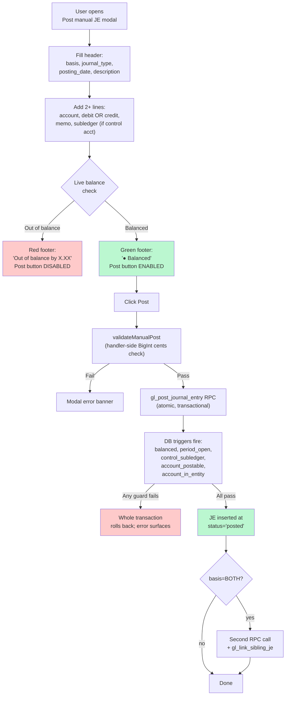
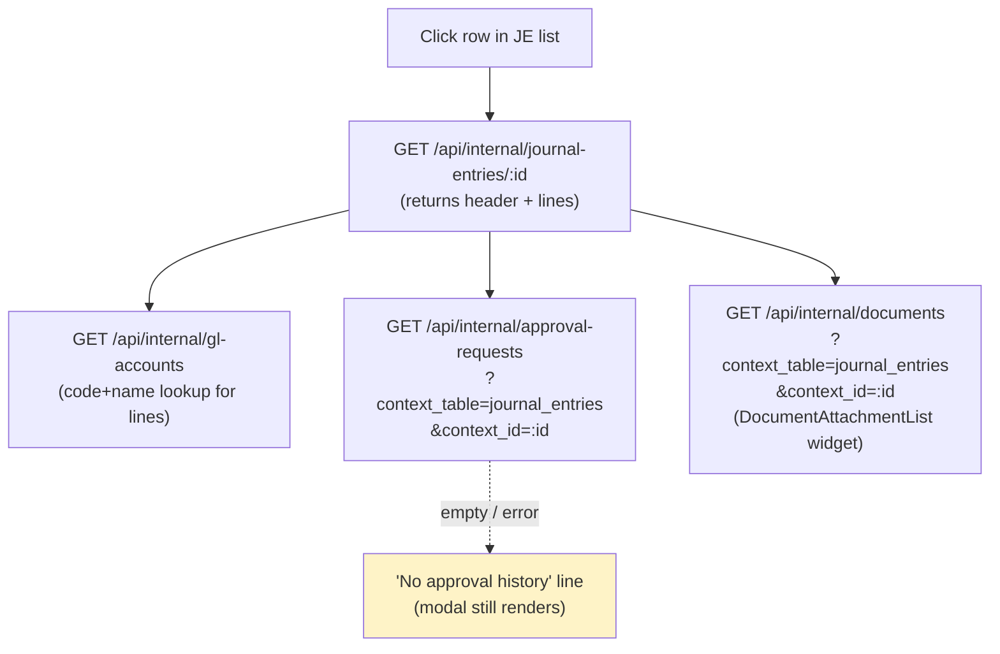
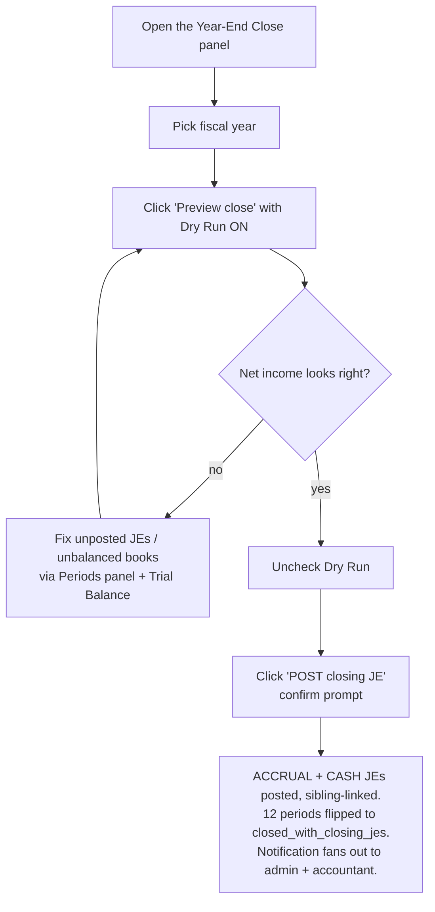
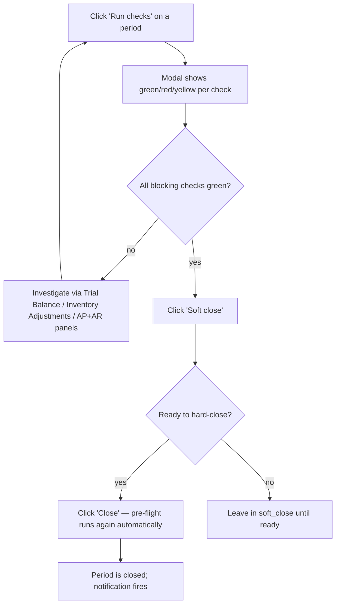

# 3. Accounting — Chart of Accounts, Periods, Journal Entries

These three panels form the accountant's daily / monthly workflow. The order matters: **Chart of Accounts must be populated before Journal Entries can be posted**, because every JE line references an account.

> ## 📌 The General Ledger IS the Xoro mirror (2026-07-13 rebuild)
>
> As of the full-ledger rebuild (#1720), **Tangerine's General Ledger is a faithful 1:1 double-entry mirror of Xoro's complete GL** — not a bottom-up reconstruction from the AR/AP subledgers. Every posted transaction in Xoro (`xoro_gl_transactions`, the nightly mirror of Xoro's `accounting/getgltransactions`) becomes exactly **one journal entry** in Tangerine:
>
> - **journal_type** = `xoro_gl_mirror`, **source_id** = the Xoro `TxnId` (idempotent — a re-run posts nothing new).
> - **posting_date** = the Xoro transaction date (never today's date).
> - Each Xoro leg's signed `amount_home` maps to a Tangerine line: **positive = debit, negative = credit**; the Xoro account name resolves to a ROF account via `xoro_account_map`.
> - Every JE balances by construction (each Xoro transaction nets to $0). Sub-cent rounding from Xoro's higher-precision legs is absorbed into **8001 Penny Rounding Adjustments** (whole-ledger total under $1).
>
> **Why:** the old GL was rebuilt from invoices/bills, so it never captured Xoro's GL-only entries (payroll, provisions, inventory adjustments, closing/opening entries) and overstated net income. The mirror captures the whole ledger, so **Tangerine's trial balance now equals Xoro's account-by-account and month-by-month, to the cent** (AR, Inventory, AP, cash, expense, equity), and `8007 Uncategorized Expense` fell to ~$0 on its own.
>
> **Subledger detail still lives in Tangerine** (`ar_invoices`/`ar_invoice_lines`, `invoices`/`invoice_line_items`) — every invoice and bill survives and its `accrual_je_id` re-links to the mirror JE by document number (`invoice_number` = Xoro `ref_number`). The GL amount is now Xoro's number; where a subledger line total disagrees (a known 2025 line-total defect), the detail row is the one to true up (see `docs/tangerine/gl-rebuild-amount-recon.csv`).
>
> **Cash side (`cash_je_id`) re-linked too.** A follow-up pass links each paid invoice/bill to the mirror JE of the transaction that paid it. Xoro payment transactions don't carry the invoice number in their own reference — but each payment leg's **memo does**: an *Invoice Payment* names the invoice it relieves (`Invoice Ref # ROF-I…`) and a *Bill Payment* names the bill (`…Bill# ROF-B… Amount Paid …`). The paying JE is the mirror JE whose `source_id` = that payment transaction's id. Only **deterministic single-payment** matches are linked — an invoice/bill settled across more than one payment transaction is left `cash_je_id = NULL` (a single link can't represent several payment JEs). Result: **AR 8,755** invoices and **AP 3,186** bills carry a cash link; the remainder are open/unpaid, were settled by a customer deposit/credit application (non-cash), are Tangerine-native (non-Xoro) documents, or are the small multi-payment set left null on purpose. See `scripts/gl-rebuild/stage4_cash_relink.sql`.
>
> **Provenance, rollback, and the approved-event record.** The 99,160 mirror JEs were bulk-loaded once with the immutability / period-lock / T11 audit triggers disabled (a single CEO-approved batch, not per-JE operator edits), so they have no per-JE audit rows — instead each JE's provenance is `source_id` = its Xoro `TxnId`. That approved event is recorded durably in the general audit table (`audit_logs`, `entity_type='gl_rebuild'`): one row for the bulk mirror load and one for the cash re-link (migration `20260983000000`). The one-step rollback is to restore `journal_entries` / `journal_entry_lines` from the snapshot tables **`je_backup_20260713`** / **`jel_backup_20260713`** (with the triggers disabled) and re-null the subledger `accrual_je_id` / `cash_je_id` links. See `docs/tangerine/gl-rebuild-provenance.md` for the full controller sign-off record.
>
> **Operationally:** the mirror is kept current nightly by the Xoro GL sync; new Xoro transactions post themselves. Native Tangerine JEs (operator-entered) still post through the normal Journal Entry panel below and are validated by the posting guards — the rebuild deleted only the superseded bottom-up reconstructions, never a native entry.

### 🔬 Xoro Monthly Recon (Accounting → Xoro Monthly Recon)

**What it is.** A month-by-month, account-by-account proof that Tangerine's GL equals the Xoro GL. It compares **all** mapped Xoro activity against the actual Tangerine GL (the mirror **plus** the documented channel-reclass splits) and puts every account-month into one of a few plain-English **categories**, so a close check reads green when every difference is *accounted for* — never by forcing a number.

**How to read it.** The headline reports the **closed periods** only (the current, still-syncing month is set aside). Each month row shows how many account-months fall in each category; click a row to filter the breaks table below. Categories:

- **Clean** — Tangerine ties to Xoro within $1 (sub-dollar drift is the mirror's penny-rounding into `8001`).
- **Intentional** — the only difference is a documented **channel_reclass** split (ROF/PT ecom revenue & COGS moved to their own accounts; revenue/COGS-internal and net-zero — see `gl-rebuild-provenance.md` §6). Not a break.
- **Open-period lag** — Xoro transactions the nightly GL sync hasn't mirrored **yet**; only ever the current open month, self-heals overnight. Not a close blocker for prior months.
- **Unexplained** — a difference with no accounted-for cause. This is the only thing to investigate; today it is a handful of **sub-$3 penny-rounding** rows on Inventory / Kids-COGS across all of history.

**For a month-close:** open this panel, confirm the month you're closing shows **only Clean and Intentional** (zero Unexplained, zero Open-period), then run the Month-End Close checklist. Export (xlsx) is on the breaks table for your working papers. The categorisation rule is unit-tested (`src/lib/xoroReconCategory.ts`) and mirrored 1:1 by the SQL view `v_xoro_tangerine_tb_recon` (migration `20260991000000`); the month rollup is `v_xoro_recon_monthly_summary`.

## 📒 Chart of Accounts (COA)

### Concept

The COA is the canonical list of every postable or roll-up account, scoped to the entity (currently RoF only). Each account carries:

- A **code** (e.g. `1100`, `4000-WHOLESALE`) — unique per entity, the accountant's number scheme.
- A **name** — human-readable label.
- An **account_type** — one of: `asset`, `liability`, `equity`, `revenue`, `expense`, `contra_asset`, `contra_revenue`.
- A **normal_balance** — `DEBIT` or `CREDIT`. **Auto-derived from `account_type`** (you can override but rarely should):



- An **is_postable** flag — `true` for accounts JEs can hit directly; `false` for roll-up parent accounts that exist only for hierarchy / reporting.
- An **is_control** flag — `true` for AR / AP / Inventory accounts. **Control accounts require subledger pairing on every JE line** (a vendor ID for AP, customer ID for AR, item ID for Inventory).
- An optional **parent_account_id** — self-FK for tree-shaped chart of accounts.

### Seeding the COA

The COA arrives **empty**. The accountant supplies the canonical list (per the email draft at `docs/tangerine/accountant-coa-request-email.md`). Until they reply:

1. You can manually add a handful of accounts via the **+ Add account** modal for testing.
2. Once their CSV/spreadsheet arrives, a data-only migration loads the full COA in one batch (Chunk 6.5 / accountant-COA-seed task, queued).

### List view

Columns: **Code, Name, Type, Subtype, Parent, Normal, Balance, Status, Postable, Control**, plus per-row Edit / Delete buttons. The **Parent** column resolves each account's `parent_account_id` to the parent's `Code — Name` (never a raw UUID), or `—` when the account has no parent. Any column can be hidden via the columns (⚙) button, and all appear in the xlsx export.

Filters above the table:

- **Search** — code or name (ilike)
- **Type dropdown** — narrow to one account type
- **Show inactive** — by default, the list shows only `status=active` accounts


<!-- screenshot needed: COA list with several seeded accounts -->

### Add modal

| Field | Required? | Locked after creation? | Notes |
|---|---|---|---|
| Code | yes | **yes** | Uppercased + trimmed. Unique per entity. |
| Name | yes | no | Free text |
| Account type | yes | **yes** | The 7 enum values |
| Normal balance | required (auto-fills) | **yes** | Changes when you change account_type; you can manually override before save |
| Subtype | no | no | Free text (e.g. `current_asset`, `ar`, `cogs`) |
| Parent account | no | no | Dropdown of all current accounts (excluding self in Edit). Restricted to same entity. |
| Postable | checkbox, default true | no | When false, JEs cannot hit this account directly |
| Control | checkbox, default false | no | When true, JE lines targeting this account MUST include subledger_type + subledger_id |
| Status | required, default active | no | active / inactive |
| Description | no | no | Free text |


<!-- screenshot needed: Add modal mid-creation, showing the normal_balance auto-fill -->

### Locked fields on Edit

`code`, `account_type`, `normal_balance`, and `entity_id` are immutable after creation. The Edit modal shows them as read-only (grayed-out). To change them, you'd need to soft-delete and recreate — but that's almost always wrong because historical JEs reference the account ID, not the code.

### Deleting accounts

Click **Delete** to hard-delete. The handler **rejects with 409 if any `journal_entry_lines` row references the account**:

> Account has posted journal entry lines; mark it inactive via PATCH status='inactive' instead of deleting.

For accounts with history, the right move is to PATCH `status='inactive'`. The account stays in the database (historical JEs remain valid), but it disappears from the default `status=active` list and from the JE entry account picker.


<!-- screenshot needed: alert showing the 409 error message -->

## 🗓️ Periods

### Concept

Periods are 12 calendar-month accounting buckets per fiscal year per entity. They were bootstrapped by migration: **FY 2021–2030, 12 periods each = 120 rows** for RoF. You don't create or delete periods — only their **status** changes.



All transitions are allowed in both directions. Reopening a closed period is unusual but supported (e.g. accountant discovers a missed entry during audit).

### What each status blocks

| Status | JE INSERT | JE UPDATE | Notes |
|---|---|---|---|
| `open` | ✅ all | ✅ all | Default working state |
| `soft_close` | ✅ only journal_type IN (`adjustment`, `close`) | ✅ same restriction | The Chunk 2 DB trigger enforces this server-side |
| `closed` | ❌ blocked | ❌ blocked | Hard wall. Trigger raises an exception. |

### List view

Periods group by fiscal year (collapsible cards). Each row shows:

- Period number (1–12) + month name
- `starts_on` and `ends_on` dates
- `posted_je_count` (live aggregate of posted JEs in this period — useful to know what you're closing)
- Color-coded status badge: 🟢 green=open, 🟡 yellow=soft_close, 🔴 red=closed
- Inline status dropdown — change status with a confirm modal

Filters above the table:

- **Fiscal year** — narrow to one FY
- **Status** — narrow to one status


<!-- screenshot needed: Periods list with FY 2026 card showing 12 rows -->

### Changing status

Click the status dropdown in the row, pick the target status, confirm the prompt:

> Change FY2026 period 5 (May) from "open" to "soft_close"?

The handler validates the transition (impossible state changes are blocked with a 400) and auto-maintains `soft_closed_at` / `closed_at` timestamps + clears them on reopen.

## 📓 Journal Entries

### Concept

A journal entry (JE) is one accounting transaction — header + 2 or more lines, balanced (sum of debits = sum of credits). Every JE has a **basis** (`ACCRUAL` or `CASH`). The system maintains **two parallel books** in dual-basis mode (the locked P1 decision):



For a manual JE you post yourself, you choose the basis: `ACCRUAL`, `CASH`, or `BOTH` (posts a sibling pair).

### List view

Columns: **Posting date, Type, Basis, Description, Source, Status**. Reversed JEs and drafts show grayed out.

Filters:

- **Basis** — all / ACCRUAL / CASH
- **Include drafts** — drafts are normally hidden (the system only inserts `status='posted'` rows; drafts can exist transiently mid-RPC)

Each posted row has a **Reverse** button on the right.


<!-- screenshot needed: JE list with mix of posted/reversed rows -->

### Posting a manual JE

Click **+ Post manual JE** to open the modal.



#### Modal fields

**Header row:**

| Field | Notes |
|---|---|
| Basis | `ACCRUAL`, `CASH`, or `BOTH` (sibling pair). For most accountant adjustments, choose ACCRUAL. |
| Journal type | `manual` (default) or `adjustment`. Use `adjustment` if posting into a soft-closed period. |
| Posting date | Date the entry hits the books. Must fall inside a non-closed period for the chosen basis. |
| Description | Free text, e.g. "Adjusting entry for accrued rent" |

**Lines table** (start with 2; add more with + Add line):

| Column | Notes |
|---|---|
| # | Line number (auto) |
| Account | Dropdown filtered to `status=active AND is_postable=true` accounts. Shows `<code> — <name> [control]` if it's a control account. |
| Debit | Decimal. Mutually exclusive with Credit on the same line — typing in one clears the other. |
| Credit | Same. |
| Memo | Free text per line |
| Sub type | `vendor`, `customer`, `item`, or (none). **Required if the account is a control account.** |
| Sub id | UUID of the subledger entity. Currently raw UUID input — picker UX is planned but not built. |

**Footer** shows live totals and balance status. The **Post** button is disabled until: lines balance AND description is non-empty.


<!-- screenshot needed: post modal mid-entry, green balanced footer -->


<!-- screenshot needed: post modal with red unbalanced footer -->

### Viewing a JE (detail modal)

Click any row in the JE list to open the read-only **JE detail modal**. The header carries the JE id; the body is divided into four sections.



**Sections** (top to bottom):

1. **Header** — posting_date, journal_type, basis, source_module, source_table/source_id, posted_at, sibling_je_id (for ACCRUAL↔CASH pairs), and reverses_je_id / reversed_by_je_id cross-links. All read-only.
2. **Description** — the free-text label entered at post time.
3. **Lines** — full line table with account code+name (joined from the COA lookup), debit, credit, memo, and subledger pairing. Totals row at the bottom shows Σ debit and Σ credit (which match by construction for any posted JE).
4. **Approval history** — best-effort lookup against `approval_requests` where `context_table='journal_entries' AND context_id=<this JE>`. Renders each request's status, kind, and step decisions. If no matching approval exists (or the lookup fails), shows **"No approval history"** — the rest of the modal still renders.
5. **Supporting documents** — the reusable `<DocumentAttachmentList>` widget bound to this JE. **This is the only writable area of the modal.** Documents can be uploaded, downloaded (via short-lived signed URL), or archived (soft-delete). Seeded kinds dropdown: `supporting_doc`, `approval_correspondence`, `receipt`, `other`.

```tsx
<DocumentAttachmentList
  contextTable="journal_entries"
  contextId={je.id}
  kinds={["supporting_doc","approval_correspondence","receipt","other"]}
/>
```

The modal has two footer buttons:

- **Close** — dismiss without any change.
- **Reverse** — only enabled when `status='posted'` AND `reversed_by_je_id` is null. Delegates to the same reverse flow as the row-level Reverse button (prompt for posting_date, then `POST /api/internal/journal-entries/:id/reverse`).

> Why is the rest of the modal read-only? Posted JEs are immutable by design (see the next section). The detail modal is intentionally a **viewer** — the only thing that can be changed about a posted JE after the fact is the set of supporting documents pinned to it.

### Reversing a posted JE

Click **Reverse** on any `status=posted` row.

The system creates a **new** JE with negated lines (debit ↔ credit), flips the original to `status=reversed`, and cross-links them via `reverses_je_id` (new → original) and `reversed_by_je_id` (original → new). The original's lines are never modified — posted lines are immutable per the Chunk 3 DB trigger.

You're prompted for an optional `YYYY-MM-DD` posting date for the reversal — leave blank to default to today.

The reversal entry lands in an **open** period. If today's period is closed, you must pick a date in an open period or first reopen the closed period.

### Why posted JEs can't be edited or deleted

Once `status='posted'`, the JE is immutable by design. PATCH and DELETE on `/api/internal/journal-entries/:id` return 405. The only undo path is reversal. This protects audit integrity — the GL always tells the truth about what was posted and when.

## Income Statement (P5-3)

**Where:** Tangerine → 💼 Accounting → 📈 **Income Statement**.

The Income Statement (P&L) is a best-in-class report that mirrors how the CEO reads a P&L — the same band structure as Xoro's **Income Statement By Store**, the full colon-path account hierarchy (parent **group headers** with indented sub-accounts and group subtotals), and **monthly columns** across any date range. It supports both the **ACCRUAL** and **CASH** books — toggle at the top — and any date range. Default range is current FY (Jan 1) through today.

**Prior-year comparatives.** The **Compare prior year** toggle (on by default) adds two columns after the Total — **PY Total** (the same window shifted back exactly one year) and **Change** ($ difference with % beside it, green up / red down). Comparatives attach to the **Total column only** — the monthly columns stay current-year so the grid stays readable — and they apply to every line: accounts, group subtotals, the section totals, and the Net Sales / Gross Profit / NOI / Net Income bands. The prior-year window is shown in the column header. The comparative figures also flow into the Excel and PDF exports.

> **Drill into any account:** click an account row (its name is shown in **blue**) to open its GL detail scoped to the same From/To and basis. See [GL account drill-down](#gl-account-drill-down-click-an-account-on-any-financial-report).

### The band structure (top to bottom)

The GL is now a 1:1 mirror of Xoro, so the report presents the standard multi-step P&L bands:

| Band | What it is |
|---|---|
| **Revenue** | Operating sales accounts (chart codes 4000–4899) |
| Less: Returns, Discounts & Chargebacks | All `contra_revenue` accounts — deducted to reach Net Sales |
| **NET SALES** | Revenue − deductions (this is the 100% base for the % column) |
| **Cost of Goods Sold** | Direct product cost (see the COGS rule below) |
| **GROSS PROFIT** | Net Sales − COGS — green if positive, red if negative |
| **Operating Expenses** | Payroll, G&A, marketing, factoring, etc. |
| **NET OPERATING INCOME** | Gross Profit − Operating Expenses |
| Other Income & Expense | Non-operating income/expense (FX, gains, misc — codes ≥ 4900 / ≥ 8000) |
| **NET INCOME** | Net Operating Income + Other Income & Expense |

### Group headers + sub-accounts

The ROF/Xoro chart is hierarchical: accounts belong to a **parent group** (e.g. `6300 General and Administrative`, `6100 Payroll`, `4216 Chargebacks`). The report renders each parent as a **group header row** with its sub-accounts indented beneath and a **group subtotal**. Both the **sections** and the individual **groups** are collapsible — click any section header or group header to fold it. Use **Expand all** to reset.

### Monthly columns (the spreadsheet P&L)

Pick any From/To range and the report lays out **one column per month** (e.g. `Jan '26 | Feb '26 | Mar '26 | … | Total`), each account's value per month, with a **Total** column on the right — exactly like a spreadsheet P&L. The Total column always equals the sum of the month columns. Switch to **Single period** to collapse the months into just the Total (useful for a one-month or full-range snapshot). A single-month range automatically shows just the Total column.

### % of Net Sales

Tick **% of Net Sales** to add a `% NS` column: every line, group subtotal and band subtotal is shown as a percentage of Net Sales for the period (Net Sales itself = 100.0%). This is the fastest way to read margin structure and cost ratios.

### The COGS rule

COGS = expense accounts in the **5000–5999** range, **except** non-product operating accounts that Xoro's by-store P&L treats as operating — Manufacturing Expense Clearing, private-label/price Tickets, and Shipping Expense (account names matching *clearing / ticket / shipping*). Those roll into **Operating Expenses** instead, along with all 6000–7999 accounts. This reproduces the CEO's Xoro Net Sales figure to the cent and the cost bands within GL rounding. If your COA evolves, the classification lives in one place in the panel and can be tuned without a schema change.

### Export

**Export statement** (Excel / PDF) emits a **best-in-class, NetSuite-style financial statement** — not a raw grid dump. Every export carries:

- a **report header block** — the **Ring of Fire** logo, the report title, the period (`July 1, 2026 through July 13, 2026`), the **basis** (Accrual / Cash), and the "as printed" timestamp, centered above the columns;
- the **banded statement body** — indented **section headers → sub-accounts → bold group subtotals → "Total <Section>"**, with the running bands (**Net Sales, Gross Profit, Net Operating Income, Net Income**) bold and ruled (the headline bands get a heavier top/bottom rule);
- **right-aligned currency** with thousands separators and **parentheses for negatives** (`($3,450.00)`), the **% of Net Sales** column when that toggle is on, and the **monthly columns** (Month | Month | … | Total) when in Monthly mode (a single **Amount** column in Single-period mode);
- a single blue accent, professional Calibri sizing, no decorative color — and in Excel the **header block and the account-label column are frozen** so the labels stay in view as you scroll the months. Values are real numeric cells (parenthesis number format), so they still sum in Excel.

It reads like a statement a CFO would hand to a bank, and matches exactly what's on screen (same range, basis, monthly/single mode, % toggle, hide-account-# toggle).

### Per-style revenue / COGS / returns routing

Revenue and COGS are carried **per AR-invoice line** (`ar_invoice_lines.revenue_account_id`), so a line *can* point at a specific account. At posting time each line resolves **line account → invoice/entity default revenue (4000) → COGS (5000)** (see [`ar-invoices/post.js`](../../../api/_handlers/internal/ar-invoices/post.js)).

> **Important — there is NO per-style GL mapping today.** `style_master` has no Revenue/COGS/Returns account columns, and nothing populates the per-line `revenue_account_id` from a style. So in practice all sales currently resolve to the **shared** entity-default accounts (revenue 4000, COGS 5000). To see revenue/COGS/margin broken out by brand, channel, warehouse or gender, use the **[Segment P&L](#segment-pl-p26)** report (P26), which pivots shared accounts into configurable columns rather than relying on per-style accounts. Per-style GL routing is a possible future enhancement, not a shipped feature.

### Post-close caveat (important)

After the **Year-End Close** RPC runs (P5-6, ships later), all revenue and expense accounts are zeroed out into Retained Earnings via a closing JE dated the last day of the FY. If you then run the Income Statement over a closed fiscal year, the **report shows $0** in every section — because the underlying revenue/expense balances are now zero by design.

This is correct behavior, not a bug. To review the historical activity of a closed FY:

- Run the Income Statement BEFORE year-end close (during the soft-close window, or right after a hard month close but before year-end).
- For post-close audit, query the GL directly against the closing JE itself (it carries the zeroing journal lines and the net-income rollover to Retained Earnings).

Operators should make a habit of running the IS over the about-to-close FY one final time during soft-close — and attaching the PDF to the period's close package (Document Attachments) — before flipping the year-end terminal close.

### Choosing the basis

- **ACCRUAL** — revenue is recognized when the invoice is sent (AR invoice posts), expenses when the bill is approved (AP invoice posts). Matches GAAP / tax filings.
- **CASH** — revenue is recognized when the customer's payment is received, expenses when the vendor is actually paid. Useful for cash-flow visibility but doesn't match GAAP.

Both books are kept in parallel — every accrual JE has a sibling cash JE (or vice versa) — so flipping the toggle is instant and always available.

### Budget columns on the statement

Tick **Compare budget** to add two columns — **Budget** and **Variance** — to the Total column of the Income Statement (they sit alongside the existing **Compare prior year** columns; both can be on at once). To keep the grid readable, budget/variance attach to the **Total column only**, never to each monthly column. Pick which named budget the columns read with the **Scenario** box next to the toggle (see Budgeting below).

- **Variance** shows Amount − Budget with a percent, coloured by **favourability**: green when the account beat plan (more revenue, or less cost), red when it missed. The colouring is sign-aware — over-spending an expense reads red even though the number is positive.
- Both columns flow into the Excel and PDF export exactly as shown.

---

## 🎯 Budgeting & variance

**Where:** Tangerine → 💼 Accounting → 🎯 **Budgets**.

Enter a budget once and the whole app measures actuals against it: the Budgets panel itself, plus the **Compare budget** columns on the Income Statement. Budget is **planning data only — it never posts to the General Ledger.**

### Scenarios

Every budget belongs to a named **scenario** (e.g. `default`, `stretch`, `board`). Several scenarios can coexist for the same fiscal year — switch with the Scenario picker, or type a name and **+ Add** to start a new one. The Income Statement's Scenario box reads the same names.

### Entering a budget

Switch to the **Budget entry** tab for a by-account grid (P&L accounts only):

- **Full-year** (default): type one number per account. For monthly reports it is spread evenly across the twelve months (so a full-year budget of $120,000 reports as $10,000/month; the even split can differ from the annual figure by a cent or two on odd amounts).
- **Monthly cells**: tick the box to reveal Jan–Dec columns and budget a specific month. Enter **either** a full-year figure **or** monthly figures for an account — not both.

Type a value and tab out; it saves immediately. The **Actual** column beside the inputs shows the posted GL for context.

### Seed from actuals (fast draft)

**Seed from actuals…** drafts an entire budget from a prior year's posted actuals × a growth factor — the quickest way to get a first budget in place:

1. Pick the **source year** (e.g. last year) and a **growth %** (5 = +5 %, −3 = −3 %).
2. Choose **Full-year** or **Monthly** grain.
3. Seed. Existing cells for the matching accounts/periods are overwritten. Nothing posts to the GL.

### Import (paste)

**Import (paste)…** takes CSV or tab-separated lines — `account_code, amount[, period]` — where period is optional (0 or blank = full-year; 1–12 = a month). Unknown codes are reported and skipped.

### Variance dashboard

The **Variance dashboard** tab summarises budget vs actual:

- **Tiles** for Net Sales, Gross Profit, Operating Expenses and Net Income, each showing actual, budget and a favourable/unfavourable variance.
- **Budget vs actual by band** — the same P&L bands the Income Statement uses.
- **Biggest unfavourable variances** — the accounts furthest off plan in the wrong direction.

**Favourable vs unfavourable** is sign-aware: for **revenue**, coming in *above* budget is favourable; for **expenses** (and returns/discounts), coming in *below* budget is favourable. The dashboard, the statement columns and the underlying `budget_vs_actual` data function all apply this same rule.

### Basis

Actuals in the Budgets panel follow the **ACCRUAL/CASH** basis toggle, matching the Income Statement, so a budget compares against the same book you report on.

---

## Segment P&L (P26)

**Where:** Tangerine → 💼 Accounting → 📈 **Segment P&L** (also linked from the **Reports & Analytics** hub).

The Segment P&L shows Revenue, COGS, Gross Margin and units sliced by **Brand × Channel × Warehouse × Gender**, with the dimensions rendered as **configurable columns**. The GL accounts stay shared — the split is a reporting pivot, not separate accounts.

### Source of the numbers (important)
Unlike the Income Statement (which reads posted journal entries), the Segment P&L reports off the **sales history sub-ledger** (`ip_sales_history_wholesale`, which despite its name holds **both** wholesale and ecom/DTC sales, tagged by channel). This is deliberate: the Tangerine GL has no posted sales yet, while the sub-ledger holds the full sales history with COGS and margin. So this report reflects the books of record for sales today — **wholesale and DTC (ROF / PT ecom) are both included** from existing data.

### Configurable columns
- The toolbar shows your segment columns as chips. Defaults are **Private Label** (MPL Epic + MPL Sun & Stone), **ROF DTC** (brand ROF + channel DTC), and **PT DTC** (brand PT + channel DTC).
- **+ Add column** opens an editor where a column is defined as any filter over **Brands / Channels / Warehouses / Genders** (an empty group means "all"). Name it whatever you like — you can create as many columns as you want.
- **Drag a chip** to reorder columns; **✎** edits, **✕** removes, **Reset** restores the default segments. Your layout is remembered in the browser.

### Total always reconciles (the "Other" column)
**Total** and **Other** are computed automatically — you can't edit or delete them. Every sale is counted in the **first** of your columns (left → right) whose filter it matches; any sale not captured by **any** column drops into an auto **Other** column (shown only when it has activity). Because each sale lands in exactly one column-or-Other, **the columns always sum to Total** — the math can't drift. (Reordering only changes which column claims a sale when two columns would both match it; normal non-overlapping segments are unaffected.)

### Rows
Net Sales (optionally broken out by gender via the checkbox), COGS, Gross Margin, Gross Margin %, and Units. Margin is blank where the source carries no cost (ecom). Use **Export** for the Excel version of the matrix.

### Date range
Defaults to current FY (Jan 1 → today); use the From/To pickers or the **Date Presets** dropdown.

---

## Cash Flow Statement (P5-5)

Tangerine → 💼 Accounting → 💧 **Cash Flow** opens the indirect-method Cash Flow Statement.

### What it computes

The cash flow statement explains how cash moved over a date range by reconciling net income to the actual change in cash on hand. **All three sections are now live** — computed from GL account activity, not placeholders:

```
Operating activities
  Net Income
  + working-capital changes  (Accounts Receivable, Inventory, Accounts Payable,
                              Accrued Liabilities, Credit Cards, Customer Deposits,
                              Taxes Payable, Payroll Liabilities, Prepaids, …)
  = Net cash from operating activities

Investing activities
  Purchases of Property & Equipment (net)
  Deposits & Other Long-Term Assets (net)
  Loans & Notes Receivable (net)
  = Net cash from investing activities

Financing activities
  Loans & Notes Payable (net)
  Factor Borrowings (net)
  SBA & Government Loans (net)
  Owner Contributions & Distributions (net)
  Other Equity Changes
  = Net cash from financing activities

Beginning Cash + Net Change = Ending Cash
```

Only lines with activity in the period are shown; each section always shows its subtotal.

### The footing guarantee

The statement **foots by construction**: for any date range,

```
Operating + Investing + Financing = Net Change in Cash = Ending Cash − Beginning Cash
```

— to the cent. This is not an approximation. Because the ledger is perfectly balanced (every JE's debits equal its credits), the change in cash exactly equals the negative of the change in every non-cash account. Each non-cash account is classified into exactly one section, so the three sections must sum to the change in cash. If any account ever failed to classify, its movement would appear as an explicit **"Change in Other / Unclassified Accounts"** line inside Operating — it is never hidden, so the statement can never silently stop footing.

### How accounts are classified

The mapping is **data, not code** — three columns on `gl_accounts` (`cashflow_section`, `cashflow_line`, `cashflow_sort`) populated from documented COA code ranges (migration `20260993000000`):

- **Cash & cash equivalents** — the Cash & Bank group (codes **1000–1030**: banks, petty cash, PayPal, undeposited funds, cash clearing). This set defines beginning/ending cash and the net change.
- **Operating** — A/R (1100–1113), factor advances (1050–1051), inventory (1200–1210), prepaids & other current assets (1300–1303, 1308, 1400–1409); A/P (2000–2001), accrued (2010–2021, 2160, 2450), credit cards (2100–2108), customer deposits & unearned (2200–2201), taxes payable (2300–2315), payroll liabilities (2400–2412).
- **Investing** — property & equipment (1500–1599), deposits & intangibles / other long-term assets (1304–1307, 1600–1699), loans & notes receivable (1450–1455).
- **Financing** — loans & notes payable and leases (2250–2251, 2451–2452, 2500–2599, 2700–2703), factor borrowings (2460), SBA & government loans (2800–2805), and all equity (3000–3999: owner contributions/distributions + retained earnings / opening equity).

To reclassify an account, change its `cashflow_section` / `cashflow_line` (or extend the ranges in the migration and re-run it). New balance-sheet accounts left unmapped surface in the Operating "Unclassified" residual line until you classify them.

### Year-end close is handled automatically

The mirrored Xoro ledger contains **year-end closing entries** that zero the P&L into Retained Earnings, plus small P&L↔RE reclasses. These are pure equity reclassifications that move no cash. The RPC **excludes** them from every flow so they don't (a) understate Net Income for a period that spans the close, or (b) show up as a spurious equity movement in Financing. The exclusion is footing-safe (an excluded entry touches no cash and is internally balanced). The **opening-balance** entry, which does seed opening cash and balances, is deliberately kept.

### Controls

- **Basis toggle:** ACCRUAL or CASH. Today's ledger is ACCRUAL-only, so read the ACCRUAL view.
- **From / To dates:** default to Jan 1 of the current calendar year through today. Adjustable for any custom window — month-to-date, quarter, trailing 12 months, prior year, etc.

### The footer reconciliation invariant

The bottom of the panel shows:

```
Beginning Cash    $X
+ Net Change      $Y
= Ending Cash     $Z
```

`X + Y = Z` always holds (within $0.01) given the footing guarantee above. If a yellow **"Reconciliation gap — investigate"** row ever appears, it means a genuinely out-of-balance JE was posted historically (extremely rare — the JE-post trigger guards against this) — not a classification gap, which surfaces as the Unclassified line instead.

## Going further

- **Concepts** (dual-basis, control accounts, subledgers, audit immutability): [04-concepts.md](04-concepts.md)
- **Workflows** (month-end close, manual adjustment, AP invoice manual entry): [05-workflows.md](05-workflows.md)
- **Accounts Payable** ([13-accounts-payable.md](13-accounts-payable.md)) — the AP-invoice form now **defaults its Payment Terms from the selected vendor's master record** (`vendors.payment_terms_id`). Picking a vendor auto-fills the Payment terms picker (alongside the vendor's default AP + expense accounts); on an existing invoice it only fills when the field is still blank so an explicit edit is never overwritten.
- **Troubleshooting** (period closed, unbalanced, missing subledger, account not found): [06-troubleshooting.md](06-troubleshooting.md)

---

## Period close (P5-1, 2026-05-27)

The Periods panel ships with a 3-status state machine — `open` → `soft_close` → `closed` — and P5-1 adds a fourth terminal status (`closed_with_closing_jes`) that is set only by the year-end close RPC (P5-6). The full layout:

```
            ┌──────────────────┐
            ▼                  │
          open ──► soft_close ─┤──► closed
                                    │
                                    ▼
                          closed_with_closing_jes (TERMINAL)
```

### Soft-closing a period

`POST /api/internal/gl-periods/:id/close` with `body = { target_status: 'soft_close', actor_user_id, reason? }`. The reason is optional but recommended; it's recorded in the new `gl_period_status_log` audit table.

A soft-closed period blocks new manual journal entries but still accepts AP/AR/inventory operations (they're operationally idempotent and posting them late is fine).

### Hard-closing

Same endpoint, `target_status: 'closed'`. Blocks all posting (manual JE + AP + AR + inventory). The only exception is historical-backfill writes (`journal_type='*_historical'`), which still bypass via the trigger logic established in P4-1.

If an active `approval_rules` row exists with `kind='gl_period_close'`, the handler routes the close through M27 approvals before applying — returns `202 {requires_approval: true, approval_request_id}` and the operator must approve before the period flips. Without a rule, the close lands immediately.

A `gl_period_closed` (or `_soft_closed`) notification is enqueued to `recipient_roles=['admin','accountant']` on success.

### Reopening a closed period

`POST /api/internal/gl-periods/:id/reopen` with `body = { actor_user_id, reason }`. **Both fields required.** Caller must hold `role='admin'` on the entity (returns 403 otherwise). Status flips back to `soft_close`. The reason is captured in the audit log and the `gl_period_reopened` notification body.

Periods in `closed_with_closing_jes` cannot be reopened — that status is reserved for year-end close (P5-6) and is the one situation where corrections must instead be filed as adjustment JEs in the next FY's opening period.

### Audit log

Every status transition writes one row to `gl_period_status_log` (entity_id, period_id, from_status, to_status, reason, actor_user_id, performed_at). The audit row is populated by an `AFTER UPDATE` trigger reading session-local vars set by the `gl_period_transition_status` RPC — so the actor + reason are captured atomically with the status flip.

---

## Trial Balance (P5-2)

The **Trial Balance** is the foundation report for every other financial statement (Income Statement, Balance Sheet, Cash Flow). It rolls up every posted journal entry line per account and tells you — for the date window you choose — the total debit, total credit, and the net in either direction.

Open it from **💼 Accounting → 📊 Trial Balance**.

### What it shows

One row per account that has been touched by a posted JE in the window:

- **Code / Name** — from the COA.
- **Type** (asset / liability / equity / revenue / expense / contra_*) and **Normal** (DEBIT / CREDIT) — same source.
- **Debit** — `SUM(journal_entry_lines.debit)` across posted JEs in the window.
- **Credit** — `SUM(journal_entry_lines.credit)` across posted JEs in the window.
- **Net** — `Debit − Credit`. Positive (green) means the account has net debits; negative (yellow) means net credits.

Rows are grouped by account type with a per-group subtotal row and one grand-total footer row.

> **Drill into any account:** click an account row (its name is shown in **blue**) to open its GL detail scoped to the same From/To and basis. See [GL account drill-down](#gl-account-drill-down-click-an-account-on-any-financial-report).

### Operator workflow

1. Pick **Basis** — `ACCRUAL` for the audited book (recommended default), `CASH` to see only cash-basis posting impact.
2. Set **From** and **To** dates. The default range is the last 90 days; widen for a year-end review, narrow for a single-period check.
3. Click **Refresh**. The grid loads.
4. Scan each account type's subtotal row — does the asset total match what you expect? Did revenue land where it should?

### Key invariant — the grand-total must net to $0.00

A trial balance proves out double-entry. If every posted JE is internally balanced (debits = credits), then summing across all of them MUST also balance — every dollar debited to one account is credited to another.

**The grand-total Net row should always read $0.00.**

If it doesn't, the variance row is rendered in red with a warning. That means an unbalanced JE somehow slipped past the P1 posting guard (which is supposed to reject unbalanced inserts at the trigger level). It's a corruption indicator — investigate by querying `journal_entry_lines` for the date range and looking for any `journal_entry_id` where `SUM(debit) ≠ SUM(credit)`.

In practice this should never happen — the trigger guard catches it. The variance row is defense in depth so a bug in the trigger doesn't silently corrupt downstream reports.

### API surface

`GET /api/internal/trial-balance?basis=ACCRUAL|CASH&from=YYYY-MM-DD&to=YYYY-MM-DD`

- `basis` (required) — `ACCRUAL` or `CASH`.
- `from` / `to` (both-or-neither) — if both provided, calls the `trial_balance(entity_id, basis, from, to)` RPC. If both omitted, reads the view `v_trial_balance` (cumulative across all posted history).

Response: `{ basis, from, to, rows: [...] }` sorted by account code ASC.

---

## GL account drill-down (click an account on any financial report)

Every financial report that lists GL accounts — **Income Statement**, **Trial Balance**, and **Balance Sheet** — lets you click an account row to open that account's **GL detail** (its underlying posted journal-entry lines) **pre-filtered to exactly the date range and basis the report is showing**. This is the fastest way to answer "what makes up this number?" without leaving the report.

### How to use it

- Account rows that can be drilled show their **account name in blue** and turn into a pointer on hover (a tooltip reads *"Open GL detail for this account"*). Click anywhere on the row.
- **Click** (or **double-click**) the account row. A **GL Detail** modal opens on top of the report.
- The modal header shows the account **code · name · type**, the **basis** (ACCRUAL / CASH), and the **date range** it is scoped to.
- The table lists each posted line in the window: **Date, Description, Source, Debit, Credit, Running Balance**, with a totals footer. JE numbers and memos are resolved for you — no raw database IDs appear.
- Use the **Export** button to download the lines to Excel, or close with **✕** / **Esc** / clicking outside the modal.

### Drill from a ledger line to its full journal entry

A single GL-detail line shows only *this account's* side of a posting. To see the **whole journal entry** — every line, both sides, with header and memos:

- **Click** any line in the GL Detail table (its **JE number is shown in blue**) — clicking anywhere on the row opens it.
- The **Journal entry detail** modal opens on top, showing the complete entry: header (posting date, journal type, basis, source, posted-at), **all** of its lines (account code · name, debit, credit, memo, subledger) with balanced totals, the approval history, supporting documents, and the change/audit trail.
- **Editing a posted entry is by reversal, not in-place edits** (this keeps the books audit-safe). If the entry is **posted** and not already reversed, a **Reverse** button appears: it creates the offsetting reversal (you may supply a posting date, or leave blank for today), and the GL detail behind it refreshes automatically. Draft entries surface their draft status. This is the same JE detail/reverse view used in the **Journal Entries** module — opening it here just pre-loads the entry behind the line you clicked.
- Close the JE modal with **Close** / **Esc** / clicking outside to return to the GL Detail list.

### Drill from a journal entry to the actual invoice or bill (QuickBooks-style)

The Journal entry detail modal has a **Source document** row. For an entry that came from an AR invoice or an AP bill, clicking it now **opens the actual document in place** — the way double-clicking a number in a QuickBooks Desktop report opens the transaction:

- A read-only **Invoice** (or **Bill**) opens on top of the journal entry, showing the **customer / vendor**, invoice & due dates, status, and the **line items** — each resolved to its **SKU** (style · color · size), quantity, unit price, and amount — with subtotal / tax / total (and paid / balance for an invoice). No hunting through a list.
- If the entry settles **many** documents (e.g. a single payment across dozens of invoices), the Source document row expands to a **picker** listing each one (with its customer/vendor); pick any to open it.
- Entries with no single source document (payroll, adjustments, the monthly channel-reclass entries, manufacturing mirror JEs) show a plain label instead of a dead link — the journal entry itself is the detail.
- Need the full editable panel? The document viewer keeps an **Open in AR / AP module** button that jumps to the invoice/bill in its own module.
- Close the document with **Close** / **Esc** / clicking outside to return to the journal entry.

So the full path is now one continuous drill: **Income Statement account → GL detail line → journal entry → the actual invoice/bill with its SKU lines** — never leaving the report.

### Which date range each report passes through

| Report | Range passed to the GL detail |
|---|---|
| **Income Statement** | The report's **From → To** (and the selected basis) |
| **Trial Balance** | The report's **From → To** (and the selected basis) |
| **Balance Sheet** | The **year-to-date window** ending at the **as-of** date — i.e. `Jan 1 of the as-of year → as-of date` (and the selected basis). This is the activity that builds up to the balance shown. |

So on the Income Statement, clicking an expense account opens its ledger scoped to the same From/To you were looking at; on the Balance Sheet, clicking an asset opens the year-to-date lines that roll up to that balance.

> Synthetic rows that aren't a single GL account (subtotals, the Balance Sheet's *Current Year Earnings* line) are not clickable — there's no single ledger behind them.

### API surface

`GET /api/internal/gl-account-detail` — served by `GET /api/internal/gl-detail?account_id=<uuid>&from=YYYY-MM-DD&to=YYYY-MM-DD&basis=ACCRUAL|CASH`.

- `account_id` (required) — the account's UUID (resolved by the report; never typed by hand).
- `from` / `to` (required) — the date window.
- `basis` (optional, default `ACCRUAL`) — when `CASH` is requested the handler uses the basis-aware `gl_detail_b(account_id, from, to, basis)` RPC; `ACCRUAL` keeps the original `gl_detail` RPC.

Response: `{ account_id, from, to, basis, rows: [{ posting_date, je_id, description, debit_cents, credit_cents, running_balance_cents, source_module, source_id }] }`.

The same ledger is also reachable as a standalone panel from **Accounting → Reports → GL Detail**, where you pick the account and dates manually.

---

## 📋 Balance Sheet (P5-4)

The Balance Sheet panel renders **assets**, **liabilities**, and **equity** as of a chosen date, in a three-column layout. Available at `Accounting → 📋 Balance Sheet`.

**Prior-year comparatives.** The **Compare prior year** toggle (on by default) adds a **PY** column (the balance as of the same date one year earlier) plus a **Change** column ($ difference with % beside it) to every account row, each section total, the Current Year Earnings line, and the variance proof. With comparatives on, the three sections stack vertically so the extra columns have room; turn it off to return to the compact side-by-side three-column view. The PY / Change columns are included in the Excel export.

> **Drill into any account:** click an account row (its name is shown in **blue**) to open its GL detail. Because the Balance Sheet is an *as-of* report, the drill-down is scoped to the **year-to-date through the as-of date** (Jan 1 → as-of) on the selected basis — the activity that builds up to the balance shown. See [GL account drill-down](#gl-account-drill-down-click-an-account-on-any-financial-report).

### Controls

- **Basis toggle** — `ACCRUAL` (default) or `CASH`. Reads the parallel sibling JEs posted by AP / AR / inventory rules.
- **As-of date picker** — defaults to today. The handler ALWAYS calls the parameterized `balance_sheet_as_of(entity_id, basis, as_of_date)` RPC so any historical snapshot is queryable.

### Layout

| Column | Sources |
|---|---|
| **Assets** | `account_type='asset'` + `account_type='contra_asset'` (the latter rendered with negative balance + slight indent so it visually nets against parent assets) |
| **Liabilities** | `account_type='liability'` |
| **Equity** | `account_type='equity'` PLUS a synthetic **Current Year Earnings** line at the bottom |

Each column has a per-section subtotal footer; the Equity column's footer is `equity + current_year_earnings`.

### Current Year Earnings

This synthetic line is computed in the UI from a sibling `/api/internal/income-statement?basis=X&from=YYYY-01-01&to=<as_of>` fetch:

```
Current Year Earnings = Σ(revenue net credits) − Σ(contra_revenue) − Σ(expense net debits)
                        for posting_date in [year_start .. as_of_date]
```

Until the year-end close JE runs (P5-6), this is how the BS stays balanced — closing the books rolls Current Year Earnings into the operator's designated **Retained Earnings** equity account and zeros out the underlying revenue + expense accounts. From that point on, prior-year activity shows up as Retained Earnings on the BS instead of as Current Year Earnings.

### Variance footer

The accounting equation is:

```
Assets = Liabilities + Equity + Current Year Earnings
```

The footer shows:

```
Variance = Assets − Liabilities − Equity − Current Year Earnings
```

**This should always be `$0.00`** — any non-zero value renders in red bold and indicates corruption (an out-of-balance JE somewhere, a basis mismatch, or a stale schema). The JE post trigger already rejects unbalanced lines, so this is rare in practice; the footer exists as defense-in-depth + a quick visual sanity check.

### Notes

- The view + RPC INCLUDE the current year's revenue / expense impact via the Current Year Earnings calculation. They do NOT include closed-year revenue / expense activity (zeroed by the year-end close JE — see P5-6).
- Money cells are right-aligned with `tabular-nums` and formatted as `$X,XXX.XX` (cents ÷ 100).
- The RPC is `STABLE` so Postgres can plan with the current snapshot — re-running with the same args within a transaction is cheap.

---

## Year-End Close (P5-6)

**Where:** Tangerine → 💼 Accounting → 🔚 **Year-End Close**.

The Year-End Close panel posts the FY's closing journal entry — zeros every revenue + expense account and rolls net income (or loss) into the operator's designated **Retained Earnings** equity account. After commit, all 12 periods of that FY flip to `closed_with_closing_jes`, a **terminal status that cannot be reopened**.

### Prerequisite — Retained Earnings account

`entities.default_retained_earnings_account_id` must be set. The P5-6 migration auto-wires it to a `gl_accounts` row with `code='3500'` + `account_type='equity'` if one exists for ROF. If not, the operator picks the account via the Entities admin panel (or seeds the `3500` account first).

### Workflow



### What the RPC does

For each basis (ACCRUAL, then CASH):

1. Aggregates revenue + contra_revenue + expense activity for the FY via the same shape the Income Statement (P5-3) uses.
2. Builds a single JE: DR each revenue account by its net credit (zeroing it); CR each expense account by its net debit (zeroing it); plug Retained Earnings with net income (CR if profit, DR if loss).
3. If both bases have non-zero activity, posts both JEs and sibling-links them via `gl_link_sibling_je`.
4. Uses `journal_type='gl_year_end_close'` — this is one of the historical-bypass journal types from P4-1, so the JE writes through even though some periods may be in `closed` status.
5. Updates all 12 periods of the FY to `closed_with_closing_jes` (terminal). Re-running errors with "already has N periods in closed_with_closing_jes."

### Skipped bases

If a basis has no revenue/expense activity for the FY (e.g. the cash book never recognized anything for a backfill-only FY), that basis's JE is skipped entirely. The breakdown panel surfaces this with a `skipped_reason` row.

### Post-close verification

| Report | Expected post-close |
|---|---|
| **Income Statement** for the closed FY | All accounts $0 — revenue + expense zeroed by the close |
| **Balance Sheet** as-of the FY end | Retained Earnings increased by net income; Current Year Earnings line is $0 |
| **Trial Balance** for the closed FY range | Balances unchanged (full JE history still readable) |
| **Periods** panel | All 12 periods of the FY show terminal `closed_with_closing_jes` badge |

### Corrections after year-end close

`closed_with_closing_jes` periods are **immutable**. To correct a closed FY, file an adjustment JE in the next FY's opening period referencing the original closing entry as documentation. The audit trail stays intact.

### API surface

```
POST /api/internal/year-end-close/run
body: { fiscal_year: <int>, dry_run: <bool, default true>, actor_user_id: <uuid> }
```

Response (both modes return the same shape; live run additionally writes JEs + flips periods):

```json
{
  "entity_id": "...",
  "fiscal_year": 2024,
  "dry_run": false,
  "accrual_je_id": "...",
  "cash_je_id": "...",
  "periods_flipped": 12,
  "basis_breakdown": {
    "ACCRUAL": { "net_income_cents": 12345600, "line_count": 17, "projected_lines": [...] },
    "CASH":    { "net_income_cents": 11200000, "line_count": 14, "projected_lines": [...] }
  }
}
```


---

## Close Pre-flight Checks (P5-7)

The Periods panel now has structured Close / Reopen / **Run checks** buttons per period (the old "change status" dropdown was a P1 placeholder that didn't write the audit log). Behind them: the new `gl_period_close_preflight(entity_id, period_id)` RPC, which returns one row per check and feeds both the manual modal AND the close handler.

### What gets checked

| Check | Severity | What it verifies |
|---|---|---|
| `period_status_allows_close` | blocking | Period isn't already in `closed_with_closing_jes` (terminal) |
| `accrual_trial_balanced` | blocking | Sum of accrual JE debits − credits for this period is $0.00 |
| `cash_trial_balanced` | blocking | Same for the cash book |
| `no_draft_jes` | blocking | No `journal_entries` rows in status `draft`/`pending_approval`/`unposted` for this period |
| `no_unposted_ar_invoices` | warning | No AR invoices with `gl_status` in pre-posted states for this period's date range |
| `no_unposted_ap_invoices` | warning | Same for legacy AP invoices |
| `no_unposted_inventory_adjustments` | warning | No `inventory_adjustments` still draft (posted_at IS NULL) for this period |
| `no_unapplied_receipts` | warning | No AR receipts with unapplied balance for this period |
| `fifo_negative_layers` | blocking | No `inventory_layers` with `remaining_qty < 0` — corruption indicator |

**Blocking** = the close is rejected with `409` if any blocking row fails. **Warning** = surfaced for operator visibility but doesn't block.

### Operator workflow



### Reopening a closed period

Click **Reopen**. Operator is prompted for: (1) a reason (recorded in the audit log + notification body), (2) their `auth_user_id` (must hold `role='admin'` on the entity — non-admins get 403). The terminal `closed_with_closing_jes` status (from year-end close P5-6) is the one case that cannot be reopened — file a correcting JE in the next FY's opening period instead.

### API surface

```
GET  /api/internal/gl-periods/:id/preflight    → { period_id, rows, summary }
POST /api/internal/gl-periods/:id/close        → runs preflight + transitions on pass
POST /api/internal/gl-periods/:id/reopen       → admin-only with reason
```


---

## Drill-through — every number down to the journal entry (Phase 1, 2026-07-08)

QuickBooks-style descent, now wired end to end:

1. **Report line → account activity.** Trial Balance / Income Statement / Balance Sheet rows already opened the account's GL detail (date- and basis-scoped, running balance).
2. **Activity line → journal entry.** Both the GL-detail modal *and* the standalone GL Detail panel now open the entry: click the JE number (or double-click the row).
3. **Journal entry → source document.** The entry modal's **Source document** row resolves where the entry came from (AR invoice, AP bill, payment, receipt, adjustment, commission, build order) and jumps to it — one click from a ledger line to the invoice behind it.
   - Because the GL is now a **1:1 Xoro mirror**, most entries carry the Xoro transaction (not the invoice) as their own source. The resolver handles this by running the **reverse lookup** — it finds the AR invoice(s)/AP bill(s) whose `accrual_je_id` or `cash_je_id` points *at* this entry — so a revenue account still drills to the customer invoice and an expense/AP account still drills to the vendor bill.
   - **One document** → a direct link that **opens the actual invoice/bill in place** — a read-only document with the customer/vendor, dates, status, and SKU line items (see [Drill from a journal entry to the actual invoice or bill](#drill-from-a-journal-entry-to-the-actual-invoice-or-bill-quickbooks-style)); an **Open in AR/AP module** button remains for the full editable panel. **Many** (a single payment/receipt entry can settle hundreds of invoices) → the row shows a **picker** (`N source documents — X AR invoices, Y AP bills ▾`) with each counterparty; expand it and click any invoice/bill to open it in place. Very large fan-outs list the first 400 with a "showing first 400 of M" note.
   - **No document** (payroll, adjustment, or manufacturing mirror entries) → the row reads **"GL journal entry (no source document)"**; the entry detail itself (Xoro txn ref + memo + all lines) is the drill target, so the walk never dead-ends.
4. **Related entries.** Sibling (cash-basis twin), "reverses", and "reversed by" numbers in the entry modal are links — the modal re-loads in place, so an audit walk never dead-ends.
5. **Document → its entry (the reverse direction).** AR invoice and AP bill list rows: the posted status badge links to the posting entry; AP payment rows: the "✓ posted" cell links to the cash entry.
6. **Deep link:** `/tangerine?m=journal_entries&je=<id>` opens the Journal Entries panel with that entry's modal already open (one-shot param).

## Drill-through Phase 2 — agings, Segment P&L, bank recon (2026-07-09)

Phase 2 extends the same descent to three more report surfaces:

### AR / AP aging bucket drills

Every amount on **AR Aging** and **AP Aging** is now clickable — a customer × bucket cell, a
vendor × bucket cell, a row total, or a column total (amounts show a dotted underline on hover).
Clicking opens the **bucket drill modal**: the open invoices/bills behind that exact number, with
invoice #, party, dates, **days past due**, total / paid / **open**, and a footer TOTAL that always
ties to the clicked cell (same bucket math as the report SQL, including the as-of date if you set
one). From each row:

- Clicking the row (its invoice number is shown in blue) opens the document in the AR / AP Invoices module, filtered to it.
- **JE** opens the posting journal entry (from there Phase 1 reaches the source document and
  related entries).

Very large buckets list the first 5,000 documents (earliest due first) and say so — the TOTAL
still covers everything. The drill is shareable/deep-linkable:
`/tangerine?m=ar_aging&bucket=61-90&party=<customer id>` (also `m=ap_aging`; `bucket=total` works;
optional `as_of=YYYY-MM-DD`). The AR panel also now shows the full six SQL buckets (91-120 and
120+ were previously lumped) — and a long-standing bug where every AR aging amount rendered as
"—" is fixed.

### Segment P&L cell → GL accounts

On **Segment P&L**, click any **Net Sales**, per-gender break-out, or **COGS** number (segment
columns and Total; the auto "Other" bucket has no filter definition, so it doesn't drill). The
modal maps the cell through the **same revenue-routing rules the Xoro bridge posts with**
(4005-4012 revenue / 50xx COGS twins, private-label = style codes ending "PL") and lists each GL
account behind the cell:

- **Sub-ledger (this segment)** — the cell's share, ties to the clicked number to the cent.
- **GL Posted (account net)** — the account's full posted net for the range, exactly what the GL
  detail shows on the next hop.
- **Coverage** — *exclusive* means only this cell routes into the account (the two columns should
  tie once the routed revenue backfill covers the range); *shared* means other segments also post
  there, so the GL column is a superset by design.

Clicking the row (the account is shown in blue) opens the account's GL detail for the same range (ACCRUAL) — from there
Phase 1 reaches the journal entries and source documents.

### Bank reconciliation links

On **Bank Reconciliation → Transactions**:

- **Matched** (and auto-posted) rows show a **JE <number>** button → opens the matched journal
  entry directly.
- Every row shows **GL ▸** → opens the bank account's GL ledger windowed **±7 days** around the
  transaction date. For **unmatched** rows this is the "find the counterpart" view: scan nearby
  ledger activity for the amount, then use **Match**.

Phase 2 still queued: scorecard tiles, AR receipts panel reverse link.

## Subledger tie-out monitor — the books prove themselves daily (2026-07-08)

Best-in-class books aren't proven once at close — they're proven **continuously**. Every morning (06:00 UTC) a monitor compares each **control account's** GL balance against the subledger that is supposed to explain it, to the cent:

| Control account | GL side (posted ACCRUAL entries) | Subledger it must match |
|---|---|---|
| **1105 AR — Credit Card** | net debit balance | open AR invoices routed to 1105 (`total − paid`) |
| **1107 AR — Factored** | net debit balance | open AR invoices routed to 1107 |
| **1108 AR — House** | net debit balance | open AR invoices routed to 1108 |
| **2000 Accounts Payable** | net credit balance | unpaid posted vendor bills (`total − paid`) |

**What happens on a break.** Any difference greater than **$0.01** sends ONE bell + email alert to admin and accounting (same delivery path as the Xoro feed-health alert), listing each account with its GL figure, subledger figure, and the exact diff. The break is also recorded in the error log, so the daily app-errors digest carries it as a second net.

**Expected diffs during the transition — read before panicking:**

- **AR classes:** the per-invoice AR history backfill is still running. Until it completes, the AR classes will alert daily — that's intentional. The alert going quiet is the signal that history has fully landed.
- **AP 2000:** vendor-bill *payments* aren't posted to the GL yet (bills only accrue). While no posted bill carries any payment, the AP tie-out reports **`pending_payments`** in the run summary's `waived` field instead of alerting. The moment the first payment lands in the bills ledger, the waiver lifts on its own and 2000 is held to the same one-cent standard.

**Where to look when it fires:** open **GL Detail** on the named account (Accounting → GL Detail, or drill from the Trial Balance) and compare against the AR Invoices / AP Bills grid filtered to open balances. The alert body includes any open AR sitting on invoices with *no* AR account assigned — that amount can never tie and should be re-routed first.

Runs as `/api/cron/subledger-tieout`; it can also be invoked manually for an on-demand proof after a backfill batch.

## Month-End Close — the close checklist, tie-outs and period locking (2026-07-10)

**Panel:** Tangerine → Accounting → **Month-End Close** (`?m=month_end_close`).

Best-in-class close discipline in one place: a **per-period checklist** that combines the automated tie-out battery with the human sign-offs, and only lets a month be locked when *everything* is green.

### The close calendar

The strip across the top shows the **last 12 periods** with their status at a glance — gray (not started), blue (in close), amber (in close with failing checks), green (closed). Click any chip to jump to that month, or use the ◀ ▶ arrows next to the month label.

### Automated checks (Run checks)

**Run checks** executes the whole battery server-side in one shot (SQL aggregation — no row caps) and stores each verdict **with a plain-language explanation, a recommended next step, and the numbers behind it**. Every check is scored **as of the period-end date** (both the GL side and the subledger side are valued to the last day of the month — not "all-time-through-today", which is what made a historical close look broken). Expand any row (▸) to see the numbers.

| Check | Passes when |
|---|---|
| **GL balanced** | posted debits = credits for the period, on BOTH bases, to the cent |
| **AR subledger tie** | as of month-end, 1105 / 1107 / 1108 GL balances = open AR invoices routed to each account |
| **AP subledger tie** | as of month-end, 2000 GL = open posted vendor bills (invoiced − cash-applied by that date) |
| **Bank / CC reconciled** | every true bank/credit-card **statement** account has a reconciled run for the period |
| **No draft JEs** | zero draft / pending-approval / unposted journal entries dated in the period |
| **8007 Uncategorized** | zero Uncategorized Expense activity in the period — anything else should be reclassed |
| **Factor tie** | if a Rosenthal statement covers the month, its ending Net OAR = GL 1107 as of period end |
| **Revenue posted** | period revenue > $0 (sanity — an empty month means the feed didn't post) |

Checks can be re-run any number of times; each run overwrites the automated verdicts (manual sign-offs are never touched).

### Reading the close checks — statuses and closing with a documented exception

Not every non-green result is a problem you must fix. Each card carries one of four **statuses**, and only one of them blocks the close:

| Status | Colour | Blocks close? | What it means |
|---|---|---|---|
| **Pass** | green | no | Ties out (or nothing to check). No action. |
| **Blocker** (`fail`) | red | **YES** | A genuine problem that must be fixed before the month can close (an out-of-balance GL, or draft JEs in the period). The card says exactly what to do. |
| **Advisory** (`warn`) | amber | no | A real difference worth a look, but a known/expected one that shouldn't stop a close — e.g. an AR tie residual while the per-invoice history is still being reconstructed ahead of the cutover backfill. |
| **Waived** | grey | no | A documented, non-cash or not-yet-operated exception that *cannot* tie by design yet. Hover the chip for "why". |

**Common non-blocking states on migration-era months:**

- **AR subledger tie → Waived (pre-AR-history).** Any month **ending before 09/01/2024** predates Tangerine's migrated AR invoice detail. The GL carries the opening AR balances, but there are no invoice-level records to tie them to yet, so there is nothing to reconcile. This resolves automatically at the cutover AR historical backfill. (August 2024 is the classic case — the "424 unmapped invoices" you may have seen was this artifact, not a books error.)
- **AR subledger tie → Advisory (as-of diff).** For in-history months, the per-invoice AR history is still being reconstructed ahead of the cutover backfill, so a residual is expected; the card shows the largest per-account difference. Flips to Pass (or to a real Blocker to investigate) once the backfill completes.
- **AP subledger tie → Waived (non-cash relief).** GL 2000 also carries relief that no vendor-bill *payment* represents — credit memos, factor settlements, and the 8007→1308 reclasses — so open bills can never tie to 2000 by cash application alone. The card shows the exact residual; it is a books-recon item for the accountant, not a posting error.
- **Bank / CC reconciled → Waived (not operated).** Bank and credit-card balances are mirrored from Xoro (reconciled in Xoro through 05/31/2026); per-statement reconciliation has not yet been operated inside Tangerine, so there is nothing to pass or fail. Only true bank/credit-card accounts are scored — factor-advance (1051) and cash-clearing (1020) control accounts are reconciled through their own modules, not a bank statement, so they are excluded.

**How to close a month that has advisory/waived exceptions but no blockers:** the readiness banner at the top tells you where you stand. If there are **0 blockers**, sign off the six manual items (each requires a note describing what you reviewed — that note *is* the documented exception), then click **Close period** and enter a reason. Both the sign-off notes and the close reason are captured in the T11 audit log, so the exception is on the record. If there **is** a blocker, the banner is red and Close stays disabled until you fix it.

### Manual sign-offs

Six judgment items ship per period: **Bank statements reviewed · Factor statement received & reconciled · Chargebacks reviewed · Payroll booked · Depreciation booked · Close sign-off (controller)**. Signing off requires a **note** describing what was reviewed; the panel records **who and when** and shows it on the row. A sign-off can be reverted (with a reason) while the period is still open — every change lands in the T11 audit ledger.

### Closing (and reopening) the period

**Close period** stays disabled until there are **zero blockers** AND every manual item is signed off. (Advisory and Waived checks are non-blocking documented exceptions — they do not hold the close.) Closing asks for a confirmation plus a **reason**, then locks the GL period (`gl_periods` → `closed`) through the audited transition — from that moment the `je_period_lock` triggers reject any posting dated in the month. **Reopen** (admin only, mandatory reason, audit-logged) unlocks the month and drops the close back to *in close* — the checklist and its sign-offs survive, so re-closing is a review, not a restart.

Year-end (`closed_with_closing_jes`) periods are terminal and can be neither closed again nor reopened here.

### Export

The **Export** button delivers the full checklist — status, detail summary, signer, timestamp, note — as xlsx, ready to file as the period's close evidence.

## Xoro GL mirror — payroll (first slice of "Tangerine GL = Xoro GL", 2026-07-12)

Tangerine's ledger was built bottom-up from the **AR and AP subledgers**, so it never carried Xoro's **GL-only** entries — the biggest of which is **payroll**. Xoro books each Paycor run as a self-balancing General Ledger journal entry (there is no payroll subledger), so none of it flowed into Tangerine, and net income was overstated by roughly $210K/month. The fix is not a plug: it is to **mirror Xoro's actual posted transactions — both legs of every payroll journal entry** — since each Xoro transaction already balances to $0.

**What it posts.** `scripts/mirror-xoro-payroll.mjs post` reads the complete Xoro GL mirror (`xoro_gl_transactions`) and, for every payroll **Journal Entry** (a `Journal Entry` that carries a payroll/bad-debt **expense** leg — wages, salaries, hourly, overtime, holidays, sick, vacation, payroll tax, bonus, severance, commission-via-payroll, payroll processing, executive salary, and bad-debt provisions), posts one Tangerine journal entry with **all** of that transaction's legs. The signed Xoro amount drives the side (positive = debit, negative = credit), each leg is mapped to its ROF chart-of-accounts twin by exact account name, and the entry is **dated to the Xoro transaction date** (never today). Closing/opening omnibus entries (the year-end close and the 8/31/2024 opening) and the two entries that touch the AR control account are deliberately left out — they belong to other slices — so the payroll mirror never disturbs the AP control (2000) or AR control accounts.

**Result.** 85 journal entries spanning 2024-08 → 2026-06, **$3,143,455.65** of payroll and bad-debt expense, each entry balanced, the global trial balance still at $0.00, and the monthly total tying to Xoro's own payroll figure **to the cent**. Accounts payable (2000) is untouched. Every entry carries a T11 audit reason citing the Xoro transaction number, date and memo, and re-running the script posts nothing new (it dedupes by Xoro transaction id) — so the future full-ledger mirror will extend this naturally.

The ROF chart already mirrors Xoro's payroll accounts one-for-one (6115 Payroll Expense - Hourly, 6119 Salaries, 6125 Payroll Tax, 2401 Payroll Payable, 1408 Payroll Asset, 6305 Bad Debt, …); the only account added was **6135 Payroll Expense - Executive Salary**. A few accounts (6127 Meredith commission, 6128 Severance, 6132 processing fees) also carry earlier AP-side postings — the controller reconciles those against this payroll truth in a later AP slice.

## Approvals & segregation of duties (maker-checker, 2026-07-14)

The formal audit's #1 internal-controls finding was that a single person could both create **and** post a manual journal entry or release an AP payment with no independent review. **Maker-checker** closes that gap: above a dollar threshold, the person who enters the transaction (the *maker*) can no longer complete it alone — a **different** authorized user (the *checker*) must approve it first. That the approver may not be the requester **is** the control.

### What requires approval

Two human actions are gated. Everything else is untouched.

| Action | Threshold | Who approves |
|---|---|---|
| **Manual journal entry** (the Journal Entries panel) | total debits **≥ $5,000** | any user with the **admin** role, other than the maker |
| **AP payment** (Record payment on a posted AP bill) | payment amount **≥ $5,000** | any user with the **admin** role, other than the maker |

Below the threshold, nothing changes — the entry posts / the payment settles immediately.

**Automated postings are never gated.** The Xoro GL mirror, the nightly crons, the AR/AP backfill sweeps and every SQL migration post to the ledger through their own service paths and never touch these two human screens, so they are inherently exempt — maker-checker applies only to a person clicking *Post* or *Record payment* in the app.

### How it works, end to end

1. **Maker submits.** When a manual JE (or AP payment) is at/above the threshold, the server does **not** write it to the ledger. Instead it opens an **approval request** and returns a "submitted for approval" message. No journal entry is created and no cash moves yet — the transaction is held, not posted.
2. **Checker reviews.** The request appears in **Approvals** (the Approval Inbox). Each row shows the kind, the requester, the amount, a plain-language summary of what it is (JE description / invoice number), and how long it has been waiting. Click any row to open it.
3. **Checker decides — with a mandatory note.** The reviewer chooses **Approve**, **Reject**, or **Request changes** and must type a note (recorded in the approval audit trail). **You cannot approve your own request:** if you are the maker, the Approve option is hidden and the button is disabled, with a tooltip explaining why. The server enforces the same rule, so it cannot be bypassed from the browser.
4. **On approval, it posts.** Approving immediately posts the held journal entry (attributed to the original maker, not the approver) or executes the held payment. **Reject** leaves it unposted with the rejection note; **Request changes** logs feedback without posting. The maker can also cancel/withdraw their own pending request.

### Changing the thresholds or approver role (CEO)

The rules live in the `approval_rules` table (kinds `je_manual_post` and `ap_payment`). To raise the manual-JE bar to $10,000, set that rule's `match` to `{"min_amount_cents": 1000000}`. To require a different approver role, edit the step's `role_required` (must be one of `admin`, `accountant`, `staff`, `readonly`). To switch a control off without deleting it, set `is_active = false`. Defaults shipped: **$5,000** for both, **one admin approval** each.

## Cash-side subledger — receipts, payments, DSO & DPO (2026-07-14)

Tangerine's ledger is a faithful 1:1 mirror of Xoro, so every customer payment
and vendor payment is **already posted** to the GL. What was missing was the
**subledger** view of that cash — the per-invoice receipts and per-bill
payments the aging, DSO and DPO reports are built on. This backfill derives
those application records **from the existing mirror journal entries** — it
posts **nothing new** to the GL (the journal-entry count is identical before
and after).

### AR receipts & cash application

Each Xoro "Invoice Payment" becomes one **AR receipt** with a per-invoice
**application** (matched by exact invoice number). Invoices paid across several
payments now show each application, and the amount applied to any invoice is
capped at that invoice's total — an overpayment is **parked and reported**, never
silently applied, so an invoice can never show paid greater than its balance.
Payments that reference an invoice Tangerine doesn't have yet (older than the AR
history cutoff), and the rare case where a pre-existing paid figure disagreed
with the mirror, are **flagged for review** in the backfill exception ledger
rather than overwritten.

### AP payments

Each Xoro "Bill Payment" becomes an **invoice payment** on the matching bill.
Note that a bill's booked *paid amount* already includes **non-cash relief**
(credit memos, factor settlements, GL reclasses) that no cash payment can
represent, so these payment rows are a **cash-provenance layer** used for DPO —
they are not asserted to equal the bill's paid amount, and the backfill
**preserves** the booked paid figure.

### DSO / DPO by month

The **Reconciliation Dashboard** now shows **DSO** (days sales outstanding, from
AR receipt applications) and **DPO** (days payable outstanding, from AP payments)
by month — the amount-weighted average days between an invoice's date and the
day cash was applied. Table-first, newest month on top, with the standard xlsx
**Export**.

### AP 2000 tie-out note

Because the AP control account (2000) carries non-cash relief that the bills
ledger cannot, it does **not** tie by cash application alone. The daily
subledger tie-out therefore reports the AP residual as a **waived, non-alerting**
line (`ap_noncash_gl_relief_residual`) that still carries its live difference
into the digest — so a *growing* gap stays visible — pending accountant review.

## Sales Tax & VAT — liability by jurisdiction and filing support (M19, 2026-07-14)

Ring of Fire sells wholesale + DTC ecommerce into the **US and Europe**, so it
carries live **sales-tax** (US) and **VAT** (EU/UK/Nordic) liability. The
**Sales Tax & VAT** panel (*Accounting → Sales Tax & VAT*, `?m=sales_tax`) tracks
what tax has been collected and owed per jurisdiction and produces filing-ready
liability reports **straight from the GL**.

> **What this module is — and is not.** Tax rates are **not** computed here. Tax
> was already calculated, collected and posted **upstream in Xoro** (the system
> of record); Tangerine's GL is a faithful 1:1 mirror. This panel **reads** the
> per-jurisdiction tax-payable accounts that already carry the balances and
> **posts nothing** to the GL. Rate calculation is a separate concern handled in
> the sales channel / Xoro (and the P10 tax-rules engine under *Tax*).

### How liability is read from the GL

Each jurisdiction is bound to one GL tax-payable account. On that account:

- **Collected** = **credits** (tax charged to customers).
- **Remitted** = **debits** (payments made to the tax authority).
- **Net owed** (liability) = collected − remitted — the running credit balance.

All tax activity is on the **accrual** books. The jurisdiction → account map:

| Code | Jurisdiction | GL account | Filing frequency |
| ---- | ------------ | ---------- | ---------------- |
| US   | US Sales Tax (national roll-up) | 2314 US Tax Payable | Monthly |
| NY   | New York Sales Tax | 2302 New York Tax Payable | Quarterly |
| STX  | Sales Tax (general / unassigned US) | 2300 Sales Tax Payable | Monthly |
| EU   | EU VAT (OSS) | 2306 EU Tax Payable | Quarterly |
| GB   | UK VAT | 2308 GBR Tax Payable | Quarterly |
| DK   | Denmark VAT | 2304 DNK Tax Payable | Quarterly |
| IT   | Italy VAT | 2310 ITA Tax Payable | Quarterly |
| SE   | Sweden VAT | 2312 SWE Tax Payable | Quarterly |
| STXS | Sales Tax clearing (nets to zero) | 2301 Sales Tax (Posted to Sales) | — |

The **2301** account is a clearing/contra account whose activity nets to zero;
it is shown muted and **excluded from the headline liability**. Jurisdiction of
sale is not reliably carried on the invoice (ship-to is only a location id /
channel), so the **tax accounts themselves are the authoritative liability
source** — country flags are shown as short text tokens (US, GB, EU, …), never
emoji.

### Liability tab

Summary cards show total **collected**, total **remitted**, **net owed** across
all jurisdictions, and the **largest unremitted** balance. The table lists one
row per jurisdiction with collected / remitted / net owed and last-activity date.
**Click any jurisdiction** to drill into the exact GL lines on its tax-payable
account (the posted credits and debits that make up the balance), with an xlsx
**Export**.

### Filing worklist tab

For each jurisdiction the worklist builds the filing periods (aligned to the
jurisdiction's **frequency**), sums the tax the GL booked in each period, and
computes a **due date** (period end + the jurisdiction's statutory grace window)
and a status:

- **upcoming** — the period has not closed yet.
- **due** — the period closed and the deadline has not passed.
- **overdue** — past the deadline with no recorded filing.
- **filed / paid** — a filing has been recorded for that period.

Overdue items sort to the top. Use **Record filing** on a due/overdue row to log
a submission with the period and amounts pre-filled.

### Filings tab & recording a filing

The **Filings** tab lists everything recorded (draft → filed → paid). **+ Record
filing** opens a form: choose the jurisdiction, set the period (or click *Use
current period* to fill it from the frequency), enter **collected** and
**remitted** amounts (net due is computed), pick a **status**, and add a
confirmation **reference** / notes. Recording a filing is **bookkeeping only** —
it does **not** post a GL remittance, because Xoro/bank already books the payment
that the mirror reflects as a debit to the payable account.
