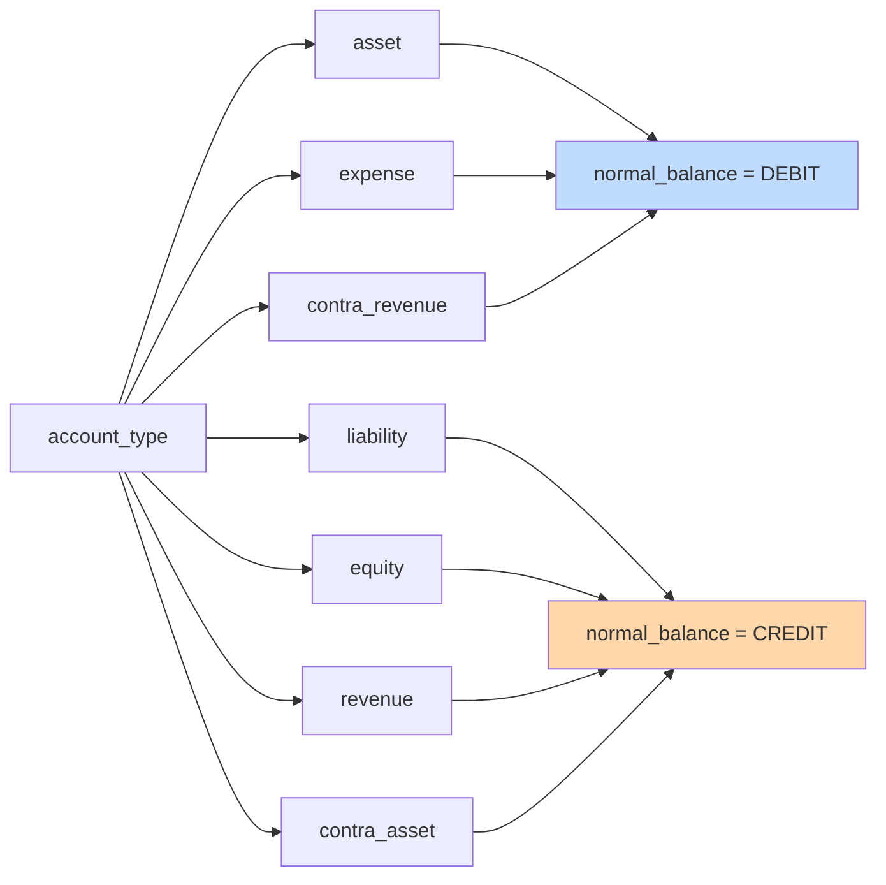
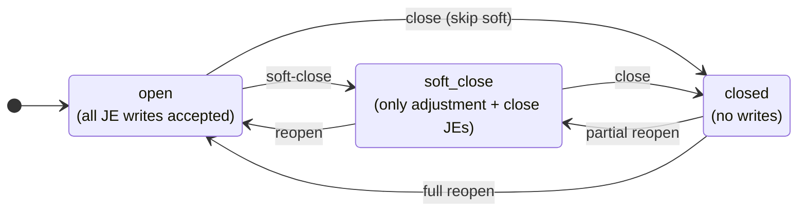
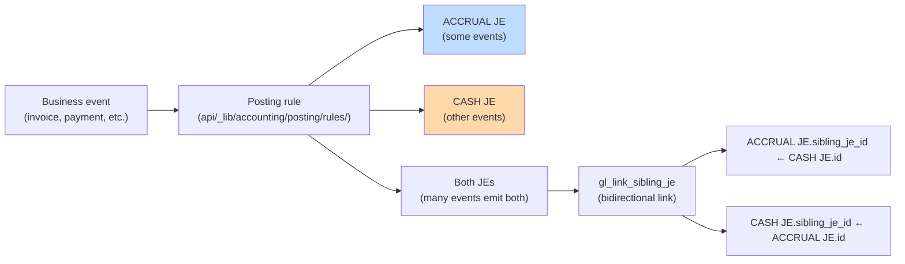
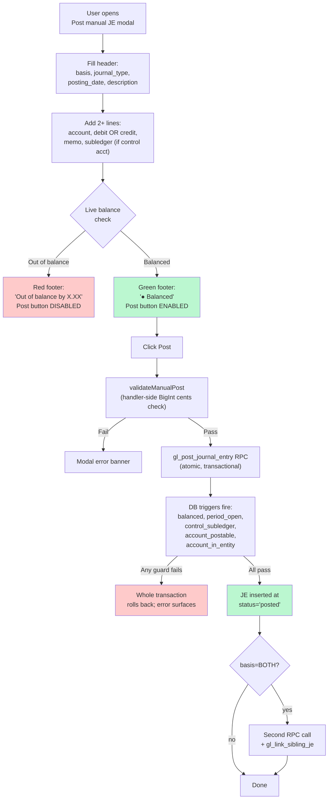

# 3. Accounting — Chart of Accounts, Periods, Journal Entries

These three panels form the accountant's daily / monthly workflow. The order matters: **Chart of Accounts must be populated before Journal Entries can be posted**, because every JE line references an account.

## 📒 Chart of Accounts (COA)

### Concept

The COA is the canonical list of every postable or roll-up account, scoped to the entity (currently RoF only). Each account carries:

- A **code** (e.g. `1100`, `4000-WHOLESALE`) — unique per entity, the accountant's number scheme.
- A **name** — human-readable label.
- An **account_type** — one of: `asset`, `liability`, `equity`, `revenue`, `expense`, `contra_asset`, `contra_revenue`.
- A **normal_balance** — `DEBIT` or `CREDIT`. **Auto-derived from `account_type`** (you can override but rarely should):

- An **is_postable** flag — `true` for accounts JEs can hit directly; `false` for roll-up parent accounts that exist only for hierarchy / reporting.
- An **is_control** flag — `true` for AR / AP / Inventory accounts. **Control accounts require subledger pairing on every JE line** (a vendor ID for AP, customer ID for AR, item ID for Inventory).
- An optional **parent_account_id** — self-FK for tree-shaped chart of accounts.

### Seeding the COA

The COA arrives **empty**. The accountant supplies the canonical list (per the email draft at `docs/tangerine/accountant-coa-request-email.md`). Until they reply:

1. You can manually add a handful of accounts via the **+ Add account** modal for testing.
2. Once their CSV/spreadsheet arrives, a data-only migration loads the full COA in one batch (Chunk 6.5 / accountant-COA-seed task, queued).

### List view

Columns: **Code, Name, Type, Subtype, Balance, Status, Postable, Control**, plus per-row Edit / Delete buttons.

Filters above the table:

- **Search** — code or name (ilike)
- **Type dropdown** — narrow to one account type
- **Show inactive** — by default, the list shows only `status=active` accounts

<!-- screenshot needed: COA list with several seeded accounts -->

### Add modal

| Field | Required? | Locked after creation? | Notes |
|---|---|---|---|
| Code | yes | **yes** | Uppercased + trimmed. Unique per entity. |
| Name | yes | no | Free text |
| Account type | yes | **yes** | The 7 enum values |
| Normal balance | required (auto-fills) | **yes** | Changes when you change account_type; you can manually override before save |
| Subtype | no | no | Free text (e.g. `current_asset`, `ar`, `cogs`) |
| Parent account | no | no | Dropdown of all current accounts (excluding self in Edit). Restricted to same entity. |
| Postable | checkbox, default true | no | When false, JEs cannot hit this account directly |
| Control | checkbox, default false | no | When true, JE lines targeting this account MUST include subledger_type + subledger_id |
| Status | required, default active | no | active / inactive |
| Description | no | no | Free text |

<!-- screenshot needed: Add modal mid-creation, showing the normal_balance auto-fill -->

### Locked fields on Edit

`code`, `account_type`, `normal_balance`, and `entity_id` are immutable after creation. The Edit modal shows them as read-only (grayed-out). To change them, you'd need to soft-delete and recreate — but that's almost always wrong because historical JEs reference the account ID, not the code.

### Deleting accounts

Click **Delete** to hard-delete. The handler **rejects with 409 if any `journal_entry_lines` row references the account**:

> Account has posted journal entry lines; mark it inactive via PATCH status='inactive' instead of deleting.

For accounts with history, the right move is to PATCH `status='inactive'`. The account stays in the database (historical JEs remain valid), but it disappears from the default `status=active` list and from the JE entry account picker.

<!-- screenshot needed: alert showing the 409 error message -->

## 🗓️ Periods

### Concept

Periods are 12 calendar-month accounting buckets per fiscal year per entity. They were bootstrapped by migration: **FY 2021–2030, 12 periods each = 120 rows** for RoF. You don't create or delete periods — only their **status** changes.

All transitions are allowed in both directions. Reopening a closed period is unusual but supported (e.g. accountant discovers a missed entry during audit).

### What each status blocks

| Status | JE INSERT | JE UPDATE | Notes |
|---|---|---|---|
| `open` | ✅ all | ✅ all | Default working state |
| `soft_close` | ✅ only journal_type IN (`adjustment`, `close`) | ✅ same restriction | The Chunk 2 DB trigger enforces this server-side |
| `closed` | ❌ blocked | ❌ blocked | Hard wall. Trigger raises an exception. |

### List view

Periods group by fiscal year (collapsible cards). Each row shows:

- Period number (1–12) + month name
- `starts_on` and `ends_on` dates
- `posted_je_count` (live aggregate of posted JEs in this period — useful to know what you're closing)
- Color-coded status badge: 🟢 green=open, 🟡 yellow=soft_close, 🔴 red=closed
- Inline status dropdown — change status with a confirm modal

Filters above the table:

- **Fiscal year** — narrow to one FY
- **Status** — narrow to one status

<!-- screenshot needed: Periods list with FY 2026 card showing 12 rows -->

### Changing status

Click the status dropdown in the row, pick the target status, confirm the prompt:

> Change FY2026 period 5 (May) from "open" to "soft_close"?

The handler validates the transition (impossible state changes are blocked with a 400) and auto-maintains `soft_closed_at` / `closed_at` timestamps + clears them on reopen.

## 📓 Journal Entries

### Concept

A journal entry (JE) is one accounting transaction — header + 2 or more lines, balanced (sum of debits = sum of credits). Every JE has a **basis** (`ACCRUAL` or `CASH`). The system maintains **two parallel books** in dual-basis mode (the locked P1 decision):

For a manual JE you post yourself, you choose the basis: `ACCRUAL`, `CASH`, or `BOTH` (posts a sibling pair).

### List view

Columns: **Posting date, Type, Basis, Description, Source, Status**. Reversed JEs and drafts show grayed out.

Filters:

- **Basis** — all / ACCRUAL / CASH
- **Include drafts** — drafts are normally hidden (the system only inserts `status='posted'` rows; drafts can exist transiently mid-RPC)

Each posted row has a **Reverse** button on the right.

<!-- screenshot needed: JE list with mix of posted/reversed rows -->

### Posting a manual JE

Click **+ Post manual JE** to open the modal.

#### Modal fields

**Header row:**

| Field | Notes |
|---|---|
| Basis | `ACCRUAL`, `CASH`, or `BOTH` (sibling pair). For most accountant adjustments, choose ACCRUAL. |
| Journal type | `manual` (default) or `adjustment`. Use `adjustment` if posting into a soft-closed period. |
| Posting date | Date the entry hits the books. Must fall inside a non-closed period for the chosen basis. |
| Description | Free text, e.g. "Adjusting entry for accrued rent" |

**Lines table** (start with 2; add more with + Add line):

| Column | Notes |
|---|---|
| # | Line number (auto) |
| Account | Dropdown filtered to `status=active AND is_postable=true` accounts. Shows `<code> — <name> [control]` if it's a control account. |
| Debit | Decimal. Mutually exclusive with Credit on the same line — typing in one clears the other. |
| Credit | Same. |
| Memo | Free text per line |
| Sub type | `vendor`, `customer`, `item`, or (none). **Required if the account is a control account.** |
| Sub id | UUID of the subledger entity. Currently raw UUID input — picker UX is planned but not built. |

**Footer** shows live totals and balance status. The **Post** button is disabled until: lines balance AND description is non-empty.

<!-- screenshot needed: post modal mid-entry, green balanced footer -->

<!-- screenshot needed: post modal with red unbalanced footer -->

### Reversing a posted JE

Click **Reverse** on any `status=posted` row.

The system creates a **new** JE with negated lines (debit ↔ credit), flips the original to `status=reversed`, and cross-links them via `reverses_je_id` (new → original) and `reversed_by_je_id` (original → new). The original's lines are never modified — posted lines are immutable per the Chunk 3 DB trigger.

You're prompted for an optional `YYYY-MM-DD` posting date for the reversal — leave blank to default to today.

The reversal entry lands in an **open** period. If today's period is closed, you must pick a date in an open period or first reopen the closed period.

### Why posted JEs can't be edited or deleted

Once `status='posted'`, the JE is immutable by design. PATCH and DELETE on `/api/internal/journal-entries/:id` return 405. The only undo path is reversal. This protects audit integrity — the GL always tells the truth about what was posted and when.

## Going further

- **Concepts** (dual-basis, control accounts, subledgers, audit immutability): [04-concepts.md](04-concepts.md)
- **Workflows** (month-end close, manual adjustment, AP invoice manual entry): [05-workflows.md](05-workflows.md)
- **Troubleshooting** (period closed, unbalanced, missing subledger, account not found): [06-troubleshooting.md](06-troubleshooting.md)
