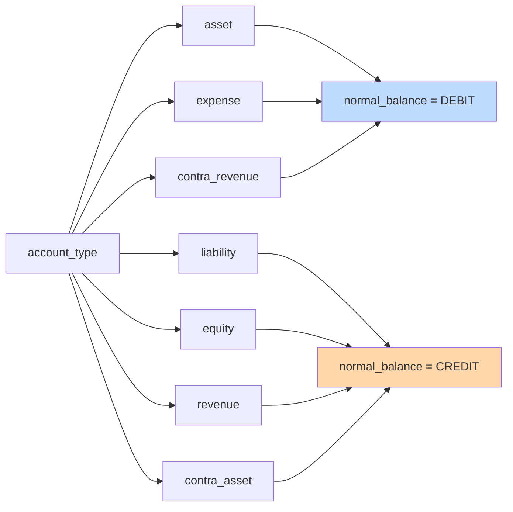
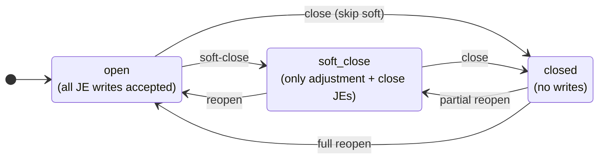
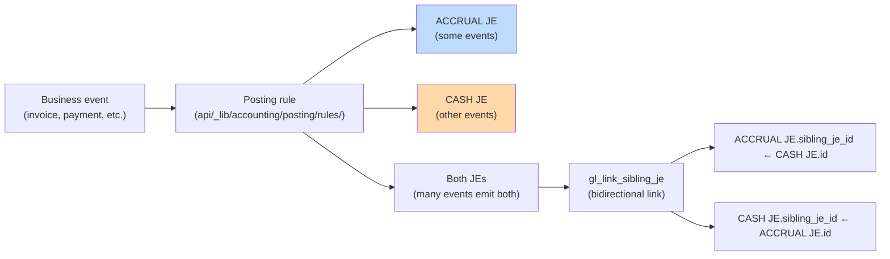
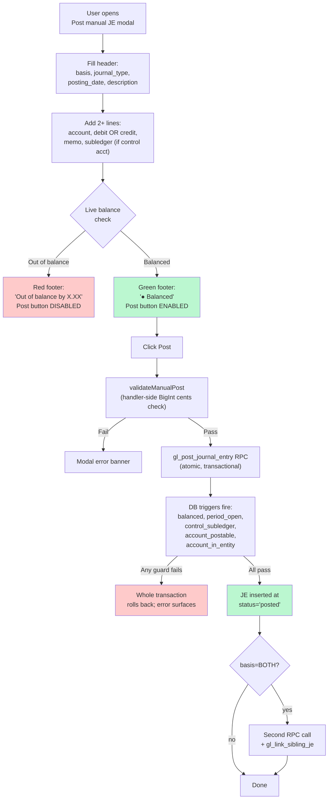
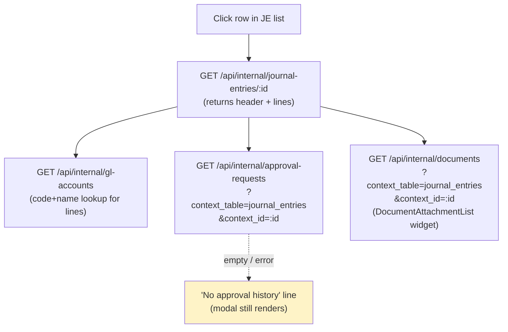
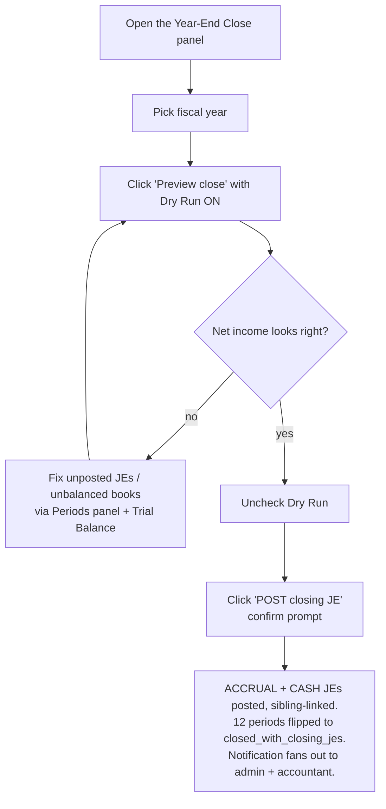
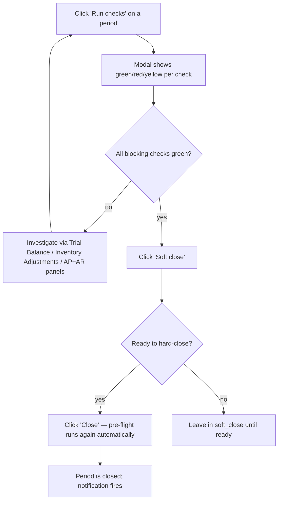

# 3. Accounting — Chart of Accounts, Periods, Journal Entries

These three panels form the accountant's daily / monthly workflow. The order matters: **Chart of Accounts must be populated before Journal Entries can be posted**, because every JE line references an account.

## 📒 Chart of Accounts (COA)

### Concept

The COA is the canonical list of every postable or roll-up account, scoped to the entity (currently RoF only). Each account carries:

- A **code** (e.g. `1100`, `4000-WHOLESALE`) — unique per entity, the accountant's number scheme.
- A **name** — human-readable label.
- An **account_type** — one of: `asset`, `liability`, `equity`, `revenue`, `expense`, `contra_asset`, `contra_revenue`.
- A **normal_balance** — `DEBIT` or `CREDIT`. **Auto-derived from `account_type`** (you can override but rarely should):



- An **is_postable** flag — `true` for accounts JEs can hit directly; `false` for roll-up parent accounts that exist only for hierarchy / reporting.
- An **is_control** flag — `true` for AR / AP / Inventory accounts. **Control accounts require subledger pairing on every JE line** (a vendor ID for AP, customer ID for AR, item ID for Inventory).
- An optional **parent_account_id** — self-FK for tree-shaped chart of accounts.

### Seeding the COA

The COA arrives **empty**. The accountant supplies the canonical list (per the email draft at `docs/tangerine/accountant-coa-request-email.md`). Until they reply:

1. You can manually add a handful of accounts via the **+ Add account** modal for testing.
2. Once their CSV/spreadsheet arrives, a data-only migration loads the full COA in one batch (Chunk 6.5 / accountant-COA-seed task, queued).

### List view

Columns: **Code, Name, Type, Subtype, Parent, Normal, Balance, Status, Postable, Control**, plus per-row Edit / Delete buttons. The **Parent** column resolves each account's `parent_account_id` to the parent's `Code — Name` (never a raw UUID), or `—` when the account has no parent. Any column can be hidden via the columns (⚙) button, and all appear in the xlsx export.

Filters above the table:

- **Search** — code or name (ilike)
- **Type dropdown** — narrow to one account type
- **Show inactive** — by default, the list shows only `status=active` accounts


<!-- screenshot needed: COA list with several seeded accounts -->

### Add modal

| Field | Required? | Locked after creation? | Notes |
|---|---|---|---|
| Code | yes | **yes** | Uppercased + trimmed. Unique per entity. |
| Name | yes | no | Free text |
| Account type | yes | **yes** | The 7 enum values |
| Normal balance | required (auto-fills) | **yes** | Changes when you change account_type; you can manually override before save |
| Subtype | no | no | Free text (e.g. `current_asset`, `ar`, `cogs`) |
| Parent account | no | no | Dropdown of all current accounts (excluding self in Edit). Restricted to same entity. |
| Postable | checkbox, default true | no | When false, JEs cannot hit this account directly |
| Control | checkbox, default false | no | When true, JE lines targeting this account MUST include subledger_type + subledger_id |
| Status | required, default active | no | active / inactive |
| Description | no | no | Free text |


<!-- screenshot needed: Add modal mid-creation, showing the normal_balance auto-fill -->

### Locked fields on Edit

`code`, `account_type`, `normal_balance`, and `entity_id` are immutable after creation. The Edit modal shows them as read-only (grayed-out). To change them, you'd need to soft-delete and recreate — but that's almost always wrong because historical JEs reference the account ID, not the code.

### Deleting accounts

Click **Delete** to hard-delete. The handler **rejects with 409 if any `journal_entry_lines` row references the account**:

> Account has posted journal entry lines; mark it inactive via PATCH status='inactive' instead of deleting.

For accounts with history, the right move is to PATCH `status='inactive'`. The account stays in the database (historical JEs remain valid), but it disappears from the default `status=active` list and from the JE entry account picker.


<!-- screenshot needed: alert showing the 409 error message -->

## 🗓️ Periods

### Concept

Periods are 12 calendar-month accounting buckets per fiscal year per entity. They were bootstrapped by migration: **FY 2021–2030, 12 periods each = 120 rows** for RoF. You don't create or delete periods — only their **status** changes.



All transitions are allowed in both directions. Reopening a closed period is unusual but supported (e.g. accountant discovers a missed entry during audit).

### What each status blocks

| Status | JE INSERT | JE UPDATE | Notes |
|---|---|---|---|
| `open` | ✅ all | ✅ all | Default working state |
| `soft_close` | ✅ only journal_type IN (`adjustment`, `close`) | ✅ same restriction | The Chunk 2 DB trigger enforces this server-side |
| `closed` | ❌ blocked | ❌ blocked | Hard wall. Trigger raises an exception. |

### List view

Periods group by fiscal year (collapsible cards). Each row shows:

- Period number (1–12) + month name
- `starts_on` and `ends_on` dates
- `posted_je_count` (live aggregate of posted JEs in this period — useful to know what you're closing)
- Color-coded status badge: 🟢 green=open, 🟡 yellow=soft_close, 🔴 red=closed
- Inline status dropdown — change status with a confirm modal

Filters above the table:

- **Fiscal year** — narrow to one FY
- **Status** — narrow to one status


<!-- screenshot needed: Periods list with FY 2026 card showing 12 rows -->

### Changing status

Click the status dropdown in the row, pick the target status, confirm the prompt:

> Change FY2026 period 5 (May) from "open" to "soft_close"?

The handler validates the transition (impossible state changes are blocked with a 400) and auto-maintains `soft_closed_at` / `closed_at` timestamps + clears them on reopen.

## 📓 Journal Entries

### Concept

A journal entry (JE) is one accounting transaction — header + 2 or more lines, balanced (sum of debits = sum of credits). Every JE has a **basis** (`ACCRUAL` or `CASH`). The system maintains **two parallel books** in dual-basis mode (the locked P1 decision):



For a manual JE you post yourself, you choose the basis: `ACCRUAL`, `CASH`, or `BOTH` (posts a sibling pair).

### List view

Columns: **Posting date, Type, Basis, Description, Source, Status**. Reversed JEs and drafts show grayed out.

Filters:

- **Basis** — all / ACCRUAL / CASH
- **Include drafts** — drafts are normally hidden (the system only inserts `status='posted'` rows; drafts can exist transiently mid-RPC)

Each posted row has a **Reverse** button on the right.


<!-- screenshot needed: JE list with mix of posted/reversed rows -->

### Posting a manual JE

Click **+ Post manual JE** to open the modal.



#### Modal fields

**Header row:**

| Field | Notes |
|---|---|
| Basis | `ACCRUAL`, `CASH`, or `BOTH` (sibling pair). For most accountant adjustments, choose ACCRUAL. |
| Journal type | `manual` (default) or `adjustment`. Use `adjustment` if posting into a soft-closed period. |
| Posting date | Date the entry hits the books. Must fall inside a non-closed period for the chosen basis. |
| Description | Free text, e.g. "Adjusting entry for accrued rent" |

**Lines table** (start with 2; add more with + Add line):

| Column | Notes |
|---|---|
| # | Line number (auto) |
| Account | Dropdown filtered to `status=active AND is_postable=true` accounts. Shows `<code> — <name> [control]` if it's a control account. |
| Debit | Decimal. Mutually exclusive with Credit on the same line — typing in one clears the other. |
| Credit | Same. |
| Memo | Free text per line |
| Sub type | `vendor`, `customer`, `item`, or (none). **Required if the account is a control account.** |
| Sub id | UUID of the subledger entity. Currently raw UUID input — picker UX is planned but not built. |

**Footer** shows live totals and balance status. The **Post** button is disabled until: lines balance AND description is non-empty.


<!-- screenshot needed: post modal mid-entry, green balanced footer -->


<!-- screenshot needed: post modal with red unbalanced footer -->

### Viewing a JE (detail modal)

Click any row in the JE list to open the read-only **JE detail modal**. The header carries the JE id; the body is divided into four sections.



**Sections** (top to bottom):

1. **Header** — posting_date, journal_type, basis, source_module, source_table/source_id, posted_at, sibling_je_id (for ACCRUAL↔CASH pairs), and reverses_je_id / reversed_by_je_id cross-links. All read-only.
2. **Description** — the free-text label entered at post time.
3. **Lines** — full line table with account code+name (joined from the COA lookup), debit, credit, memo, and subledger pairing. Totals row at the bottom shows Σ debit and Σ credit (which match by construction for any posted JE).
4. **Approval history** — best-effort lookup against `approval_requests` where `context_table='journal_entries' AND context_id=<this JE>`. Renders each request's status, kind, and step decisions. If no matching approval exists (or the lookup fails), shows **"No approval history"** — the rest of the modal still renders.
5. **Supporting documents** — the reusable `<DocumentAttachmentList>` widget bound to this JE. **This is the only writable area of the modal.** Documents can be uploaded, downloaded (via short-lived signed URL), or archived (soft-delete). Seeded kinds dropdown: `supporting_doc`, `approval_correspondence`, `receipt`, `other`.

```tsx
<DocumentAttachmentList
  contextTable="journal_entries"
  contextId={je.id}
  kinds={["supporting_doc","approval_correspondence","receipt","other"]}
/>
```

The modal has two footer buttons:

- **Close** — dismiss without any change.
- **Reverse** — only enabled when `status='posted'` AND `reversed_by_je_id` is null. Delegates to the same reverse flow as the row-level Reverse button (prompt for posting_date, then `POST /api/internal/journal-entries/:id/reverse`).

> Why is the rest of the modal read-only? Posted JEs are immutable by design (see the next section). The detail modal is intentionally a **viewer** — the only thing that can be changed about a posted JE after the fact is the set of supporting documents pinned to it.

### Reversing a posted JE

Click **Reverse** on any `status=posted` row.

The system creates a **new** JE with negated lines (debit ↔ credit), flips the original to `status=reversed`, and cross-links them via `reverses_je_id` (new → original) and `reversed_by_je_id` (original → new). The original's lines are never modified — posted lines are immutable per the Chunk 3 DB trigger.

You're prompted for an optional `YYYY-MM-DD` posting date for the reversal — leave blank to default to today.

The reversal entry lands in an **open** period. If today's period is closed, you must pick a date in an open period or first reopen the closed period.

### Why posted JEs can't be edited or deleted

Once `status='posted'`, the JE is immutable by design. PATCH and DELETE on `/api/internal/journal-entries/:id` return 405. The only undo path is reversal. This protects audit integrity — the GL always tells the truth about what was posted and when.

## Income Statement (P5-3)

**Where:** Tangerine → 💼 Accounting → 📈 **Income Statement**.

The Income Statement (P&L) report aggregates posted journal entries from revenue and expense accounts into the three standard sections operators expect on a financial statement. It supports both the **ACCRUAL** and **CASH** books — toggle at the top — and any date range. Default range is current FY (Jan 1) through today.

> **Drill into any account:** click an account row (look for the **↗**) to open its GL detail scoped to the same From/To and basis. See [GL account drill-down](#gl-account-drill-down-click-an-account-on-any-financial-report).

### The three sections

1. **Revenue** — every account with `account_type IN ('revenue','contra_revenue')`. Contra-revenue accounts (returns, discounts) display alongside revenue rows but reduce the section total. The footer of this section shows **Net Revenue** = gross revenue minus contra revenue.

2. **Cost of Goods Sold (COGS)** — expense accounts whose `code` starts with `'5'`. This is a convention-based heuristic following ROF's chart-of-accounts layout where the 5xxx range is reserved for direct product cost.

3. **Operating Expenses (OPEX)** — every other expense account (`account_type='expense'` and code does NOT start with `'5'`). Typically 6xxx-7xxx in ROF's COA (rent, salaries, marketing, etc).

Each section is collapsible (default open). Accounts within a section list code + name + amount, right-aligned with tabular numerals so columns align cleanly.

### Subtotals + Net Income

The footer below the three sections shows the standard P&L roll-up:

| Line | Formula |
|---|---|
| Net Revenue | Revenue section total |
| − COGS | COGS section total |
| **Gross Margin** | Net Revenue − COGS — green if positive, red if negative |
| − Operating Expenses | OPEX section total |
| **Operating Income** | Gross Margin − OPEX |
| **NET INCOME** | Operating Income (until M22 Fixed Assets adds depreciation) |

### Per-style revenue / COGS / returns routing

Revenue and COGS are carried **per AR-invoice line** (`ar_invoice_lines.revenue_account_id`), so a line *can* point at a specific account. At posting time each line resolves **line account → invoice/entity default revenue (4000) → COGS (5000)** (see [`ar-invoices/post.js`](../../../api/_handlers/internal/ar-invoices/post.js)).

> **Important — there is NO per-style GL mapping today.** `style_master` has no Revenue/COGS/Returns account columns, and nothing populates the per-line `revenue_account_id` from a style. So in practice all sales currently resolve to the **shared** entity-default accounts (revenue 4000, COGS 5000). To see revenue/COGS/margin broken out by brand, channel, warehouse or gender, use the **[Segment P&L](#segment-pl-p26)** report (P26), which pivots shared accounts into configurable columns rather than relying on per-style accounts. Per-style GL routing is a possible future enhancement, not a shipped feature.

### The COGS heuristic (code starts with '5')

The system identifies COGS rows by checking whether the gl_accounts code begins with `5`. This is a convention, not a hard schema rule. If your COA uses a different numbering scheme (e.g., 50000-series instead of 5xxx, or you have non-COGS accounts that happen to start with 5), you'll see misclassifications — talk to engineering about adding an explicit `gl_accounts.is_cogs boolean` flag. Per arch §13, the heuristic is the MVP default; the flag ships only if range-based detection turns out wrong for your COA.

### Post-close caveat (important)

After the **Year-End Close** RPC runs (P5-6, ships later), all revenue and expense accounts are zeroed out into Retained Earnings via a closing JE dated the last day of the FY. If you then run the Income Statement over a closed fiscal year, the **report shows $0** in every section — because the underlying revenue/expense balances are now zero by design.

This is correct behavior, not a bug. To review the historical activity of a closed FY:

- Run the Income Statement BEFORE year-end close (during the soft-close window, or right after a hard month close but before year-end).
- For post-close audit, query the GL directly against the closing JE itself (it carries the zeroing journal lines and the net-income rollover to Retained Earnings).

Operators should make a habit of running the IS over the about-to-close FY one final time during soft-close — and attaching the PDF to the period's close package (Document Attachments) — before flipping the year-end terminal close.

### Choosing the basis

- **ACCRUAL** — revenue is recognized when the invoice is sent (AR invoice posts), expenses when the bill is approved (AP invoice posts). Matches GAAP / tax filings.
- **CASH** — revenue is recognized when the customer's payment is received, expenses when the vendor is actually paid. Useful for cash-flow visibility but doesn't match GAAP.

Both books are kept in parallel — every accrual JE has a sibling cash JE (or vice versa) — so flipping the toggle is instant and always available.

---

## Segment P&L (P26)

**Where:** Tangerine → 💼 Accounting → 📈 **Segment P&L** (also linked from the **Reports & Analytics** hub).

The Segment P&L shows Revenue, COGS, Gross Margin and units sliced by **Brand × Channel × Warehouse × Gender**, with the dimensions rendered as **configurable columns**. The GL accounts stay shared — the split is a reporting pivot, not separate accounts.

### Source of the numbers (important)
Unlike the Income Statement (which reads posted journal entries), the Segment P&L reports off the **sales history sub-ledger** (`ip_sales_history_wholesale`, which despite its name holds **both** wholesale and ecom/DTC sales, tagged by channel). This is deliberate: the Tangerine GL has no posted sales yet, while the sub-ledger holds the full sales history with COGS and margin. So this report reflects the books of record for sales today — **wholesale and DTC (ROF / PT ecom) are both included** from existing data.

### Configurable columns
- The toolbar shows your segment columns as chips. Defaults are **Private Label** (MPL Epic + MPL Sun & Stone), **ROF DTC** (brand ROF + channel DTC), and **PT DTC** (brand PT + channel DTC).
- **+ Add column** opens an editor where a column is defined as any filter over **Brands / Channels / Warehouses / Genders** (an empty group means "all"). Name it whatever you like — you can create as many columns as you want.
- **Drag a chip** to reorder columns; **✎** edits, **✕** removes, **Reset** restores the default segments. Your layout is remembered in the browser.

### Total always reconciles (the "Other" column)
**Total** and **Other** are computed automatically — you can't edit or delete them. Every sale is counted in the **first** of your columns (left → right) whose filter it matches; any sale not captured by **any** column drops into an auto **Other** column (shown only when it has activity). Because each sale lands in exactly one column-or-Other, **the columns always sum to Total** — the math can't drift. (Reordering only changes which column claims a sale when two columns would both match it; normal non-overlapping segments are unaffected.)

### Rows
Net Sales (optionally broken out by gender via the checkbox), COGS, Gross Margin, Gross Margin %, and Units. Margin is blank where the source carries no cost (ecom). Use **Export** for the Excel version of the matrix.

### Date range
Defaults to current FY (Jan 1 → today); use the From/To pickers or the **Date Presets** dropdown.

---

## Cash Flow Statement (P5-5)

Tangerine → 💼 Accounting → 💧 **Cash Flow** opens the indirect-method Cash Flow Statement.

### What it computes

The cash flow statement explains how cash moved over a date range by reconciling net income to the actual change in cash on hand. The **indirect method** starts from net income (from the income statement) and adjusts for working-capital changes:

```
Operating section:
  Net Income (from the income statement)
  + Decrease in Accounts Receivable  (or − Increase)
  + Decrease in Inventory             (or − Increase)
  + Increase in Accounts Payable      (or − Decrease)
  = Net cash from operating activities

Investing section:   $0 placeholder until P22+ (Fixed Assets)
Financing section:   $0 placeholder until P22+ (account tagging)

Beginning Cash + Net Change = Ending Cash
```

### Controls

- **Basis toggle:** ACCRUAL or CASH. The cash-basis statement is mostly an identity (cash-basis net income ≈ net change in cash) so the ACCRUAL view is the one to read most days.
- **From / To dates:** default to Jan 1 of the current calendar year through today. Adjustable for any custom window — month-to-date, quarter, prior year, etc.

### How accounts get identified

The RPC must know which accounts represent AR, AP, Inventory, and Cash. It uses two layers:

1. **Entity defaults** (preferred) — `entities.default_ar_account_id`, `default_ap_account_id`, `default_inventory_account_id` (set during P3-1 and P4-1 schema migrations).
2. **Code-prefix fallback** — if any default is null, the RPC looks up:
   - AR → first `gl_accounts` row with code `'1200'`
   - AP → first row with code `'2010'`
   - Inventory → first row with code `'1300'`

Cash accounts (for the footer reconciliation) are identified by **heuristic**:

```
account_type = 'asset'
AND code LIKE '1%'
AND (name ILIKE '%cash%' OR name ILIKE '%bank%')
```

If your COA names cash accounts with words like "Petty" or "Operating" only (no "cash" or "bank"), the heuristic will miss them and the footer reconciliation will show a gap. Rename the accounts so they match — an explicit `is_cash boolean` flag will land in P22+ if the operator needs finer control.

### The investing + financing placeholders

Both sections render with a single `$0` placeholder row and a small note "Configure account tagging in P22+." These ship populated once:

- **M22 Fixed Assets** (P25 roadmap) introduces capital purchases/sales — those flow into Investing.
- **Account tagging UI** (post-P22) lets the operator mark equity/liability accounts as "owner contributions," "loan principal repayments," "dividends paid," etc. Those tags drive the Financing section.

Until then, Net cash from investing = $0 and Net cash from financing = $0. The operating section is fully live.

### The footer reconciliation invariant

The bottom of the panel shows:

```
Beginning Cash    $X
+ Net Change      $Y
= Ending Cash     $Z
```

These must satisfy `X + Y ≈ Z` (within $0.01). If they don't, the panel renders a yellow warning row "Reconciliation gap — investigate." Common causes:

- The cash-account heuristic is missing one of your cash accounts (rename it to include "cash" or "bank").
- An out-of-balance JE posted historically (extremely rare — the JE post trigger guards against this).
- The operating section's AR/AP/Inventory deltas aren't catching all the movement because a non-default account was used (check `entities.default_*_account_id` is set correctly).

The reconciliation is a defense-in-depth check — under normal operations it should always be green.

## Going further

- **Concepts** (dual-basis, control accounts, subledgers, audit immutability): [04-concepts.md](04-concepts.md)
- **Workflows** (month-end close, manual adjustment, AP invoice manual entry): [05-workflows.md](05-workflows.md)
- **Accounts Payable** ([13-accounts-payable.md](13-accounts-payable.md)) — the AP-invoice form now **defaults its Payment Terms from the selected vendor's master record** (`vendors.payment_terms_id`). Picking a vendor auto-fills the Payment terms picker (alongside the vendor's default AP + expense accounts); on an existing invoice it only fills when the field is still blank so an explicit edit is never overwritten.
- **Troubleshooting** (period closed, unbalanced, missing subledger, account not found): [06-troubleshooting.md](06-troubleshooting.md)

---

## Period close (P5-1, 2026-05-27)

The Periods panel ships with a 3-status state machine — `open` → `soft_close` → `closed` — and P5-1 adds a fourth terminal status (`closed_with_closing_jes`) that is set only by the year-end close RPC (P5-6). The full layout:

```
            ┌──────────────────┐
            ▼                  │
          open ──► soft_close ─┤──► closed
                                    │
                                    ▼
                          closed_with_closing_jes (TERMINAL)
```

### Soft-closing a period

`POST /api/internal/gl-periods/:id/close` with `body = { target_status: 'soft_close', actor_user_id, reason? }`. The reason is optional but recommended; it's recorded in the new `gl_period_status_log` audit table.

A soft-closed period blocks new manual journal entries but still accepts AP/AR/inventory operations (they're operationally idempotent and posting them late is fine).

### Hard-closing

Same endpoint, `target_status: 'closed'`. Blocks all posting (manual JE + AP + AR + inventory). The only exception is historical-backfill writes (`journal_type='*_historical'`), which still bypass via the trigger logic established in P4-1.

If an active `approval_rules` row exists with `kind='gl_period_close'`, the handler routes the close through M27 approvals before applying — returns `202 {requires_approval: true, approval_request_id}` and the operator must approve before the period flips. Without a rule, the close lands immediately.

A `gl_period_closed` (or `_soft_closed`) notification is enqueued to `recipient_roles=['admin','accountant']` on success.

### Reopening a closed period

`POST /api/internal/gl-periods/:id/reopen` with `body = { actor_user_id, reason }`. **Both fields required.** Caller must hold `role='admin'` on the entity (returns 403 otherwise). Status flips back to `soft_close`. The reason is captured in the audit log and the `gl_period_reopened` notification body.

Periods in `closed_with_closing_jes` cannot be reopened — that status is reserved for year-end close (P5-6) and is the one situation where corrections must instead be filed as adjustment JEs in the next FY's opening period.

### Audit log

Every status transition writes one row to `gl_period_status_log` (entity_id, period_id, from_status, to_status, reason, actor_user_id, performed_at). The audit row is populated by an `AFTER UPDATE` trigger reading session-local vars set by the `gl_period_transition_status` RPC — so the actor + reason are captured atomically with the status flip.

---

## Trial Balance (P5-2)

The **Trial Balance** is the foundation report for every other financial statement (Income Statement, Balance Sheet, Cash Flow). It rolls up every posted journal entry line per account and tells you — for the date window you choose — the total debit, total credit, and the net in either direction.

Open it from **💼 Accounting → 📊 Trial Balance**.

### What it shows

One row per account that has been touched by a posted JE in the window:

- **Code / Name** — from the COA.
- **Type** (asset / liability / equity / revenue / expense / contra_*) and **Normal** (DEBIT / CREDIT) — same source.
- **Debit** — `SUM(journal_entry_lines.debit)` across posted JEs in the window.
- **Credit** — `SUM(journal_entry_lines.credit)` across posted JEs in the window.
- **Net** — `Debit − Credit`. Positive (green) means the account has net debits; negative (yellow) means net credits.

Rows are grouped by account type with a per-group subtotal row and one grand-total footer row.

> **Drill into any account:** click an account row (look for the **↗**) to open its GL detail scoped to the same From/To and basis. See [GL account drill-down](#gl-account-drill-down-click-an-account-on-any-financial-report).

### Operator workflow

1. Pick **Basis** — `ACCRUAL` for the audited book (recommended default), `CASH` to see only cash-basis posting impact.
2. Set **From** and **To** dates. The default range is the last 90 days; widen for a year-end review, narrow for a single-period check.
3. Click **Refresh**. The grid loads.
4. Scan each account type's subtotal row — does the asset total match what you expect? Did revenue land where it should?

### Key invariant — the grand-total must net to $0.00

A trial balance proves out double-entry. If every posted JE is internally balanced (debits = credits), then summing across all of them MUST also balance — every dollar debited to one account is credited to another.

**The grand-total Net row should always read $0.00.**

If it doesn't, the variance row is rendered in red with a warning. That means an unbalanced JE somehow slipped past the P1 posting guard (which is supposed to reject unbalanced inserts at the trigger level). It's a corruption indicator — investigate by querying `journal_entry_lines` for the date range and looking for any `journal_entry_id` where `SUM(debit) ≠ SUM(credit)`.

In practice this should never happen — the trigger guard catches it. The variance row is defense in depth so a bug in the trigger doesn't silently corrupt downstream reports.

### API surface

`GET /api/internal/trial-balance?basis=ACCRUAL|CASH&from=YYYY-MM-DD&to=YYYY-MM-DD`

- `basis` (required) — `ACCRUAL` or `CASH`.
- `from` / `to` (both-or-neither) — if both provided, calls the `trial_balance(entity_id, basis, from, to)` RPC. If both omitted, reads the view `v_trial_balance` (cumulative across all posted history).

Response: `{ basis, from, to, rows: [...] }` sorted by account code ASC.

---

## GL account drill-down (click an account on any financial report)

Every financial report that lists GL accounts — **Income Statement**, **Trial Balance**, and **Balance Sheet** — lets you click an account row to open that account's **GL detail** (its underlying posted journal-entry lines) **pre-filtered to exactly the date range and basis the report is showing**. This is the fastest way to answer "what makes up this number?" without leaving the report.

### How to use it

- Account rows that can be drilled show a small **↗** next to the account name and turn into a pointer on hover (a tooltip reads *"Open GL detail for this account"*).
- **Click** (or **double-click**) the account row. A **GL Detail** modal opens on top of the report.
- The modal header shows the account **code · name · type**, the **basis** (ACCRUAL / CASH), and the **date range** it is scoped to.
- The table lists each posted line in the window: **Date, Description, Source, Debit, Credit, Running Balance**, with a totals footer. JE numbers and memos are resolved for you — no raw database IDs appear.
- Use the **Export** button to download the lines to Excel, or close with **✕** / **Esc** / clicking outside the modal.

### Drill from a ledger line to its full journal entry

A single GL-detail line shows only *this account's* side of a posting. To see the **whole journal entry** — every line, both sides, with header and memos:

- **Double-click** any line in the GL Detail table, or click the small **↗** button in the rightmost **JE** column of that line.
- The **Journal entry detail** modal opens on top, showing the complete entry: header (posting date, journal type, basis, source, posted-at), **all** of its lines (account code · name, debit, credit, memo, subledger) with balanced totals, the approval history, supporting documents, and the change/audit trail.
- **Editing a posted entry is by reversal, not in-place edits** (this keeps the books audit-safe). If the entry is **posted** and not already reversed, a **Reverse** button appears: it creates the offsetting reversal (you may supply a posting date, or leave blank for today), and the GL detail behind it refreshes automatically. Draft entries surface their draft status. This is the same JE detail/reverse view used in the **Journal Entries** module — opening it here just pre-loads the entry behind the line you clicked.
- Close the JE modal with **Close** / **Esc** / clicking outside to return to the GL Detail list.

### Which date range each report passes through

| Report | Range passed to the GL detail |
|---|---|
| **Income Statement** | The report's **From → To** (and the selected basis) |
| **Trial Balance** | The report's **From → To** (and the selected basis) |
| **Balance Sheet** | The **year-to-date window** ending at the **as-of** date — i.e. `Jan 1 of the as-of year → as-of date` (and the selected basis). This is the activity that builds up to the balance shown. |

So on the Income Statement, clicking an expense account opens its ledger scoped to the same From/To you were looking at; on the Balance Sheet, clicking an asset opens the year-to-date lines that roll up to that balance.

> Synthetic rows that aren't a single GL account (subtotals, the Balance Sheet's *Current Year Earnings* line) are not clickable — there's no single ledger behind them.

### API surface

`GET /api/internal/gl-account-detail` — served by `GET /api/internal/gl-detail?account_id=<uuid>&from=YYYY-MM-DD&to=YYYY-MM-DD&basis=ACCRUAL|CASH`.

- `account_id` (required) — the account's UUID (resolved by the report; never typed by hand).
- `from` / `to` (required) — the date window.
- `basis` (optional, default `ACCRUAL`) — when `CASH` is requested the handler uses the basis-aware `gl_detail_b(account_id, from, to, basis)` RPC; `ACCRUAL` keeps the original `gl_detail` RPC.

Response: `{ account_id, from, to, basis, rows: [{ posting_date, je_id, description, debit_cents, credit_cents, running_balance_cents, source_module, source_id }] }`.

The same ledger is also reachable as a standalone panel from **Accounting → Reports → GL Detail**, where you pick the account and dates manually.

---

## 📋 Balance Sheet (P5-4)

The Balance Sheet panel renders **assets**, **liabilities**, and **equity** as of a chosen date, in a three-column layout. Available at `Accounting → 📋 Balance Sheet`.

> **Drill into any account:** click an account row (look for the **↗**) to open its GL detail. Because the Balance Sheet is an *as-of* report, the drill-down is scoped to the **year-to-date through the as-of date** (Jan 1 → as-of) on the selected basis — the activity that builds up to the balance shown. See [GL account drill-down](#gl-account-drill-down-click-an-account-on-any-financial-report).

### Controls

- **Basis toggle** — `ACCRUAL` (default) or `CASH`. Reads the parallel sibling JEs posted by AP / AR / inventory rules.
- **As-of date picker** — defaults to today. The handler ALWAYS calls the parameterized `balance_sheet_as_of(entity_id, basis, as_of_date)` RPC so any historical snapshot is queryable.

### Layout

| Column | Sources |
|---|---|
| **Assets** | `account_type='asset'` + `account_type='contra_asset'` (the latter rendered with negative balance + slight indent so it visually nets against parent assets) |
| **Liabilities** | `account_type='liability'` |
| **Equity** | `account_type='equity'` PLUS a synthetic **Current Year Earnings** line at the bottom |

Each column has a per-section subtotal footer; the Equity column's footer is `equity + current_year_earnings`.

### Current Year Earnings

This synthetic line is computed in the UI from a sibling `/api/internal/income-statement?basis=X&from=YYYY-01-01&to=<as_of>` fetch:

```
Current Year Earnings = Σ(revenue net credits) − Σ(contra_revenue) − Σ(expense net debits)
                        for posting_date in [year_start .. as_of_date]
```

Until the year-end close JE runs (P5-6), this is how the BS stays balanced — closing the books rolls Current Year Earnings into the operator's designated **Retained Earnings** equity account and zeros out the underlying revenue + expense accounts. From that point on, prior-year activity shows up as Retained Earnings on the BS instead of as Current Year Earnings.

### Variance footer

The accounting equation is:

```
Assets = Liabilities + Equity + Current Year Earnings
```

The footer shows:

```
Variance = Assets − Liabilities − Equity − Current Year Earnings
```

**This should always be `$0.00`** — any non-zero value renders in red bold and indicates corruption (an out-of-balance JE somewhere, a basis mismatch, or a stale schema). The JE post trigger already rejects unbalanced lines, so this is rare in practice; the footer exists as defense-in-depth + a quick visual sanity check.

### Notes

- The view + RPC INCLUDE the current year's revenue / expense impact via the Current Year Earnings calculation. They do NOT include closed-year revenue / expense activity (zeroed by the year-end close JE — see P5-6).
- Money cells are right-aligned with `tabular-nums` and formatted as `$X,XXX.XX` (cents ÷ 100).
- The RPC is `STABLE` so Postgres can plan with the current snapshot — re-running with the same args within a transaction is cheap.

---

## Year-End Close (P5-6)

**Where:** Tangerine → 💼 Accounting → 🔚 **Year-End Close**.

The Year-End Close panel posts the FY's closing journal entry — zeros every revenue + expense account and rolls net income (or loss) into the operator's designated **Retained Earnings** equity account. After commit, all 12 periods of that FY flip to `closed_with_closing_jes`, a **terminal status that cannot be reopened**.

### Prerequisite — Retained Earnings account

`entities.default_retained_earnings_account_id` must be set. The P5-6 migration auto-wires it to a `gl_accounts` row with `code='3500'` + `account_type='equity'` if one exists for ROF. If not, the operator picks the account via the Entities admin panel (or seeds the `3500` account first).

### Workflow



### What the RPC does

For each basis (ACCRUAL, then CASH):

1. Aggregates revenue + contra_revenue + expense activity for the FY via the same shape the Income Statement (P5-3) uses.
2. Builds a single JE: DR each revenue account by its net credit (zeroing it); CR each expense account by its net debit (zeroing it); plug Retained Earnings with net income (CR if profit, DR if loss).
3. If both bases have non-zero activity, posts both JEs and sibling-links them via `gl_link_sibling_je`.
4. Uses `journal_type='gl_year_end_close'` — this is one of the historical-bypass journal types from P4-1, so the JE writes through even though some periods may be in `closed` status.
5. Updates all 12 periods of the FY to `closed_with_closing_jes` (terminal). Re-running errors with "already has N periods in closed_with_closing_jes."

### Skipped bases

If a basis has no revenue/expense activity for the FY (e.g. the cash book never recognized anything for a backfill-only FY), that basis's JE is skipped entirely. The breakdown panel surfaces this with a `skipped_reason` row.

### Post-close verification

| Report | Expected post-close |
|---|---|
| **Income Statement** for the closed FY | All accounts $0 — revenue + expense zeroed by the close |
| **Balance Sheet** as-of the FY end | Retained Earnings increased by net income; Current Year Earnings line is $0 |
| **Trial Balance** for the closed FY range | Balances unchanged (full JE history still readable) |
| **Periods** panel | All 12 periods of the FY show terminal `closed_with_closing_jes` badge |

### Corrections after year-end close

`closed_with_closing_jes` periods are **immutable**. To correct a closed FY, file an adjustment JE in the next FY's opening period referencing the original closing entry as documentation. The audit trail stays intact.

### API surface

```
POST /api/internal/year-end-close/run
body: { fiscal_year: <int>, dry_run: <bool, default true>, actor_user_id: <uuid> }
```

Response (both modes return the same shape; live run additionally writes JEs + flips periods):

```json
{
  "entity_id": "...",
  "fiscal_year": 2024,
  "dry_run": false,
  "accrual_je_id": "...",
  "cash_je_id": "...",
  "periods_flipped": 12,
  "basis_breakdown": {
    "ACCRUAL": { "net_income_cents": 12345600, "line_count": 17, "projected_lines": [...] },
    "CASH":    { "net_income_cents": 11200000, "line_count": 14, "projected_lines": [...] }
  }
}
```


---

## Close Pre-flight Checks (P5-7)

The Periods panel now has structured Close / Reopen / **Run checks** buttons per period (the old "change status" dropdown was a P1 placeholder that didn't write the audit log). Behind them: the new `gl_period_close_preflight(entity_id, period_id)` RPC, which returns one row per check and feeds both the manual modal AND the close handler.

### What gets checked

| Check | Severity | What it verifies |
|---|---|---|
| `period_status_allows_close` | blocking | Period isn't already in `closed_with_closing_jes` (terminal) |
| `accrual_trial_balanced` | blocking | Sum of accrual JE debits − credits for this period is $0.00 |
| `cash_trial_balanced` | blocking | Same for the cash book |
| `no_draft_jes` | blocking | No `journal_entries` rows in status `draft`/`pending_approval`/`unposted` for this period |
| `no_unposted_ar_invoices` | warning | No AR invoices with `gl_status` in pre-posted states for this period's date range |
| `no_unposted_ap_invoices` | warning | Same for legacy AP invoices |
| `no_unposted_inventory_adjustments` | warning | No `inventory_adjustments` still draft (posted_at IS NULL) for this period |
| `no_unapplied_receipts` | warning | No AR receipts with unapplied balance for this period |
| `fifo_negative_layers` | blocking | No `inventory_layers` with `remaining_qty < 0` — corruption indicator |

**Blocking** = the close is rejected with `409` if any blocking row fails. **Warning** = surfaced for operator visibility but doesn't block.

### Operator workflow



### Reopening a closed period

Click **Reopen**. Operator is prompted for: (1) a reason (recorded in the audit log + notification body), (2) their `auth_user_id` (must hold `role='admin'` on the entity — non-admins get 403). The terminal `closed_with_closing_jes` status (from year-end close P5-6) is the one case that cannot be reopened — file a correcting JE in the next FY's opening period instead.

### API surface

```
GET  /api/internal/gl-periods/:id/preflight    → { period_id, rows, summary }
POST /api/internal/gl-periods/:id/close        → runs preflight + transitions on pass
POST /api/internal/gl-periods/:id/reopen       → admin-only with reason
```


---

## Drill-through — every number down to the journal entry (Phase 1, 2026-07-08)

QuickBooks-style descent, now wired end to end:

1. **Report line → account activity.** Trial Balance / Income Statement / Balance Sheet rows already opened the account's GL detail (date- and basis-scoped, running balance).
2. **Activity line → journal entry.** Both the GL-detail modal *and* the standalone GL Detail panel now open the entry: click the JE number (or double-click the row).
3. **Journal entry → source document.** The entry modal's **Source document** row resolves where the entry came from (AR invoice, AP bill, payment, receipt, adjustment, commission, build order) and jumps to it — one click from a ledger line to the invoice behind it. Mirror-posted daily summaries label themselves as such (no single document).
4. **Related entries.** Sibling (cash-basis twin), "reverses", and "reversed by" numbers in the entry modal are links — the modal re-loads in place, so an audit walk never dead-ends.
5. **Document → its entry (the reverse direction).** AR invoice and AP bill list rows: the posted status badge links to the posting entry; AP payment rows: the "✓ posted" cell links to the cash entry.
6. **Deep link:** `/tangerine?m=journal_entries&je=<id>` opens the Journal Entries panel with that entry's modal already open (one-shot param).

## Drill-through Phase 2 — agings, Segment P&L, bank recon (2026-07-09)

Phase 2 extends the same descent to three more report surfaces:

### AR / AP aging bucket drills

Every amount on **AR Aging** and **AP Aging** is now clickable — a customer × bucket cell, a
vendor × bucket cell, a row total, or a column total (amounts show a dotted underline on hover).
Clicking opens the **bucket drill modal**: the open invoices/bills behind that exact number, with
invoice #, party, dates, **days past due**, total / paid / **open**, and a footer TOTAL that always
ties to the clicked cell (same bucket math as the report SQL, including the as-of date if you set
one). From each row:

- **↗** (or double-click) opens the document in the AR / AP Invoices module, filtered to it.
- **JE** opens the posting journal entry (from there Phase 1 reaches the source document and
  related entries).

Very large buckets list the first 5,000 documents (earliest due first) and say so — the TOTAL
still covers everything. The drill is shareable/deep-linkable:
`/tangerine?m=ar_aging&bucket=61-90&party=<customer id>` (also `m=ap_aging`; `bucket=total` works;
optional `as_of=YYYY-MM-DD`). The AR panel also now shows the full six SQL buckets (91-120 and
120+ were previously lumped) — and a long-standing bug where every AR aging amount rendered as
"—" is fixed.

### Segment P&L cell → GL accounts

On **Segment P&L**, click any **Net Sales**, per-gender break-out, or **COGS** number (segment
columns and Total; the auto "Other" bucket has no filter definition, so it doesn't drill). The
modal maps the cell through the **same revenue-routing rules the Xoro bridge posts with**
(4005-4012 revenue / 50xx COGS twins, private-label = style codes ending "PL") and lists each GL
account behind the cell:

- **Sub-ledger (this segment)** — the cell's share, ties to the clicked number to the cent.
- **GL Posted (account net)** — the account's full posted net for the range, exactly what the GL
  detail shows on the next hop.
- **Coverage** — *exclusive* means only this cell routes into the account (the two columns should
  tie once the routed revenue backfill covers the range); *shared* means other segments also post
  there, so the GL column is a superset by design.

**↗** (or double-click) opens the account's GL detail for the same range (ACCRUAL) — from there
Phase 1 reaches the journal entries and source documents.

### Bank reconciliation links

On **Bank Reconciliation → Transactions**:

- **Matched** (and auto-posted) rows show a **JE <number>** button → opens the matched journal
  entry directly.
- Every row shows **GL ▸** → opens the bank account's GL ledger windowed **±7 days** around the
  transaction date. For **unmatched** rows this is the "find the counterpart" view: scan nearby
  ledger activity for the amount, then use **Match**.

Phase 2 still queued: scorecard tiles, AR receipts panel reverse link.

## Subledger tie-out monitor — the books prove themselves daily (2026-07-08)

Best-in-class books aren't proven once at close — they're proven **continuously**. Every morning (06:00 UTC) a monitor compares each **control account's** GL balance against the subledger that is supposed to explain it, to the cent:

| Control account | GL side (posted ACCRUAL entries) | Subledger it must match |
|---|---|---|
| **1105 AR — Credit Card** | net debit balance | open AR invoices routed to 1105 (`total − paid`) |
| **1107 AR — Factored** | net debit balance | open AR invoices routed to 1107 |
| **1108 AR — House** | net debit balance | open AR invoices routed to 1108 |
| **2000 Accounts Payable** | net credit balance | unpaid posted vendor bills (`total − paid`) |

**What happens on a break.** Any difference greater than **$0.01** sends ONE bell + email alert to admin and accounting (same delivery path as the Xoro feed-health alert), listing each account with its GL figure, subledger figure, and the exact diff. The break is also recorded in the error log, so the daily app-errors digest carries it as a second net.

**Expected diffs during the transition — read before panicking:**

- **AR classes:** the per-invoice AR history backfill is still running. Until it completes, the AR classes will alert daily — that's intentional. The alert going quiet is the signal that history has fully landed.
- **AP 2000:** vendor-bill *payments* aren't posted to the GL yet (bills only accrue). While no posted bill carries any payment, the AP tie-out reports **`pending_payments`** in the run summary's `waived` field instead of alerting. The moment the first payment lands in the bills ledger, the waiver lifts on its own and 2000 is held to the same one-cent standard.

**Where to look when it fires:** open **GL Detail** on the named account (Accounting → GL Detail, or drill from the Trial Balance) and compare against the AR Invoices / AP Bills grid filtered to open balances. The alert body includes any open AR sitting on invoices with *no* AR account assigned — that amount can never tie and should be re-routed first.

Runs as `/api/cron/subledger-tieout`; it can also be invoked manually for an on-demand proof after a backfill batch.
