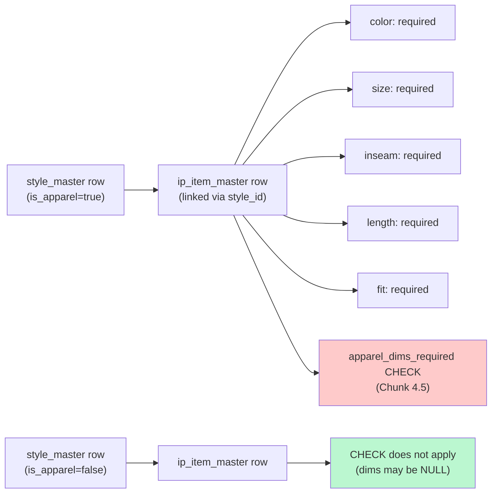

# 4. Concepts

The Tangerine ERP is built around a handful of architectural ideas that show up everywhere. Reading this section once will make the panels make sense.

## Multi-entity

Every transactional row in the system carries an `entity_id` foreign key pointing at the `entities` table. RoF is the only entity today, so this is mostly invisible — but the schema is multi-tenant from day one to avoid a painful retrofit later.

Practical implications:

- Every COA account, every JE, every period, every master record is **scoped to a single entity**.
- When SaaS goes live (P10), Row-Level Security flips on and the same DB serves multiple companies without code change.
- For now, all admin handlers resolve the default entity via `SELECT id FROM entities WHERE code='ROF'` — there's no entity-switcher UI yet.

> If you ever see "Default entity (ROF) not found" in an error, the `entities` table is missing its seed row. Re-run the Chunk 1 migration or contact the developer.

## Dual-basis accounting

The deepest architectural commitment in P1 is **two parallel books**: ACCRUAL and CASH. Every event that produces a journal entry can produce one for each basis.

```mermaid
flowchart TB
    Event["📥 Business event<br/>(invoice received, payment sent, etc.)"]
    Event --> Decision{"Which book(s)<br/>does this event hit?"}

    Decision -->|Accrual only| AccrualBox["ACCRUAL JE inserted<br/>CASH side: null"]
    Decision -->|Cash only| CashBox["CASH JE inserted<br/>ACCRUAL side: null"]
    Decision -->|Both (sibling pair)| BothBox["ACCRUAL JE + CASH JE<br/>linked via sibling_je_id"]

    AccrualBox --> Reports["Reports filter<br/>by basis"]
    CashBox --> Reports
    BothBox --> Reports

    style AccrualBox fill:#bfdbfe
    style CashBox fill:#fed7aa
    style BothBox fill:#ddd6fe
```

### The matrix that drives everything

| Event | Accrual JE | Cash JE |
|---|---|---|
| Vendor bill received | DR Expense / CR AP | (none — cash basis recognizes at payment) |
| Vendor bill paid | DR AP / CR Cash | DR Expense / CR Cash |
| Customer invoice sent | DR AR / CR Revenue | (none) |
| Customer payment received | DR Cash / CR AR | DR Cash / CR Revenue |
| Inventory receipt | DR Inventory / CR GR-IR | (none) |
| Inventory adjustment | DR/CR Inventory / Adj | DR/CR Inventory / Adj (same) |

For a manual JE you post via the UI, you choose the basis explicitly: `ACCRUAL`, `CASH`, or `BOTH` (which creates a sibling pair with identical lines and bidirectionally links them via `gl_link_sibling_je`).

### Why both books?

- **ACCRUAL** is GAAP-standard. Required for inventory + AR/AP timing accuracy. Most reports your CPA will want use this basis.
- **CASH** matches your bank account. Useful for cash-flow forecasting and the (smaller) set of tax filings that prefer cash-basis revenue recognition.
- Maintaining both is a real cost (every posting service produces two journals where applicable), but the alternative — converting one to the other later — is a several-month migration that re-derives historical entries from receipts.

## Control accounts and subledgers

Some accounts have implicit per-entity-counterparty detail. AP owes a *specific* vendor; AR is owed by a *specific* customer; inventory belongs to a *specific* SKU. These are **control accounts**, marked `is_control=true` in the COA.

Every journal entry line targeting a control account MUST include:

- `subledger_type` — one of `vendor`, `customer`, `item`
- `subledger_id` — the UUID of the specific counterparty

The DB trigger from Chunk 2 enforces this on every JE post — if you forget the subledger pairing, the entire transaction rolls back with an exception.

In the JE entry UI, control accounts show `[control]` next to their name in the account picker, as a hint that you need to fill the subledger columns for that line.

### Why subledgers matter

The subledger lets you ask questions like:

- "How much do we owe vendor V0042 today?" — SUM AP credits minus debits where `subledger_type='vendor' AND subledger_id=<V0042's id>`.
- "What's our inventory balance for SKU `RY1234-RED-M-30-REGULAR-SLIM`?" — same query against the Inventory account.

The view `gl_subledger_balances_v` (Chunk 2) does exactly this aggregation. It's read-only today; the AR aging report (P4) and AP open-invoice list (P3) will be built on top.

## Matrix dimensions

Apparel SKUs carry **5 dimensions**: color, size, inseam, length, fit. The Style Master row says whether the linked SKUs need all 5 (`is_apparel=true`) or can skip them (`is_apparel=false` — accessories, hats, etc.).



The Chunk 4.5 backfill used a regex (`jeans|pants|shorts|denim|bottoms|leggings|trousers|skirt`) over `ip_category_master.category_code` and `name` to identify "bottoms" categories. Items in those categories with all 5 dims set got flipped to `is_apparel=true`; everything else stayed `is_apparel=false`.

The merchandiser can override this anytime by UPDATE — the regex is a one-time bootstrap, not policy.

### What about non-apparel?

`is_apparel=false` rows (accessories, footwear, hats, bags) bypass the dim-required CHECK entirely. Color and size are still meaningful (a black hat vs a red hat); inseam/length/fit are typically NULL.

The Matrix React primitive (Chunk 5, `src/shared/matrix/`) renders these as a 2-D color × size grid by default and lets the user pivot to any 2 of 5 dims. Non-axis dims become filter chips. The primitive is library code today — no admin panel uses it yet. It'll get wired in by the ATS allocation grid (P17), the SO entry line (P16), and the PO entry line (P13).

## PII handling

Per CLAUDE.md security mandate, PII never appears in API responses or admin UI:

| PII field | Where stored | Where it appears in UI |
|---|---|---|
| `vendors.tax_id` | text (EIN/VAT — app layer must encrypt before write) | **NEVER** — Vendor Master modal has no field |
| `vendors.bank_account_encrypted` | bytea (AES-256 ciphertext) | **NEVER** — Vendor Master modal has no field |
| `customers.tax_exempt_certificate` | text | **NEVER** in list; placeholder note in Edit modal |

Vendor Master and Customer Master modals show a small note: "Tax ID and banking handled via dedicated PII workflow" — meaning we'll build separate authenticated, audit-logged endpoints for these fields in a future chunk. For now, populate them directly via SQL if you must, but the right path is the dedicated workflow when it ships.

## Audit immutability

Posted journal entries are **immutable**. You cannot edit them, delete them, or modify their lines. This is enforced at three layers:

1. **DB trigger** (Chunk 2) — `journal_entry_lines_immutable` rejects INSERT/UPDATE/DELETE on lines of a posted/reversed JE.
2. **Handler** — `PATCH` and `DELETE` on `/api/internal/journal-entries/:id` return 405.
3. **UI** — Edit and Delete buttons don't appear on posted rows; only Reverse is offered.

The only way to "undo" a posted JE is to **reverse** it — which creates a *new* JE with negated lines, flips the original to `status='reversed'`, and bidirectionally links them. The original entry remains visible, with status badge red.

This is non-negotiable for GAAP and for any future audit. The system **always tells the truth about what was posted**.

## Idempotency

When a posting event has a `source_table + source_id` (e.g. invoice X), the DB has a unique index `journal_entries (source_table, source_id, basis) WHERE source_id IS NOT NULL`. This means:

- Retrying the same posting RPC twice (e.g. after a network blip) produces exactly one journal entry per basis, not duplicates.
- The second attempt fails with a 23505 unique violation, which the application layer should handle as "already posted" — not as an error.

Manual JEs you post via the UI have `source_table=null` and `source_id=null`, so this guard doesn't apply to them. If you double-click Post, you get two entries — be careful, or use the Reverse action to undo.

## Going further

- Where these concepts live in code: [P1 foundation architecture](../P1-foundation-architecture.md), especially §4 (GL), §5 (matrix), §7-8 (vendor/customer master).
- How to use the concepts day-to-day: [05-workflows.md](05-workflows.md).
- When the concepts manifest as errors: [06-troubleshooting.md](06-troubleshooting.md).
