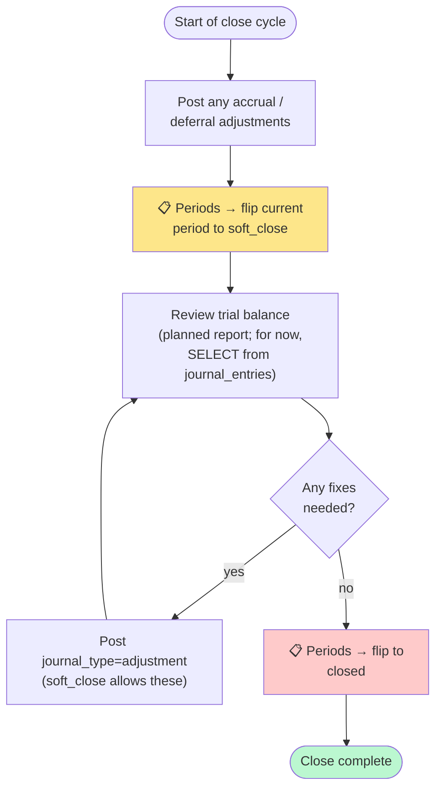

# 5. Workflows

End-to-end recipes for the most common operator and accountant tasks. Each workflow links back to the panels involved.

## Initial COA setup (one-time)

**Persona:** accountant + operator (operator inputs from accountant's list)
**Frequency:** once at the start, then ad-hoc additions

1. Accountant sends back the canonical COA list (CSV/spreadsheet) per the email template at [`docs/tangerine/accountant-coa-request-email.md`](../accountant-coa-request-email.md).
2. **Operator** opens [📒 Chart of Accounts](03-accounting.md#-chart-of-accounts-coa) and uses + Add account for each row. For larger lists (>50 accounts), wait for the data-only migration that bulk-loads the CSV instead.
3. After seeding, verify:
   - Every code from the accountant's list appears in the table
   - Roll-up parents (e.g. "1000 — Assets" header for the 1xxx range) have `is_postable=false`
   - AR (1200ish), AP (2000ish), Inventory (1300ish) have `is_control=true`

Once the COA exists, all downstream accounting flows unlock.

## Posting a manual adjustment

**Persona:** accountant
**Frequency:** monthly, occasionally ad-hoc

> Example: at month-end, the accountant accrues $5,000 of rent expense for the month that wasn't paid yet.

1. Open [📓 Journal Entries](03-accounting.md#-journal-entries) → click **+ Post manual JE**.
2. **Header:**
   - Basis: `ACCRUAL` (accruals only hit the accrual book; cash basis recognizes when rent is paid)
   - Journal type: `manual`
   - Posting date: last day of the month
   - Description: `Accrued rent — May 2026`
3. **Lines:**
   - Line 1: account `6010` (Rent Expense), debit `5000.00`, no subledger
   - Line 2: account `2010` (Accrued Liabilities), credit `5000.00`, no subledger
4. Confirm footer shows **● Balanced**. Click Post.
5. The entry appears in the list at status `posted`. When rent is actually paid next month, post a JE that DR Accrued Liabilities / CR Cash to clear the accrual.

## Posting against a soft-closed period

If you need to make a correction to a period that's been soft-closed:

1. Open [📓 Journal Entries](03-accounting.md#-journal-entries) → **+ Post manual JE**.
2. **Header:**
   - Basis: as appropriate
   - **Journal type: `adjustment`** (this is what unlocks soft-closed periods)
   - Posting date: a date inside the soft-closed period
   - Description: explain the adjustment + reference to the original entry
3. Lines as normal.
4. Post. The DB trigger from Chunk 2 sees `journal_type=adjustment` and allows the post into the soft-closed period.

For a **closed** (not soft-closed) period, this won't work. You must either:

- Reopen the period (Periods panel → flip status to `open` or `soft_close`), post, then re-close, **or**
- Post the adjustment in the current open period instead (preferred — preserves audit trail of "this was closed and a later correction was made")

## Reversing a posted JE

**Persona:** accountant
**Frequency:** rare; only when an error was discovered

1. Open [📓 Journal Entries](03-accounting.md#-journal-entries).
2. Find the posted JE you need to undo. Click **Reverse** on its row.
3. The confirm prompt asks for an optional posting_date for the reversal (blank = today).
4. The system creates a new JE with debits/credits swapped, flips the original to `status='reversed'`, and links the two.
5. Both entries now appear in the list — original red/reversed, new green/posted.

### Why not just "delete"?

Deletion would break audit integrity. The reverse pattern keeps both entries visible forever — anyone reading the GL can see exactly what was posted and exactly when it was reversed.

## Month-end close

**Persona:** accountant + operator (depending on company structure)
**Frequency:** monthly

1. **Post accruals / deferrals.** Use the manual JE flow with `journal_type=manual` and basis `ACCRUAL` for things like accrued rent, deferred revenue, etc.
2. **Run pre-flight checks.** Open [🗓️ Periods](03-accounting.md#-periods), find the period (e.g. May 2026), click **Run checks**. Confirm all blocking rows are green (trial balance balanced on both books, no draft JEs, no negative FIFO layers). See [03-accounting.md § Close Pre-flight Checks](03-accounting.md#close-pre-flight-checks-p5-7). Yellow warnings (unposted AR/AP invoices, unapplied receipts) are advisory — investigate but they don't block.
3. **Soft-close the period.** On the same row click **Soft close**. The handler reruns the pre-flight checks, captures actor + reason in the audit log, and enqueues a notification to admin + accountant. After the flip, only `adjustment` and `close` journal types can post into the period.
4. **Review the books.** Run [📊 Trial Balance](03-accounting.md#trial-balance-p5-2) (filter to the period date range, ACCRUAL basis) — the grand-total Net row must read `$0.00`. Then run [📈 Income Statement](03-accounting.md#income-statement-p5-3), [📋 Balance Sheet](03-accounting.md#-balance-sheet-p5-4), and [💧 Cash Flow](03-accounting.md#cash-flow-statement-p5-5) as-of the period end date. Snapshot whatever PDFs / xlsx exports your accountant wants — use the universal **Export** button on every panel — and attach them to the period's Document Attachments (planned wiring) or your close folder.
5. **Fix anything you need to.** Post additional JEs with `journal_type=adjustment` into the soft-closed period (the trigger lets these through). Re-run trial balance to confirm books still tie out.
6. **Hard-close the period.** Periods panel → **Close**. The handler reruns pre-flight one final time and blocks if any rule failed. From this point, no more writes are accepted into this period (except historical-backfill types, which bypass via P4-1 trigger logic).
7. (Optional) **Send accountant a summary.** The dual-basis structure means you can give them the ACCRUAL book for GAAP reporting and the CASH book for cash-flow review. The exports from step 4 cover both bases.

### If pre-flight blocks the close

Common blocking failures and where to look:

- **`accrual_trial_balanced` or `cash_trial_balanced` failed** — an unbalanced JE somehow posted. This shouldn't happen (the post trigger guards against it), but if it does, query `journal_entry_lines` for the period and find the `journal_entry_id` where `SUM(debit) ≠ SUM(credit)`. Reverse the bad entry and re-post correctly.
- **`no_draft_jes` failed** — a JE row is sitting in `draft`/`pending_approval`/`unposted` status in this period. Open the Journal Entries list with **Include drafts** checked, find the row, post it (or reverse if it shouldn't be there).
- **`fifo_negative_layers` failed** — an `inventory_layers` row has `remaining_qty < 0`, indicating corruption. Escalate to engineering before closing the period.

## New vendor onboarding

**Persona:** operator
**Frequency:** ad-hoc

1. Open [🏭 Vendor Master](02-master-data.md#-vendor-master) → **+ Add vendor**.
2. Fill name (required), code (recommended), legal_name, country, payment terms, default_currency (usually USD), is_1099_vendor checkbox if applicable.
3. **Don't try to add tax_id or bank account here** — those flow through the (planned) dedicated PII workflow.
4. Click Create.
5. If the accountant has already seeded the COA, you can now open the Edit modal on the new vendor and set:
   - `default_gl_ap_account_id` — the AP account this vendor's bills will credit
   - `default_gl_expense_account_id` — the default expense account for line-coding new bills
6. The vendor is now ready to receive POs (when the PO module exists — currently still using Xoro for PO origination).

## New customer onboarding

**Persona:** operator
**Frequency:** ad-hoc (more frequent for ecom — Shopify customers feed in automatically once that integration lands)

1. Open [🤝 Customer Master](02-master-data.md#-customer-master) → **+ Add customer**.
2. Fill name (required), code, customer_type (most common: `wholesale`), country, payment terms, credit_limit if you've negotiated one, tax_exempt checkbox.
3. Click Create.
4. Edit modal lets you later set default GL accounts and addresses.
5. For `tax_exempt=true` customers, leave the certificate field placeholder note as-is — the cert flows through the (planned) PII workflow.

## Bulk style cleanup

**Persona:** operator (merchandiser)
**Frequency:** seasonal

The Chunk 4 backfill created a `style_master` row for every distinct `TRIM(UPPER(style_code))` in `ip_item_master`. If your legacy data had typos / case-drift, you may see duplicates.

1. Open [🎨 Style Master](02-master-data.md#-style-master).
2. Search for the suspected dup style code prefix.
3. For each duplicate, decide which is canonical.
4. Soft-delete the others via the Delete button.
5. Update any `ip_item_master.style_id` that pointed to the soft-deleted style to point at the canonical one (currently requires a direct UPDATE; an admin "merge styles" UI is planned).

## Investigating "why isn't this account showing up in the JE picker?"

The JE entry account picker only shows accounts where `status='active' AND is_postable=true`. Common causes for an account being absent:

1. Account is marked `status='inactive'` — open COA, toggle Show inactive, find it, edit, flip status back to `active`.
2. Account is `is_postable=false` (a roll-up parent) — by design. Use a postable child account instead.
3. Account belongs to a different entity (will only matter once multi-entity ships) — confirm `entity_id` matches RoF.

## Going further

- The panels themselves: [02-master-data.md](02-master-data.md), [03-accounting.md](03-accounting.md)
- The concepts behind these flows: [04-concepts.md](04-concepts.md)
- When something goes wrong: [06-troubleshooting.md](06-troubleshooting.md)
