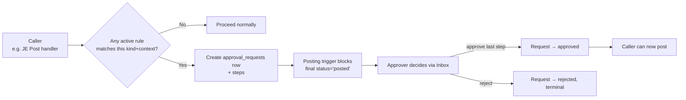

# Approvals (M27)

**Shipped in P2 Chunks 1 + 2** (2026-05-27).

The Approvals system lets you gate any posting flow behind a configurable rule. Today it integrates with Journal Entry posting; future modules (AP, AR, PO release) will hook in the same way.

## Where it lives

`/tangerine` top nav → **⚙️ Approval Rules** + **✅ Approval Inbox**.

| Panel | Who uses it | What it does |
|---|---|---|
| **Approval Rules** | CEO / admin | Define which flows require approval (CRUD on `approval_rules`). |
| **Approval Inbox** | Anyone with the required role | See pending requests, approve / reject / request changes, or cancel. |

## How the gate works



The posting flow itself doesn't change — the existing posting trigger fires the new `pending_approval_gate` guard. If any pending `approval_requests` row exists for that exact `(context_table, context_id)`, the post fails with code `23514`.

## Defining a rule

Open **Approval Rules** → **+ Add rule**:

- **Kind** — discriminator the calling code passes (e.g. `ap_invoice`, `je_post`, `po_release`).
- **Name** — human label ("CFO approval > $5k").
- **Match** (JSON) — what conditions must hold for the rule to apply. Operators:
  - `min_amount_cents`, `max_amount_cents` — amount-in-cents thresholds
  - `source_kind` — e.g. `"manual"`
  - `vendor_new` — boolean
  - `entity_id` — uuid
  - `or`, `and` — compose clauses
  - Empty `{}` = match everything of this kind
- **Steps** (JSON array) — ordered approval steps. Each step:
  - `step_order` — 1-based, unique within the rule
  - `mode` — `"any"` (one approval closes the step) or `"all"` (every entity_users row with the role must approve)
  - `role_required` — one of `admin`, `accountant`, `staff`, `readonly`

### Example: any manual JE requires admin sign-off

```json
{
  "kind": "je_post",
  "name": "Manual JE → admin approval",
  "match": { "source_kind": "manual" },
  "steps": [
    { "step_order": 1, "mode": "any", "role_required": "admin" }
  ]
}
```

### Example: AP invoice > $5k requires admin

```json
{
  "kind": "ap_invoice",
  "name": "AP > $5k → admin",
  "match": { "min_amount_cents": 500000 },
  "steps": [
    { "step_order": 1, "mode": "any", "role_required": "admin" }
  ]
}
```

When multiple rules match a single request, their steps are **unioned, deduped, and sorted by `step_order`**. So if rule A has step `1.any/admin` and rule B has step `1.any/admin` and step `2.any/accountant`, the resulting request has two steps.

## Approving a request

Open **Approval Inbox** (default filter: 🟡 Pending). Each row shows:

- **Kind / Context** — what's being approved
- **Amount** — for monetary requests
- **Current step** — which step is awaiting decision
- **Status** — pending / approved / rejected / cancelled / expired

Click **Decide**:

- Choose **approve** (closes current step in `any` mode, or counts toward quorum in `all` mode), **reject** (terminal — request → rejected), or **request_changes** (logged but no status change; caller typically cancels + re-opens).
- Add optional notes (saved to `approval_decisions` audit log).
- You decide as your **signed-in user** — the "Acting as" line shows your name (resolved from your Microsoft sign-in); no UUID to type. To decide on someone else's behalf, click **Act as another user** and pick the employee from the searchable dropdown.

A request **flips to `approved`** automatically when the last open step closes.

## Cancelling a request

Owner of the request OR an admin in the same entity can cancel. Cancelled is terminal — to retry, the caller code (e.g. JE post handler) re-invokes `approvalsAPI.requestIfRequired()` which will create a fresh request if rules still match.

## Audit trail

Every decision lands in `approval_decisions` (append-only — there is no UPDATE or DELETE RLS policy). Even after rejection / approval, you can reconstruct who decided what and when.

## What's dormant vs live in this PR

- ✅ **Live:** schema, library, JE posting trigger gate, admin UI for both panels
- ⚠️ **Dormant:** no rules are seeded by default. With zero rules, **no flow is gated**. The system is opt-in: you define a rule, then the corresponding flow starts requiring approval. The JE handler is wired through the trigger but only blocks if a matching pending request exists.

## Related architecture

- [`../P2-cross-cutters-architecture.md` §4](../P2-cross-cutters-architecture.md) — full M27 spec
- [`../P1-foundation-architecture.md` §4.1](../P1-foundation-architecture.md) — posting trigger semantics (the gate hangs off this)
