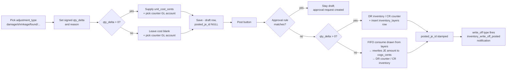

# 11. Inventory Operations (P3)

The Inventory group in the Tangerine top nav hosts M37 inventory operations: transfers, adjustments, and cycle counts. This chapter grows as each P3 chunk ships its panel.

## What's shipped in P3

| Panel | Status | Chunk |
|---|---|---|
| 🔁 Inventory Transfers | **Live** (matrix + single-variant entry) | P3-7 (2026-05-27); entry shipped 2026-06-05 |
| 📐 Inventory Adjustments | **Live** (GL auto-select + reason master dropdown) | P3-5 (2026-05-27); improved #1020 |
| 📋 Adjustment Reason Master | **Live** | Master Data → Adjustment Reasons (#1020) |
| 📋 Cycle Counts | **Shipped** | P3-6 (2026-05-27) |

> **#1020 improvements (2026-08-25):**
> - **GL account auto-selected** — the server always resolves the "Inventory Adjustments Expense" account from Chart of Accounts automatically. Operators no longer pick a GL account when creating an adjustment.
> - **Reason from master** — the free-text reason field is replaced by a searchable dropdown sourced from the new **Adjustment Reason Master** (`Master Data → 📋 Adjustment Reasons`). Manage reasons there; they appear in both the single-variant and matrix adjustment modals. The dropdown shows the reason **name only** (the code stays searchable).
>
> **Single-adjustment modal updates (2026):**
> - **Direction selector** — instead of typing a signed number, pick **+ Add inventory** (increase on-hand) or **− Reduce inventory** (decrease) and enter a positive quantity. Saving shows a confirmation spelling out the direction and the journal entry it will book on Post (**add** → DR Inventory / CR Inventory Adjustments; **reduce** → CR Inventory / DR Inventory Adjustments).
> - **Reason required** — a reason must be picked before saving (inline `*` warning + a blocking toast otherwise).
> - **Add a reason on the fly** — type a new reason in the dropdown and click **"+ Add reason '…'"**; it's created in the Adjustment Reason Master and selected. **Admins only** (signed-in users) — a non-admin sees a warning and must pick an existing reason.
>
> **Adjustment list — who/when + user filter (2026):** the grid shows a **When** (date + time) and **By** (who created it) column, and a **user filter** lets you scope to your own or another user's adjustments. The creator is captured automatically (`created_by_user_id`) and resolved to a name server-side.

---

## 11.0 Inventory Matrix (on-hand view)

**Where:** Tangerine top nav → **🧮 Inventory Matrix** (Inventory group). A read-only on-hand view that renders any style's color × size grid (× rise / inseam when the scale carries them), with amber row/column totals, blended Avg Cost, Total Cost, and Last-Received date — mirroring the PO-detail matrix.

**Finding styles.** Leave the style picker empty and use **Search styles** (and the Brand / Gender / Group / Category / Sub-Category dropdowns) to narrow the list; the view stacks one matrix block per matching style, 25 per page. The header bar reads **"Styles X–Y of N"** for the current page. Click any style's header to drill into its single-style view and its **SO / PO / Invoice** tabs.

> **Styles with no on-hand are shown, not hidden (2026-06-11).** Every style that matches your search now renders a block, so the number of blocks always matches the "Styles X–Y of N" count. A style with no on-hand inventory (for example a zero-stock **-PPK** or **-KO** sibling) appears as a slim header + a *"No on-hand inventory"* note instead of vanishing. *Previously a zero-on-hand style was counted in the header total but produced no block — so searching e.g. `RYB0594` could read "1–3 of 3" while only one matrix showed.* Turn off **Hide Zeros** to expand any such style into its full zero-quantity grid, or click its header to open it directly.

**Display toggles.** **Hide Zeros** (default on) drops zero-total color rows within each style; **Hide sizes** (default off) drops **all per-size columns**, leaving the non-size columns (Color, Total, Avg Cost, Total Cost, Last Received) for a compact roll-up; **Explode** folds PPK packs on-hand into sized eaches via the Prepack Matrix master; **By Inseam** splits each color into per-inseam rows with subtotals (shown only when the scale carries inseams). The **Warehouse** dropdown narrows on-hand to one warehouse (the on-hand *location*, per the house Warehouse-vs-Store rule) — on the Snapshot it constrains the **On Hand** (and ATS on-hand) columns to that warehouse's layers; the other lifecycle columns (Allocated / SO / PO / Sold / Purchased) are not warehouse-grained.

> **Empty size-column collapse (all matrix views, 2026-07-02; extended 2026-07-15).** Once a style's grid has stock, the **first size column with quantity turns green and is clickable** — click it to hide the all-zero size columns *before* the first and *after* the last sized column, collapsing the grid to the size range actually in stock (mid-range zero sizes stay visible); a leading/trailing **⋯** marks the hidden columns, and clicking again shows them all. This works on the **single-style matrix AND every per-style block in the brand / multi-style view** — each block collapses independently (clicking one block's green header does not touch the others). It is the same green-first-column collapse the **Sales-Order and Purchase-Order size grids** use, plus the **PO detail "Item Matrix" tab**, the **PO grid row-detail (▸ expander) matrix**, the right-click **PO matrix popover**, and the **vendor-portal PO matrix** — all share the one `computeSizeCollapse` helper. The **Hide sizes** toggle (which drops every size column) and the collapse are independent; **exports always carry the full size set**, never the collapsed range.

> **Cascading filters (Snapshot).** The **Gender / Group / Category / Sub-Category** dropdowns narrow each other reciprocally — each only offers values that exist among the styles matching the *other* active filters plus the search text, so picking a Category trims the Group/Gender lists to what remains, and vice-versa.

> **The default view is the Inventory Snapshot** (one row per style + color across all metrics — On Hand, Allocated, On SO, ATS, On PO, Sold, Purchased, …), not the per-style grids. The grids are the **OH matrices** toggle. The Snapshot adds **Merge PPK** (collapse base + PPK sibling into one `BASE/PPK` row; turning it on **auto-enables Explode and locks it on** — merging needs unit-grain eaches, so while Merge PPK is selected the Explode button shows a **darker-blue, can't-turn-off** state with a hover note explaining why; switch Merge PPK off to change Explode. Each merged line carries a **▸ expander**; click it to drill into the two components that summed into it: the **Base eaches** row and the **PPK pack** row, both shown per-unit so they reconcile exactly to the merged totals, and each still drills to its own style), a **Collapse** control (collapse rows *onto* Style or Item Category — e.g. one line per style with all colours summed, or one line per category; **Collapse aggregates the full filtered set, not just the visible page**, so the roll-up totals every matching style — the pager is replaced by an "all N styles" note), a **Totals** toggle (totals strip above the headers stacking, per column: **Qty** units, **$ Cost** = qty × avg cost, **$ Wholesale** = qty × avg wholesale SO selling price, **Avg Cost**, **Avg Mrgn** = (avg sale − avg cost) ÷ avg sale as a percent, and **Avg Sale** = the per-unit means **over the units that actually carry a cost / price**, not ÷ total qty — otherwise units from rows with no known cost or wholesale price (e.g. a style never sold on an SO) would inflate the denominator and drag the average artificially low). **Each column is priced/costed from its own source (#1800):** On SO uses the open-order price, Sold the actual sold price, and the inventory/PO columns the **qty-weighted average SO price** (not a single most-recent line); **On PO / In Trnst cost at the actual open-PO unit cost** so they tie to the PO grid, every other column at the item-master avg cost. When the visible page contains any PPK style, turning on **Totals** auto-forces per-unit explode so the $ values reconcile (a pack of 24 at $136.80 cost reads as $5.70 per unit, not 24× inflated). A **Columns** show/hide, click-to-drill quantities, and a determinate load bar round it out. Every Snapshot grid header sorts (click to toggle ▲/▼); with **Totals** on, the Excel export appends the Totals rows (Qty / $ Cost / $ Wholesale / Avg Cost / Avg Margin % / Avg Sale) at the bottom. A dedicated **Avg Mrgn %** column (immediately before **Avg Sale**) shows each row's gross margin — (avg sale − avg cost) ÷ avg sale, to two decimals — blank when the row has no avg sale price; it exports as a percent column too. See **chapter 28 → Inventory Snapshot** for the full details.

> **Sold / Purchased drill popups.** Clicking a **Sold** or **Purchased** quantity opens a drill popup. Every column header in the popup sorts (▲/▼). The **Sold** popup adds a **Store** filter and a **Collapse: Invoice** toggle (rolls the rows up onto the invoice number); the **Purchased** popup adds a **Collapse: Bill** toggle (rolls onto the bill number) alongside the existing click-a-colour filter. Invoice numbers (AR) and bill Ref #s (AP) open a **full doc popup** (header + lines) with **✎ Edit (new tab)** → the AR Invoice / AP Bill editor. The drill popups clear the NavDrawer so they never slide under the menu on a narrow window.

> **Where the On Hand number comes from (pre-go-live).** Until Tangerine is the inventory system of record, the Matrix On Hand mirrors the authoritative on-hand from the **nightly ATS/Xoro feed** (the same upload that refreshes planning). Before this, on-hand was a one-time 2026-05-27 seed that Xoro sales never reduced — so goods that had already been **sold** still showed as on-hand (a "phantom" overstatement). The nightly **on-hand sync** now re-points each Xoro-sourced style's on-hand at the latest feed, so a sold-through style reads its true 0 the morning after it ships. The sync **never touches** a style once you start managing it natively in Tangerine (an AP bill receipt, PO receipt, adjustment, manufacture build, or the by-size cutover) — those keep their own FIFO layers. It is enabled per environment via `ONHAND_LAYER_SYNC` (`report` to preview, `apply` to write); the operator can also stage it per style with `scripts/rebuild-onhand-sync.mjs --apply --style <code>`.

---

## 11.1 Inventory Transfers

**Where:** Tangerine top nav → **🔁 Inventory Transfers** (Inventory group).

**Purpose:** records location-to-location movements of inventory. There is one entry point — **+ Add** — which opens a chooser offering two paths: a **Matrix** transfer (a whole style's color × size grid at once, like the Sales-Order and Adjustment matrix entry) or a **Single variant** transfer. The filterable list sits below.

> **Required reason:** every transfer must carry a **Transfer Reason** (single and matrix alike). The reason picker is a searchable dropdown sourced from the **Transfer Reasons master** (Master Data → 🔁 Transfer Reasons), with an inline **"Add new"** option. If you try to save without one, the save is **blocked** and a warning appears — pick or add a reason to continue. The chosen reason name is written into the transfer's notes.
>
> **Add-reason is admin-only (2026):** the inline "Add new" creates a reason in the master — only **admins** (signed-in users) can do it; a non-admin who clicks it gets a warning and must pick an existing reason.
>
> **Wider matrix window:** the Matrix-transfer modal is now wide enough to show a full color × size grid (incl. the Grand-Total row) for the largest size runs, with the grid in a horizontal-scroll area so an extra-wide run is never clipped.
>
> **Who/when on the grid + user filter:** the list now shows a **By** (who logged it) and **Created** (date + time) column, and a **user filter** lets you scope to your own or another user's transfers. The creator is captured automatically (`created_by_user_id`) and resolved to a name server-side.

### What you'll see

A list view with these columns:

| Column | Source |
|---|---|
| **Item** | `item_id` (uuid into `ip_item_master`) — the SKU being moved |
| **Qty** | `qty` — positive numeric, units of inventory transferred |
| **From** | `from_location` — free-form text source location |
| **To** | `to_location` — free-form text destination (must differ from From) |
| **Date** | `transfer_date` — when the move happened |
| **Notes** | `notes` — free-form operator notes |

Three filter dropdowns above the table — all are SearchableSelect pickers, no UUID entry:

- **All styles** — pick a style from the dropdown to narrow the list to that style's transfers.
- **From warehouse** — pick a warehouse to filter by source location.
- **To warehouse** — pick a warehouse to filter by destination location.

Any combination of filters narrows the list. Clearing a dropdown to its "All …" placeholder removes that filter.

### + Add → Matrix (recommended)

Click **+ Add**, then choose the **Matrix** tile to open the size-grid entry modal:

1. **Pick a FROM location and a TO location** (free-form text — they must differ). The From/To boxes default to whatever you typed in the panel's filter inputs, so set those first to pre-fill.
2. **Pick a Transfer Reason** (required) — searchable dropdown over the Transfer Reasons master, with inline "Add new". *(Optional)* type a **Notes** line — both apply to every transfer row created in this batch.
3. **Pick a style** with the searchable dropdown. The panel loads that style's **color × size** grid (× inseam when the style spans multiple inseams). The faint number above each cell is the current on-hand.
4. **Type a transfer qty into each cell** you want to move. The header counts the cells filled and the total units.
5. Click **Create N transfer(s)**. Each non-zero cell is resolved to its SKU / `inventory_item_id` (find-or-create, exactly like the Matrix Adjustment) and **one `inventory_transfers` row is created per cell** — same `from_location` / `to_location` / reason / `notes` across the batch.

This mirrors the **Matrix Adjustment** and **Matrix Sales-Order** entry exactly — one style, one grid, one row per filled cell.

### + Add → Single variant

Click **+ Add**, then choose the **Single variant** tile for a one-SKU transfer: **pick a SKU** with the searchable dropdown (search by SKU / style / description — no UUID), a qty, the From/To locations, a **Transfer Reason** (required), and optional notes. This is the secondary path when you only need to move a single variant.

### Empty state

> *"No transfers logged yet. Use "+ Add" to log a single-variant or matrix transfer."*

This is the expected state until the first transfer is created.

---

## 11.1.x FIFO layers on AP receipt (P3-4)

**When an AP invoice with inventory lines posts, FIFO layers are created automatically.**

Each AP invoice line that carries an `inventory_item_id` together with **both** a `qty` and a `unit_cost_cents` triggers the creation of one `inventory_layers` row at posting time:

- `entity_id` — from the invoice
- `item_id` — from the line
- `original_qty` and `remaining_qty` — both set to the line's `qty`
- `unit_cost_cents` — per-unit landed cost from the line
- `source_kind` — `'ap_invoice'`
- `source_invoice_id` — the invoice id (FK back to `invoices`)
- `received_at` — defaults to the invoice's `invoice_date`
- `created_by_user_id` — propagated from the posting event

**Sequencing:** the layer rows are inserted **after** the journal entry persists successfully. If the JE fails (period locked, unbalanced, period closed, etc.), the layer step is skipped entirely — there will never be an orphan layer without a matching GL impact.

**Soft-fail on layer side:** if the JE posts but a layer insert fails (e.g. transient DB error), the JE is **not** rolled back. The failure is logged and the offending item id is returned in the posting result under `inventory_layer_errors`. The GL truth (DR inventory / CR AP) is already correct; the operator can backfill the missing layer via a manual adjustment or contact the dev team.

**Lines without qty + unit_cost_cents:** legacy / partial AP invoices that mark a line `inventory_item_id` but omit one of `qty` / `unit_cost_cents` post the JE as before but create **no** layer. This is intentional — those rows pre-date the FIFO wiring and the operator may not yet know the per-unit cost. Subsequent receipts can be properly costed.

**Void behaviour:** voiding an AP invoice via the `ap_invoice_voided` event **does not** delete or zero its FIFO layers. The layers represent inventory that physically arrived; if the operator wants to remove the received quantity from the on-hand picture they must file a separate inventory adjustment (P3-5).

---

## 11.2 GL impact policy

Internal transfers between owned locations within a single entity **do not hit the General Ledger**. The `posted_je_id` column on the underlying table stays NULL for those rows. The inventory simply moves between layers (consume the oldest layers at the source, create new layers at the destination with the same `unit_cost_cents`).

**Live since 2026-06-06 (M52):** this is now wired. `POST /api/internal/inventory-transfers` resolves the From/To **warehouse codes** to `inventory_locations` ids and calls the `transfer_inventory_between_locations()` RPC, which FIFO-drains the source warehouse's oldest cost layers and re-creates them at the destination (`source_kind='transfer_in'`). Cost basis and total on-hand are preserved (conservation-checked inside the RPC); it errors if the source warehouse lacks enough on-hand. Each `inventory_layers.location_id` is the authoritative warehouse (re-pointed from the legacy `wh=` notes tag at cutover), and the Inventory Matrix warehouse breakdown reads `location_id`. **Limitation:** deleting a transfer's audit row does NOT reverse the move — record a reverse transfer instead.

Cross-entity transfers — once that scenario is supported — will post via `gl_post_journal_entry` and link the resulting JE in `posted_je_id`.

---

## 11.3 API surface

| Method | Path | Behavior |
|---|---|---|
| `GET` | `/api/internal/inventory-transfers` | List (filterable, capped at 500). Default 100 rows ordered by `transfer_date DESC`. |
| `POST` | `/api/internal/inventory-transfers` | Create one transfer row. Body: `item_id` (uuid), `qty` (>0), `from_location`, `to_location` (must differ), optional `notes`, `transfer_date`, `created_by_user_id`. Returns 201 with the created row. The matrix-transfer UI calls this once per non-zero cell. |
| `GET` | `/api/internal/inventory-transfers/:id` | Fetch one transfer by id. 404 if not found. |
| `PATCH` | `/api/internal/inventory-transfers/:id` | Update mutable fields (`qty`, `notes`, `transfer_date`) on unposted rows only. 409 if posted. `item_id`, `from_location`, `to_location` are locked — delete and recreate. |
| `DELETE` | `/api/internal/inventory-transfers/:id` | Hard-delete an unposted transfer. 409 if posted. |

Filter query params: `item_id` (uuid), `from_location` (text), `to_location` (text), `limit` (1–500, default 100).

---

## 11.4 Inventory Adjustments

**Where:** Tangerine top nav → **📐 Inventory Adjustments** (Inventory group).

**Purpose:** records ad-hoc inventory deltas (damage, shrinkage, found, correction, write-off, return-to-vendor) and posts them to the GL plus the FIFO ledger.

### Entry modes

**+ Add is the single entry point.** Click **+ Add** and a small chooser asks how you want to enter the adjustment — **Single variant** or **Matrix**. (There is no separate top-level Matrix button anymore; matrix entry now lives inside the Add flow.)

In both modes the **Adjustment Type** picker is a searchable dropdown sourced from the configurable **Adjustment Type master** (Master Data → ⚙️ Adjustment Types). The type is a **category / reason for grouping only — it does NOT decide increase vs decrease.** That is governed purely by the sign of the quantity (and the unit cost for increases).

> **Required type:** an adjustment cannot be saved without an Adjustment Type. If the type is empty (e.g. the master has no active types yet), the save is **blocked** and a warning appears — add a type in the Adjustment Types master and pick it to continue. (This does not change the FIFO increase/decrease accounting, which still keys off the quantity sign and unit cost.)

- **Single variant** — the classic one-row modal. Search for one SKU, pick the adjustment type, type a signed `qty_delta`, supply the counter GL account + reason (and a unit cost for positive deltas), and save one draft.
- **Matrix (recommended for whole styles)** — works exactly like **Sales Order matrix entry** (chapter 27). You pick the adjustment type, counter GL account, and reason **once** for the whole batch, choose a **style** from the searchable picker, and the panel renders that style's **color × size (× inseam)** grid using the same `EditableSizeMatrix` primitive the SO and PO screens use. Type a signed quantity into any cell (negative = decrease / FIFO-consume, positive = increase / new FIFO layer); the faint number above each cell is the current on-hand. For positive cells, fill the per-row **Unit cost (¢)** column (the column header has a "set all" field to stamp one cost across every row).

  On **Create adjustments**, each non-zero cell is resolved to its SKU — reusing the existing `ip_item_master` row when the cell already maps to one, otherwise find-or-create via `POST /api/internal/style-matrix/resolve-sku` (the same resolver Sales Order entry uses) — and one draft is POSTed to the standard `POST /api/internal/inventory-adjustments` endpoint per cell. The batch-level type / counter account / reason (and brand pool for increases) apply to every created draft. Drafts are then reviewed and posted individually like any other adjustment.

## 11.4 Cycle Counts

**Where:** Tangerine top nav → **📋 Cycle Counts** (Inventory group).

**Purpose:** the operator periodically walks the warehouse and physically recounts items. Where the system says "100 units" but only 95 are on the shelf, the cycle count surfaces a **variance** of `-5` and rolls it forward to an inventory adjustment draft. Reverse case (count > system) → `+5` "found" variance → positive adjustment draft.

### Lifecycle



### Adjustment types

| Type | Direction | Typical counter account | Notes |
|---|---|---|---|
| `damage` | Negative | Damage / loss expense | Inventory physically damaged on-site |
| `shrinkage` | Negative | Shrinkage expense | Missing during cycle count |
| `found` | Positive | Inventory-found income (contra-shrinkage) | Found in stockroom; operator supplies per-unit cost |
| `correction` | Positive or Negative | Misc inventory adjustment | Catch-all for stock-record errors |
| `write_off` | Negative | Inventory write-off expense | Triggers `inventory_write_off_posted` notification to admin + accountant |
| `return_to_vendor` | Negative | AP credit memo / vendor receivable | Returning damaged stock to vendor (M3 credit-memo wiring later) |

### Sign convention

`qty_delta` is signed:

- **Positive** (`qty_delta > 0`) — new inventory appears. You MUST supply `unit_cost_cents` because the system uses that cost to create a new FIFO layer. The JE posts `DR inventory / CR counter` at `qty × unit_cost`.
- **Negative** (`qty_delta < 0`) — inventory removed. You MUST leave `unit_cost_cents` blank: FIFO derives the per-unit cost from existing layers in receipt-order. The JE posts `DR counter / CR inventory` at the FIFO-derived `cogs_cents` total.

The CHECK constraint enforces this at the database layer; the UI hides the cost field on negative deltas.

### Posting (`Post` button)

For each draft row, clicking **Post**:

1. **Resolves the inventory asset account** by looking up `gl_accounts.code='1300'` (canonical inventory code per the COA defaults). Falls back to `name ILIKE 'inventory%'`. If neither hits, the post fails with a clear error pointing at the COA admin panel.
2. **Approval gate** — calls `approvalsAPI.requestIfRequired({ kind: 'inventory_adjustment', amount_cents, ... })`. If any active rule matches (e.g. high-dollar write-off threshold), the row stays draft and the operator gets `requires_approval=true` plus a `request_id`. Approval Inbox (chapter 7) handles the decide flow.
3. **Posts the JE** through the standard posting service. Both accrual and cash bases get the same line shape (an inventory adjustment is a non-cash event).
4. **Side effect** — positive: one `inventory_layers` row is inserted (`source_kind='adjustment'`, `source_adjustment_id`). Negative: `inventory_fifo_consume()` draws from existing layers, returns `cogs_cents`, and inserts one `inventory_consumption` row per layer touched.
5. **Stamps the row** — `posted_je_id` and `posted_at` are set; the Edit/Delete buttons disappear (use journal-entries reverse + a corrective adjustment if you need to undo).
6. **Notification** — if `adjustment_type='write_off'`, fires `inventory_write_off_posted` to `recipient_roles=['admin','accountant']`.

### Worked examples

#### Example 1 — Shrinkage (negative)

> "Cycle count shows 7 fewer units of SKU `BLU-TEE-MED` than the system thinks."

- adjustment_type: `shrinkage`
- qty_delta: `-7`
- unit_cost_cents: *(blank)*
- gl_account_id: Shrinkage Expense (5800)
- reason: "Cycle count short by 7"

At post: FIFO consumes 7 units from open `BLU-TEE-MED` layers in receipt order. Suppose the oldest layer has 4 units left at $12.00/unit and the next has plenty at $13.50/unit. cogs_cents = 4×1200 + 3×1350 = 4800 + 4050 = **8850**. The JE posts `DR Shrinkage Expense $88.50 / CR Inventory $88.50` (subledger=item: BLU-TEE-MED).

#### Example 2 — Found (positive)

> "Recovered 5 units of SKU `RED-SCARF` that were misshelved last month."

- adjustment_type: `found`
- qty_delta: `5`
- unit_cost_cents: `1850` ($18.50/unit, matches recent receipt cost)
- gl_account_id: Inventory-Found Income (4900) or Contra-Shrinkage (5810)
- reason: "Misshelved last month"

At post: one new `inventory_layers` row is inserted with `original_qty=5, remaining_qty=5, unit_cost_cents=1850, source_kind='adjustment', source_adjustment_id=<this row id>`. The JE posts `DR Inventory $92.50 / CR Inventory-Found Income $92.50` (subledger=item on the DR).

#### Example 3 — Write-off (negative + notification)

> "10 units of damaged stock written off after warehouse flood."

- adjustment_type: `write_off`
- qty_delta: `-10`
- unit_cost_cents: *(blank)*
- gl_account_id: Inventory Write-off Expense
- reason: "Flood damage 2026-05-26"

Same FIFO flow as shrinkage. **Additionally**, an `inventory_write_off_posted` notification fans out to all `admin` + `accountant` role-holders on the entity (in-app + email per their preferences).

### Editing + deleting

Drafts (no `posted_je_id`) are fully editable: you can change `qty_delta`, `unit_cost_cents`, and `reason`. Locking applies to `adjustment_type`, `item_id`, and `gl_account_id` — delete the draft and create a new one if those need to change.

Posted rows refuse PATCH (409) and DELETE (409). To undo a posted adjustment: reverse the JE via the **Journal Entries** panel (chapter 3), which auto-reverses both accrual and cash twins. The FIFO ledger keeps its history — a positive adjustment's layer remains as a "phantom" with whatever `remaining_qty` the subsequent consumption left it at; a negative adjustment's consumption rows stay in `inventory_consumption` for audit. File a corrective adjustment in the opposite direction if the physical truth changed.
  start([Start new count]) --> snapshot[Snapshot system_qty<br/>per item from inventory_layers]
  snapshot --> in_progress[(status='in_progress')]
  in_progress --> enter[Operator enters<br/>counted_qty per line]
  enter --> finalize{Finalize?}
  finalize -- "yes" --> fanout[Generate 1 inventory_adjustments row<br/>per non-zero variance line]
  fanout --> completed[(status='completed')]
  completed --> review[Operator reviews + posts<br/>each draft via Adjustments panel]
  review --> ledger[(JE posted to GL)]
  in_progress --> cancel{Cancel?}
  cancel -- "yes" --> cancelled[(status='cancelled')]
```

### Start a count

Click **+ Start new count**. The modal asks for:

- **Count date** — defaults to today.
- **Location** — defaults to `main` (single-location launch). Multi-warehouse populates this dropdown later.
- **Notes** — optional free-form text.
- **Scope filter** — optional list of item UUIDs (newline or comma separated). Blank = snapshot *every* item with an open FIFO layer in this entity.

Submitting triggers the snapshot:

1. Read every open `inventory_layers` row (`remaining_qty > 0`) for the entity.
2. SUM `remaining_qty` per `item_id` → that's `system_qty`.
3. Apply the scope filter if supplied. Items in the filter that have **no** open layer are still included with `system_qty=0` — counting "should-be-zero" items is a valid scenario.
4. Insert one `inventory_cycle_count_lines` row per item with `counted_qty=NULL`.

### Enter counts

Click a row to open the detail modal. The lines table shows every snapshotted item:

| Column | Source |
|---|---|
| **Item** | `item_id` (uuid) |
| **System** | `system_qty` — snapshot at start, **never changes** during the count |
| **Counted** | editable number input (only when status='in_progress') |
| **Variance** | `variance_qty` — server-computed STORED column (`counted - system`). Green for positive, red for negative, muted dash if not yet counted. |
| **Adj** | First 8 chars of the linked `inventory_adjustments.id`. Empty until finalize. |

Counts auto-save on blur (or click the explicit **Save** button next to the row). Variance updates on save.

### Finalize

Click **Finalize**. For every line where `counted_qty IS NOT NULL` and `variance_qty != 0`:

- `qty_delta = variance_qty` (signed)
- `adjustment_type = variance > 0 ? 'found' : 'shrinkage'`
- For positive variance: the system needs a `unit_cost_cents` for the new FIFO layer.
  - **Resolution order:** request body `positive_unit_costs[line_id]` override → `ip_item_avg_cost.avg_cost_dollars × 100` (rounded) → fail with `missing_cost_line_ids`.
  - The Web UI does not yet expose the per-line override; positive variance lines must have an avg-cost row. Negative variance does not need a cost (FIFO consumes).
- `gl_account_id`: from request `gl_account_id` if supplied, otherwise the first expense `gl_accounts` row whose `name ILIKE 'shrinkage%'`, otherwise the first expense account.
- `reason = "Cycle count {short_id} variance"`.

**The generated adjustments land as DRAFTS** (`posted_je_id` NULL). They do **not** auto-post. The operator reviews + posts each one individually via the Adjustments panel (P3-5). This is a deliberate safety choice — auto-posting from a cycle count would bypass GL approval gates.

Zero-variance lines are skipped. Uncounted lines (`counted_qty=NULL`) are skipped.

### Cancel

Click **Cancel count** (only on `in_progress`). Sets `status='cancelled'`. The snapshot lines stay for audit. No adjustments are generated.

### Notifications

If any single line's variance exceeds **10%** of its `system_qty` (configurable via `threshold_pct` in the finalize body, 0–100), a `inventory_variance_exceeds_threshold` notification is enqueued to `recipient_roles=['admin']`. The denominator is `max(1, system_qty)` so a 5-unit found on a 0-system isn't infinite-percent.

### Deletion vs cancellation

- **Cancel** keeps the snapshot + any partial counts for audit. Always reversible to "this happened."
- **Delete** is allowed only when `status='in_progress'` AND no line has `counted_qty` set. A clean abort of an empty count.

### API surface

| Method | Path | Behavior |
|---|---|---|
| `GET` | `/api/internal/inventory-adjustments` | List with filters: `item_id`, `adjustment_type`, `posted=true|false`, `from=YYYY-MM-DD`, `to=YYYY-MM-DD`, `limit=1..500` (default 100). Ordered `created_at DESC`. |
| `POST` | `/api/internal/inventory-adjustments` | Create draft. Body: `{ item_id, adjustment_type, qty_delta, unit_cost_cents?, reason, gl_account_id }`. 400 on CHECK violations. |
| `GET` | `/api/internal/inventory-adjustments/:id` | Fetch one. 404 if not found. |
| `PATCH` | `/api/internal/inventory-adjustments/:id` | Update mutable fields on draft only. 409 if posted. |
| `DELETE` | `/api/internal/inventory-adjustments/:id` | Delete draft only. 409 if posted. |
| `POST` | `/api/internal/inventory-adjustments/:id/post` | Run the full post flow (resolve inventory account → approval gate → postEvent → stamp → notification). Returns `{requires_approval:true, request_id}` with 202 if a rule matched; the row stays draft. Returns the updated row + `accrual_je_id` + `cash_je_id` + `consume_results` + `inventory_layer_ids` otherwise. |
| `GET` | `/api/internal/inventory-cycle-counts` | List (filters: `status`, `from`, `to`, `limit` 1-500). |
| `POST` | `/api/internal/inventory-cycle-counts` | Start a new count. Body: `{count_date?, location?, notes?, scope_filter?}`. |
| `GET` | `/api/internal/inventory-cycle-counts/:id` | Header + embedded `lines` array. |
| `PATCH` | `/api/internal/inventory-cycle-counts/:id` | Only `{status:'cancelled'}` accepted. |
| `DELETE` | `/api/internal/inventory-cycle-counts/:id` | 409 unless `in_progress` and no counts entered. |
| `PATCH` | `/api/internal/inventory-cycle-counts/:id/lines/:line_id` | Update a single line. Body: `{counted_qty, notes?}`. |
| `POST` | `/api/internal/inventory-cycle-counts/:id/finalize` | Fan out variance → adjustment drafts. Returns `{adjustments_created, lines_with_variance, lines_skipped_zero, lines_skipped_not_counted, threshold_breaches}`. |

---

## 11.4a Inventory Accuracy monitor (read-only)

**Menu:** `📦 Inventory → 🎯 Inventory Accuracy`. Route `?m=inventory_accuracy`.

Tangerine does not yet own its inventory — Xoro remains the operational system of
record until cutover. As a result the on-hand number can be **wrong**: phantom
stock (units counted as both on-hand and sold), two feeds that disagree by
thousands of units, disabled nightly syncs, and no perpetual by-size ledger. The
Inventory Accuracy panel does not fix any of that — **it measures it**, so you can
see exactly which SKUs are wrong and by how much. Every object behind it is
read-only; nothing here mutates stock, re-enables a sync, or "corrects" a number.

### The feeds it compares

Per SKU (a size-grain item), the monitor lines up:

| Feed | What it is | Trust |
|---|---|---|
| **Live layers** | `Σ inventory_layers.remaining_qty` — the number the **Inventory Matrix** reads | what the app *shows* |
| **Xoro REST** | `tangerine_size_onhand` — Xoro's REST by-size feed | **the truth basis** |
| **ATS feed** | `ip_inventory_snapshot` source `manual` | informational (known unreliable for some styles) |
| **Phantom feed** | `ip_inventory_snapshot` source `tangerine` | the historical **phantom** values; shown for reference only |

**Signed divergence = Live layers − Xoro REST.** A **positive** divergence means
the app *overstates* on-hand versus the truth; **negative** means it *understates*
(REST shows stock the app is missing).

### How to read it

- **Severity** — each SKU is classed:
  - **Tie** — matches REST within rounding.
  - **Minor** — off by ≤ 25 units.
  - **Material** — off by > 25 units.
  - **Phantom-suspect** — the app shows on-hand that REST says is gone (or a stale
    `opening_balance` seed still carries quantity). These are the classic phantom
    rows.
- **Scorecard tiles** — SKUs divergent, total units off (Σ|Δ|), **$ exposure at
  cost**, phantom-suspect, negative on-hand, and **zero-cost on-hand** (units
  sitting on a layer with no cost, so they can't be valued). A second row shows the
  three feed totals side by side.
- **Grid** — one row per divergent SKU, worst-first. Click **any row** to open a
  detail view with every feed side-by-side plus the **FIFO layers** that build up
  the live number and the REST snapshot rows.
- **Filters** — severity dropdown + a free-text search over style / color / size.
- **Export** — the ExportButton emits whatever is filtered/sorted on screen.
- **Trend** — the nightly cron records one summary row per day, so the $ exposure
  tile shows whether divergence is getting better or worse once a few days accrue.

### What fixes it (and what doesn't)

Nothing in this panel fixes stock. The root causes need the **Xoro cutover** and the
by-size ingest re-run: phantom opening balances, the two syncs being disabled, and
the absence of a perpetual by-size ledger while Xoro still owns order flow. Treat
the numbers here as the diagnosis the CEO reviews before authorizing any correction —
see the engineering memory `HANDOVER_2026_07_02_inventory_onhand` and
`project_phantom_opening_balance_onhand`.

### API + automation

| Method | Path | Behavior |
|---|---|---|
| `GET` | `/api/internal/inventory-accuracy/summary` | Summary rollup + divergent rows (`severity=`, `include_ties=1`, `limit=`) + 90-day trend. Read-only. |
| `GET` | `/api/internal/inventory-accuracy/detail?item_id=` | One SKU: reconciliation row + its FIFO layers + REST snapshot rows. |
| cron | `/api/cron/inventory-onhand-check` (07:30 UTC) | Records today's summary to the trend table and, if $ exposure / phantom / negative crosses a threshold, drops one breadcrumb into `app_errors` for the daily digest. Never fixes anything. |

Backed by migration `20260997000000` — the `v_inventory_onhand_reconcile` view, the
`inventory_onhand_accuracy_summary()` RPC, and the `inventory_onhand_accuracy_snapshot`
trend table.

## 11.4b Perpetual inventory ledger — SHADOW / pre-cutover

**Menu:** `📦 Inventory → 🎯 Inventory Accuracy → Perpetual ledger (shadow)` tab.

> **This is a PARALLEL, pre-cutover build — it is NOT the live on-hand and it
> changes nothing.** The Inventory Matrix, the FIFO layers, the on-hand feeds and
> the (disabled) nightly syncs are all untouched. The perpetual ledger runs
> *alongside* the current system so that, at the Xoro cutover, it can become the
> authoritative by-size on-hand having already been proven out.

**What it is.** A true perpetual on-hand computed the accounting way: an
**append-only event ledger** (`inv_ledger_movements`) of signed by-(SKU × location ×
size) movements — `opening`, `receipt`, `sale`, `transfer_in/out`, `adjustment`,
`return` — where the on-hand is simply **Σ qty_delta**. History is immutable (a
database trigger blocks any UPDATE/DELETE/TRUNCATE), so every unit is explained by
a movement you can drill into.

**How it is seeded.** The ledger starts from a trustworthy **opening baseline** =
the Xoro REST by-size truth (`tangerine_size_onhand`, source `xoro_rest`) at its
latest snapshot date. On top of the baseline it ingests the deterministic
movements Tangerine can prove exactly — post-baseline **receipts**
(`ip_receipts_history`), **transfers**, **adjustments**, and FIFO **sale**
depletion (`inventory_consumption`). Where a source row has no size, the movement
is recorded at the grain available and **flagged** (`size?`) — the ledger never
fabricates a size split.

**The readiness meter.** The Perpetual tab scores how close the perpetual tracks
the truth: **readiness % = share of REST-covered SKUs whose perpetual is within
0.5 unit of the REST truth.** Today it reads ~100% *by construction* (the opening
was seeded from truth). Its value is **forward-looking**: as real movement is
captured, the perpetual should keep matching truth on its own. Any growing drift
is a precise measure of movement the ledger is *not yet* capturing.

**What's gated on cutover.** The one deterministic feed that is **empty today is
live sale depletion** — because Xoro still owns orders and the nightly sync is
disabled, no sale events flow into Tangerine to deplete the perpetual. So right
now the ledger = opening baseline + a trickle of receipts. **Event-sourced live
sale depletion is the cutover deliverable**; until then this tab proves the
architecture, locks in a by-size opening baseline, and quantifies readiness — it
does not yet drive divergence to zero on its own.

**Reading the tab.** Scorecard tiles show readiness %, perpetual vs REST-truth vs
live-layers totals, drift (units + $ at cost), ledger movement counts
(opening vs incremental), and by-size coverage %. The grid lists each SKU's
perpetual / live-layers / REST quantities with signed **drift vs truth**; a
full-row click opens the SKU's **movement history** — the opening seed and every
incremental movement that builds its perpetual on-hand. Filter to **Drift only**
to see just the SKUs not tracking truth. `ExportButton` exports the grid.

### Perpetual API + automation

| Method | Path | Behavior |
|---|---|---|
| `GET` | `/api/internal/inventory-accuracy/perpetual` | Readiness summary + per-SKU perpetual-vs-truth-vs-layers rows (`drift_only=1`, `limit=`). Read-only. |
| `GET` | `/api/internal/inventory-accuracy/perpetual-movements?item_id=` | One SKU: reconciliation row + its full append-only movement history. |

Backed by migration `20261080000000` — the append-only `inv_ledger_movements`
table, the `v_inv_perpetual_onhand` view (+ `inv_perpetual_onhand_asof(ts)`), the
`inv_ledger_backfill()` seeding function, the `v_inv_perpetual_reconcile` readiness
view, and the `inv_perpetual_readiness_summary()` RPC. Pure sum/drift/readiness
helpers live in `src/lib/perpetualInventory.ts` (unit-tested).

## 11.4c Inventory Aging report (read-only)

**Menu:** `📦 Inventory → ⏳ Inventory Aging`. Route `?m=inventory_aging`.

A best-in-class aged-inventory report — the same carrying-cost economics as the
ATS aged-inventory report, but **richer**: it ages **true FIFO layers**
(`inventory_layers.received_at`), not one "last received date" per style, so each
layer's on-hand lands in the age bucket for *its own* age. Everything is
read-only; nothing here mutates stock or the GL.

### The aged date (as-of)

The report's spine is the **Aged date** picker at the top (with presets: Today,
Month-end, Quarter-end, Year-end, −30/−90/−180 days). It ages every layer to that
date — a layer received on 03/01 shows as 30 days old at an aged date of 03/31 and
120 days old at 06/30.

> **As-of caveat (intentional):** `inventory_layers.remaining_qty` is the *current*
> on-hand — historical layer consumption is not reconstructable from that table. So
> an older aged date re-computes **ages** from that date's perspective against
> **today's** on-hand; it is not a full point-in-time inventory restatement. This
> matches the ATS report's on-hand semantics while adding true per-layer ages.

### Mirrored stock: effective last-received date

Most on-hand pre-cutover is **mirrored** from Xoro's REST by-size feed — a single
snapshot layer (`source_kind = xoro_rest_size`) dated to the sync, so its raw age is
meaningless. For **mirrored layers only**, the report ages off an **effective
last-received date** — the same basis the ATS aging report uses — resolved in order:

1. the **ATS "Last Receipt Date"** from the Xoro feed (persisted per size-SKU in
   `ats_last_receipt`, populated by the nightly planning ATS sync — full coverage);
2. Tangerine's own **receipt history** (`ip_receipts_history`, ~9% of items today);
3. the layer's snapshot date (previous behaviour).

**Tangerine-received layers** (AP receipts, native POs, transfers) keep their **true
`received_at`** untouched. The FIFO-layer drill shows the effective date with the raw
snapshot date in the tooltip and a **(mirrored)** tag, so you can always see which
ages are physical vs. sync-dated.

### Cost & the Uncosted flag

Snapshot layers often carry **$0 cost**. The report fills cost per layer in order:
**layer cost → average cost (`ip_item_avg_cost`) → item cost** — and whatever still
has no cost is counted as **Uncosted** (a KPI tile + an amber per-row badge + a column)
and **excluded from value totals**, so a `$0` reads as *"no cost on file"*, not
*"worth $0."* **Quantities and ages are always exact regardless of cost**, so
aging-by-units is fully reliable even where value isn't.

**Cost back-fill (#1803).** A two-tier back-fill fills the report-fallback cost
(`ip_item_avg_cost`, source `po_backfill`) for items that had no cost on file — no
GL / on-hand / layer impact, idempotent, never overwriting a real cost:
- **Tier 1 — native PO lines:** weighted-average `unit_cost_cents` per item from
  `purchase_order_lines` (**1,832 items / ~301k units**; exact join). *Applied.*
- **Tier 2 — style-sibling average:** for the fragmented remainder (whose color
  fields carry size fragments, so exact matching fails), apply the **average cost of
  the style** from its own already-costed stock (**~1,841 items / ~156k units**;
  ~19 items with no costed sibling stay flagged). *Applied — maintained nightly.*

Tier 2 is **PPK-grain-aware:** a PPK pack is a multiple of the base each, so the
style average is computed **per grain** — pack siblings inherit only pack-grain
costs, each siblings only each-grain. A misnumbered prepack (a PPK sku sharing the
base style code) would otherwise blend a pack cost with each costs into a nonsense
style average.

After Tier 1 + Tier 2, entity uncosted units fell 455,726 → ~951 (99.8% costed) and
on-hand value rose $4.25M → $6.99M. A residual of items with no cost anywhere stays
honestly flagged.

**Nightly refresh (#1805).** A daily cron (`/api/cron/inventory-cost-backfill`,
09:00 UTC) re-runs the same two-tier logic via the idempotent
`inventory_cost_backfill()` RPC, so **newly-received stock is auto-costed** and
doesn't slowly re-accumulate as Uncosted. It fills only currently-uncosted items,
never overwrites a real cost, and drops one `app_errors` breadcrumb (daily digest)
on days it costs anything. A quiet day fills 0.

### Grain, buckets & filters

- **Group by** — Style · Style + Color · SKU (size) · Category · Warehouse · Vendor.
- **Buckets** — six fixed age buckets: `0-30 / 31-60 / 61-90 / 91-180 / 181-365 / 366+`.
- **Filters** — Category, Vendor, Brand, Warehouse, Gender, **Min age** (only layers ≥ N
  days), single **Bucket**, **Slow ≥** (no sale in ≥ N days, incl. never-sold), **Min $** /
  **Min qty** (group thresholds), **Include zero on-hand**, plus a client-side result search.

> **Age buckets are measured from the Aged date, not from today.** Stock received within
> 30 days of the aged date lands in **0-30** — even if that date is more than 30 days
> before today. When the aged date is not today, the toolbar shows an amber
> **"Aged as of MM/DD/YYYY — not today"** pill with a **Use today** button, so the
> buckets are never misread. Set the aged date to **Today** for age-from-now.

### What each row shows

On-hand qty, value at cost, average unit cost, **weighted-average age**, oldest age,
last received, **$ per age bucket** (units in the cell tooltip; 181-365 & 366+
highlighted amber), **carrying cost** (interest 9%/yr + storage $20/pallet-month at
864 pcs/pallet — identical constants to ATS), and **velocity** (days since last sale,
weeks of supply from the trailing-90-day sell-through). The KPI header totals
on-hand value, weighted age, distinct SKUs/styles, **dead stock** (value past the top
cut-off) and annual carrying cost, with a per-bucket distribution strip.

**Full-row click → FIFO layer drill:** every layer that makes up the grain, each
with its own received date, age, source, warehouse, on-hand, unit cost and value —
the evidence behind the aggregate. Universal **Export** button on the toolbar.

### API & internals

`/api/internal/inventory-aging/report` (grain aggregate + KPIs), `…/filters` (option
lists), `…/layers` (per-grain FIFO drill) over `inventory_aging_report()` +
`inventory_aging_kpis()` (migration `20261090000000`). Pure bucket/carrying-cost/
velocity math lives in `src/lib/inventoryAging.ts` (unit-tested, incl. cents↔dollars
parity with the ATS `calcAgedCosts` constants).

## 11.5 Roadmap

- **P3-6 — Cycle Counts:** add `🧮 Cycle Counts` panel. Variances roll up to adjustments.
- **P3-5 — Inventory Adjustments:** add `🛠️ Adjustments` panel under this same Inventory group. Posts to GL via M37 / M5 logic per architecture §5.
- **M37 transfer full build (shipped 2026-06-05, #1024):** warehouse-picker filters, edit + delete for unposted rows, `GET|PATCH|DELETE /api/internal/inventory-transfers/:id` handler. Still pending: GL posting for cross-entity moves.
- **Positive-variance cost capture in UI:** the finalize flow currently relies on `ip_item_avg_cost` for positive variances; a future iteration adds an inline cost prompt for items that have no avg-cost row.
