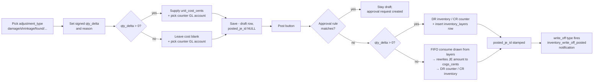

# 11. Inventory Operations (P3)

The Inventory group in the Tangerine top nav hosts M37 inventory operations: transfers, adjustments, and cycle counts. This chapter grows as each P3 chunk ships its panel.

## What's shipped in P3

| Panel | Status | Chunk |
|---|---|---|
| 🔁 Inventory Transfers | **Read-only skeleton** | P3-7 (2026-05-27) |
| 📐 Inventory Adjustments | **Live** | P3-5 (2026-05-27) |
| 🧮 Cycle Counts | Not shipped yet | P3-6 (planned) |

---

## 11.1 Inventory Transfers (skeleton)

**Where:** Tangerine top nav → **🔁 Inventory Transfers** (Inventory group).

**Purpose:** records location-to-location movements of inventory. At the P3-7 skeleton stage the panel is **read-only**: the schema (`inventory_transfers` table) is in place for forward compatibility, but the create / edit UX is intentionally deferred until the multi-warehouse module lands.

### What you'll see

A list view with these columns:

| Column | Source |
|---|---|
| **Item** | `item_id` (uuid into `ip_item_master`) — the SKU being moved |
| **Qty** | `qty` — positive numeric, units of inventory transferred |
| **From** | `from_location` — free-form text source location |
| **To** | `to_location` — free-form text destination (must differ from From) |
| **Date** | `transfer_date` — when the move happened |
| **Notes** | `notes` — free-form operator notes |

Three filter inputs above the table:

- **Item ID (uuid)** — exact match on the item being moved
- **From location** — exact match on the source location
- **To location** — exact match on the destination location

Any combination of filters narrows the list. Clear an input to drop that filter.

### Why the "Add" button is disabled

The **+ Add** button is intentionally disabled with the tooltip:

> *"Multi-warehouse + transfer creation lands when M37 full UX ships. Schema exists for forward compatibility."*

Until the multi-warehouse module lands, the operator runs a single location and there's nothing to transfer between. The table will remain empty by design. When M37's full chunk ships, this same panel grows a create-transfer modal + GL impact wiring for cross-entity moves.

### Empty state

> *"No transfers logged yet. Schema is in place for forward compatibility."*

This is the expected state during P3 until M37 ships its full UX or a cross-entity transfer is created elsewhere.

---

## 11.1.x FIFO layers on AP receipt (P3-4)

**When an AP invoice with inventory lines posts, FIFO layers are created automatically.**

Each AP invoice line that carries an `inventory_item_id` together with **both** a `qty` and a `unit_cost_cents` triggers the creation of one `inventory_layers` row at posting time:

- `entity_id` — from the invoice
- `item_id` — from the line
- `original_qty` and `remaining_qty` — both set to the line's `qty`
- `unit_cost_cents` — per-unit landed cost from the line
- `source_kind` — `'ap_invoice'`
- `source_invoice_id` — the invoice id (FK back to `invoices`)
- `received_at` — defaults to the invoice's `invoice_date`
- `created_by_user_id` — propagated from the posting event

**Sequencing:** the layer rows are inserted **after** the journal entry persists successfully. If the JE fails (period locked, unbalanced, period closed, etc.), the layer step is skipped entirely — there will never be an orphan layer without a matching GL impact.

**Soft-fail on layer side:** if the JE posts but a layer insert fails (e.g. transient DB error), the JE is **not** rolled back. The failure is logged and the offending item id is returned in the posting result under `inventory_layer_errors`. The GL truth (DR inventory / CR AP) is already correct; the operator can backfill the missing layer via a manual adjustment or contact the dev team.

**Lines without qty + unit_cost_cents:** legacy / partial AP invoices that mark a line `inventory_item_id` but omit one of `qty` / `unit_cost_cents` post the JE as before but create **no** layer. This is intentional — those rows pre-date the FIFO wiring and the operator may not yet know the per-unit cost. Subsequent receipts can be properly costed.

**Void behaviour:** voiding an AP invoice via the `ap_invoice_voided` event **does not** delete or zero its FIFO layers. The layers represent inventory that physically arrived; if the operator wants to remove the received quantity from the on-hand picture they must file a separate inventory adjustment (P3-5).

---

## 11.2 GL impact policy

Internal transfers between owned locations within a single entity **do not hit the General Ledger**. The `posted_je_id` column on the underlying table stays NULL for those rows. The inventory simply moves between layers (consume one layer at the source, create a new layer at the destination with the same `unit_cost_cents`).

Cross-entity transfers — once that scenario is supported — will post via `gl_post_journal_entry` and link the resulting JE in `posted_je_id`. At the P3-7 skeleton stage no such posting path exists.

---

## 11.3 API surface

| Method | Path | Behavior |
|---|---|---|
| `GET` | `/api/internal/inventory-transfers` | List (filterable, capped at 500). Default 100 rows ordered by `transfer_date DESC`. |
| `POST` / `PATCH` / `DELETE` | (any) | **Returns 405 Method Not Allowed.** Creation UX deferred. |

Filter query params: `item_id` (uuid), `from_location` (text), `to_location` (text), `limit` (1–500, default 100).

---

## 11.4 Inventory Adjustments

**Where:** Tangerine top nav → **📐 Inventory Adjustments** (Inventory group).

**Purpose:** records ad-hoc inventory deltas (damage, shrinkage, found, correction, write-off, return-to-vendor) and posts them to the GL plus the FIFO ledger.

### Lifecycle

### Adjustment types

| Type | Direction | Typical counter account | Notes |
|---|---|---|---|
| `damage` | Negative | Damage / loss expense | Inventory physically damaged on-site |
| `shrinkage` | Negative | Shrinkage expense | Missing during cycle count |
| `found` | Positive | Inventory-found income (contra-shrinkage) | Found in stockroom; operator supplies per-unit cost |
| `correction` | Positive or Negative | Misc inventory adjustment | Catch-all for stock-record errors |
| `write_off` | Negative | Inventory write-off expense | Triggers `inventory_write_off_posted` notification to admin + accountant |
| `return_to_vendor` | Negative | AP credit memo / vendor receivable | Returning damaged stock to vendor (M3 credit-memo wiring later) |

### Sign convention

`qty_delta` is signed:

- **Positive** (`qty_delta > 0`) — new inventory appears. You MUST supply `unit_cost_cents` because the system uses that cost to create a new FIFO layer. The JE posts `DR inventory / CR counter` at `qty × unit_cost`.
- **Negative** (`qty_delta < 0`) — inventory removed. You MUST leave `unit_cost_cents` blank: FIFO derives the per-unit cost from existing layers in receipt-order. The JE posts `DR counter / CR inventory` at the FIFO-derived `cogs_cents` total.

The CHECK constraint enforces this at the database layer; the UI hides the cost field on negative deltas.

### Posting (`Post` button)

For each draft row, clicking **Post**:

1. **Resolves the inventory asset account** by looking up `gl_accounts.code='1300'` (canonical inventory code per the COA defaults). Falls back to `name ILIKE 'inventory%'`. If neither hits, the post fails with a clear error pointing at the COA admin panel.
2. **Approval gate** — calls `approvalsAPI.requestIfRequired({ kind: 'inventory_adjustment', amount_cents, ... })`. If any active rule matches (e.g. high-dollar write-off threshold), the row stays draft and the operator gets `requires_approval=true` plus a `request_id`. Approval Inbox (chapter 7) handles the decide flow.
3. **Posts the JE** through the standard posting service. Both accrual and cash bases get the same line shape (an inventory adjustment is a non-cash event).
4. **Side effect** — positive: one `inventory_layers` row is inserted (`source_kind='adjustment'`, `source_adjustment_id`). Negative: `inventory_fifo_consume()` draws from existing layers, returns `cogs_cents`, and inserts one `inventory_consumption` row per layer touched.
5. **Stamps the row** — `posted_je_id` and `posted_at` are set; the Edit/Delete buttons disappear (use journal-entries reverse + a corrective adjustment if you need to undo).
6. **Notification** — if `adjustment_type='write_off'`, fires `inventory_write_off_posted` to `recipient_roles=['admin','accountant']`.

### Worked examples

#### Example 1 — Shrinkage (negative)

> "Cycle count shows 7 fewer units of SKU `BLU-TEE-MED` than the system thinks."

- adjustment_type: `shrinkage`
- qty_delta: `-7`
- unit_cost_cents: *(blank)*
- gl_account_id: Shrinkage Expense (5800)
- reason: "Cycle count short by 7"

At post: FIFO consumes 7 units from open `BLU-TEE-MED` layers in receipt order. Suppose the oldest layer has 4 units left at $12.00/unit and the next has plenty at $13.50/unit. cogs_cents = 4×1200 + 3×1350 = 4800 + 4050 = **8850**. The JE posts `DR Shrinkage Expense $88.50 / CR Inventory $88.50` (subledger=item: BLU-TEE-MED).

#### Example 2 — Found (positive)

> "Recovered 5 units of SKU `RED-SCARF` that were misshelved last month."

- adjustment_type: `found`
- qty_delta: `5`
- unit_cost_cents: `1850` ($18.50/unit, matches recent receipt cost)
- gl_account_id: Inventory-Found Income (4900) or Contra-Shrinkage (5810)
- reason: "Misshelved last month"

At post: one new `inventory_layers` row is inserted with `original_qty=5, remaining_qty=5, unit_cost_cents=1850, source_kind='adjustment', source_adjustment_id=<this row id>`. The JE posts `DR Inventory $92.50 / CR Inventory-Found Income $92.50` (subledger=item on the DR).

#### Example 3 — Write-off (negative + notification)

> "10 units of damaged stock written off after warehouse flood."

- adjustment_type: `write_off`
- qty_delta: `-10`
- unit_cost_cents: *(blank)*
- gl_account_id: Inventory Write-off Expense
- reason: "Flood damage 2026-05-26"

Same FIFO flow as shrinkage. **Additionally**, an `inventory_write_off_posted` notification fans out to all `admin` + `accountant` role-holders on the entity (in-app + email per their preferences).

### Editing + deleting

Drafts (no `posted_je_id`) are fully editable: you can change `qty_delta`, `unit_cost_cents`, and `reason`. Locking applies to `adjustment_type`, `item_id`, and `gl_account_id` — delete the draft and create a new one if those need to change.

Posted rows refuse PATCH (409) and DELETE (409). To undo a posted adjustment: reverse the JE via the **Journal Entries** panel (chapter 3), which auto-reverses both accrual and cash twins. The FIFO ledger keeps its history — a positive adjustment's layer remains as a "phantom" with whatever `remaining_qty` the subsequent consumption left it at; a negative adjustment's consumption rows stay in `inventory_consumption` for audit. File a corrective adjustment in the opposite direction if the physical truth changed.

### API surface

| Method | Path | Behavior |
|---|---|---|
| `GET` | `/api/internal/inventory-adjustments` | List with filters: `item_id`, `adjustment_type`, `posted=true|false`, `from=YYYY-MM-DD`, `to=YYYY-MM-DD`, `limit=1..500` (default 100). Ordered `created_at DESC`. |
| `POST` | `/api/internal/inventory-adjustments` | Create draft. Body: `{ item_id, adjustment_type, qty_delta, unit_cost_cents?, reason, gl_account_id }`. 400 on CHECK violations. |
| `GET` | `/api/internal/inventory-adjustments/:id` | Fetch one. 404 if not found. |
| `PATCH` | `/api/internal/inventory-adjustments/:id` | Update mutable fields on draft only. 409 if posted. |
| `DELETE` | `/api/internal/inventory-adjustments/:id` | Delete draft only. 409 if posted. |
| `POST` | `/api/internal/inventory-adjustments/:id/post` | Run the full post flow (resolve inventory account → approval gate → postEvent → stamp → notification). Returns `{requires_approval:true, request_id}` with 202 if a rule matched; the row stays draft. Returns the updated row + `accrual_je_id` + `cash_je_id` + `consume_results` + `inventory_layer_ids` otherwise. |

---

## 11.5 Roadmap

- **P3-6 — Cycle Counts:** add `🧮 Cycle Counts` panel. Variances roll up to adjustments.
- **M37 full UX (post-P3):** enable create + edit + post on Inventory Transfers. The disabled `+ Add` button activates; the schema doesn't change.
