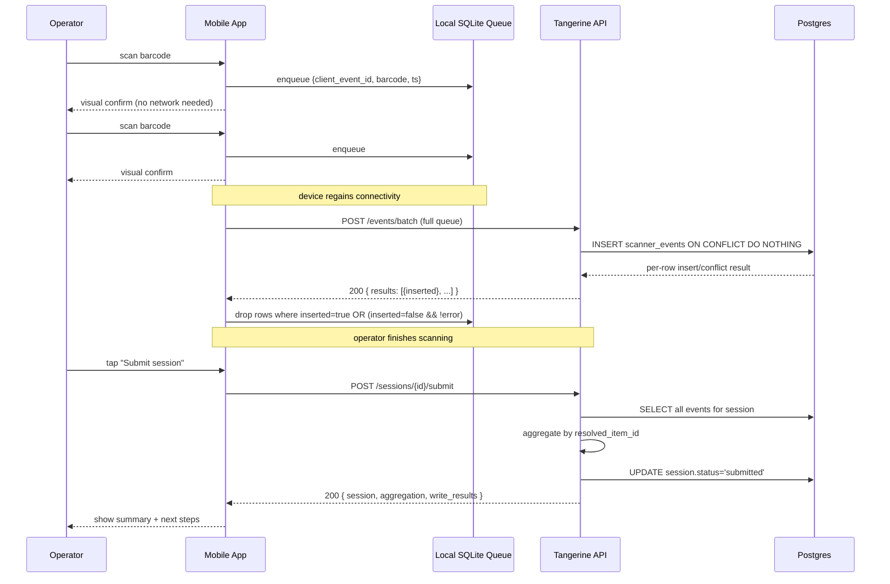

# 12 · Mobile Scanner

> **Status:** P3-8 ships the back-end contract only. The native iOS/Android
> apps are a separate work stream — they consume the REST endpoints
> documented here.

The Mobile Scanner is M39 in the Tangerine roadmap. Operators on the
warehouse floor carry a barcode scanner (or an iPhone/Android phone with
the camera) and run one of four flows:

| Mode | Purpose | Submit output |
|---|---|---|
| `receive` | Scan a vendor PO + each item received | Receipt aggregation → AP path (P3-2 territory) |
| `pick` | Scan a customer SO + items picked | Pick aggregation → SO-ship handler (later P3 chunk) |
| `transfer` | Scan from-location → items → to-location | Aggregation → manual transfer create (P3-7 territory) |
| `count` | Join cycle count → scan items + qty | Writes counted_qty into inventory_cycle_count_lines if P3-6 has shipped |

P3-8 only delivers the **back-end contract + idempotent offline-replay
endpoint**. Auto-posting to AP / SO-ship / transfers is intentionally
deferred until each upstream chunk ships, so the scanner code paths land
clean and decoupled.

---

## 12.1 Architecture

```
 [iPhone / Android app]                    [Tangerine API]                [Postgres]
   │                                         │                              │
   │  scan barcode (offline OK)              │                              │
   │  enqueue to local SQLite                │                              │
   │                                         │                              │
   │  POST /api/internal/scanner/sessions    │                              │
   ├────────────────────────────────────────►│                              │
   │  ◄ 201 { id, status: "open" }           │  INSERT scanner_sessions     │
   │                                         ├─────────────────────────────►│
   │  (on reconnect)                         │                              │
   │  POST /api/internal/scanner/events/batch│                              │
   ├────────────────────────────────────────►│                              │
   │  ◄ 200 { results: [...] }               │  INSERT scanner_events       │
   │                                         │  ON CONFLICT DO NOTHING      │
   │                                         ├─────────────────────────────►│
   │                                         │  TRIGGER updates             │
   │                                         │  scanner_sessions.scanned_at │
   │                                         │                              │
   │  POST .../sessions/:id/submit           │                              │
   ├────────────────────────────────────────►│                              │
   │  ◄ 200 { session, aggregation,          │  UPDATE status='submitted'   │
   │          write_results }                ├─────────────────────────────►│
```

Tables introduced in this chunk:

- `scanner_sessions` — one row per scan flow against one target
  (PO / SO / cycle count / adhoc). Status moves `open → submitted` (or `cancelled`).
- `scanner_events` — append-only log. Idempotency key is
  `UNIQUE (session_id, client_event_id)`.

---

## 12.2 Offline-replay JSON contract

The mobile app generates `client_event_id` (uuid v4) at scan time and
persists it to local SQLite **before** any network call. On reconnect it
sends the entire local queue. The server INSERT uses
`ON CONFLICT (session_id, client_event_id) DO NOTHING`, so re-sending the
same batch twice is safe.

**Wire format** (request body of `POST /api/internal/scanner/events/batch`):

```json
{
  "session_id": "<uuid>",
  "events": [
    {
      "client_event_id": "<uuid generated on device>",
      "scanned_barcode": "1234567890",
      "resolved_item_id": "<uuid | null>",
      "qty": 1,
      "client_timestamp": "2026-05-27T10:00:00.000Z",
      "notes": "optional"
    }
  ]
}
```

**Per-event response shape**:

```json
{ "client_event_id": "...", "inserted": true | false, "error": "optional" }
```

- `inserted: true` — row written for the first time.
- `inserted: false` and no `error` — duplicate; idempotent replay; treat
  as success and drop the local-queue row.
- `inserted: false` with `error` — real failure; retry on the next batch.

The single rule the mobile app must follow: **never regenerate
`client_event_id` on retry.** Each physical scan has a fixed uuid forever.

---

## 12.3 Offline scan → batch → submit sequence



---

## 12.4 Troubleshooting view in Tangerine

The Tangerine admin shell (`/tangerine`) has a new **Scanner Sessions**
panel under the **Operations** group. It is read-only:

- Lists sessions with filters for status (`open`/`submitted`/`cancelled`)
  and mode (`receive`/`pick`/`transfer`/`count`).
- Clicking a row opens a modal showing the session header (mode, target,
  device, timestamps, client_meta) and a scrollable event log — one row
  per scanner_events entry, in server-received order.
- No edit / submit / cancel buttons in the admin view; those flows are
  owned by the mobile app.

This is the place to start when an operator reports "my session disappeared"
or "scan #5 never made it" — the event log shows exactly what the server
received and when.

---

## 12.5 RLS model

- `scanner_sessions` — standard P1 (anon + auth-internal-by-entity) **plus**
  `auth_own_scanner_sessions`: devices see only their own rows
  (`device_user_id = auth.uid()`). Admin paths use service-role and bypass RLS.
- `scanner_events` — append-only. Only `SELECT` and `INSERT` policies exist;
  `UPDATE` and `DELETE` are denied to authenticated/anon by omission.
  service-role can still amend, but no device path can rewrite history.

---

## 12.6 Future work

- The native iOS/Android shell (Swift / Kotlin / React Native — TBD) is a
  separate work stream owned by mobile. P3-8 only delivers the back-end
  contract these apps consume.
- Receipt → AP posting integration ships in **P3-2** (M3 AP Invoice).
- Transfer auto-create ships once **P3-7** (M37 Inventory Operations)
  merges and we wire the two chunks together.
- Cycle-count write-back becomes active automatically once **P3-6**
  (M5 Inventory FIFO with cycle counts) ships its
  `inventory_cycle_count_lines` table.

---

## 12.7 Related contracts

- [`scanner-rest-contract.md`](../scanner-rest-contract.md) — the formal
  OpenAPI-style spec the mobile teams consume.
- [`P3-acc-core-architecture.md`](../P3-acc-core-architecture.md) §6 —
  full design rationale.
