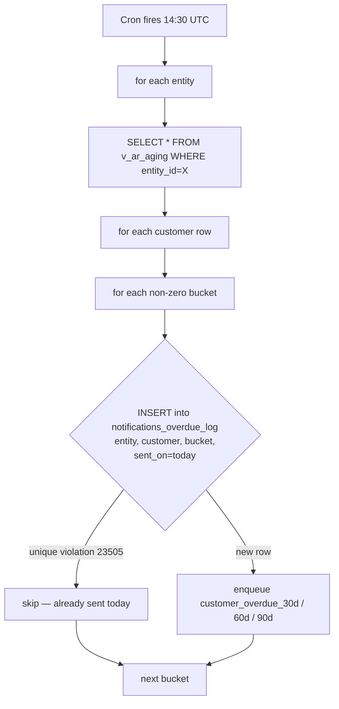
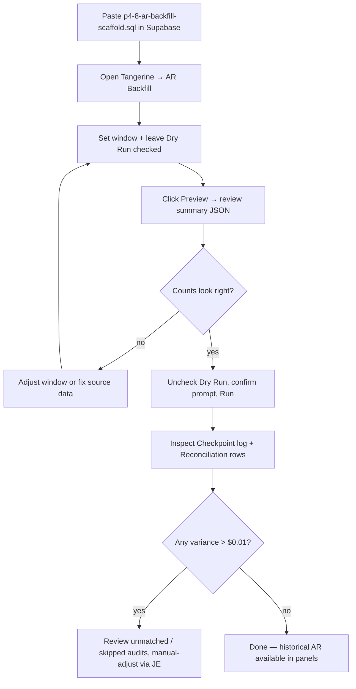

# 16. Accounts Receivable (M4)

> **P4 status (2026-05-27 night):** all 8 chunks shipped, all migrations applied to prod, all four AR admin panels live in Tangerine → Accounting. PRs #370, #371, #372, #373, #377, #378, #380, #382, #384, #386.

The Accounts Receivable module records customer invoices, drives them through GL posting (with FIFO COGS recognition for inventory lines), captures customer payments, and surfaces the receivables ledger + aging report. AR is the AP module flipped to the customer side: where AP debits an expense / inventory asset and credits AP control, AR debits AR control and credits revenue (plus a FIFO COGS pair per inventory line).

Tangerine P4 Chunk 4 (this chapter) ships the AR Invoices admin UI + handlers on top of the P4 Chunk 1 schema (`ar_invoices`, `ar_invoice_lines`, `ar_receipts`, `ar_receipt_applications`). Receipts UI ships in P4-5 — see the placeholder at the bottom of this page.

## Panels

| Panel | URL | Who uses it | Writable? |
|---|---|---|---|
| 🧮 **AR Invoices** | `/tangerine` → AR Invoices | Accountant, ops | Yes — full CRUD on drafts; Post / Void on sent invoices |
| 💰 **AR Receipts** | _coming in P4-5_ | Accountant | Pending |
| 📊 **AR Aging** | _coming in P4-6_ | CEO, accountant | Pending (operator's daily morning view) |

## Lifecycle

```mermaid
flowchart LR
    Draft["🧾 draft<br/>(edit + delete OK)"]
    PendingApproval["⏳ pending_approval<br/>(awaiting M27 approval)"]
    Sent["✅ sent<br/>(accrual JE live, FIFO consumed)"]
    PartialPaid["💵 partial_paid<br/>(receipt applied)"]
    Paid["💰 paid<br/>(fully paid — cash JE live)"]
    Void["🚫 void<br/>(JEs reversed, FIFO restored)"]

    Draft -->|Post button| PendingApproval
    Draft -->|Post (no rule fires)| Sent
    PendingApproval -->|approver clicks Approve in M27 Inbox| Sent
    PendingApproval -->|approver rejects| Draft
    Sent -->|Receipt (partial)| PartialPaid
    Sent -->|Receipt (full)| Paid
    PartialPaid -->|Receipt (remainder)| Paid
    Sent -->|Void| Void
    Draft -->|Void / Del| Void

    style Draft fill:#cbd5e1,color:#0f172a
    style PendingApproval fill:#fed7aa,color:#0f172a
    style Sent fill:#bbf7d0,color:#0f172a
    style PartialPaid fill:#a7f3d0,color:#0f172a
    style Paid fill:#86efac,color:#0f172a
    style Void fill:#fecaca,color:#0f172a
```

There is also a terminal **`posted_historical`** status reserved for the P4-8 5-year backfill — the operator UI cannot write that state directly; the backfill RPC owns it.

## Creating an AR invoice (draft)

From the **AR Invoices** panel, click **+ New invoice**.

| Field | Required? | Notes |
|---|---|---|
| Customer | yes | Sourced from M36 Customer Master. Type an unknown name → a **"+ Add customer '<name>'"** typeahead row opens the Add-customer popup pre-filled, creates it on the fly, selects it here, and sends a complete-the-info reminder (item 8). UUID paste fallback is offered. **On selection the customer's Payment terms and Ship-to are auto-populated** (see below). Saving without a customer raises a warning. |
| Ship-to location | optional | Auto-populated on customer selection: the customer's **default** location (else the first). When the customer has **more than one** ship-to address, a toast warns you which was auto-selected so you can change it. Sourced from `customer_locations`. |
| Invoice number | optional | Auto-generated as `AR-YYYY-NNNNN` if blank. Must be unique per entity. |
| Kind | yes | `customer_invoice` / `customer_credit_memo` |
| Invoice date | yes | The date the GL JE will land on (must be inside an open period at post time). `posting_date` is kept in lockstep with this field. |
| Payment terms | optional | Auto-populated from the customer master (`customers.payment_terms_id`) on customer selection; still editable. When set, **Due date** is auto-computed as invoice date + `payment_terms.due_days`, and **recomputed** whenever the terms or invoice date change — unless you have hand-edited the Due date, which is never silently overwritten. |
| Due date | optional | Auto-derived from Payment terms (above). Editing it marks it manual, freezing the auto-recompute. |
| AR account override | optional | Defaults to `entities.default_ar_account_id` (code `1200`). Per-customer override via `customers.default_ar_account_id`. |
| Revenue account (default) | optional | Defaults to `entities.default_revenue_account_id` (code `4000`). Per-line override available. |
| COGS account | optional | Defaults to `entities.default_cogs_account_id` (code `5000`). Required only when an inventory line is present. |
| Inventory asset | optional | Defaults to `entities.default_inventory_account_id` (code `1300`). Required only when an inventory line is present. |
| Description | optional | Free text |
| Lines (≥ 1) | yes | See **Lines + inventory contract** below |

### Lines + inventory contract

Each line must resolve to a positive `line_total_cents`. There are two paths:

1. **Quantity + unit price path** — supply `quantity` and `unit_price_cents` (UI: dollars). The DB trigger `ar_invoice_lines_compute_total_trg` computes `line_total_cents = quantity * unit_price_cents`.
2. **Flat total path** — supply only `line_total_cents` (UI: the **Amount $** column on a non-matrix line) when no per-unit breakdown applies (e.g. a flat service / freight line). The trigger preserves the explicit value.

**Inventory contract:** if a line carries `inventory_item_id` (uuid into `ip_item_master`), it **must** use the quantity + unit price path. The unit price is the **selling price** (not the cost) — the COGS amount is derived at post time from the FIFO layer consumption (see next section). A line without `inventory_item_id` is treated as a service / non-inventory line and never generates a COGS entry.

The trigger `ar_invoice_lines_maintain_total` rebuilds `ar_invoices.total_amount_cents` after every line insert / update / delete. The UI shows a running total under the lines table.

**Missing-price warning:** on save, if any line carries a quantity but **no sales price ($0 unit price)**, a warn-and-confirm dialog lists the affected styles/lines ("Save anyway" / "Add price"). This mirrors the Sales Order editor's missing-price guard — a soft warning, not a hard block, since $0 is occasionally intended (e.g. a free replacement).

### The line body is the size matrix (shared with Sales Orders)

The invoice line body is the **same editable size-matrix body the Sales Order modal uses** (`LineMatrixBody`, `mode="ar"`), open by default:
- **Always opens in matrix format.** Whether you create a new invoice, open one created from **Allocations** (SO → invoice), or open any existing invoice, the body shows the color × size grids by default. On open, each existing inventory line is resolved back to its style / color / size (via the item master, including now-inactive SKUs) and **regrouped into a per-style matrix**; only lines that can't be matrixed (amount-only charges, non-apparel SKUs, or SKUs that can't be resolved) fall back to a flat row.
- **➕ Add style (matrix)** — pick a style → fill its color × size grid inline, with a per-row **Unit $**; new pickers insert on top.
- **+ Add non-matrix line** — a flat row that doubles as an **amount-only charge** (freight / fees / discounts): enter a **Description** + **Amount $** with no SKU, or a SKU + Qty + Unit $.
- **Revenue routing:** inventory/style (matrix) lines route revenue **server-side** (header → customer → entity default); added flat lines default server-side too but expose an optional per-line **Revenue acct** override.
- Save / Close sit in a **frozen footer**. (The old ☰ List / ▦ Matrix read-only toggle and the per-line price-suggest were removed in favour of this unified editable body.)

## Posting — Approval gate + FIFO consume

Click **Post** on a draft row (or on a pending-approval row to re-emit the gate). The handler:

1. Loads the invoice + lines. Resolves the GL account chain:
   - **AR:** `invoice.ar_account_id` → `entity.default_ar_account_id` → COA code `1200`
   - **Revenue:** `invoice.revenue_account_id` → `entity.default_revenue_account_id` → COA code `4000`
   - **COGS** (only when an inventory line exists): `invoice.cogs_account_id` → `entity.default_cogs_account_id` → COA code `5000`
   - **Inventory asset** (only when an inventory line exists): `invoice.inventory_asset_account_id` → `entity.default_inventory_account_id` → COA code `1300`

   If any required leg is unresolvable, the handler returns **400** with a clear error message before any DB writes occur.

   > **Per-style revenue + COGS routing (operator #6).** Each invoice **line** can carry its own `revenue_account_id` and `cogs_account_id`. When an invoice is created from a sales order, each line's accounts are resolved **style → customer default → entity default** — the style's `style_master.revenue_account_id` / `cogs_account_id` win (these are set per brand bucket: ROF Brands / Boys / PT / Private Label, from the Xoro item GL export). So a single invoice spanning several brands books **each line's revenue and COGS to that brand's accounts**; the invoice-level account is only the fallback for styles with no account set. The `arInvoiceSent` rule applies the per-line account when present, else the invoice default.
   >
   > **Per-style returns routing.** Customer **credit memos** (returns, M23) route the same way: each return line's revenue reversal posts to the style's **`returns_account_id`** (the brand's Sales Returns account — 4236 ROF / 4234 Boys / 4235 PT / 4201 Private Label) → customer `default_returns_account_id` → entity Sales Returns (4100). So returns show up against the right brand's contra-revenue line.

2. Calls `approvalsAPI.requestIfRequired({ kind: 'ar_invoice', amount_cents: total, payload: { customer_id, customer_code } })`.
   - If a rule matches (e.g. amount > $10k, or a `customer_credit_extension` rule fires for over-limit customers — see arch §5.1):
     - Sets `gl_status='pending_approval'`.
     - Fires the `ar_invoice_approval_requested` notification to the **admin** role.
     - Returns `202 { requires_approval: true, approval_request_id }`.
     - The accountant + admin see the row in the **Approval Inbox** panel and decide.
   - If no rule matches: continues directly to step 3.

3. Calls `postEvent({ kind: 'ar_invoice_sent' })`. The posting service:
   - Runs `inventory_fifo_consume()` per inventory line — returns the per-line `cogs_cents` from the FIFO layer draw-down.
   - Builds the accrual JE: **DR AR / CR revenue** (per line) **+** per-inventory-line **DR COGS / CR inventory** with the resolved FIFO amounts.
   - Drops any zero-COGS sentinel pair cleanly (a layer might be already-zero-cost on a return-to-stock layer with damaged units).
   - Persists the JE atomically. The accrual JE id is returned.

4. The handler writes each `consume_results[].cogs_cents` back onto `ar_invoice_lines.cogs_cents` (keyed by `target_line_id`) and stamps `cogs_resolved_at`. These columns are NULL until the invoice is sent.

5. Stamps `ar_invoices.accrual_je_id` and flips `gl_status='sent'`.

6. Fires the `ar_invoice_posted` notification to **admin + accountant**.

When the approver clicks **Approve** in the **Approval Inbox**, the M27 `decide` handler re-runs the post path automatically via `fromApprovalHook=true`. The invoice flips from `pending_approval` to `sent` in one round trip.

### Cash basis is deferred to receipt

Unlike AP (where the cash JE fires at the Pay event), AR's cash basis is recognized at **receipt** time — when an `ar_receipt` is applied to this invoice via `ar_receipt_applications`. See `arPaymentReceived.js`. This means at the **sent** state there is exactly one JE (accrual). At the **paid** state there are two: the original accrual and a deferred cash JE. The trigger `ar_invoices_paid_maintainer` (P4-1) flips `gl_status` from `sent → partial_paid → paid` based on the running sum of receipt applications vs. `total_amount_cents`.

## Voiding an invoice

Click **Void** on a sent row (or **Del** on a draft row for hard delete). The void handler:

1. Returns **409** with `{ has_payments: true, paid_amount_cents }` if any receipt has been applied (i.e. `paid_amount_cents > 0`). The operator must void the receipts first via the P4-5 receipts panel.
2. Calls `postEvent({ kind: 'ar_invoice_voided', data: { invoice_id, accrual_je_id, cash_je_id, gl_status, reason } })`. The `arInvoiceVoided` rule emits a `reversals[]` array of JE ids to reverse:
   - **Draft / pending_approval:** empty array (nothing posted yet).
   - **Sent / partial_paid / paid:** `[accrual_je_id]` and, if `cash_je_id` is set, also includes it.
3. The posting service calls `reverseJournalEntry(jeId)` for each — emitting a new JE with negated lines (`reverses_je_id` set). This reverses the GL, including putting the inventory **asset dollars** back (DR Inventory / CR COGS).
   - **Physical inventory put-back.** The GL reversal alone does **not** restore the on-hand *quantity* (the consumed FIFO layers stay drawn down). So the void flow then calls **`restoreInvoiceConsumption()`** (`api/_lib/inventory/restoreInvoiceConsumption.js`): for each live `inventory_consumption` row this invoice's lines drew, it adds `qty_consumed` back to that layer's `remaining_qty` (true reversal — the exact layers, capped at `original_qty`) and stamps the consumption row `reversed_at` (kept for audit, not deleted). The units return to on-hand, since the goods are no longer considered shipped. A never-posted **draft delete** consumed nothing, so this is a no-op there.
4. Flips `ar_invoices.gl_status='void'`.
5. Appends `[void] <reason>` to `ar_invoices.notes` if a reason was supplied.
6. Fires the `ar_invoice_voided` notification to **admin + accountant**.
7. **Re-opens the originating sales order** (when the invoice carries a `sales_order_id`): `reopenSalesOrderFromInvoice()` rolls the SO lines' `qty_invoiced` back by the invoiced quantities and re-derives the line + header status — **allocated** when the soft allocations still fully cover the order, else **confirmed** (a `cancelled` SO is never resurrected). The same re-open runs on a **draft Delete**. This stops a deleted/voided invoice from stranding its SO in `invoiced`. The Void prompt and the Delete confirmation **warn** *"this will re-open SO-NNNN and restore its allocations"* first, and a toast confirms the re-opened SO afterward. (Allocations are a soft reservation untouched by invoicing, so they remain in place — only the SO status/invoiced quantities are repaired.)

Voiding is **always** reversible to a clean GL — the audit trail keeps both the original JE and its reversal pair, so the AP/AR aging reports always reconcile.

## Editing rules

| Operation | Allowed when `gl_status` is | Notes |
|---|---|---|
| Edit header / lines | `draft`, `unposted` | The PATCH handler rejects with 405 if posted/sent/paid/void/reversed. |
| Delete | `draft`, `unposted` | Use Void instead once posted. |
| Post | `draft`, `unposted`, `pending_approval` | Re-emits approval if still pending. |
| Void | `sent`, `partial_paid`, `paid` | Blocked while applied receipts exist. |

`gl_status`, `accrual_je_id`, `cash_je_id`, `total_amount_cents`, `paid_amount_cents`, and `entity_id` are **server-controlled** — the PATCH handler rejects any direct write attempts with 400.

## Filter row

The top of the panel has these filters:

- **Status** — single-select on `gl_status`.
- **Customer** — single-select on the customer dropdown.
- **Source** — single-select on the row `source` (manual vs mirrored).
- **From / To** — `invoice_date` range (with date presets).
- **Limit** — 50 / 100 / 200 / 500.
- **Include void** — checkbox (default off).
- **Search** — **searches everything**, server-side: invoice number, customer name/code, line **SKU / style / description**, status, and the invoice **amount** (e.g. `1234.56`). Matching is a broad case-insensitive lookup that pre-resolves customer and line matches into id lists so the grid stays a single indexed query.

### Grid columns

Beyond Invoice # / Date / Customer / Total / Paid / Balance / Status, the grid carries (toggle via the column-prefs button, all included in the export):

- **Payment Terms** — the `payment_terms.code` for the invoice's terms.
- **Due Date** — `due_date` (MM/DD/YYYY).
- **Credit Applied** — the summed total of posted **credit memos** that reverse this invoice (`ar_invoices.reverses_invoice_id` link), shown as a negative green amount. Blank when none. (The operator's original ask called this "Vendor Credit"; in this AR context the real data is customer credit memos, so the column is labelled **Credit Applied**.)
- **Payment Date** — the date of the most recent **non-void** receipt applied to the invoice (`MAX(ar_receipts.receipt_date)` via `ar_receipt_applications`).

Void invoices render at 50% opacity. The **Balance** column shows `total_amount_cents − paid_amount_cents` colored amber when > 0 — this is the invoice balance the operator asked for; note it does **not** net out Credit Applied (credit memos are separate documents with their own balance).

## Row expander — inline line detail (the ▸ carrot)

Each invoice row has a **▸ carrot** in a leading column — the same expander the **Purchase Orders** grid uses. Click it to open an inline **line-detail** panel under the row without leaving the list (clicking the carrot toggles the detail; clicking anywhere else on the row still opens the edit modal as before). Click **▾** to collapse.

The detail lazy-loads the invoice's lines (`GET /api/internal/ar-invoices/:id`) and resolves each inventory line back to its **style / color / size** via `GET /api/internal/items?ids=` (including now-inactive SKUs). It then renders exactly like the PO expander:

- **Per-style size matrix.** Any inventory line that resolves to a sized apparel item (style + size, positive qty, a unit price) is grouped into a per-style **color × size grid**. Each style block leads with the **style code in blue** followed by the **style name** (first line/SKU description) so the invoice reads by name, not just a bare code — and, for jeans, a shared **inseam chip** (e.g. `Inseam 32"`) when every line of the style shares one inseam (mixed inseams append `· 32"` to the colourway row instead). Case-variant colourways (`BLACK` vs `Black`) merge into **one** title-cased row. Columns are **Qty**, **Unit $** (qty-weighted average), and **Ext $**, plus a per-style total row. Size columns use the shared canonical ordering, and the first size column collapses the empty leading/trailing columns the same way as the SO/PO grids and Inventory Matrix — the first visible size header turns **green** and is clickable to toggle (`⋯` marks hidden columns).
- **Other lines.** Amount-only charges (freight, fees), non-apparel SKUs, or SKUs that can't be resolved to a size fall back to a flat **Description / Qty / Unit $ / Ext $** list below the matrices, with a total.

The grouping logic lives in the pure, unit-tested **shared** builder `src/tanda/lib/invoiceMatrixBody.ts` (`buildInvoiceMatrixBody`) — the AR entry point `src/tanda/arInvoiceLineDetail.ts` (`buildArLineDetail`) is a thin adapter over it, and the panel renders through the shared `src/tanda/components/InvoiceMatrixBody.tsx` component. **The exact same builder + component render the AP vendor-bill body and the Inventory Snapshot Sold/Purchased drill's invoice/bill popup**, so all four surfaces are pixel-identical. The read-only expander reuses the existing invoice-detail endpoint, so no new API was added.

### Why some lines land in "Other lines" — size grain of mirrored AR

Mirrored / historical AR invoices (`source='xoro_mirror'` and the `manual` history backfill) inherit their `inventory_item_id` from `ip_sales_history_wholesale`, whose feeds (the Excel sales ingest **and** `xoro-sales-sync`) deliberately roll SKUs up to **style + color grain** (`canonStyleColor`) so they line up with the planning grid. A style + color item has no size, so the expander can't place the line in a size cell — it falls to **Other lines**. **Planning's grain is intentional and is never changed.**

Two mechanisms restore size grain on the AR side without touching planning:

1. **Item size-resolution (#1817 + follow-up).** `scripts/backfills/ar-mirror-size-resolution.mjs --parse-sizes` populates `ip_item_master.size` for items whose `sku_code` already embeds a size token (`…-LARGE`, `…-12MO`, `…-30`), turning the AR lines that point at them into true matrix cells. Items that are **duplicate fragments** of an already-sized twin (writing the size would violate `uq_ip_item_master_logical_sku`) are handled by `scripts/backfills/ar-line-repoint-fragments.mjs`, which **re-points the AR line to the canonical sized twin** — touching only `inventory_item_id`, so the line total is provably untouched (the `ar_invoice_lines_compute_total_trg` clobber trigger is column-scoped to `quantity, unit_price_cents, line_total_cents` and does not fire).

2. **Size-grain explosion (this PR).** When a size-grain **source** carries per-size lines for an invoice, the AR mirror **explodes** the one style + color line into per-size lines pointing at true size-grain items, preserving the line total **to the cent** (remainder to the last size). The source is `raw_xoro_payloads` rows with `endpoint='sales-history'` — the raw Xoro `invoice/getinvoice` response (already mirrored locally), whose `invoiceItemLineArr[].ItemNumber` is the full size SKU. This runs automatically in the nightly mirror (`api/_lib/xoro-mirror/ar-sizegrain.js`, wired into `ar.js`) and can be applied to existing invoices with `scripts/backfills/ar-sizegrain-explode.mjs`. Coverage is bounded by how many invoices the sales-history raw-payload ingest holds; uncovered invoices stay as honest style + color rollups (no fabricated sizes). Every exploded insert sets `unit_price_cents=NULL` unless `quantity × unit` reproduces the total exactly, so a discounted net is never re-grossed by the compute trigger (#1674).

**Private-label colour resolution (#1835).** Private-label buyers (Ross, Burlington, etc.) carry dash-delimited **style-colour-size** ItemNumbers whose style is a bare number — e.g. `100203712MN-Black Shadow GD-29` (style `100203712MN`, colour `Black Shadow GD`, size `29`). The colour is the middle segment, so it **is** parseable; the earlier residual (~1.6k covered invoices left unexploded) came from the size-grain stub builder **dropping** it: two colours of the same style + size (`…-BLACKSHADOWGD-29` and `…-SIMPLESAGEGD-29`) both landed as `(style, colour='', size=29)` and collided on the `uq_ip_item_master_logical_sku` index — and one collision aborted the whole invoice's explosion. Resolution now (a) **reuses the authoritative catalog row** — the same garment already in `ip_item_master` under a spaced/dashed colour (`100203712MN-BLACK-SHADOW-GD-29`, colour "Black Shadow Gd") is matched by `(style_code, canonical colour, canonical size)` so no duplicate is minted; and only for a genuinely-new SKU (b) **mints a stub that carries the colour** parsed from the SKU's own colour segment. Distinct colours → distinct logical keys → the batch insert no longer aborts. The colour source is the SKU's own dash-delimited encoding (Xoro carries no separate per-line colour attribute); catalog reuse is preferred over parsing.

**Lifting the hard limit — CSV-driven historical enrichment (#1898).** The one source that *can* reach a closed invoice's size detail is a Xoro **UI export**: the "Invoice Detail Report" CSV carries every paid invoice's per-`STYLE-COLOR-SIZE` line. `scripts/enrich-ar-invoice-sizes.mjs` (dry-run by default; `--apply` writes; `--csv <path>` for additional exports; idempotent) replaces the size-NULL historical aggregate lines of a **wholesale** invoice (`invoice_number NOT ILIKE '%ECOM%'`, 2024-09-01 … 2026-07-07 — ECOM is left untouched by CEO decision) with per-size lines linked to size-populated SKUs, and explodes the matching `ip_sales_history_wholesale` colour rows to size grain. It handles the two historical shapes: **Case A** — one colour-grain line is **split** across the CSV sizes; **Case B** — a backfill that was already one-line-per-size but linked to a size-NULL SKU is simply **re-linked** to a sized SKU. Conservation is exact to the cent because every size line reuses its aggregate line's **own** `unit_price_cents` (the `compute_total` trigger then reproduces `line_total = qty × unit`, and the gate requires `Σ CSV qty == aggregate qty` per group), so the header and its posted JE never move; `cogs_cents` is distributed by qty. Lines whose booked list price differs from the CSV's discounted amount are still enriched (the divergence is reported, the booked total conserved); an invoice is **skipped entirely** (never partially) when its stored aggregate doesn't reconcile to the CSV (missing styles, qty mismatch). Sized SKUs are reused first and only **created** — via the sanctioned `resolveOrCreateSku` — when the (style, colour) already exists. Every replaced row is captured as a reversible pre-image manifest. **Residual by design:** the CSV the CEO exports bounds coverage — dates it doesn't include (e.g. pre-2025 history) stay as style + colour rollups until a covering export is delivered and the same script is re-run.

**Repricing / filling the subledger to the Xoro GL (#1902).** #1896's enrichment deliberately *conserved* each invoice's booked total. A follow-up (`scripts/reprice-ar-invoices-to-csv.mjs`, dry-run by default; `--apply`) corrects the historical invoices whose stored total disagrees with the Xoro CSV, so the AR **subledger agrees with the Xoro GL**. It is grounded in a GL-linkage fact: `ar_invoices.total_amount_cents` is **subledger-only** — no journal entry is sourced from `ar_invoices`; GL revenue/AR is posted by the Xoro GL mirror (linked via `ar_invoices.accrual_je_id`). So a total correction posts **nothing** to the GL (closed periods receive no posting; the subledger simply moves onto the already-posted GL). The correction is **gated on `|CSV − GL AR debit| ≤ 5¢`**, which restricts it to invoices where the CSV equals the full Xoro receivable — and therefore *excludes* ecom-style invoices that carry web **"Shipping income"** (where GL AR = merchandise + shipping > the CSV's merchandise-only Amount) and any genuine CSV≠GL mismatch; both are **itemized for the controller, never auto-corrected** (consistent with "ECOM stays untouched"). For a passing invoice it rebuilds the lines to exactly the CSV — **repricing** a booked-list invoice down to the Xoro-discounted amount, or **filling** an under-captured invoice with the styles its aggregate was missing — so the post-fix total equals the CSV **and** the GL receivable. Touched lines carry `notes='[ar-size-reprice …]'`; every write is captured as a reversible pre-image.

**Widening coverage — and its hard limit (#1824).** The per-size payloads come from Xoro's `invoice/getinvoice` REST endpoint, which **only returns OPEN invoices** — it ignores every filter param (invoice number, status, date) and always paginates the same ~4,400 currently-open invoices. Once an invoice is paid it drops out of that universe and its per-size detail becomes **permanently unreachable** by REST (every alternate endpoint is access-denied). The only way to capture an invoice's size detail is to archive it **while it is still open**, so a nightly cron (`/api/cron/ar-payload-ingest`, 01:00 UTC, just before the mirror) archives not-yet-seen invoices' raw payloads into `raw_xoro_payloads`. Because each Xoro page takes ~45 s to fetch, the cron runs a **tail sweep** (page 1 probe + the last `?tail_pages=4` pages — Xoro paginates oldest-first, so newly opened invoices appear on the tail); it is idempotent (skips invoices already archived) and supports `?page_start=`/`?max_pages=` for manual forward chunks. The one-time historical sweep of the whole current open set is `scripts/backfills/ar-payload-ingest.mjs` (resumable — safe to re-run or chunk with `--page-start`/`--max-pages`). **Honest residual:** invoices that were already paid before this capture began (the bulk of pre-2026 history) can never get per-size lines and remain style + color rollups by design.

## Supporting documents

The edit modal embeds `<DocumentAttachmentList contextTable="ar_invoices" kinds={["customer_invoice_pdf","approval_correspondence","other"]} />` so accountants can attach the PDF copy of the invoice that goes out to the customer plus any approval correspondence.

## Schema coordination

- All money amounts are stored as **`bigint cents`** — never floats. The UI translates dollars ↔ cents at the form boundary; the handler validates every cents field as a BigInt-safe integer.
- The `(entity_id, invoice_number)` UNIQUE constraint on `ar_invoices` enforces operator typo isolation per company. Two ROF invoices can't share a number; the handler returns **409** on collision.
- `ar_invoice_lines.cogs_cents` and `cogs_resolved_at` are populated server-side at post time — the UI never writes these. They appear on the read API but the PATCH handler rejects them.
- The FIFO consume side-effect ordering is the same asymmetry P3-5 documented: `inventory_fifo_consume()` mutates layers + writes the consumption ledger row BEFORE the JE persists. If JE persist fails, the FIFO ledger leads the GL by one event. Accepted tradeoff — operator reconciles out-of-band via the `consume_results` audit trail surfaced on the post response.

## Receipts (P4-5)

_Placeholder._ The P4-5 chunk ships the **AR Receipts** admin UI: a separate panel for entering customer payments (ACH / wire / check / credit card / cash / paypal / stripe), applying one receipt to one or more invoices via the `ar_receipt_applications` junction, and triggering the `arPaymentReceived` posting rule (DR bank / CR AR per applied invoice for the accrual side; DR bank / CR revenue for the deferred cash side). Receipts also support partial application — under-applied amounts surface in the `v_ar_unapplied_receipts` view for accountant cleanup.

This chapter will be extended in P4-5 with:
- Receipt entry form (header + applications grid)
- One-receipt-many-invoices flow with running unapplied balance
- Void receipt flow (reverses the cash JE; restores the invoice's paid_amount_cents)
- Cash receipts journal view (`v_cash_receipts_journal`)

## Related docs

- [`../P4-ar-architecture.md`](../P4-ar-architecture.md) §3 (schema), §4.1 (`arInvoiceSent` rule), §4.3 (`arInvoiceVoided` rule), §5 (hook contracts), §6 (5-year backfill — P4-8)
- [13-accounts-payable.md](13-accounts-payable.md) — the AP-side analogue this chapter mirrors
- [07-approvals.md](07-approvals.md) — the M27 approval-rule gate `ar_invoice` and `customer_credit_extension` rule kinds
- [08-notifications.md](08-notifications.md) — the `ar_invoice_posted`, `ar_invoice_voided`, and `ar_invoice_approval_requested` notification kinds

---

## Customer Receipts (P4-5)

A **receipt** is the record of a customer payment. One receipt may be applied across one or more invoices via the `ar_receipt_applications` junction table; any unapplied portion shows in `v_ar_unapplied_receipts` (an on-account credit).

### Lifecycle

```mermaid
stateDiagram-v2
    [*] --> Draft : Add Receipt
    Draft --> Posted : Post (emits accrual + cash JEs)
    Draft --> Voided : Void (no JE; flips is_void)
    Posted --> Voided : Void (reverses both JEs)
    Voided --> [*]
```



**Three terminal-or-near-terminal states:**

| State | Triggers | What you can do |
|---|---|---|
| **Draft** | Created via the Add Receipt modal; no JEs emitted yet | Edit header fields, add/remove applications, delete (if no applications), post, void |
| **Posted** | `Post` button creates the accrual JE and the cash JE (sibling-linked) | Header is locked; void (which reverses both JEs); no further header edits |
| **Voided** | `Void` button — also fires when posted receipts are reversed | Terminal; applications stay in the DB as audit history; the `paid_amount_cents` maintainer on invoices ignores `is_void=true` so paid totals automatically back out |

### Add Receipt — the multi-application UX

1. **Pick customer.** As soon as a customer is selected the modal fetches their open AR invoices (`gl_status IN ('sent','partial_paid')` AND balance > 0), sorted by `due_date` ascending (oldest first — standard FIFO collection logic).
2. **Enter receipt header.** Amount, date, payment method (ach / wire / check / credit_card / cash / paypal / stripe / other), bank account, and optional reference (check #, wire confirmation, Stripe charge id).
3. **Check rows to apply.** Each checked row auto-fills the apply amount = invoice's outstanding balance (capped at remaining receipt amount). You can override each amount manually.
4. **Live sums** at the bottom show *Receipt / Applied / Unapplied*. Behavior:
   - **Applied ≤ Receipt** — allowed; if Applied < Receipt the difference is on-account (visible in `v_ar_unapplied_receipts`).
   - **Applied > Receipt** — UI shows in red; submit is rejected client-side AND by the DB over-application guard (`ar_receipt_applications_amount_positive`).
   - **Applied = 0** — allowed; creates a fully-unapplied on-account receipt.
5. **Save** creates the receipt as **Draft**. JEs are NOT emitted until you click **Post** in the detail modal.

### Post → JE emission

Posting a receipt invokes the `arPaymentReceived` posting rule in **multi-application mode** (see `api/_lib/accounting/posting/rules/arPaymentReceived.js`). Each posting emits TWO journal entries:

| JE | Side | Shape |
|---|---|---|
| **Accrual JE** | `basis=ACCRUAL`, `journal_type=ar_receipt` | Header: `DR bank_account` (full receipt total). Then one `CR ar_account` line per application (per-invoice). Clears the customer's AR balance proportionally. |
| **Cash JE** | `basis=CASH`, `journal_type=ar_receipt` | Header: `DR bank_account` (full receipt total). Then one `CR revenue_account` line per application. Recognizes revenue on cash basis (deferred from invoice send). |

The two JEs are **sibling-linked** via the `gl_link_sibling_je` RPC inside `persistRuleOutput` — reports can navigate accrual↔cash from either side. The receipt header is then stamped with both `accrual_je_id` and `cash_je_id`.

> **Per-line revenue routing:** if an applied invoice has a per-invoice `revenue_account_id` (set when the invoice was created/sent), the cash JE will credit that revenue account specifically rather than the entity default. This supports e.g. wholesale-vs-ecom revenue split per customer.

### Trigger-driven invoice updates

Two DB triggers do work for you when applications are inserted, updated, or deleted:

1. **`ar_receipt_apps_maintain_paid`** — recomputes `ar_invoices.paid_amount_cents` = SUM of `amount_applied_cents` across all non-voided receipt applications.
2. **`ar_invoices_status_from_paid`** — when `paid_amount_cents` changes, auto-flips `gl_status`:
   - `paid_amount_cents >= total_amount_cents` → **paid**
   - `0 < paid_amount_cents < total_amount_cents` → **partial_paid**
   - `paid_amount_cents = 0` (after voiding all receipts) → back to **sent**

Posting and voiding receipts therefore drive invoice gl_status changes automatically; you don't manually transition invoices through partial_paid → paid → reopened.

### Void → reversal of BOTH JEs

When you void a posted receipt:

1. `reverseJournalEntry()` is invoked for the accrual JE → emits a new accrual JE with negated lines (`reverses_je_id` set).
2. `reverseJournalEntry()` is invoked for the cash JE → same, on the cash side.
3. The receipt is stamped with `is_void=true` + `voided_at=now()` + `voided_by_user_id` + (optional) `void_reason`.
4. **Applications stay in the DB.** They're audit history. The `is_void=false` filter in the paid-amount maintainer ignores voided receipts, so the parent invoices' `paid_amount_cents` automatically back out and the status-from-paid trigger flips them back from `paid` → `partial_paid` → `sent`.

> Voiding a Draft (un-posted) receipt skips steps 1+2 (no JEs to reverse) but still flips `is_void` and notifies the accounting team.

### Unapply (delete a single application)

`DELETE /api/internal/ar-receipt-applications/:id` removes a single application row. Allowed only when the parent receipt is Draft. Posted or Voided parents return 409 — to undo a posted receipt's application, void the entire receipt and create a new one.

### Documents

The receipt detail modal embeds `<DocumentAttachmentList contextTable="ar_receipts">` with these document kinds:

- `customer_payment_proof` — generic
- `check_image` — scanned check
- `wire_confirmation` — wire transfer PDF
- `other`

Documents persist independently of the receipt lifecycle (still accessible after void).

### Notifications

| Event | Kind | Severity | Recipients |
|---|---|---|---|
| Receipt posted | `ar_receipt_posted` | `info` | `admin`, `accountant` |
| Receipt voided | `ar_receipt_voided` | `warn` | `admin`, `accountant` |

### API surfaces

| Endpoint | Methods | Purpose |
|---|---|---|
| `/api/internal/ar-receipts` | GET, POST | List receipts (filter by customer / method / date range / include_void; paginated via `?offset=N`); create draft with applications |
| `/api/internal/ar-receipts/:id` | GET, PATCH, DELETE | Fetch one with applications + customer name; edit header fields (Draft only); delete (Draft + no applications only) |
| `/api/internal/ar-receipts/:id/post` | POST | Emit accrual + cash JEs; stamp the receipt |
| `/api/internal/ar-receipts/:id/void` | POST | Reverse JEs (if any) + flip is_void |
| `/api/internal/ar-receipt-applications/:id` | DELETE | Unapply a single application (Draft parents only) |

### Schema cheat sheet

```
ar_receipts
  id (uuid, PK)
  entity_id, customer_id
  receipt_date (date)
  amount_cents (bigint > 0)
  bank_account_id (uuid → gl_accounts)
  customer_payment_method (ach|wire|check|credit_card|cash|paypal|stripe|other)
  reference, notes (text)
  accrual_je_id, cash_je_id (uuid → journal_entries)
  is_void (bool), voided_at, voided_by_user_id, void_reason

ar_receipt_applications
  id (uuid, PK)
  ar_receipt_id (uuid → ar_receipts, ON DELETE CASCADE)
  ar_invoice_id (uuid → ar_invoices, ON DELETE RESTRICT)
  amount_applied_cents (bigint > 0)
  UNIQUE (ar_receipt_id, ar_invoice_id)
```

### Reporting views

- **`v_cash_receipts_journal`** — every cash event impacting AR, joined to applications and invoices. Useful for monthly bank-statement reconciliation. Excludes voided receipts.
- **`v_ar_unapplied_receipts`** — receipts with an unapplied balance (on-account credits). Each row exposes `applied_cents` and `unapplied_cents`.

### Operator runbook — common scenarios

| Scenario | Steps |
|---|---|
| Wire payment of $5,000 covering one open $5,000 invoice | Add Receipt → pick customer → enter $5,000 → check the one invoice (auto-fills $5,000) → Save → Post |
| ACH for $10,000 paying off three small invoices ($2k + $3k + $4k = $9k) with $1k overpay | Add Receipt → enter $10,000 → check all three → live unapplied shows $1,000 → Save → Post. The receipt's $1k stays as on-account credit in `v_ar_unapplied_receipts` until applied to a future invoice. |
| Customer's check bounced after posting | Open receipt → enter void reason ("NSF bounce") → Void posted receipt. Both JEs reverse; the parent invoices auto-flip from `paid` back to `sent` via the trigger chain. |
| Misapplied a payment to wrong invoice (still draft) | Open the draft receipt → click × next to the wrong application → re-apply via the apply-more action (or void + recreate). |
| Misapplied a payment to wrong invoice (already posted) | Void the entire posted receipt → create a new one. (Unapply on posted receipts is blocked — audit-trail rule.) |

---

## Aging report + overdue cron (P4-6)

### The Aging panel

Navigate to **Tangerine → Accounting → AR Aging** (📅). The panel shows one row per customer with non-zero open AR, broken into six buckets relative to invoice due dates:

| Bucket | Definition |
|---|---|
| **Current** | due date is in the future (or today) |
| **1-30** | 1-30 days past due (yellow) |
| **31-60** | 31-60 days past due (orange) |
| **61-90** | 61-90 days past due (red) |
| **91-120** | 91-120 days past due (deeper red) |
| **120+** | 120+ days past due (deepest red, bolded) |

Each row's "Total Open" matches the sum across all six buckets. The footer row totals each column across the filtered customer set.

> **Drill-through (Phase 2, 2026-07-09):** every amount is clickable — cell, row total, or column
> total — and opens the list of open invoices behind that number (dates, days past due, open
> amount; footer ties to the cell). Clicking a row (its invoice number is shown in blue) opens the invoice, and a **JE** button opens its posting journal
> entry (**JE**). Deep link: `?m=ar_aging&bucket=<key>&party=<customer id>`. See the
> [Accounting chapter's drill-through section](03-accounting.md#drill-through-phase-2--agings-segment-pl-bank-recon-2026-07-09).

### AR-account filter + the House / Factored / Credit-card split (2026-07-15)

The AR control account is **split** into three GL accounts, and the headline aging total sums all of them:

| Account | What it is |
|---|---|
| **1108 House** | Ordinary wholesale + Macy's receivables the company collects itself. Macy's (MMG) is **house**, not factored. |
| **1107 Factored** | Invoices sold to the factor (Rosenthal). This is **Rosenthal's** exposure — the factor advanced cash against it — not the company's own collectable AR. It is by far the largest slice. |
| **1105 Credit-card** | Card-settled AR (none currently open). |

The panel now has an **AR account** selector and a **summary strip** of clickable cards (House / Factored / Credit-card, each with its open $ and invoice count). Pick an account — or click a card — and the buckets, totals, drill-through and export all recompute for just that account. "All AR accounts" restores the combined view. This is why the combined number looks large: **factored (Rosenthal's) dwarfs the collectable house AR.** Split it to read each correctly.

> **Why the combined total was overstated.** Beyond the factored/house split, ~$0.74M of **house** AR is a reconciliation artifact: **Shopify D2C** ecom orders were backfilled from sales history as *open* invoices, but D2C is **card-paid at checkout** — the payment was never applied, so they age forever. They are flagged **D2C** in the grid, summarized in an amber **Shopify D2C (likely unreconciled)** card, and hidden by the **Exclude Shopify D2C** toggle. Removing factored + Shopify D2C leaves the true **house-wholesale** AR (of which Macy's is the largest piece). These invoices are *not* auto-cleared because no per-invoice payment record exists to match deterministically; an operator can reconcile them with `scripts/backfills/shopify_d2c_ar_reconcile.sql` (creates the AR receipt + application dated to the invoice date, posts nothing to the GL, idempotent). Pre-cutoff (before 2024-09-01) open AR is $0 — the migrated AR detail starts at the cutoff.

### Modes

- **Default mode** (no `as_of` parameter): reads the `v_ar_aging` view which uses `CURRENT_DATE`. Fast — view is computed live by the DB. The view carries `ar_account_id`; the handler `.eq()`-filters it when an account is selected, and `v_ar_open_by_account` feeds the summary strip / dropdown.
- **As-of mode** (pick a date in the past): calls the `ar_aging_as_of(p_entity_id, p_as_of_date, p_brand_id, p_ar_account_id)` RPC (the last two are optional filters, NULL = all). Useful for retroactive close-of-period reports. Slightly slower than the view because the RPC re-aggregates.

The mode badge in the header ("mode: current" / "mode: as_of") shows which path is active.

### Daily overdue notification cron

`api/cron/ar-aging-overdue-email.js` runs daily at 14:30 UTC (= 6:30 PT / 09:30 ET) per `vercel.json`. Per entity:



**Dedup table** (`notifications_overdue_log`) prevents same-day re-fires. Schema:

```sql
notifications_overdue_log (
  id           uuid PK,
  entity_id    uuid → entities,
  customer_id  uuid → customers,
  bucket       text  CHECK in (30d, 60d, 90d, 120d_plus),
  sent_on      date  DEFAULT current_date,
  open_cents   bigint,
  UNIQUE (entity_id, customer_id, bucket, sent_on)
)
```

Re-running the cron on the same day is a clean no-op (`duplicates_skipped` increments; no duplicate emails go out).

### Notification kinds

| Kind | Bucket(s) | Severity |
|---|---|---|
| `customer_overdue_30d` | 1-30 | info |
| `customer_overdue_60d` | 31-60 | warn |
| `customer_overdue_90d` | 61-90 AND 91-120+ | warn / alert |

Recipient: `recipient_roles=['admin','accountant']`. To silence a kind for a specific user, use the **Notification Preferences** panel (P2-4).

### Manual trigger

Hit the endpoint with a service-role bearer (or via `vercel dev`):

```
curl -X POST https://<your-host>/api/cron/ar-aging-overdue-email
```

Response shape:

```json
{
  "ok": true,
  "entities_scanned": 1,
  "customers_scanned": 47,
  "notifications_enqueued": 12,
  "duplicates_skipped": 23,
  "errors": []
}
```


---

## Historical backfill (P4-8)

Backfills `ar_invoices` + `journal_entries` from the existing `ip_sales_history_wholesale` Xoro feed. **Window: 2024-08-01 → today** (per Xoro initial-use cutoff; earlier `gl_periods` are purged and `entities.posting_locked_through` is pinned to `2024-07-31` so nothing earlier can ever be posted).

### Coverage

**AR history now starts 2024-09-01** (loaded 2026-07-10; previously 2025-01-01). The Sep–Dec 2024 gap was closed from the CEO's Xoro invoice-registry + item-detail exports via `scripts/ar2024-backfill/` (stage → post → verify), reusing this same runner end to end:

- **5,350 invoices / $8,302,559.57** posted with SKU-level lines (Sep $1,820,754.10 · Oct $1,554,575.71 · Nov $2,696,785.79 · Dec $2,230,443.97 — each month ties the Xoro registry to the cent). 23 additional $0 registry invoices (promo/internal) are skipped by the runner's `total<=0` convention.
- Every invoice's lines sum **exactly** to its registry header: item lines are verbatim Xoro detail; any remainder (freight/handling not in the item report) posts as a **`AR2024-FREIGHT`** top-up line routed to the invoice's channel revenue account.
- **1,051 registry invoices have no item lines in Xoro** (confirmed by two independent exports) and post as a single **`AR2024-NODETAIL`** summary line: Macys micro-invoices (970 / $244,071.98) are consignment-style → revenue-only, NO COGS/inventory legs; the wholesale ones (81 / $1,168,374.25 — Ross, Burlington, Bealls, DD'S, etc.) carry **estimated COGS at the period blended cost ratio** of the SKU-lined invoices per channel.
- The **8/31/2024 opening balance sheet (incl. opening inventory/equity) is still pending** CEO exports — GL history before 2024-09-01 remains empty by design.

### Suspected year-end re-issues (CEO review)

The registry contains two exact duplicate pairs straddling 2024→2025 — same customer, amount, and FullPaymentDate, adjacent invoice numbers: `ROF-I015528` (12/31, Ross, $262,028.85) ↔ `ROF-I015526` (1/1), and `ROF-I015522` (12/31, Heritage Surf Shop, $2,667.65) ↔ `ROF-I015523` (1/1). The **Dec-31 versions are posted**; the Jan-1 twins are NOT in `ar_invoices` (they were header-only, so the 2025 load skipped them) and **must stay excluded — or be CEO-confirmed — at the 2025 verbatim line re-do** to avoid double-counting.

### What the runner does

For each month in the window:

1. Reads `ip_sales_history_wholesale` rows with `invoice_number IS NOT NULL`.
2. Groups by `(invoice_number, txn_date, customer_id)`.
3. Resolves the legacy `ip_customer_master.customer_id` to a `customers` row — by `customer_code`, then by name match. Synthesizes a `code='HIST_<legacy>'` row when nothing matches, logged to `bf_unmatched_customers_log`.
4. Inserts one `ar_invoices` row per group with `invoice_kind='customer_invoice_historical'` + `gl_status='posted_historical'`.
5. Posts a `journal_entries` row with `journal_type='ar_invoice_historical'` — the trigger bypasses the period lock for that journal type (P4-1 wired this).
6. **FIFO is NOT touched.** COGS comes from `unit_cost_at_sale` directly. Lines where that's null are logged to `bf_skipped_cogs_log` and the revenue side still posts.
7. Records per-month progress in `bf_backfill_checkpoint_log`.

Re-runs are idempotent: the `(entity_id, invoice_number)` unique index on `ar_invoices` makes ON CONFLICT skip already-inserted rows.

### Operator workflow



### Reconciliation view

`v_ar_backfill_reconciliation` compares `ip_sales_history_wholesale` source totals to `ar_invoices` (historical) totals per month. Rows where `ABS(variance) > 0.01` need operator review.

```sql
SELECT * FROM v_ar_backfill_reconciliation WHERE ABS(variance) > 0.01;
```

### Payment-side backfill

Historical invoices land with `paid_amount_cents=0`; paid state then flows through the Xoro payment-state pipeline: `ar_xoro_payment_state` (nightly `rest_invoice_sync` push, or a registry-export load like the 2024 backfill) → the daily `ar-receipts-reconcile` cron posts `DR 1051` (factored) / `DR 1030` (house) / `CR` the invoice's AR account at `posting_date = FullPaymentDate` and stamps `paid_amount_cents`.

> **2026-07-10 fix:** receipt JEs previously could NEVER post — the cron tagged them `source_table='ar_invoices'`, which collides with the invoice's own accrual JE under the `uq_je_source_basis` unique index (one JE per `(source_table, source_id, basis)`), so every attempt failed with a duplicate-key error (zero `ar_receipt_xoro` JEs existed). Receipts now post under the provenance token `source_table='ar_receipts'` (same convention as `ap_payment_import`). The Sep–Dec 2024 invoices are receipted; **2025+ historical invoices remain unpaid in the GL until their payment states are loaded** (part of the 2025 verbatim re-do / nightly walk). Note the cron scans the 400 oldest unpaid invoices per run, so a large stateless backlog ahead of newer invoices delays their receipts until the backlog gets states.

### Trigger safety

The bypass is structurally locked to the `*_historical` journal_types — operator UI cannot set `journal_type` directly. The hard-lock on the entity (`posting_locked_through=2024-07-31`) ensures even backfill calls can't push into the pre-Xoro era.

## Customer credit limit + approval gate (P4-7)

Each customer carries a `credit_limit_cents` (canonical) and `credit_limit_currency` (default `USD`). Operator sets these via **Customer Master → edit → Credit limit**. A value of **0 or blank** means *no limit* — the gate never fires.

When posting an AR invoice, the post handler runs **two** approval checks in sequence:

1. **Threshold gate** (kind `ar_invoice`) — fires when an `approval_rules` row with `kind='ar_invoice'` matches the invoice total. Standard M27 rule.
2. **Credit-limit gate** (kind `customer_credit_extension`) — runs *after* the threshold gate clears. Computes the customer's current open AR balance (sum of `total - paid` across `sent` + `partial_paid` + `posted_historical` invoices, excluding the in-flight invoice itself) and checks whether posting this invoice would push the projected balance over `credit_limit_cents`. If breach AND an active rule exists with `kind='customer_credit_extension'`, the invoice flips to `pending_approval` and the request is logged in the M27 panel.

The credit-extension request payload carries the full breakdown so the approver sees the math:

```json
{
  "customer_id": "…",
  "customer_name": "Burlington",
  "invoice_number": "AR-2026-00042",
  "invoice_total_cents": 30000,
  "credit_limit_cents": 100000,
  "current_open_cents": 80000,
  "projected_balance_cents": 110000,
  "breach_amount_cents": 10000
}
```

On approval, the `decide` hook re-runs `postArInvoice` with `fromApprovalHook=true` (skips all gates) so the post proceeds atomically. On rejection, the invoice stays at `pending_approval`; operator either lowers the invoice total, raises the customer's limit, or cancels the draft.

### Opting in

The gate is opt-in: it only fires for customers whose `credit_limit_cents > 0` AND an active `approval_rules` row exists with `kind='customer_credit_extension'`. Seed the rule in **Tangerine → Approvals → Rules → New**:

```
kind          = customer_credit_extension
match         = {}         (matches every breach; tighten later if needed)
steps         = [{ step_order: 1, role_required: "admin", mode: "any" }]
is_active     = true
```

Until that rule exists, the credit-check helper still runs (and the result is logged on the post response as `credit_check`), but no request is created — the post proceeds.

### Sanity check

Set `credit_limit_cents=100000` (= $1,000) on a test customer, create an AR invoice for $1,500, click Post. Expected: HTTP 202, `requires_approval: true`, `approval_request_id` returned, invoice `gl_status='pending_approval'`. Approve via the Approvals panel → re-post fires automatically → `gl_status='sent'` + `accrual_je_id` populated.


---

## Factor (Rosenthal) — monthly statements + open-AR tie-out

> **Factor Module Phase 1 (2026-07-08).** Ring of Fire factors its wholesale AR through **Rosenthal Capital Group** (client #11548). Rosenthal delivers two monthly PDFs: the **CLIENT RECAP** (statement economics) and the **FACTORED AR DETAILED** (month-end open-AR by customer/invoice). This module imports both into Tangerine and proves them against the GL.

**Panel:** Tangerine → Accounting → **Factor (Rosenthal)** (`?m=factor_recon`).

- **Statement grid** — one row per month with Net Sales, Cash Collections, Chargebacks (net, sign as printed — negative means net chargebacks), Commissions, Interest, Fees/Other, Advances, Beginning/Ending Net OAR, Net Due Client, and Total Loans. Export to Excel with the export button.
- **Month drill** — click a month to open the month-end **open-AR detail** grouped by customer (with the Rosenthal customer number), each group showing computed aging buckets as of the report date (Current / 1–15 / 16–30 / 31–60 / 61–90 / Over 90; `O`-type rows are open A/P deductions, e.g. chargeback offsets, and carry negative balances). The footer total ties to the report's Net OAR to the cent.
- **Tie-out strip** — the drill header compares the statement's **Ending Net OAR** against the **GL 1107 (Accounts Receivable - Factor)** cumulative ACCRUAL balance as of month end (via the trial-balance endpoint) and shows the difference. While the AR historical backfill is mid-flight a diff is expected; once factored invoices post to 1107 the diff should trend to $0.

**Importing statements:** drop the Rosenthal PDFs in a folder and run

```
node scripts/import-factor-pdfs.mjs <folder-or-pdf-paths>
```

Both filename vintages are recognized ("CLIENT RECAP 07.2025.pdf" and "Client recap 10.24.pdf"); the statement month always comes from the PDF text. The importer is idempotent (upserts on `statement_month` / `(as_of_date, item_num)`), keeps signs exactly as printed, verifies the OAR rollforward inside each statement, checks month-to-month chain continuity (each beginning Net OAR = prior ending), and asserts Σ item balances = the AR-detail footer Net OAR before reporting the tie-out table. Tables: `factor_statements`, `factor_ar_open_items`, `factor_customers` (Rosenthal number → our customer link).

**The factored-customer directory (Rosenthal numbers → Tangerine customers, 12 of 13 linked):** BEALL`S INC. 111987 · BURLINGTON MERCHANDISING 119432 · D D`S DISCOUNT 133867 · ISLAND LEISURE 676622 · ROSS STORES 211832 · MACY`S BACKSTAGE 683407 (Phase-1 seed), plus (linked 2026-07-10): OCEAN HUT SURF SHOP 405767 → Ocean Hut Surf Shop (CUST-00097) · HILTON WATERFRONT BEACH RESORT 704940 → Hilton TWBR (CUST-00064) · SWFM RETAIL GROUP, LLC 786256 → SWFM Retail Group LLC. (CUST-00154) · DISCOUNT FASHION WAREHOUSE/DFWH INC 680749 → Discount Fashion Wh. (CUST-00032) · VARIETY WHOLESALERS INC 236410 → Variety Wholesalers, Inc. (CUST-00175) · TIENDAS LA GRAN VIA INC 244993 → Tiendas La Gran Via (CUST-00161). The links also stamp `customer_id` on `factor_ar_open_items` and `factor_chargebacks` rows. **Still unlinked (CEO review): MACYS CORPORATE SERVICES 577512** — no "Macy's Corporate" customer record exists and it is distinct from the Macys (CUST-00089) trading account; all 5,777 of its chargeback rows (net −$638,258.67, the Macy's-family chargebacks Rosenthal routes through corporate services) carry `client_customer` to disambiguate Macys / Backstage / MMG.

**Phase 2 (deferred):** monthly factoring-cost JEs (commissions / interest / chargebacks → expense accounts) and per-invoice chargeback dispute tracking (needs the Rosenthal chargeback-detail report).

### Phase 2 — chargeback disputes + factoring-cost JEs (2026-07-09)

**Chargebacks tab** (Factor (Rosenthal) panel → Chargebacks): item-grain rows from the monthly Rosenthal **"Chargeback Report MM.YY.pdf"** ("Charge Back Analysis" section — customer, invoice/deduction ref, item date, C/B date, batch, signed amount). Positive = chargeback (deduction taken by the customer); negative = creditback/recovery. Σ per month ties to the report's **TradeStyle Total**, which equals the recap's chargeback line negated — the importer asserts both. **Reasons** (with Rosenthal's 3-digit reason codes) attach best-effort from the report's CHARGEBACK/CREDITBACK SUMMARY section; Rosenthal merges that section at date grain ("GLOBAL"), so high-volume months resolve fewer per-item reasons — unattributed rows show "—".

**Dispute workflow:** each row carries an editable **status** (New / Under review / Disputed / Accepted / Recovered) and a **notes** field, saved inline (PATCH `/api/internal/factor/chargebacks/:id`). Every status change appends `{at, by, from, to, note}` to the row's `status_history` (updated-by audit trail). Re-importing a month **never** overwrites dispute state. Loaded history: Jul 2025 → Jun 2026 (11 months, 5,928 items; **Feb 2026 report was not provided by Rosenthal**; no chargeback detail exists before Jul 2025).

**Factoring-cost JEs** (`scripts/post-factor-cost-jes.mjs`): one accrual JE per statement month, dated month-end —

```
DR 6802 Factor Commissions Expense    (recap COMMISSIONS)
DR 6804 Factor Interest Expense       (TOTAL INTEREST + PRIOR MONTH INT. ADJ.)
DR 6803 Factor Exp - Other            (facility FEES + OTHER lines only)
CR 1051 Factor Advances - Rosenthal   (the factor charges costs to the loan)
```

The recap's "ACCRUED FEES/OTHER TRANSFERS (FACILITY)" is deliberately NOT posted whole — it contains the **prior** month's interest being charged to the loan (already expensed in its accrual month), so only the facility FEES+OTHER components are new cost. Chargebacks are AR-side and excluded from cost JEs. Idempotent per month (`source_module='factor_recap'`, `source_id=<statement month>`; `uq_je_source_basis` backstop). Posted 2024-10 → 2025-09 (12 JEs, **$515,690.72** total factoring cost). Known exception: Oct-24's facility OTHER is a one-off −$188,930.78 loan credit (not a fee — three orders of magnitude beyond every other month's OTHER) and is excluded from 6803 pending CEO/Rosenthal clarification.

**Statement gaps:** CLIENT RECAP statements Oct 2025 → Jun 2026 have not been provided yet — `factor_statements` (and therefore cost JEs) end at Sep 2025; the AR snapshots and chargeback detail already run through Jun 2026. Re-run `import-factor-pdfs.mjs` + `post-factor-cost-jes.mjs` when the CEO forwards them.

## Chargeback Management — matched invoices, disposition workflow, dilution (#1744, 2026-07-14)

> Promotes the raw factor-chargeback ledger (the Factor-Recon **Chargebacks tab** above, which stays as the month-at-a-glance import view) from **recording-grade to management-grade**. This was a top-5 finding in the formal audit: chargebacks were imported but never linked to the invoice that caused them, never dispositioned, and never measured as a dilution rate.

**Panel:** Tangerine → Accounting → **Chargebacks** (`?m=chargebacks`). Two tabs.

### Worklist tab

Every chargeback / creditback (5,928 rows) as a filterable, sortable worklist. Columns: item/invoice number (rendered blue — click **anywhere on the row** to open the detail; there are no ↗ arrows), customer, the **matched AR invoice**, C/B date, reason, amount, disposition and owner. Filters: disposition · customer · reason (incl. **Un-coded**) · month · matched/unmatched · type · free-text. Paginated 100/page. **Export** (Excel/PDF) on the table honours the current filter.

**Column sorting.** Click any column header to sort; click again to flip direction (▲ ascending / ▼ descending). Sorting is **server-side across the whole filtered set** — not just the visible page — and resets you to page 1. Default is C/B date, newest first. Text columns first sort A→Z, date/amount columns newest/largest first. The only unsortable column is **Matched Invoice** (it lives on the joined AR invoice, not the chargeback row — sort by Item / Invoice instead, which is the same number for matched rows).

**Auto-match to the originating AR invoice.** The importer leaves `item_num` as free text (Rosenthal's format: an 11-digit zero-padded invoice number like `00000010360`, sometimes the prefixed form `ROF-I141259`). A deterministic matcher links each chargeback to `ar_invoices` by **exact normalized equality only** — two disjoint, unambiguous methods:

- **`invoice_number_suffix`** — a purely numeric `item_num`, leading zeros stripped, equals an invoice's trailing digit-run (ROF / ROF-ECOM / PT share one global Xoro invoice sequence, so the numeric core is globally unique).
- **`invoice_number_exact`** — the prefixed form, matched on the alphanumeric-normalized full string (`ROF-I141259` → `ROFI141259`).

**House rule: a token that resolves to 2+ invoices is left UNMATCHED** — a wrong link is worse than no link. Since 07/20/2026 the candidate pool also **excludes ECOM (D2C/Shopify) invoices**: Rosenthal only factors wholesale AR, so a factor item can never legitimately reference an ECOM invoice (a Macy's internal doc number "150100" had wrongly suffix-matched the $28.25 `ROF ECOM-I150100`; that pair is now unmatched). The matcher lives in the reusable `chargeback_rematch()` SQL function (mig `20263800000000`) — self-healing: every run first unlinks any auto-match pointing at an ECOM invoice, then recomputes; manual links are never touched. Match rate **86.4 %** (5,120 / 5,928); the ~808 unmatched are mostly Macy's internal deduction/RA document numbers that are not ROF invoice numbers. Matching validated against invoice amount/customer (e.g. `00000142222` → `ROF-I142222`, a −$29.40 creditback against that invoice's exact $29.40 total). The matcher runs in the migration and is idempotent (re-runs never clobber a **manual** link).

### Detail modal + disposition workflow

Full-row click opens the chargeback with its matched invoice. The **matched invoice number is a blue link** that drills to the AR invoice (no raw UUIDs are ever shown). From here you:

- Set the **reason code** (governed master `chargeback_reason_codes`: shortage, pricing/allowance, short-pay, unearned-discount, markdown, compliance, packing, freight, co-op, defective/RTV, returns, interest/fees, misc, unknown). The raw Rosenthal `reason`/`reason_code` strings are preserved untouched; the governed code is the new classification layer. The ~3 % of rows Rosenthal captions were pre-coded on import where the mapping was exact/obvious; everything else is **Un-coded** until a human codes it (`unknown` is never auto-assigned).
- Move the **disposition**: `open → valid / disputed / recovered / written_off`. **A disposition change requires a reason note** (enforced on both the API and the UI); each change is appended to the row's `status_history` (`{at, by, field:'disposition', from, to, note}`) in the T11 spirit.
- Assign an **owner**.

Re-importing a month **never** overwrites match, disposition, reason-code, owner or notes.

**2025 bulk sign-off (07/20/2026).** With accounting — including the factor accounts — fully reconciled through 2025, every still-open chargeback dated before 01/01/2026 was bulk-dispositioned **Valid** by CEO directive (5,566 rows, net −$594,530.51; actor `system:bulk-2025-signoff`, each row's history note records the directive). The run script is `scripts/backfills/chargeback_bulk_valid_pre2026.sql`; it only touches rows still at *Open*, so operator decisions are never overwritten.

Because of this sign-off, the Worklist now **defaults to Disposition = Open** — the actionable queue (2026 activity only). Switch the Disposition filter to *All* to see the full Rosenthal ledger including the signed-off 2025 rows; nothing is ever deleted.

### Dilution tab

Table-first analytics (no chart libraries). Sign convention: **positive = a chargeback deduction the customer took; negative = a creditback / recovery / reversal.** "Dilution %" = **gross chargeback deductions ÷ gross sales** (the standard chargeback rate); gross sales come from `ar_invoices` (`v_chargeback_gross_sales`). The chargeback's customer is resolved as `COALESCE(factor_chargebacks.customer_id, matched invoice's customer_id)` so the deliberately-unlinked **Macys Corporate 577512** rows still roll up via their matched invoices.

**Factor receivable churn is excluded (#1832, widened).** "Factor receivable churn" is money the **factor** moves that is **not a customer deduction**. It is excluded from Gross Chargebacks, Net and Dilution % (every card + the by-customer / by-reason / by-month tables); the amount is shown honestly in a dedicated **Excluded (factor churn)** card + column and gets its own line in **By reason** with a $0 deduction share. The ledger is **never** rewritten — only the analytics layer nets it out, and the imported amount / reason / raw fields are never touched. There are **three kinds** (persisted on each row as `churn_kind`, so the worklist, the dilution endpoint and auto-disposition all read one governed flag):

- **`recourse_610`** — Rosenthal's **"Manual Charge Back" (reason code 610)**: the factor recoursing the **whole invoice** back to us (credit-risk / recourse). On prod every code-610 row is a full-invoice amount (several *exceed* the invoice) against an invoice the customer **paid in full**. *(Worked example: invoice `ROF-I142402` — Xoro shows it paid in full with a real $208.59 deduction; Rosenthal posted a $23,412 code-610 charge-back. Dilution contributes **$0** for it, not $23,412.)*
- **`offset_pair`** — a chargeback and a creditback for the **same receivable** with **exactly opposite** amounts, greedily paired 1:1. Normalization is upper-case, strip non-alphanumerics, **and strip leading zeros on all-numeric tokens**, so a reversal booked under a zero-padded variant still cancels its charge (e.g. Macys `150100` +$37,909.60 vs `00000150100` −$37,909.60). **Both legs** are excluded regardless of reason code; the row is labelled "*Offset pair — reversed by a creditback MM/DD/YYYY (item #…)*" (or the reverse wording on the credit leg). *(This is deliberately more aggressive than the un-coded **net-open-by-document** metric, which keeps zero-padded document numbers distinct: a paired leading-zero variant that doc-netting alone could not net out is still removed from open exposure.)*
- **`factor_admin_code`** — reason codes **200 "Against previous chargeback", 202 "Non-factored Invoice (credit)", 204**: factor administrative credits/debits. Verified on prod — the large unpaired credits under these codes (e.g. item `4622377` −$222,362.85, the `ROFI14599x` series) have **no counted opposite deduction anywhere**, so they were inflating "recoveries"; they are not real customer recoveries. (Codes **201** and the **3xx / 5xx / 6xx** deduction captions are genuine deductions and are **kept**.)

**Auto-disposition.** On every statement import (and via the one-time backfill), each row is classified, then any row that **is** churn, is still **Open**, and has **no prior disposition history** is auto-set to **Valid** with reason "*Factor receivable churn (auto): not a customer deduction*" (actor `system:churn-auto`, standard `status_history` append). Operator decisions and the 2025 bulk sign-off (already **Valid**) are never overwritten — the open-only guard protects both — and re-imports are idempotent. New rows can complete a pair with older rows, so classification runs over the whole ledger each import.

Prod impact of the widened exclusion (48 churn rows = 10 `recourse_610` + 20 `offset_pair` + 18 `factor_admin_code`): **Gross Chargebacks $806,833 → $242,993**, **Net −$835,733 → −$413,335**, and 23 still-open 2026 rows were auto-dispositioned to Valid on backfill.

- **Top offenders — by customer**: chargebacks, creditbacks, excluded (factor churn), net, gross sales, dilution %, item count. Corrected highest-dilution customers on prod (all churn removed): Island Leisure ~4.9 %, Bealls ~1.3 %, Macys ~1.3 %, Burlington ~0.3 %, Ross ~0.05 %. **Shopify (D2C) drops to ~0 %** — its only chargeback was the `150100` offset pair, itself wrongly exact-matched to a $28.25 invoice; the pairing neutralizes that dilution. **Macy's Backstage** remains **~0 %** (its balance was code-610 churn). The big Macys Corporate offset pairs (docs `573164`, `6074473`, `3173025`, …) carry no matched invoice, so they were never in *by customer* — they clear out of the **totals** and the un-coded exposure instead.
- **By reason**: share of total gross deductions per governed reason (Un-coded shown explicitly); factor churn appears as its own line with a $0 share.
- **Monthly trend**: chargebacks and dilution % by report month.

Each sub-table has its own **Export** button, and every column header in the three sub-tables is click-to-sort (▲/▼; numeric columns default to largest-first). Exports follow the on-screen sort.

### API + RBAC

`GET /api/internal/chargebacks` (worklist, filters + pagination), `PATCH /api/internal/chargebacks/:id` (disposition / owner / reason / manual link), `GET /api/internal/chargebacks/dilution-summary`, `GET /api/internal/chargebacks/drill` (audit drill). The `chargebacks` route segment maps to the **finance_misc** RBAC module (same class as Factor): GETs are read-gated, the PATCH is write-gated. Migration `20260988000000_chargeback_management.sql`; auto-match + reason normalization are idempotent SQL in the same migration; token-extraction, dilution aggregation and the factor-churn classifier (`isFactorChurnChargeback`, `classifyChurn`, `pairingToken`) are the pure, unit-tested functions in `api/_lib/chargebackMatch.js`. The three churn kinds are **persisted** (`is_factor_churn` / `churn_kind` / `churn_pair_id`, migration `20263400000000_chargeback_churn_classification.sql` — annotation columns only). The shared classification + auto-disposition pass is `api/_lib/chargebackChurnSweep.js`, run from the importer (`scripts/import-factor-pdfs.mjs`) every batch and once from `scripts/backfills/chargeback_churn_classification.mjs`; the dilution endpoint prefers the persisted flag and falls back to `classifyChurn` over the fetched set for any not-yet-swept row. Offset-pair rows carry their reversing/reversed twin (`churn_twin`) for the worklist label.

## Collections — worklist, promises, activity log (2026-07-14)

The **Collections** panel (`/tangerine` → Customers → Accts Rec → 📞 Collections) turns the read-only AR Aging report into a *managed* process: who owes, how overdue, what you last did about it, and what they promised. It writes an **operator log only** — logging a note or a promise **never posts to the GL and never touches the invoice**.

**What is "collectible" here.** The worklist is built from `v_ar_collections_worklist` — one row per **open** invoice (`open = total − paid`, excluding drafts and reversals). AR history starts **2024-09-01**, so every row is real post-cutoff AR. A **factored** invoice (AR account `1107`, or a customer flagged `is_factored`) is **Rosenthal's to collect** — it is surfaced with a purple **Factored · Rosenthal** badge and is **excluded by default** (the "Exclude factored" checkbox). Everything else is house / credit-card AR that **you** collect.

### KPI header

Five tiles: **Overdue (ours)** open $ + account/invoice counts, **Open promises** $, **Broken promises** $, **Current DSO** (latest month from `v_dso_dpo_monthly`), and **Factored (Rosenthal)** open $ (surfaced but not yours to dun). Computed server-side by the `ar_collections_kpi()` RPC — one round trip, no 16k-row fetch.

### Worklist (per-account)

The grid is the **account roll-up** (`v_ar_collections_customer_rollup`) — one row per customer with open-invoice count, open balance, 61+-days-past-due exposure, max days past due, promise/next-action flags and the last-activity date. Sort by **amount** or **days past due**; filter by status, age bucket, promise state, or name/code search. **Full-row click** opens the account's **collections drawer**. Customer names render as blue links.

### Collections drawer

- **Aging summary** — the account's open balance split across the six buckets (current / 1-30 / 31-60 / 61-90 / 91-120 / 120+).
- **Log activity** — pick a type (note, call, email, **promise to pay**, dispute, escalate, payment expected), optionally scope it to one invoice (default = account-level), and enter a **mandatory outcome**. A promise-to-pay additionally requires an **amount** and a **date**.
- **Activity timeline** — every logged activity, newest first, colour-keyed by type. Promises show "Promised $X by MM/DD/YYYY".
- **Open invoices** — the invoices behind the balance: number (blue), dates, days past due, bucket, open $ and derived status.

**Derived status** (per invoice): the most recent dispute → `disputed`; most recent escalation → `escalated`; an open (future-dated) promise → `promised`; otherwise by age (`current` / `overdue` / `in_collections`). An operator can override the status per customer in `ar_collection_status`.

### Promises view

The **promise-to-pay pipeline**, grouped **Broken** (date has passed — follow up now), **Due today**, and **Upcoming**. Only the **latest** promise per invoice/customer counts, so a new promise supersedes an old broken one. Customer names drill back into the account drawer.

### Exports

Every table (worklist, promises, drawer invoices) carries the universal **Export** button (xlsx).

### API + schema

- `GET /api/internal/ar-collections?group=customer` (roll-up) or `?group=invoice&customer=<id>` (a customer's open invoices, **chunked fetch-all** so a large account is never silently truncated at PostgREST's 1000-row cap). Filters: `exclude_factored`, `bucket`, `status`, `owner`, `has_promise`, `q`.
- `GET/POST /api/internal/ar-collections/activities` — the timeline and the write. `outcome` is mandatory; `promise_to_pay` requires `promise_amount_cents` + `promise_date`.
- `GET /api/internal/ar-collections/summary` — the KPI RPC.
- `GET /api/internal/ar-collections/promises` — the pipeline (`is_latest` filtered by default).

Migration `20261020000000_ar_collections.sql`: tables `ar_collection_activities` + `ar_collection_status`, views `v_ar_collections_worklist` / `_promises` / `_customer_rollup`, and the `ar_collections_kpi()` function. RBAC gates on the **ar_invoices** module (same as the other AR panels). Pure aging / promise / KPI helpers are unit-tested in `src/lib/collections.ts`.
