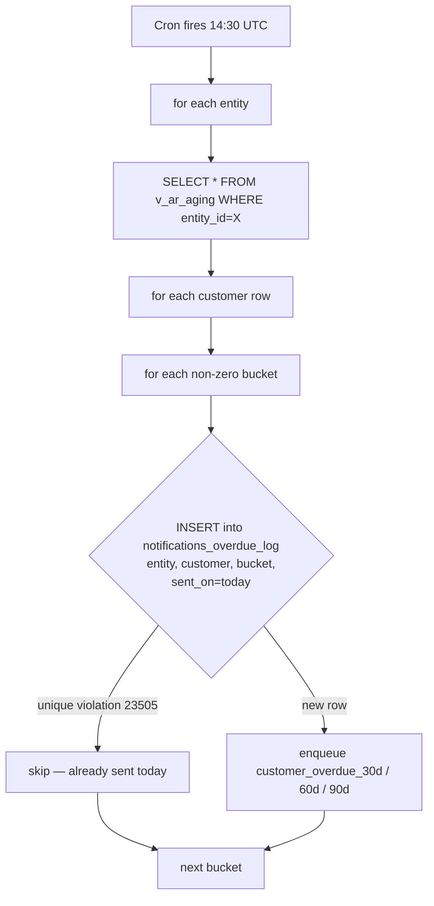

# 16. Accounts Receivable (M4)

The Accounts Receivable module records customer invoices, drives them through GL posting (with FIFO COGS recognition for inventory lines), captures customer payments, and surfaces the receivables ledger + aging report. AR is the AP module flipped to the customer side: where AP debits an expense / inventory asset and credits AP control, AR debits AR control and credits revenue (plus a FIFO COGS pair per inventory line).

Tangerine P4 Chunk 4 (this chapter) ships the AR Invoices admin UI + handlers on top of the P4 Chunk 1 schema (`ar_invoices`, `ar_invoice_lines`, `ar_receipts`, `ar_receipt_applications`). Receipts UI ships in P4-5 — see the placeholder at the bottom of this page.

## Panels

| Panel | URL | Who uses it | Writable? |
|---|---|---|---|
| 🧮 **AR Invoices** | `/tangerine` → AR Invoices | Accountant, ops | Yes — full CRUD on drafts; Post / Void on sent invoices |
| 💰 **AR Receipts** | _coming in P4-5_ | Accountant | Pending |
| 📊 **AR Aging** | _coming in P4-6_ | CEO, accountant | Pending (operator's daily morning view) |

## Lifecycle

```mermaid
flowchart LR
    Draft["🧾 draft<br/>(edit + delete OK)"]
    PendingApproval["⏳ pending_approval<br/>(awaiting M27 approval)"]
    Sent["✅ sent<br/>(accrual JE live, FIFO consumed)"]
    PartialPaid["💵 partial_paid<br/>(receipt applied)"]
    Paid["💰 paid<br/>(fully paid — cash JE live)"]
    Void["🚫 void<br/>(JEs reversed, FIFO restored)"]

    Draft -->|Post button| PendingApproval
    Draft -->|Post (no rule fires)| Sent
    PendingApproval -->|approver clicks Approve in M27 Inbox| Sent
    PendingApproval -->|approver rejects| Draft
    Sent -->|Receipt (partial)| PartialPaid
    Sent -->|Receipt (full)| Paid
    PartialPaid -->|Receipt (remainder)| Paid
    Sent -->|Void| Void
    Draft -->|Void / Del| Void

    style Draft fill:#cbd5e1,color:#0f172a
    style PendingApproval fill:#fed7aa,color:#0f172a
    style Sent fill:#bbf7d0,color:#0f172a
    style PartialPaid fill:#a7f3d0,color:#0f172a
    style Paid fill:#86efac,color:#0f172a
    style Void fill:#fecaca,color:#0f172a
```

There is also a terminal **`posted_historical`** status reserved for the P4-8 5-year backfill — the operator UI cannot write that state directly; the backfill RPC owns it.

## Creating an AR invoice (draft)

From the **AR Invoices** panel, click **+ New invoice**.

| Field | Required? | Notes |
|---|---|---|
| Customer | yes | Sourced from M36 Customer Master (must already exist). UUID paste fallback is offered. |
| Invoice number | optional | Auto-generated as `AR-YYYY-NNNNN` if blank. Must be unique per entity. |
| Kind | yes | `customer_invoice` / `customer_credit_memo` |
| Invoice date | yes | The date the GL JE will land on (must be inside an open period at post time). `posting_date` is kept in lockstep with this field. |
| Payment terms | optional | If set, **Due date** is auto-computed from `payment_terms.net_days`. Manual edit overrides. |
| Due date | optional | Defaults to invoice date if blank. |
| AR account override | optional | Defaults to `entities.default_ar_account_id` (code `1200`). Per-customer override via `customers.default_ar_account_id`. |
| Revenue account (default) | optional | Defaults to `entities.default_revenue_account_id` (code `4000`). Per-line override available. |
| COGS account | optional | Defaults to `entities.default_cogs_account_id` (code `5000`). Required only when an inventory line is present. |
| Inventory asset | optional | Defaults to `entities.default_inventory_account_id` (code `1300`). Required only when an inventory line is present. |
| Description | optional | Free text |
| Lines (≥ 1) | yes | See **Lines + inventory contract** below |

### Lines + inventory contract

Each line must resolve to a positive `line_total_cents`. There are two paths:

1. **Quantity + unit price path** — supply `quantity` and `unit_price_cents` (UI: dollars). The DB trigger `ar_invoice_lines_compute_total_trg` computes `line_total_cents = quantity * unit_price_cents`.
2. **Flat total path** — supply only `line_total_cents` (UI: "Or total $") when no per-unit breakdown applies (e.g. a flat service line). The trigger preserves the explicit value.

**Inventory contract:** if a line carries `inventory_item_id` (uuid into `ip_item_master`), it **must** use the quantity + unit price path. The unit price is the **selling price** (not the cost) — the COGS amount is derived at post time from the FIFO layer consumption (see next section). A line without `inventory_item_id` is treated as a service / non-inventory line and never generates a COGS entry.

The trigger `ar_invoice_lines_maintain_total` rebuilds `ar_invoices.total_amount_cents` after every line insert / update / delete. The UI shows a running total under the lines table.

## Posting — Approval gate + FIFO consume

Click **Post** on a draft row (or on a pending-approval row to re-emit the gate). The handler:

1. Loads the invoice + lines. Resolves the GL account chain:
   - **AR:** `invoice.ar_account_id` → `entity.default_ar_account_id` → COA code `1200`
   - **Revenue:** `invoice.revenue_account_id` → `entity.default_revenue_account_id` → COA code `4000`
   - **COGS** (only when an inventory line exists): `invoice.cogs_account_id` → `entity.default_cogs_account_id` → COA code `5000`
   - **Inventory asset** (only when an inventory line exists): `invoice.inventory_asset_account_id` → `entity.default_inventory_account_id` → COA code `1300`

   If any required leg is unresolvable, the handler returns **400** with a clear error message before any DB writes occur.

2. Calls `approvalsAPI.requestIfRequired({ kind: 'ar_invoice', amount_cents: total, payload: { customer_id, customer_code } })`.
   - If a rule matches (e.g. amount > $10k, or a `customer_credit_extension` rule fires for over-limit customers — see arch §5.1):
     - Sets `gl_status='pending_approval'`.
     - Fires the `ar_invoice_approval_requested` notification to the **admin** role.
     - Returns `202 { requires_approval: true, approval_request_id }`.
     - The accountant + admin see the row in the **Approval Inbox** panel and decide.
   - If no rule matches: continues directly to step 3.

3. Calls `postEvent({ kind: 'ar_invoice_sent' })`. The posting service:
   - Runs `inventory_fifo_consume()` per inventory line — returns the per-line `cogs_cents` from the FIFO layer draw-down.
   - Builds the accrual JE: **DR AR / CR revenue** (per line) **+** per-inventory-line **DR COGS / CR inventory** with the resolved FIFO amounts.
   - Drops any zero-COGS sentinel pair cleanly (a layer might be already-zero-cost on a return-to-stock layer with damaged units).
   - Persists the JE atomically. The accrual JE id is returned.

4. The handler writes each `consume_results[].cogs_cents` back onto `ar_invoice_lines.cogs_cents` (keyed by `target_line_id`) and stamps `cogs_resolved_at`. These columns are NULL until the invoice is sent.

5. Stamps `ar_invoices.accrual_je_id` and flips `gl_status='sent'`.

6. Fires the `ar_invoice_posted` notification to **admin + accountant**.

When the approver clicks **Approve** in the **Approval Inbox**, the M27 `decide` handler re-runs the post path automatically via `fromApprovalHook=true`. The invoice flips from `pending_approval` to `sent` in one round trip.

### Cash basis is deferred to receipt

Unlike AP (where the cash JE fires at the Pay event), AR's cash basis is recognized at **receipt** time — when an `ar_receipt` is applied to this invoice via `ar_receipt_applications`. See `arPaymentReceived.js`. This means at the **sent** state there is exactly one JE (accrual). At the **paid** state there are two: the original accrual and a deferred cash JE. The trigger `ar_invoices_paid_maintainer` (P4-1) flips `gl_status` from `sent → partial_paid → paid` based on the running sum of receipt applications vs. `total_amount_cents`.

## Voiding an invoice

Click **Void** on a sent row (or **Del** on a draft row for hard delete). The void handler:

1. Returns **409** with `{ has_payments: true, paid_amount_cents }` if any receipt has been applied (i.e. `paid_amount_cents > 0`). The operator must void the receipts first via the P4-5 receipts panel.
2. Calls `postEvent({ kind: 'ar_invoice_voided', data: { invoice_id, accrual_je_id, cash_je_id, gl_status, reason } })`. The `arInvoiceVoided` rule emits a `reversals[]` array of JE ids to reverse:
   - **Draft / pending_approval:** empty array (nothing posted yet).
   - **Sent / partial_paid / paid:** `[accrual_je_id]` and, if `cash_je_id` is set, also includes it.
3. The posting service calls `reverseJournalEntry(jeId)` for each — emitting a new JE with negated lines (`reverses_je_id` set) and, for sources tagged `ar_invoices`, calling `inventoryFifoAPI.restoreConsumption()` to undo any layer draw-downs.
4. Flips `ar_invoices.gl_status='void'`.
5. Appends `[void] <reason>` to `ar_invoices.notes` if a reason was supplied.
6. Fires the `ar_invoice_voided` notification to **admin + accountant**.

Voiding is **always** reversible to a clean GL — the audit trail keeps both the original JE and its reversal pair, so the AP/AR aging reports always reconcile.

## Editing rules

| Operation | Allowed when `gl_status` is | Notes |
|---|---|---|
| Edit header / lines | `draft`, `unposted` | The PATCH handler rejects with 405 if posted/sent/paid/void/reversed. |
| Delete | `draft`, `unposted` | Use Void instead once posted. |
| Post | `draft`, `unposted`, `pending_approval` | Re-emits approval if still pending. |
| Void | `sent`, `partial_paid`, `paid` | Blocked while applied receipts exist. |

`gl_status`, `accrual_je_id`, `cash_je_id`, `total_amount_cents`, `paid_amount_cents`, and `entity_id` are **server-controlled** — the PATCH handler rejects any direct write attempts with 400.

## Filter row

The top of the panel has six filters:

- **Status** — single-select on `gl_status`.
- **Customer** — single-select on the customer dropdown.
- **From / To** — `invoice_date` range.
- **Limit** — 50 / 100 / 200 / 500.
- **Include void** — checkbox (default off).
- **Search** — `invoice_number` ilike.

Void invoices render at 50% opacity. The **Balance** column shows `total_amount_cents − paid_amount_cents` colored amber when > 0.

## Supporting documents

The edit modal embeds `<DocumentAttachmentList contextTable="ar_invoices" kinds={["customer_invoice_pdf","approval_correspondence","other"]} />` so accountants can attach the PDF copy of the invoice that goes out to the customer plus any approval correspondence.

## Schema coordination

- All money amounts are stored as **`bigint cents`** — never floats. The UI translates dollars ↔ cents at the form boundary; the handler validates every cents field as a BigInt-safe integer.
- The `(entity_id, invoice_number)` UNIQUE constraint on `ar_invoices` enforces operator typo isolation per company. Two ROF invoices can't share a number; the handler returns **409** on collision.
- `ar_invoice_lines.cogs_cents` and `cogs_resolved_at` are populated server-side at post time — the UI never writes these. They appear on the read API but the PATCH handler rejects them.
- The FIFO consume side-effect ordering is the same asymmetry P3-5 documented: `inventory_fifo_consume()` mutates layers + writes the consumption ledger row BEFORE the JE persists. If JE persist fails, the FIFO ledger leads the GL by one event. Accepted tradeoff — operator reconciles out-of-band via the `consume_results` audit trail surfaced on the post response.

## Receipts (P4-5)

_Placeholder._ The P4-5 chunk ships the **AR Receipts** admin UI: a separate panel for entering customer payments (ACH / wire / check / credit card / cash / paypal / stripe), applying one receipt to one or more invoices via the `ar_receipt_applications` junction, and triggering the `arPaymentReceived` posting rule (DR bank / CR AR per applied invoice for the accrual side; DR bank / CR revenue for the deferred cash side). Receipts also support partial application — under-applied amounts surface in the `v_ar_unapplied_receipts` view for accountant cleanup.

This chapter will be extended in P4-5 with:
- Receipt entry form (header + applications grid)
- One-receipt-many-invoices flow with running unapplied balance
- Void receipt flow (reverses the cash JE; restores the invoice's paid_amount_cents)
- Cash receipts journal view (`v_cash_receipts_journal`)

## Related docs

- [`../P4-ar-architecture.md`](../P4-ar-architecture.md) §3 (schema), §4.1 (`arInvoiceSent` rule), §4.3 (`arInvoiceVoided` rule), §5 (hook contracts), §6 (5-year backfill — P4-8)
- [13-accounts-payable.md](13-accounts-payable.md) — the AP-side analogue this chapter mirrors
- [07-approvals.md](07-approvals.md) — the M27 approval-rule gate `ar_invoice` and `customer_credit_extension` rule kinds
- [08-notifications.md](08-notifications.md) — the `ar_invoice_posted`, `ar_invoice_voided`, and `ar_invoice_approval_requested` notification kinds

---

## Customer Receipts (P4-5)

A **receipt** is the record of a customer payment. One receipt may be applied across one or more invoices via the `ar_receipt_applications` junction table; any unapplied portion shows in `v_ar_unapplied_receipts` (an on-account credit).

### Lifecycle

```mermaid
stateDiagram-v2
    [*] --> Draft : Add Receipt
    Draft --> Posted : Post (emits accrual + cash JEs)
    Draft --> Voided : Void (no JE; flips is_void)
    Posted --> Voided : Void (reverses both JEs)
    Voided --> [*]
```



**Three terminal-or-near-terminal states:**

| State | Triggers | What you can do |
|---|---|---|
| **Draft** | Created via the Add Receipt modal; no JEs emitted yet | Edit header fields, add/remove applications, delete (if no applications), post, void |
| **Posted** | `Post` button creates the accrual JE and the cash JE (sibling-linked) | Header is locked; void (which reverses both JEs); no further header edits |
| **Voided** | `Void` button — also fires when posted receipts are reversed | Terminal; applications stay in the DB as audit history; the `paid_amount_cents` maintainer on invoices ignores `is_void=true` so paid totals automatically back out |

### Add Receipt — the multi-application UX

1. **Pick customer.** As soon as a customer is selected the modal fetches their open AR invoices (`gl_status IN ('sent','partial_paid')` AND balance > 0), sorted by `due_date` ascending (oldest first — standard FIFO collection logic).
2. **Enter receipt header.** Amount, date, payment method (ach / wire / check / credit_card / cash / paypal / stripe / other), bank account, and optional reference (check #, wire confirmation, Stripe charge id).
3. **Check rows to apply.** Each checked row auto-fills the apply amount = invoice's outstanding balance (capped at remaining receipt amount). You can override each amount manually.
4. **Live sums** at the bottom show *Receipt / Applied / Unapplied*. Behavior:
   - **Applied ≤ Receipt** — allowed; if Applied < Receipt the difference is on-account (visible in `v_ar_unapplied_receipts`).
   - **Applied > Receipt** — UI shows in red; submit is rejected client-side AND by the DB over-application guard (`ar_receipt_applications_amount_positive`).
   - **Applied = 0** — allowed; creates a fully-unapplied on-account receipt.
5. **Save** creates the receipt as **Draft**. JEs are NOT emitted until you click **Post** in the detail modal.

### Post → JE emission

Posting a receipt invokes the `arPaymentReceived` posting rule in **multi-application mode** (see `api/_lib/accounting/posting/rules/arPaymentReceived.js`). Each posting emits TWO journal entries:

| JE | Side | Shape |
|---|---|---|
| **Accrual JE** | `basis=ACCRUAL`, `journal_type=ar_receipt` | Header: `DR bank_account` (full receipt total). Then one `CR ar_account` line per application (per-invoice). Clears the customer's AR balance proportionally. |
| **Cash JE** | `basis=CASH`, `journal_type=ar_receipt` | Header: `DR bank_account` (full receipt total). Then one `CR revenue_account` line per application. Recognizes revenue on cash basis (deferred from invoice send). |

The two JEs are **sibling-linked** via the `gl_link_sibling_je` RPC inside `persistRuleOutput` — reports can navigate accrual↔cash from either side. The receipt header is then stamped with both `accrual_je_id` and `cash_je_id`.

> **Per-line revenue routing:** if an applied invoice has a per-invoice `revenue_account_id` (set when the invoice was created/sent), the cash JE will credit that revenue account specifically rather than the entity default. This supports e.g. wholesale-vs-ecom revenue split per customer.

### Trigger-driven invoice updates

Two DB triggers do work for you when applications are inserted, updated, or deleted:

1. **`ar_receipt_apps_maintain_paid`** — recomputes `ar_invoices.paid_amount_cents` = SUM of `amount_applied_cents` across all non-voided receipt applications.
2. **`ar_invoices_status_from_paid`** — when `paid_amount_cents` changes, auto-flips `gl_status`:
   - `paid_amount_cents >= total_amount_cents` → **paid**
   - `0 < paid_amount_cents < total_amount_cents` → **partial_paid**
   - `paid_amount_cents = 0` (after voiding all receipts) → back to **sent**

Posting and voiding receipts therefore drive invoice gl_status changes automatically; you don't manually transition invoices through partial_paid → paid → reopened.

### Void → reversal of BOTH JEs

When you void a posted receipt:

1. `reverseJournalEntry()` is invoked for the accrual JE → emits a new accrual JE with negated lines (`reverses_je_id` set).
2. `reverseJournalEntry()` is invoked for the cash JE → same, on the cash side.
3. The receipt is stamped with `is_void=true` + `voided_at=now()` + `voided_by_user_id` + (optional) `void_reason`.
4. **Applications stay in the DB.** They're audit history. The `is_void=false` filter in the paid-amount maintainer ignores voided receipts, so the parent invoices' `paid_amount_cents` automatically back out and the status-from-paid trigger flips them back from `paid` → `partial_paid` → `sent`.

> Voiding a Draft (un-posted) receipt skips steps 1+2 (no JEs to reverse) but still flips `is_void` and notifies the accounting team.

### Unapply (delete a single application)

`DELETE /api/internal/ar-receipt-applications/:id` removes a single application row. Allowed only when the parent receipt is Draft. Posted or Voided parents return 409 — to undo a posted receipt's application, void the entire receipt and create a new one.

### Documents

The receipt detail modal embeds `<DocumentAttachmentList contextTable="ar_receipts">` with these document kinds:

- `customer_payment_proof` — generic
- `check_image` — scanned check
- `wire_confirmation` — wire transfer PDF
- `other`

Documents persist independently of the receipt lifecycle (still accessible after void).

### Notifications

| Event | Kind | Severity | Recipients |
|---|---|---|---|
| Receipt posted | `ar_receipt_posted` | `info` | `admin`, `accountant` |
| Receipt voided | `ar_receipt_voided` | `warn` | `admin`, `accountant` |

### API surfaces

| Endpoint | Methods | Purpose |
|---|---|---|
| `/api/internal/ar-receipts` | GET, POST | List receipts (filter by customer / method / date range / include_void; paginated via `?offset=N`); create draft with applications |
| `/api/internal/ar-receipts/:id` | GET, PATCH, DELETE | Fetch one with applications + customer name; edit header fields (Draft only); delete (Draft + no applications only) |
| `/api/internal/ar-receipts/:id/post` | POST | Emit accrual + cash JEs; stamp the receipt |
| `/api/internal/ar-receipts/:id/void` | POST | Reverse JEs (if any) + flip is_void |
| `/api/internal/ar-receipt-applications/:id` | DELETE | Unapply a single application (Draft parents only) |

### Schema cheat sheet

```
ar_receipts
  id (uuid, PK)
  entity_id, customer_id
  receipt_date (date)
  amount_cents (bigint > 0)
  bank_account_id (uuid → gl_accounts)
  customer_payment_method (ach|wire|check|credit_card|cash|paypal|stripe|other)
  reference, notes (text)
  accrual_je_id, cash_je_id (uuid → journal_entries)
  is_void (bool), voided_at, voided_by_user_id, void_reason

ar_receipt_applications
  id (uuid, PK)
  ar_receipt_id (uuid → ar_receipts, ON DELETE CASCADE)
  ar_invoice_id (uuid → ar_invoices, ON DELETE RESTRICT)
  amount_applied_cents (bigint > 0)
  UNIQUE (ar_receipt_id, ar_invoice_id)
```

### Reporting views

- **`v_cash_receipts_journal`** — every cash event impacting AR, joined to applications and invoices. Useful for monthly bank-statement reconciliation. Excludes voided receipts.
- **`v_ar_unapplied_receipts`** — receipts with an unapplied balance (on-account credits). Each row exposes `applied_cents` and `unapplied_cents`.

### Operator runbook — common scenarios

| Scenario | Steps |
|---|---|
| Wire payment of $5,000 covering one open $5,000 invoice | Add Receipt → pick customer → enter $5,000 → check the one invoice (auto-fills $5,000) → Save → Post |
| ACH for $10,000 paying off three small invoices ($2k + $3k + $4k = $9k) with $1k overpay | Add Receipt → enter $10,000 → check all three → live unapplied shows $1,000 → Save → Post. The receipt's $1k stays as on-account credit in `v_ar_unapplied_receipts` until applied to a future invoice. |
| Customer's check bounced after posting | Open receipt → enter void reason ("NSF bounce") → Void posted receipt. Both JEs reverse; the parent invoices auto-flip from `paid` back to `sent` via the trigger chain. |
| Misapplied a payment to wrong invoice (still draft) | Open the draft receipt → click × next to the wrong application → re-apply via the apply-more action (or void + recreate). |
| Misapplied a payment to wrong invoice (already posted) | Void the entire posted receipt → create a new one. (Unapply on posted receipts is blocked — audit-trail rule.) |

---

## Aging report + overdue cron (P4-6)

### The Aging panel

Navigate to **Tangerine → Accounting → AR Aging** (📅). The panel shows one row per customer with non-zero open AR, broken into five buckets relative to invoice due dates:

| Bucket | Definition |
|---|---|
| **Current** | due date is in the future (or today) |
| **1-30** | 1-30 days past due (yellow) |
| **31-60** | 31-60 days past due (orange) |
| **61-90** | 61-90 days past due (red) |
| **91-120+** | 91+ days past due (deep red, bolded) |

Each row's "Total Open" matches the sum across all five buckets. The footer row totals each column across the filtered customer set.

### Modes

- **Default mode** (no `as_of` parameter): reads the `v_ar_aging` view which uses `CURRENT_DATE`. Fast — view is computed live by the DB.
- **As-of mode** (pick a date in the past): calls the `ar_aging_as_of(p_entity_id, p_as_of_date)` RPC. Useful for retroactive close-of-period reports. Slightly slower than the view because the RPC re-aggregates.

The mode badge in the header ("mode: current" / "mode: as_of") shows which path is active.

### Daily overdue notification cron

`api/cron/ar-aging-overdue-email.js` runs daily at 14:30 UTC (= 6:30 PT / 09:30 ET) per `vercel.json`. Per entity:



**Dedup table** (`notifications_overdue_log`) prevents same-day re-fires. Schema:

```sql
notifications_overdue_log (
  id           uuid PK,
  entity_id    uuid → entities,
  customer_id  uuid → customers,
  bucket       text  CHECK in (30d, 60d, 90d, 120d_plus),
  sent_on      date  DEFAULT current_date,
  open_cents   bigint,
  UNIQUE (entity_id, customer_id, bucket, sent_on)
)
```

Re-running the cron on the same day is a clean no-op (`duplicates_skipped` increments; no duplicate emails go out).

### Notification kinds

| Kind | Bucket(s) | Severity |
|---|---|---|
| `customer_overdue_30d` | 1-30 | info |
| `customer_overdue_60d` | 31-60 | warn |
| `customer_overdue_90d` | 61-90 AND 91-120+ | warn / alert |

Recipient: `recipient_roles=['admin','accountant']`. To silence a kind for a specific user, use the **Notification Preferences** panel (P2-4).

### Manual trigger

Hit the endpoint with a service-role bearer (or via `vercel dev`):

```
curl -X POST https://<your-host>/api/cron/ar-aging-overdue-email
```

Response shape:

```json
{
  "ok": true,
  "entities_scanned": 1,
  "customers_scanned": 47,
  "notifications_enqueued": 12,
  "duplicates_skipped": 23,
  "errors": []
}
```

