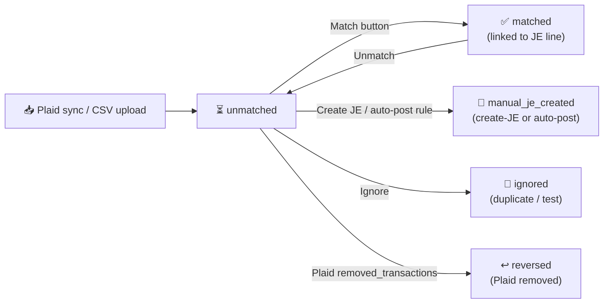

# 17. Bank Reconciliation (M7 + M8)

> **P6 status (2026-05-27 night):** all 7 chunks shipped. Schema + Plaid Link + CSV upload + match engine + admin UI + recon report + auto-post fee rules. PRs #408, #409, #410, #411, #412, #413, #414.

The Bank Reconciliation module ingests bank/CC transactions (via Plaid or CSV), matches them to existing journal-entry lines, lets the accountant post standalone JEs for fees + interest + transfers, and produces a per-period reconciliation report that the period-close pre-flight check now consumes.

## Panel layout

Tangerine top nav → **Bank**:

| Sub-panel | URL hint | Who uses it |
|---|---|---|
| 🏦 **Accounts** | `/tangerine` → Bank → Accounts tab | Accountant — manages bank_accounts + auto-post rules |
| 🔁 **Transactions** | `/tangerine` → Bank → Transactions tab | Accountant — works the unmatched queue |
| 📊 **Recon report** | `/tangerine` → Bank Recon Report | Accountant — runs report per (account, period) before period close |

## Lifecycle of a bank transaction



## Drill-through links (Phase 2, 2026-07-09)

Every transaction row now walks into the books directly:

- **Matched / auto-posted rows** show a **JE <number>** button — opens the linked journal entry
  in the shared entry modal (from there: source document, sibling / reversal links — the Phase 1
  chain).
- **Every row** (with a GL-linked bank account) shows **GL ▸** — opens the bank account's GL
  detail windowed **±7 days around the transaction date**. For **unmatched** rows this is the
  "find the counterpart" view: scan the nearby ledger activity for the amount, then use
  **Match** to link it.

## Plaid linking

1. Sign up at plaid.com → grab `PLAID_CLIENT_ID` + `PLAID_SECRET` + `PLAID_ENV` (`sandbox` first, then `production`).
2. Generate `PLAID_TOKEN_ENC_KEY` with `openssl rand -hex 32` — this AES-256-GCM-encrypts the access token at rest.
3. Add all three to Vercel env (Prod + Preview + Dev).
4. Frontend Plaid Link flow:
   - `POST /api/internal/bank-feeds/link-token` → returns `{ link_token }`
   - Frontend opens Plaid Link with that token; user picks institution + account
   - On success Plaid Link returns a `public_token`
   - `POST /api/internal/bank-feeds/exchange` with `{ public_token, gl_account_id, name, account_kind, mask, institution_name }` → creates the `bank_accounts` row, persists the encrypted access_token + Plaid item_id + Plaid account_id.
5. Sync runs every 4 hours via `cron/bank-feed-sync` + on every Plaid `DEFAULT_UPDATE` / `TRANSACTIONS_REMOVED` webhook (`/api/webhooks/plaid`).

## CSV upload (no Plaid)

For institutions Plaid doesn't cover, set `feed_source='csv_upload'`, configure `csv_column_mapping` (which CSV columns map to date / amount / description), then drop a CSV into the upload box.

## Match engine (P6-4)

`v_bank_match_candidates` is the source of truth: for each unmatched non-pending bank_transaction it lists every `journal_entry_lines` row on the bank's GL account whose `(posting_date, signed_amount)` matches within ±5 days. Confidence is `100 − days_apart × 5` (so 100 = same day, 0 = 20+ days off; matches further than 5 days are excluded by the view).

The four match-engine RPCs:

| RPC | Trigger | What it does |
|---|---|---|
| `bank_match_apply(bank_txn, je_line)` | "Match" button | Marks transaction `matched`, stores `matched_je_line_id` + audit |
| `bank_unmatch(bank_txn)` | "Unmatch" button | Severs the link; JE stays posted |
| `bank_create_je_for_transaction(bank_txn, target_gl, ...)` | "Create JE" button + auto-post | Posts a 2-line cash JE (bank ↔ target). `journal_type` = `bank_interest_je` (deposit) or `bank_fee_je` (withdrawal) |
| `bank_ignore(bank_txn, reason)` | "Ignore" button | Marks `ignored` + audit |

## Auto-post fee rules (P6-7) — NEW

The Accounts tab has an **Edit rules** button per row. The rules JSON lives on `bank_accounts.auto_post_fee_rules` (JSONB array, capped at 50 entries) and runs:

- Daily at **16:00 UTC** via `cron/bank-auto-post-fees`
- On-demand from the modal via **Dry-run** and **Run now**

### Rule shape

| Field | Required? | Notes |
|---|---|---|
| `match` | yes | JS regex, case-insensitive, ≤500 chars. Tested against `description \| merchant_name`. |
| `target_account_id` | yes | GL account to post the counter side to (e.g. `6310` Bank Service Charge, or `4200` Interest Income). |
| `max_amount_cents` | optional | Cap on `|amount|` — rule won't fire on a $500 charge if `max_amount_cents=2000`. Blank = no cap. |
| `direction` | optional | `deposit` / `withdrawal` / `both` (default). Use this to scope a rule to inflows-only or outflows-only. |
| `label` | optional | Free text ≤80 chars. Appears in the JE memo (`Auto-post: <label>`). |

### Order matters

First match wins. Put more specific rules above catch-alls:

```json
[
  { "match": "^WIRE FEE",         "target_account_id": "<6320 wire-fee uuid>",  "direction": "withdrawal", "label": "Wire fee" },
  { "match": "INTEREST CREDIT",   "target_account_id": "<4200 interest uuid>",  "direction": "deposit",    "label": "Bank interest" },
  { "match": "(SERVICE|MAINT) FEE","target_account_id":"<6310 svc-charge uuid>","direction": "withdrawal", "max_amount_cents": 5000, "label": "Bank service fee" }
]
```

### Workflow

1. Open Bank Recon → Accounts tab → click **Edit rules** on the account row.
2. Click **+ Add rule**, fill in the regex + target GL account, optional cap and label.
3. Click **Dry-run on this account** — the modal reports how many unmatched transactions WOULD have been auto-posted. Tune the regex until that count matches your expectation.
4. Click **Save rules** to persist the JSONB array.
5. The 16:00 UTC cron will pick it up tomorrow; or click **Run now** to fire immediately (it asks for confirmation since real JEs get posted).

### What does NOT get auto-posted

- Pending transactions (waiting for `pending=false` from the next Plaid sync).
- Already-handled transactions (`status` ≠ `unmatched`).
- Zero-amount transactions.
- Transactions whose description+merchant_name don't match any rule.
- Transactions where the matched rule has a `max_amount_cents` cap that the |amount| exceeds.

## Reconciliation report (P6-6)

The **Bank Recon Report** panel computes `bank_recon_compute(account, period)` which returns:

- **GL ending balance** (cumulative signed DR/CR through period end)
- **Bank statement balance** (operator enters this once per period)
- **Uncleared deposits / withdrawals** (matched JE lines whose posting date ≤ period_end but no `matched_je_line_id` from the bank side — i.e. JEs posted but bank hasn't shown them yet)
- **Reconciled diff** = `statement − (GL + uncleared)` — must be **0** to flip status to `reconciled`.

A diff of >$0.01 blocks the **Mark Reconciled** button (a 409 is returned by the RPC).

### Period close pre-flight integration

`gl_period_close_preflight(period_id)` now includes a 10th check: `bank_recon_complete`. The check passes when every bank_account that has at least one transaction in the period has a `bank_recon_runs` row with status='reconciled'. The Periods panel **Close period** action blocks if any check fails.

## Sign convention reminder

The math is annoying — here's the rule the entire P6 codebase follows:

| Side | Sign of `amount_cents` |
|---|---|
| **Bank transaction (`bank_transactions.amount_cents`)** | positive = deposit (money in), negative = withdrawal (money out) |
| **Plaid raw `amount`** | positive = withdrawal, negative = deposit. The sync handler **inverts** it. |
| **JE line on the bank GL account** | DEBIT-normal cash GL: `(debit − credit) × 100` = signed cents matching bank convention |

The `v_bank_match_candidates` view does this conversion already, so handlers never have to think about it.

## Troubleshooting

| Symptom | Likely cause | Fix |
|---|---|---|
| Cron returns 401 on local curl | Vercel cron auth header missing | The cron is callable manually via POST without auth — just hit it from the modal. |
| Auto-post posts to the wrong account | First-match-wins ordering | Re-order rules; more specific patterns above catch-alls. |
| Match candidate list is empty | JE not posted in CASH basis, or > 5 days off | Confirm `journal_entries.basis='CASH'` and `posting_date` within ±5 days of `bank_transactions.posted_date`. |
| Reconcile blocked with `|diff| > 1 cent` | Statement balance typo, or unposted JE | Check the recon table's Uncleared columns; missing JE lines surface there. |
| Plaid webhook verification keeps failing | Dispatcher pre-parses body; ES256 verification needs raw bytes | Temporary workaround: set `PLAID_WEBHOOK_SKIP_VERIFY=true` until raw-body parsing is fixed. |

## Code map

- Schema migrations: `supabase/migrations/20260607000000_p6_chunk1_bank_recon_schema.sql`, `20260608000000_p6_chunk4_match_engine.sql`, `20260609000000_p6_chunk6_recon_report.sql`.
- Encryption helpers: `api/_lib/plaid/encryption.js` (AES-256-GCM).
- Plaid REST wrapper: `api/_lib/plaid/client.js`.
- CSV parser: `api/_lib/bank-feeds/csvParser.js`.
- Auto-post rules engine: `api/_lib/bank-feeds/autoPostRules.js`.
- Handlers: `api/_handlers/internal/bank-feeds/*`, `api/_handlers/internal/bank-accounts/*`, `api/_handlers/internal/bank-transactions/*`, `api/_handlers/internal/bank-recon-runs/*`.
- Crons: `api/cron/bank-feed-sync.js`, `api/cron/bank-auto-post-fees.js`.
- UI: `src/tanda/InternalBankReconciliation.tsx`, `src/tanda/InternalBankReconReport.tsx`.
