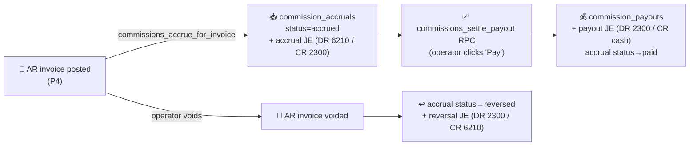
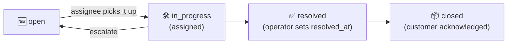

# 19. Revenue Operations (P7 — M16 + M17 + M9-subset + M47)

> **P7 status (2026-05-28):** all chunks shipped. M16 ships as a provider-abstracted interface (no concrete card processor yet — admin selects when ready). M17 commissions + M9-subset reports + M47 cases all live.

P7 closes the gap between "the books balance" (P3–P6) and "the business runs day-to-day." Four modules, all of which surface under existing or new top-nav groups in Tangerine.

---

## 19.1 M16 — Credit Card Capture (interface only; provider TBD)

### What ships in P7
- **Provider-abstracted interface** at `api/_lib/payments/provider.js` — the contract every future card processor (Stripe / Square / Authorize.net / ...) must implement. Includes a `NORMALIZED_EVENTS` set so webhooks dispatch uniformly regardless of provider.
- **Resolver** at `api/_lib/payments/index.js` — `getProvider(name)` + `resolveProviderForCustomer(customer, entity)`. The resolver picks the active provider via per-customer override → entity default → fallback `'stripe'`.
- **Generic schema columns** on `entities`, `customers`, `ar_receipts`:
  - `entities.default_payment_processor` (enum stripe/square/authnet)
  - `customers.payment_processor` + `processor_customer_id` + `processor_payment_method_id` + `processor_card_brand` + `processor_card_last4`
  - `ar_receipts.payment_processor` + `processor_intent_id` + `processor_charge_id` + `processor_fee_cents` + `processor_status`
- **3 new GL accounts** seeded: 1110 Payment Processor Clearing (asset, DR-normal), 6510 Merchant Fees (expense, DR-normal), 6610 Chargeback Expense (expense, DR-normal).

### What does NOT ship in P7
- **No concrete processor implementation.** No Stripe SDK, no Square SDK, no Authorize.net code. No `STRIPE_*` env vars. No charge / refund / webhook handlers.
- This is intentional. Per the operator's locked decision, no card-processor commitment is made until they explicitly pick one. P7-1 ships the interface so when that decision comes, the implementation is ~1 day of work (per arch §3.6 plug-in checklist).

### When admin picks a processor (future)
1. Implement `api/_lib/payments/<name>.js` satisfying the 5 functions: `createCustomer`, `attachPaymentMethod`, `createCharge`, `refundCharge`, `verifyWebhook`.
2. Register `'<name>'` in the PROVIDERS frozen map in `index.js`.
3. Add env vars (`STRIPE_*` / `SQUARE_*` / `AUTHNET_*`).
4. Add the provider's branch in `<CardCaptureForm processor="<name>">` so the frontend SDK loads conditionally.
5. Register `/api/webhooks/payments/<name>` route (1-line append).

Until then, the dropdown in Entity settings is the only `M16` surface visible — and it shows "(no provider configured)".

---

## 19.2 M17 — Sales Reps & Commissions

### Panels (under 💼 Accounting)

| Panel | Purpose |
|---|---|
| **Sales Reps** | Master CRUD: rep display name, email, default commission %, payout terms, optional tier table (bracket overrides), customer assignments |
| **Commission Accruals** | Per-(invoice × rep) snapshot list. Filters by rep / status / period. "Pay" button per row triggers settle |
| **Commission Payouts** | Historical payout grid with drill-to-JE |

### Lifecycle

### Day-to-day workflow

1. **Setup once per rep:** Sales Reps panel → +New → set display name + email + default_commission_pct (e.g. `8.00`) + payout_terms_days (default 30).
2. **Assign customers to the rep:** in the rep's edit modal, add customers. For split commissions, two reps each get a share_pct that sums to 100.
3. **Invoices auto-accrue:** when an AR invoice is posted in the AR Invoices panel, `commissions_accrue_for_invoice` runs automatically — one `commission_accruals` row per (invoice × rep) + a sibling JE.
4. **End of period (month):** open Commission Accruals → filter by rep → review accrued lines → bulk-select → click **Pay** → modal asks for `period_id`, payment method, paid date, bank account → `commissions_settle_payout` posts the payout JE + flips accruals to `paid`.
5. **AR void / credit memo:** auto-triggers `commissions_reverse_for_invoice` → posts the reverse JE + marks the accrual `reversed`. Clean clawback.

### Commission base = net revenue at invoice-post

Per decision D2 — net revenue is `SUM(ar_invoice_lines.line_total_cents) - SUM(ar_invoice_lines.tax_amount_cents)`. Discounts already baked into line totals. Commission = `net × rate_pct`. For split assignments, each rep gets `net × share_pct × rate_pct`.

### Closeout commission rate

Reps usually earn a **lower** rate on **closeout** orders. This is configured per customer, not per rep:

- **Customer Master → Reps tab → Closeout commission %** (`customers.closeout_commission_pct`) sets the closeout rate for that customer's orders.
- **Sales Order header → Closeout order** checkbox (`sales_orders.is_closeout`) flags an order as a closeout.

The **Customer Scorecard** commission is closeout-aware. This-year **net sales** (gross − dilution) are split by each invoice's source-SO `is_closeout` flag: the closeout portion is commissioned at the customer's **Closeout commission %**, the rest at the normal `sales_rep_1% + sales_rep_2%`, with dilution apportioned proportionally. The scorecard reports the closeout sales, the closeout rate, and a **blended effective** commission %. If no closeout rate is set, the normal rate applies to everything — unchanged from before.

### Tier brackets (optional)

A rep with empty tier table uses `default_commission_pct` on every accrual. A rep with brackets uses the rate matching their cumulative period-to-date invoiced total. First invoice that crosses a threshold splits the line across rates.

---

## 19.3 M9-subset — Operational Reports

### New top-nav group: 📊 Reports

| Report | Path | Notes |
|---|---|---|
| **AR Aging** | (existing — P4-6) | Stays under 💼 Accounting; relisted in §19.3.6 cross-reference table below |
| **AP Aging** | `📊 Reports → AP Aging` | NEW (P7-7) — pivoted buckets per vendor |
| **Sales by Rep** | `📊 Reports → Sales by Rep` | NEW (P7-7) — joins commission_accruals when present |
| **Sales by Customer** | `📊 Reports → Sales by Customer` | NEW (P7-7) — gross / credit memos / net |
| **GL Detail** | `📊 Reports → GL Detail` | NEW (P7-7) — drill any TB row to underlying JE lines with running balance |

All 5 reports support:
- WYSIWYG date range filter (from / to).
- ⬇ Export button (T3 cross-cutter — xlsx + csv, autofit columns, correct currency / date typing).
- Click-to-drill into related panels where applicable (GL Detail → JE; Sales by Rep → that rep's accruals).

### GL Detail RPC reference

`gl_detail(account_id, from, to)` is a STABLE function returning ordered journal_entry_lines with running_balance_cents per row. Useful for the accountant's "what made up this number" question.

---

## 19.4 M47 — Customer Service / Cases

### Panel (under 🤝 Customer Service)

Single panel **Cases** with three states visible at once via the status filter (open / in_progress / resolved / closed).

### Case lifecycle

### Creating a case

Three paths:
1. **Manual** — Cases panel → +New → subject, body, severity (low/normal/high/urgent), customer, optional invoice/RMA/SO link.
2. **Auto from chargeback** (future, once M16 has a real processor) — Stripe/Square dispute webhook → opens a case with the dispute payload attached.
3. **Email-in** — operator forwards a customer email to `cases@<your-domain>` → Resend inbound webhook → case created with the email body + `external_email=<from>` + customer lookup via `customer_users.email` match.

### case_number format

`CASE-YYYY-NNNNN` — entity-unique. UI generates next number on +New.

### Thread continuation

Inbound reply with subject `Re: [CASE-2026-00042]` appends a `case_comments` row instead of creating a new case. Subject parse handled by the webhook.

### Internal vs customer-visible comments

`case_comments.is_internal` defaults to `true`. Reserved for a future customer portal — the flag is in place but no portal yet.

---

## 19.5 Cross-cutter wiring shipped with P7-10

- **M27 Approvals**: a new seed inserts an approval template `commission_rate_change` requiring CEO approval when `sales_reps.default_commission_pct` changes by > 2 percentage points. Reuses the existing P3 approval gate pattern.
- **M28 Notifications**: 3 new notification rules seeded (idempotently — `ON CONFLICT DO NOTHING`):
  - `case_assigned_to_user` — fires when `cases.assignee_user_id` is set or changed
  - `case_status_resolved` — fires on transition to `resolved` (lets the original reporter know)
  - `commission_accrued_email` — fires on `commission_accruals` INSERT when the rep has an email; payload includes the commission amount + invoice number

These hook into the existing `notification_events` queue from P2-2 and the email-drain cron from P2-3. No new infrastructure.

---

## 19.6 Tangerine top-nav map after P7

| Group | Panels |
|---|---|
| 📚 Master Data | Style Master · Vendor Master · Customer Master · Payment Terms · Fabric Codes |
| 💼 Accounting | COA · Periods · Journal Entries · AP Invoices · AP Payments · AR Invoices · AR Receipts · AR Aging · AR Backfill · Trial Balance · Income Statement · Balance Sheet · Cash Flow · Year-End Close · Bank Reconciliation · **Sales Reps** · **Commission Accruals** · **Commission Payouts** |
| 📊 Reports | **AP Aging** · **Sales by Rep** · **Sales by Customer** · **GL Detail** |
| 🤝 Customer Service | **Cases** |
| 🏦 Bank | Bank Reconciliation · Bank Recon Report |
| ✅ Approvals | Rules · Inbox |
| 🔔 Notifications | Inbox · Preferences |
| 👥 HR | Employees |
| 📦 Inventory | Transfers · Adjustments · Cycle Counts |
| ⚙️ Operations | Scanner Sessions |

(Bold = new in P7.)

---

## 19.7 What's NOT yet usable

- **Card charges** — no processor selected.
- **Sales-by-Rep report against pre-M17 invoices** — commission_accruals didn't exist before P7-5, so historical sales show zero commission until accrue is backfilled. Out of scope.
- **Case auto-create-from-dispute** — waits on M16 processor implementation.
- **Customer-facing case portal** — reserved (case_comments.is_internal flag exists but no portal).

---

## 19.8 Code map

- Schema: `supabase/migrations/20260610000000_p7_chunk1_payments_schema.sql`, `20260611000000_p7_chunk4_commissions_schema.sql`, `20260612000000_p7_chunk8_cases_schema.sql`, `20260613000000_p7_chunk5_commission_rpcs.sql`, `20260614000000_p7_chunk7_operational_reports.sql`.
- Provider interface: `api/_lib/payments/provider.js` + `index.js`.
- Handlers: `api/_handlers/internal/commissions/*`, `api/_handlers/internal/sales-reps/*`, `api/_handlers/internal/cases/*`, `api/_handlers/internal/ap-aging/`, `api/_handlers/internal/sales-by-rep/`, `api/_handlers/internal/sales-by-customer/`, `api/_handlers/internal/gl-detail/`.
- Webhooks: `api/_handlers/webhooks/resend-inbound.js`.
- UI: `src/tanda/InternalSalesReps.tsx`, `InternalCommissionAccruals.tsx`, `InternalCommissionPayouts.tsx`, `InternalAPAging.tsx`, `InternalSalesByRep.tsx`, `InternalSalesByCustomer.tsx`, `InternalGLDetail.tsx`, `InternalCases.tsx`.
