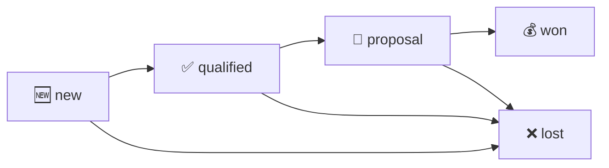

# 20. CRM (P8 — M25)

> **P8 status (2026-05-28):** CRM module COMPLETE. Schema + handlers + 4 UI panels + Resend `contact@` email-in path.

CRM is Tangerine's pipeline + activity log + task tracker for customer relationships. Replaces the "spreadsheet + Outlook" workflow operator used pre-Tangerine.

---

## 20.1 Panels (under 🤝 CRM)

| Panel | Purpose |
|---|---|
| **Opportunities** | Sales pipeline — list view with stage / owner / customer filters; detail modal shows activity timeline + stage-change dropdown + linked tasks |
| **Activities** | Append-only touchpoint log — notes, calls, emails (in/out), meetings, system events |
| **Tasks** | Per-(customer / opp / user) to-dos with status + priority + due date |
| **Pipeline Report** | 5-stage aggregate — count + total + probability-weighted value per stage |

---

## 20.2 Lifecycle — opportunity

Every stage change auto-logs a `stage_change` activity row (audit trail). The activity log is **append-only** — only the `is_hidden` flag can be toggled later; nothing else mutable.

---

## 20.3 Workflows

### Logging an opp

1. **Opportunities → +New** → opportunity_number auto-generates as `OPP-YYYY-NNNNN`.
2. Pick customer, title, expected value, probability %, expected close date, owner.
3. Save → row appears in the list with stage=`new`.

### Advancing through stages

1. Open an opp's detail modal → **Stage** dropdown.
2. Pick the new stage → enter optional reason → confirm.
3. The handler calls `crm_opp_change_stage` RPC:
   - Acquires row-level lock (FOR UPDATE).
   - Validates new stage in enum + not self-transition.
   - Updates stage + stage_changed_at.
   - INSERTs a `stage_change` activity row referencing the opp.
   - All atomic — race-safe.

### Logging an activity manually

1. **Activities → +New** → pick activity_type (note / call / meeting / email_out).
2. Link to a customer and/or opportunity.
3. Save → row immutable from this point forward; only `is_hidden` toggleable.

### Email-in via `contact@<domain>`

1. Customer sends email to `contact@<your-domain>` (P8-4 webhook).
2. Resend forwards to `/api/webhooks/resend-inbound`.
3. Webhook routes by `to` field:
   - `cases@*` → opens / continues a case (P7-9)
   - `contact@*` → inserts a `crm_activities` row with `activity_type='email_in'`
4. Customer is looked up by sender email matching `customers.billing_address->>'email'` (best-effort; `customer_id=null` if no match).
5. Raw email body + headers stored in `payload` jsonb for drill-in.

---

## 20.4 Tasks

### Creating a task

**Tasks → +New** → title (required), description, due_date, priority (low/normal/high/urgent), assignee, optional customer + opp links.

### Working a task

- **Inline status arrows** advance `open → in_progress → done`. The detail modal also has a status dropdown.
- **Mark done shortcut** — single-click `→ done` button. Trigger auto-sets `completed_at + completed_by_user_id` AND inserts a `task_done` activity row.

### Filters

assignee, status, due-before, customer, opportunity. The "due-before" filter is the operator's daily-driver "what's due today?" view.

---

## 20.5 Pipeline Report

Calls `GET /api/internal/crm/pipeline-report`. Returns 5 stage cards + a flow-bar visualization.

Each card shows:
- **Count** — number of opps in that stage
- **Total** — sum of `expected_cents`
- **Weighted** — `Σ (expected_cents × probability_pct / 100)`

The "Weighted" column is the realistic forecast — total exposure adjusted for stage confidence. A $1M opp at 25% probability counts as $250k of weighted pipeline.

---

## 20.6 Cross-cutter wiring (P8-9 seed)

- **M28 Notifications** — 3 triggers seeded by P8-9:
  - Task assigned to a user → notify assignee
  - Opportunity stage change → notify owner (when owner_user_id set)
  - Task due tomorrow → daily cron emits a notification (see §20.7 cron)
- **M27 Approvals** — none in v1. Future option: approval gate on `stage='won'` for opps above an entity-configured threshold.
- **M29 Documents** — activities can have file attachments via the existing `documents` cross-cutter (P2-5). UI integration deferred to v2.

---

## 20.7 Daily cron — `tasks-due-tomorrow`

Runs every morning at 13:00 UTC. Walks all `crm_tasks` where `status IN ('open','in_progress')` AND `due_date = current_date + 1 day`. Emits one `notification_event` per task per assignee. The existing P2-3 email-drain cron handles delivery.

Code: `api/cron/crm-tasks-due-tomorrow.js`.

---

## 20.8 Code map

- Schema: `supabase/migrations/20260616000000_p8_chunk1_crm_schema.sql`
- RPC: `supabase/migrations/20260618000000_p8_chunk2_crm_rpcs.sql` (`crm_opp_change_stage`)
- Handlers: `api/_handlers/internal/crm/*` — opportunities + activities + tasks + pipeline-report (h360-h367)
- Webhook ext: `api/_handlers/webhooks/resend-inbound.js` (contact@ branch)
- Daily cron: `api/cron/crm-tasks-due-tomorrow.js`
- UI: `src/tanda/InternalCrmOpportunities.tsx`, `InternalCrmActivities.tsx`, `InternalCrmTasks.tsx`, `InternalCrmPipelineReport.tsx`

---

## 20.9 Customer Master — contacts, defaults & reps

The **Customer Master** (📚 Master Data → Customer Master) record is organized into tabs. Recent operator-facing changes:

### Row actions in the list

Each customer row carries three inline action buttons — **Scorecard** (blue) · **Edit** (grey) · **Delete** (red), each its own framed button. A soft-deleted row shows only **Scorecard**.

### Details tab

- **Default dropdowns show the name only.** Brand, Channel, Payment terms, GL routing accounts, Price list and Country pickers display the plain name (no leading `CODE —` prefix); typing a code still matches because the code stays in the search text.
- **Credit limit** is a comma-formatted, whole-dollar field (up to 12 digits, e.g. `1,250,000`, no cents).
- The Details tab **no longer carries GL account pickers or the contact-info block** — GL routing lives only on the **GL Accounts** tab, and contacts live on the **AP/Trans/CBs** tab (below).

### AP/Trans/CBs tab

A dedicated contacts tab holds up to **8** contacts. Each row has:

- **Department** — Accounts Payable / Transportation / Chargeback
- **Name**, **Email**, **Phone**

Use **+ Add contact** to add a row (disabled once 8 are present) and remove rows individually.

**Contact notes & reminders** — each contact has a **📝 Notes** panel. Add a timestamped note (your name + date/time are stamped automatically) with an optional **reminder** date/time. When a reminder comes due, an hourly job sends you an in-app **notification**; clicking it deep-links straight back to that customer's **AP/Trans/CBs** tab with the contact expanded and the note highlighted.

### Reps tab

- **Default brand** picker (one per customer; shows brand name only). Every customer was backfilled to the brand they bought the most of historically (customers with no resolvable history default to Ring of Fire); the picker is editable and never overwrites a manual choice.
- **Closeout commission %** — the (usually lower) commission rate sales reps earn on closeout orders. See [Chapter 19 §19.2](19-revenue-operations.md) for how it splits into the scorecard.

---

## 20.10 What's NOT in v1

- **Bulk operations** on opps / tasks (assign 30 in one click).
- **Saved filter sets** ("My open high-priority tasks for ROF customer-prefix").
- **Email open / click tracking** beyond Resend's defaults.
- **Lead scoring** — M46 BI in P24.
- **CRM-side documents UI** — `crm_activities.payload` jsonb stores attachments; no upload UI yet.
- **Drag-to-reorder task priority** — set via the priority dropdown.

All deferred to v2 per arch §0 scope guardrails.
