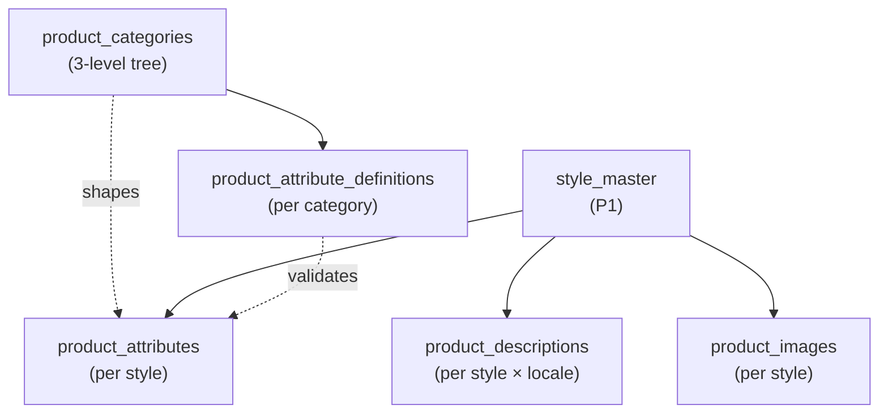

# 21. PIM — Product Information Management (P8 — M42)

> **P8 status (2026-05-28):** PIM module COMPLETE. Schema + handlers + image upload pipeline + UI.

PIM is the centralized product catalog — categories, per-style attributes, marketing descriptions, and a multi-size image library. Replaces "scattered Drive folders + Xoro descriptions" with a single source of truth ready to feed Shopify / Faire / line sheets (future).

---

## 21.1 Panel (under 📚 Master Data)

| Panel | Purpose |
|---|---|
| **Product Catalog** | List view per style with primary thumbnail + publish status + category. Click row → opens 3-tab detail editor for that style |

The detail editor's three tabs:

- **Attributes** — per-category schema; inline edit by type (text / number / enum / boolean / date)
- **Description** — long/short/bullets/SEO per locale; draft → publish lifecycle
- **Images** — drag-drop upload; primary star + sort-order arrows + alt_text + image_kind chip

---

## 21.2 Data model



- **Attribute schema** is per category and mutable (no migration to add a new attribute — operator does it in the UI).
- **Descriptions** are per (style, locale). v1 ships en-US only; the locale column supports future expansion.
- **Images** have a primary flag enforced by an EXCLUDE constraint — only one `is_primary=true` per style.

---

## 21.3 Workflows

### Setting up a category's attribute schema

1. (For now done by the accountant / design ops via direct API — UI for attribute_definitions is a future enhancement.)
2. POST `/api/internal/pim/attribute-defs` with category_id + attribute_key + label + value_type + options (for enum) + is_required.
3. Once defined, every style in that category sees the new attribute on its Attributes tab.

### Editing attributes on a style

1. Product Catalog → click a row → **Attributes** tab.
2. Each attribute renders with the appropriate input:
   - **enum** → dropdown of options
   - **number** → numeric input
   - **text** → text input
   - **boolean** → toggle
   - **date** → date picker
3. Save is per-attribute optimistic — PATCH fires on blur; success/error shown inline.

### Writing + publishing a description

1. Product Catalog → click a row → **Description** tab.
2. Edit short_description, long_description, bullet_1..5, seo_title, seo_description.
3. Save → publish_status stays `draft`. updated_at + updated_by_user_id stamped.
4. Click **Publish** → confirm modal → POST `/description/publish` → publish_status flips to `published`, published_at + published_by_user_id stamped.
5. Drafts can be re-edited freely; publishing replaces the live copy atomically.

### Uploading product images

1. Product Catalog → click a row → **Images** tab.
2. Drag-drop or file picker — `image/jpeg`, `image/png`, `image/webp`. 10 MB pre-Sharp cap; 4096×4096 max dimensions.
3. POST `/styles/:style_id/images` (multipart) → server-side Sharp processes 3 derivatives:
   - **thumb** (200px long side)
   - **web** (800px)
   - **print** (2400px or original if smaller)
4. All 3 land in the `pim-images` Supabase Storage bucket at `<entity_id>/<style_id>/<image_id>-{thumb,web,print}.jpg`.
5. Operator sees a spinner during the ~2-5s Sharp processing.
6. After success: tile appears in the grid with web-size preview.

### Managing the image grid

- **Set as primary** — star icon on tile. The EXCLUDE constraint enforces uniqueness; the previous primary auto-clears.
- **Sort order** — arrows on each tile swap with neighbour.
- **Alt text + image kind** — small modal per tile.
- **Delete** — confirm modal → POST `/images/:id/delete` → row hard-deletes + all 3 storage files removed.

### Re-issuing a signed URL

For a longer-lived shareable link to an image: GET `/styles/:style_id/images/:id/signed-url`. Returns 1-hour-TTL signed URLs for all 3 sizes.

---

## 21.4 Storage layout

```
pim-images/                          (Supabase Storage bucket)
└── <entity_id>/
    └── <style_id>/
        ├── <image_id>-thumb.jpg     (200px long side)
        ├── <image_id>-web.jpg       (800px)
        └── <image_id>-print.jpg     (2400px)
```

The bucket is **not public** — all reads use signed URLs (1-hour TTL by default). Service-role has full access; authenticated users have read-only.

---

## 21.5 Image cost guardrails

- **10 MB pre-Sharp cap** on upload — rejected at handler.
- **4096×4096 max dim** — rejected at handler (don't accept 24 MP fashion shoots; Sharp would OOM the function).
- **All derivatives are JPEG** for consistent Content-Type. The original is NOT stored separately — the print-size derivative IS the operator's high-res copy.
- **Hard-delete on remove** — no soft-delete column in v1. If you need recovery, restore from Supabase Storage's lifecycle backups.

---

## 21.6 Cross-cutter wiring (P8-9 seed)

- **M27 Approvals** — none in v1. Future option: gate `description/publish` on category-specific approval rules.
- **M28 Notifications** — none in v1 (no per-style watchers yet).
- **M29 Documents** — N/A; images live in their own dedicated bucket + table.

---

## 21.7 What's NOT in v1

- **Attribute definitions UI** — operator currently configures them via direct API. UI deferred to v2.
- **Color swatch master** — operator uses style_master's color attribute for now. Centralizing into a swatch_master is M42 v2.
- **Multi-locale descriptions** — schema supports it; UI ships en-US only.
- **Video / 3D asset support** — images only in v1.
- **Bulk image upload** (drag-drop 50 files for the same style) — single-file at a time in v1.
- **PIM workflow / approval chains** — publish is operator-immediate; M27 gate can be added per arch §0.
- **Syndication to ecom** — M12 Shopify (P11) will read PIM. The `idx_pd_published` index is ready.

---

## 21.8 Code map

- Schema: `supabase/migrations/20260617000000_p8_chunk5_pim_schema.sql`
- Non-image handlers: `api/_handlers/internal/pim/categories/*`, `attribute-defs/*`, `styles/[style_id].js` + `attributes.js` + `description/*` (h370-h377)
- Image handlers: `api/_handlers/internal/pim/styles/[style_id]/images/*` (h380-h383)
- Sharp pipeline: `api/_lib/pim-images.js`
- UI: `src/tanda/InternalPimProductCatalog.tsx`, `InternalPimStyleDetail.tsx`
- Storage bucket: `pim-images` (created by operator 2026-05-28)
