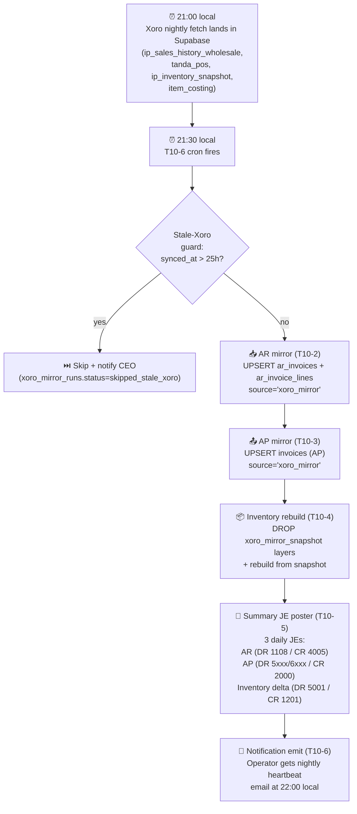

# 22. Shadow Mirror (Cross-cutter T10 — Xoro ⇄ Tangerine)

> **T10 status (2026-05-28):** all 8 chunks shipped. Shadow Mirror is the bridge that makes the P1-P8 modules usable today without waiting on the EDI / 3PL / Shopify pipeline (P11/P12/P22). Tangerine runs as a **shadow ledger** on top of the existing nightly Xoro fetch — operator's day-to-day Xoro work doesn't change.

T10 closes the "where do real numbers come from before integrations land?" gap. Reports / CRM / Cases all populate from real mirrored data on day one; operator never dual-enters anything.

---

## 22.1 What it is

Shadow Mirror is a nightly cron that reads the existing Xoro fetch (already landing in Supabase at 21:00 local) and mirrors AR invoices, AP bills, and inventory layers into Tangerine's sub-ledgers — then posts a daily summary journal entry per domain so trial balance / income statement / balance sheet reflect real numbers. Xoro stays the system-of-record; Tangerine reads, never writes back. Everything mirrored is tagged `source='xoro_mirror'` so operator-typed `source='manual'` rows are never touched.

---

## 22.2 What it does NOT do

- **Does NOT write back to Xoro.** Xoro is read-only into Tangerine. There is no reverse flow in v1.
- **Does NOT auto-create from Shopify / FBA / Walmart / EDI.** Those channels land in P11 (Shopify), P12 (FBA / Walmart / Faire settlement), and P22 (EDI 3PL). T10 mirrors only what the existing Xoro fetch produces.
- **Does NOT auto-accrue commissions on mirrored AR.** Deferred to a monthly operator action so that 24+ months of historical Xoro AR don't cascade into the M17 commission_accruals table at first run. Operator posts a monthly summary commission accrual manually.
- **Does NOT detect retroactive Xoro edits.** If Xoro changes a 90-day-old invoice, the mirror does not currently reconcile that backwards. Planned for T10 v2 if it bites.
- **Does NOT emit per-invoice JEs.** Daily summary only (one JE per domain per day).

---

## 22.3 The `source` tagging principle

Every sub-ledger row that can have multiple producers carries a `source` field. Producers and their meaning:

| `source` value | Producer |
|---|---|
| `manual` | Operator typed it in the UI |
| `xoro_mirror` | T10 cron created it from the Xoro feed |
| `shopify` | P11 future — Shopify webhook |
| `fba` | P12 future — Amazon FBA settlement |
| `walmart` | P12 future — Walmart settlement |
| `faire` | P12 future — Faire settlement |
| `edi_3pl` | P22 future — EDI inbound (856 / 945 / 810) |
| `plaid_sync` | P6 — Plaid bank txn sync |
| `api` | External API call to Tangerine |
| `system` | Internal trigger / RPC |

**Three rules the mirror obeys without exception:**

1. The cron only touches rows where `source = 'xoro_mirror'`. `source = 'manual'` rows are off-limits — never overwritten, never deleted, never re-keyed.
2. Every list view in Tangerine renders `source` as a small colored badge so operator sees at a glance how each row got there.
3. Operator can filter any list view by source (e.g. "show me my manually-typed AR invoices only" or "show me only what got auto-mirrored last night").

**Conflict resolution:** if Xoro and operator both touch the same logical entity (same invoice number, same vendor, same date), the `manual` row wins. Mirror logs the collision to the unmatched inbox; operator can force a re-mirror with an explicit "overwrite manual" confirm from the Status panel.

---

## 22.4 Daily flow

**Stale-Xoro guard:** if the most recent `ip_sales_history_wholesale.synced_at` is more than 25h old, the mirror skips that night's run, logs `status='skipped_stale_xoro'` on `xoro_mirror_runs`, and pages the CEO via the existing M28 notification queue. Better to skip a night than to mirror stale data and post bogus JEs.

---

## 22.5 Status panel walkthrough — `🔁 Shadow Mirror`

A new top-nav group in Tangerine hosts the panel.

### Four status cards (top row)

| Card | Shows |
|---|---|
| **Last AR mirror** | timestamp · row count · status badge (✅ complete / ⏭️ skipped / ❌ failed) |
| **Last AP mirror** | same |
| **Last Inventory rebuild** | timestamp · layer count delta · status badge |
| **Last Summary JE** | timestamp · 3 JE references (AR / AP / Inv) · status badge |

### 30-day history grid

One row per (run_date × domain) sourced from `xoro_mirror_runs`. Color-coded:

- 🟢 **complete** — mirror ran, all rows applied, summary JE posted
- 🟡 **skipped** — stale-Xoro guard fired (operator action: investigate Xoro fetch)
- 🔴 **failed** — exception during mirror (operator action: read the error column + manual re-run)
- ⚪ **no-run** — cron didn't fire (rare; suggests Vercel cron config drift)

Click any row → drawer with full row-level detail (inputs, outputs, error stack if any, link to the posted JEs).

### Manual re-run button

Top-right of the panel. Operator picks a date + domains (AR / AP / Inv / Summary JE — multi-select) → confirms → cron worker runs out-of-band. Idempotent: re-running for a date that already has mirrored rows just upserts in place.

**Single date or a whole range.** The re-run modal has a **Single date / Date range** toggle:

- **Single date** — re-mirrors one business date (as above).
- **Date range** — pick **From** and **To** and it mirrors **every date in the range in one shot** (`POST /api/internal/xoro-mirror/backfill-range`). Each date runs the full pipeline (AR + AP + inventory mirror, then that date's summary JEs), and every entry posts with **its own date, into its own period** — so a backfill reconciles day-by-day, not lumped into today. The stale-fetch guard is bypassed (a backfill intentionally works off already-loaded data), and one aggregate result is returned (days processed, AR/AP/inv row counts, JE count, any errors).

  Re-running a range is safe: already-posted summary JEs are skipped and mirror rows upsert in place. **Any length works** — each server call is capped at **45 days** (to stay under the function time limit), and the panel **auto-splits a longer range into consecutive chunks** and runs them one after another, showing live progress (`chunk 2/8…`). You pick the span; it handles the chunking.

  **Run in background (close the tab).** In range mode, tick **Run in background** and the range is queued as a **server-side job** instead of running in your browser — you can close the tab. A worker (`/api/cron/xoro-mirror-backfill-worker`, every ~2 min) drains the job a chunk at a time, advancing a `cursor_date` after each committed chunk so a crash resumes cleanly. Progress shows live under **Background backfills** on the panel (a bar with days-done / total, JE count, and per-domain row counts). This is the right choice for long backfills; the foreground "Run range" is fine for short ones you want to watch finish. Both are idempotent and touch only `source='xoro_mirror'` rows.

### Unmatched inboxes

Two side panels:

- **Unmatched customers** — Xoro customer-keys the mirror couldn't resolve to a Tangerine `customers` row. Operator clicks a row → "Create customer" or "Map to existing customer" → mirror re-runs for that row.
- **Unmatched vendors** — same idea against `vendors`.

These inboxes are the operator's main day-to-day touchpoint with the mirror. As Tangerine masters catch up to the Xoro feed, the inboxes drain.

---

## 22.6 Reports impact

Once the mirror has run successfully, every report that reads from the affected sub-ledgers populates with **real** numbers:

| Report | Reads from | Populates because |
|---|---|---|
| Trial Balance | journal_entry_lines | Summary JEs post nightly |
| Income Statement | journal_entry_lines | Summary JEs post nightly |
| Balance Sheet | journal_entry_lines | Summary JEs post nightly |
| AR Aging | ar_invoices + ar_receipts | Mirror writes ar_invoices |
| AP Aging | invoices (AP) | Mirror writes AP invoices |
| Sales by Customer | ar_invoice_lines | Mirror writes line splits |
| Sales by Rep | ar_invoice_lines × commission_accruals | Lines populate; accruals stay zero until manual monthly post (intentional) |
| GL Detail | journal_entry_lines | Summary JEs post nightly; drill shows the daily roll-up rather than per-invoice |

**Why commission accrual on mirrored AR is intentionally NOT auto-fired:** the M17 commissions_accrue_for_invoice trigger would fire once per mirrored row, which on initial mirror means 24+ months of historical accruals appearing in one nightly burst. Operator instead posts a single monthly summary commission accrual JE manually (see chapter 19 §19.2 for the manual workflow). If the operator wants per-invoice accruals going forward, the rule can be flipped via a single config toggle on `entities.shadow_mirror_commission_mode`.

---

## 22.7 Manual override workflow

The mirror is designed so the operator can always reach in and override.

| Operator action | Where | What happens |
|---|---|---|
| **Re-run mirror for any date** | Status panel → "Manual re-run" | Operator picks date + domains; cron runs out-of-band; idempotent |
| **Filter any list view by `source`** | Source-filter dropdown on every list page | E.g. "Manual only" / "xoro_mirror only" / "All" — applies a `WHERE source = ?` to the underlying query |
| **Type manual AR / AP entries** | AR Invoices / AP Invoices panels (existing P3 / P4 panels) | New row written with `source='manual'`; mirror never touches it again, ever |
| **Map an unmatched Xoro customer/vendor** | Unmatched inbox | Operator clicks a row → "Create" or "Map" → mirror re-runs the affected period |
| **Force overwrite a manual row from Xoro** | Status panel → row detail drawer → "Overwrite manual with Xoro" button | Explicit confirm; flips `source` to `xoro_mirror`; future mirror runs are then free to update it |

The manual entries always live alongside mirrored entries forever. There's no merge / squash / unify step — both producers stay distinguishable for audit.

---

## 22.8 What to expect in week 1

- **First run will mirror the most recent Xoro feed** (the snapshot landed at 21:00 the night the cron is turned on). Backfill of earlier history is a separate explicit operator action — open the Status panel → "Backfill" → pick a start date.
- **Unmatched-customer / unmatched-vendor backlog will be substantial.** Every Xoro customer that doesn't yet exist in Tangerine's `customers` table lands in the unmatched inbox. Plan to spend the first week walking through it. Most can be resolved with the "Map to existing" action; a few will need new Tangerine customer rows.
- **Summary JEs start populating Trial Balance immediately.** Even before unmatched inboxes are drained, the JEs post against the catch-all "Uncategorized" customer / vendor for unmatched rows. As operator drains the inbox, future runs re-attribute correctly.
- **CRM / Cases pick up real customers immediately.** Anything in the Tangerine `customers` table that the mirror has touched gets back-populated with last-invoice / last-payment dates. Cases can be opened against real customers from day one.
- **Expect at least one stale-Xoro skip in the first week.** If the Xoro fetch fails or runs late, the guard catches it; the heartbeat email tells operator what happened. No corruption risk.

---

## 22.9 Code map

| Layer | File / chunk |
|---|---|
| Architecture | `docs/tangerine/T10-shadow-mirror-architecture.md` |
| T10-1 — Source-tagging columns + `xoro_mirror_runs` table | `supabase/migrations/20260620000000_t10_chunk1_source_tagging.sql` (PR #447) |
| T10-2 — AR mirror function + handler | `api/_lib/shadow-mirror/ar.js`, `api/_handlers/internal/shadow-mirror/run-ar.js` (PR #449) |
| T10-3 — AP mirror function + handler | `api/_lib/shadow-mirror/ap.js`, `api/_handlers/internal/shadow-mirror/run-ap.js` (PR #451) |
| T10-4 — Inventory rebuild | `api/_lib/shadow-mirror/inventory.js`, `api/_handlers/internal/shadow-mirror/run-inventory.js` (PR #452) |
| T10-5 — Daily summary JE poster | `api/_lib/shadow-mirror/summary-je.js`, `api/_handlers/internal/shadow-mirror/post-summary-je.js` (PR #453) |
| T10-6 — Orchestrator cron + stale-Xoro guard + notifications | `api/cron/shadow-mirror-nightly.js` (PR #454) |
| T10-7 — Status panel + unmatched inboxes UI | `src/tanda/InternalShadowMirrorStatus.tsx`, `InternalUnmatchedCustomers.tsx`, `InternalUnmatchedVendors.tsx` (PR pending) |
| T10-8 — User guide ch22 + memory rules | this chapter + memory updates (PR pending) |

---

## 22.10 What's NOT in v1

- **Commission accrual on mirrored AR** — intentionally manual; flip the entity toggle to opt in.
- **AR receipts mirror** — v1 mirrors invoices only. Receipts (cash applications) need to be entered manually OR via the M16 card-capture flow once a processor is selected (see chapter 19 §19.1). Planned for T10 v2.
- **Retroactive Xoro edit detection** — if Xoro changes a 90-day-old invoice, the mirror does not reconcile. Manual re-run for that date is the workaround.
- **Per-invoice JE granularity** — v1 posts daily summary JEs only. v2 may add a per-invoice toggle for entities that need it for audit.
- **Mirror correctness verification against Xoro** — that's what P9 (Parallel-Run) is for. T10 produces the mirror; P9 reconciles it.

---

## 22.11 Cross-cutter wiring shipped with T10-6 + T10-8

- **M28 Notifications**: 3 new notification rules seeded (idempotently — `ON CONFLICT DO NOTHING`):
  - `shadow_mirror_run_complete` — fires nightly when all 4 domains complete; payload includes row counts per domain
  - `shadow_mirror_skipped_stale_xoro` — fires when the stale-Xoro guard trips; pages CEO
  - `shadow_mirror_failed` — fires on any exception during the run
- **No new approval rules** — the mirror is not gated by M27; manual overrides ARE auditable via the `xoro_mirror_runs` table.

---

## 22.12 Sync Health — the "screams when anything stops" layer (2026-07-07)

The bridge's historical failure mode was **silence**: the 2026-07-07 audit found `tanda_sos` stale 19 days (the pull endpoint had outgrown Vercel's 300s ceiling and 504'd) and the accounting mirror skipped **37 of 40 nights** — because `xoro_sync_logs`, the table the stale-guard reads, was **never written by anything**. Three fixes:

1. **The stale-guard contract is now honored.** `POST /api/tanda/sync-from-xoro` (the nightly PO sync, near the end of the 21:00 chain) writes a `xoro_sync_logs` row (`sync_type='nightly_po_sync'`, status `complete`) on success — the 01:30 mirror's freshness guard finally has its signal. Missed dates backfill via the range re-run.
2. **SOs are now PUSHED, not pulled.** The 21:00 fetch (`rest_sales_orders_sync.py`) already walks Xoro SOs with no time limit; it now posts the RAW records in gzip chunks to **`POST /api/tanda/upload-sos`** (server does zero Xoro I/O — flatten + upsert `tanda_sos` only; the last chunk logs `nightly_so_upload`). The old pull endpoint remains for manual small-scope one-offs.
3. **`v_xoro_feed_health` + alerts + panel + CLI.** One view, one row per feed (`pos_mirror`, `sos_mirror`, `onhand_snapshot`, `item_costing`, `open_sos_planning`, `open_pos_planning`, `fetch_log`, `accounting_mirror`) with last-sync, threshold, and `ok/stale/never`. Read by:
   - the **daily alert cron** (`/api/cron/xoro-feed-health-alert`, 13:00 UTC ≈ 09:00 ET) — ONE notification listing every non-ok feed, severity error, roles admin+accounting, channels **bell + email**; silent when all ok;
   - the **Sync Health panel** — Tangerine → Admin → **Sync Health** (`?m=sync_health`), red/green per feed + xlsx export;
   - the **CLI** — `npm run sync-health` (add `--bad` to exit non-zero when anything is stale, for scripting).

### 22.12.1 Weekends off — Mon–Fri schedules + weekend-aware staleness (2026-07-20)

There are no weekend transactions to move the feeds, so every night Sat/Sun the numbers sit unchanged — and the daily monitor still fired a "drift"/stale email each weekend morning about data that simply hadn't changed. Two coordinated changes stop the noise **without** blinding the monitor on weekdays:

1. **The REST/Xoro crons now run Mon–Fri only.** In `vercel.json` the day-of-week field is `1-5` for `xoro-feed-health-alert`, `inventory-onhand-check`, `xoro-mirror-nightly`, `ar-payload-ingest`, `xoro-ap-sync`, `ar-receipts-reconcile`, and `inventory-cost-backfill`; and the Windows **`RofXoroDailyFetch`** task (the 21:00 local fetch) is set to weekly Mon–Fri. (The `ap-paid-delta-watcher` and the high-frequency backfill/notify workers still run daily.)
2. **`v_xoro_feed_health` staleness is now weekend-aware** (migration `20262700000000`). Instead of raw hours-since, it computes **`business_hours_since` = raw hours − 24h for each Saturday/Sunday spanned** and applies the same **30h** threshold to that. So a normal Friday-night → Monday-morning gap collapses to a few business-hours (**ok**), while a genuine weekday miss (e.g. a feed dead Tuesday, seen Wednesday) still exceeds 30h and **alerts**. Weekday sensitivity is unchanged; the panel/CLI now also show `business_hours_since` alongside the raw age.

Net effect: no weekend emails, Monday mornings read green when everything is merely quiet, and a real break on any business day still screams the same as before.

### 22.12.2 On-hand accuracy alert is stale-baseline-aware (2026-07-21)

The **Inventory On-Hand Accuracy** monitor (`/api/cron/inventory-onhand-check`, 07:30 UTC) measures the live on-hand (`inventory_layers`) against the **REST by-size truth** (`tangerine_size_onhand`) and emails a breadcrumb when the $-exposure crosses $50k or any phantom/negative SKU appears. That REST truth is only refreshed by the **by-size ingest, which is paused until the Xoro cutover** — so its snapshot freezes on whatever day it last ran while the live layers keep moving with each business day's real receipts and sales. The gap therefore **grows mechanically every weekday** (e.g. it climbed from $298k to $471k over one Monday's trading against a 07-15 photo) and the monitor fired a "drift" email each morning about a divergence that is a measurement artifact, not lost stock — the alert's own text already said *"root cause needs the Xoro cutover; this is a measurement, not a fix."*

**The gate is now baseline-aware.** When the REST snapshot is older than **`INV_ONHAND_BASELINE_STALE_DAYS`** (default **2** days) the recurring $-exposure / phantom email is **suppressed** — because comparing live layers to a frozen photo isn't actionable. Two things are deliberately preserved:

- **Negative on-hand still alerts.** A negative quantity is a real data bug independent of REST freshness, so it always breaks through.
- **The daily trend row is still written.** The suppression only skips the email; `inventory_onhand_accuracy_snapshot` is still appended, so the **Inventory Accuracy** panel (Tangerine → Inventory → Inventory Accuracy) keeps charting the divergence for anyone who looks.

Staleness is computed from the summary's server-side `generated_at` minus `rest_snapshot_date`, so it never depends on the box's local clock. Once the real Xoro cutover lands and the by-size feed refreshes to the current day, the snapshot reads fresh again and full alerting resumes automatically — no config change needed. (Pure handler logic; no migration.)

### 22.12.3 The spine now owns the by-size snapshot — refreshed nightly (2026-07-21)

The stale-baseline suppression in §22.12.2 was a safety net for a real problem: **nothing was writing `tangerine_size_onhand` on a schedule.** The legacy `ingest-size-onhand.mjs --batch` step in the nightly is a headless no-op (it processes 0 styles), so the REST by-size photo froze on 2026-07-15 while the live layers moved every business day. That gap is now closed at the source.

**`scripts/sync-onhand-spine.mjs` — the spine that already trues `inventory_layers` to the fresh Xoro-REST feed every night (Mon–Fri, gated on `BY_SIZE_ONHAND_SYNC=apply`) — now also writes the by-size snapshot in the same `--apply` run.** After it finishes truing layers it:

1. **Upserts one row per (item, warehouse) it resolved from today's REST CSV** into `tangerine_size_onhand` (`source='xoro_rest'`, `snapshot_date` = the `postAD_invrest_YYYYMMDD` date, `warehouse_code` = the raw Xoro StoreName — `ROF Main`, `ROF - ECOM`, `Psycho Tuna`, `Psycho Tuna Ecom`), qty aggregated per cell. Items resolve exactly as the layer sync does — UPC spine (`upc_item_master`) plus the private-label ItemNumber path — so the snapshot and the layers are the same universe.
2. **Prunes superseded older rows** so the "latest snapshot_date per (item, warehouse)" reads that every consumer uses never see a stale photo. A pre-`snapshot_date` row is deleted when **(a)** the same (item, warehouse) got a fresh row today (day-over-day supersession), **or (b)** its item is spine-mapped (in the UPC-spine or private-label set) but **absent from today's feed** — its truth became 0, the same "confirmed sold-through" semantics as `retire-soldthrough.mjs`. This is what clears the **retired/duplicate SKUs** that otherwise linger forever and inflate the accuracy monitor. **Non-spine items absent from the feed are kept** (a coverage gap must not delete last-known data), and the sold-through prune is skipped entirely if the feed resolves 0 rows (a broken CSV can never mass-delete).

Guardrails: `--apply` is required to write (a plain run prints the upsert/prune **counts** and touches nothing); every count (upserted, pruned-superseded, pruned-sold-through) is logged to stdout so `run_daily`'s tee captures it. The old `ingest-size-onhand.mjs --batch` block was removed from `rof_xoro_project/scripts/run_daily.ps1` so there is exactly **one** writer.

**Net effect on §22.12.2:** the accuracy monitor's baseline now goes fresh every business day, so the stale-baseline suppression becomes a **dormant safety net** — full $-exposure and phantom alerting is active again, and the suppression only ever kicks in if the spine itself stops running (a real break worth its own investigation).

### 22.12.4 On-hand layers carry real cost — tiered resolution (2026-07-21)

When the spine **creates** a new on-hand layer it stamps a `unit_cost_cents` — the cost future FIFO sales will book as COGS. It used to read that from `ip_item_avg_cost` (the mirror of Xoro's average cost) by **exact `sku_code` only**, which silently returned **$0** for entire inseam programs: Xoro keys denim costing by the **inseam-embedded** BasePartNumber (`RYB059430-…`) while our per-size SKUs are coded `RYB0594-COLOR-SIZE`, so the codes never matched. A one-time audit found **~158,000 units sitting at $0** that all had real Xoro costs (e.g. RYB0594 at ~$6.57, DMB0013 at ~$5.80) — those layers were backfilled, and this change stops the nightly from re-accreting the gap.

The shared resolver `api/_lib/layerCost.js` (`makeCostResolver`) now walks four tiers, taking the first hit: **(1)** exact `sku_code`; **(2)** color-level code (the `sku_code` minus its trailing size token); **(3)** **inseam-stem average** — the mean avg-cost over every costing row keyed `<style_code><inseam>-…` (this is the tier that recovers the inseam programs), scoped to the SKU's own inseam so a 30" and a 32" never borrow each other's cost; **(4)** style-prefix average over any `<style_code>…` costing row. It only lands $0 when Xoro's costing truly has nothing for the style. (Zero-value costing rows never satisfy a tier.) Same logic the accountant-reviewed backfill used, so nightly writes and the corrected history agree.

---

## 22.13 App-wide error tracking + security hardening (2026-07-07)

Companion to §22.12 — the same audit's remaining P0s. **Error tracking** (`app_errors` table, service-role-only): the API dispatcher's catch-all now persists every unhandled handler error (`source='api'`); every internal sub-app's browser reports uncaught errors / unhandled promise rejections via `src/utils/errorReporter.ts` → `POST /api/internal/client-errors` (`source='client'`; per-session cap, dedupe, batched); crons can opt in via `captureError` (`source='cron'`). Errors are **fingerprinted** (uuids/numbers normalized) so repeats group. The daily **`app-errors-digest`** cron (13:05 UTC ≈ 09:05 ET) sends ONE bell+email to admins with the top groups — silent on a clean day — and prunes rows older than 30 days. **Security hardening:** `/api/internal/**` now **fails closed in production** if `INTERNAL_API_TOKEN` ever goes missing from the env (503, instead of silently opening every internal route — the token is set today; this guards regressions), and the vendor-PII encryption (`VENDOR_DATA_ENCRYPTION_KEY`) **rejects weak/malformed keys** instead of silently deriving a low-entropy one (the prod key was verified as a proper 32-byte key, so this is a guard, not a behavior change — never change the key itself; existing rows are encrypted under it).

---

## 22.14 SO status stays current — terminal-status mirror walk (2026-07-14)

**Symptom:** `ROF-S031893` (Burlington Coat Factory) shipped + closed in Xoro on 07/06 but still showed **Confirmed** in Tangerine's Sales Orders list. It was not alone — ~1,247 sales orders were stuck at Confirmed after they had actually shipped/closed.

**Root cause:** the SO mirror chain is `Xoro → rest_sales_orders_sync.py → /api/tanda/upload-sos → tanda_sos → import-xoro-orders.mjs --sos-native → sales_orders`. The nightly walk only fetched the **active** statuses (`Released`, `Partially Shipped`) — deliberately, because terminals aren't *supply*. But once an order ships, Xoro flips it `Released → Shipped/Closed` and it **drops out of the active walk**. Nothing ever fetched the terminal buckets, so the mirror's last-seen `Released` row was never overwritten, and the native import kept mapping it to `confirmed` forever. Correct when the mirror only fed ATS supply; wrong once it also drove SO **status**.

**Fix:** `rest_sales_orders_sync.py` now also runs a **terminal-status mirror walk** (`Shipped`, `Invoiced`, `Closed`, `Cancelled`) whose records feed **only** the `tanda_sos` push — never the ATS supply CSV. It is:
- **tail-first + date-windowed** — a recently-terminal order has a recent ship/cancel date, so a bounded recent-tail walk catches the flips without re-pulling years of closed history (`--terminal-lookback-days`, default 120; `--terminal-max-pages`, default 150 per bucket);
- **on by default** in the nightly (disable with `--no-mirror-terminal`);
- **separable** — `--skip-ats-upload` refreshes the mirror without touching supply (used for the one-time backlog catch-up).

Once the mirror carries the true status, `import-xoro-orders.mjs --sos-native` maps it through `mapSoStatus` (`Shipped→shipped`, `Closed→closed`, `Cancelled→cancelled`, `Invoiced→invoiced`) and the SO list reflects reality. **Xoro remains system-of-record; the mirror still never writes back.** (One-time 2026-07-14 backlog catch-up moved ~1,190 orders out of Confirmed and imported 4,790 terminal SOs not previously mirrored.)

---

## 22.15 "Mirror failed" that wasn't — two false-failure bugs (2026-07-15)

The **Shadow Mirror Status** panel showed a red `Error: No route for /api/internal/xoro-mirror-runs` with every domain reading *"No successful run yet,"* and the **Today** page greeted with *"mirror failed"* — while the accounting mirror was in fact **healthy** (all four domains — AR, AP, Inventory, Summary JE — ran and marked `complete` at the 01:30 UTC nightly). Two independent display bugs, neither a real mirror failure:

1. **Missing read route.** The status panel fetches `GET /api/internal/xoro-mirror-runs`, but that endpoint was referenced by the T10-7 panel and **never actually shipped** — no handler, no route. The dispatcher returned 404, so the panel couldn't load any runs. Fixed by adding the handler (returns recent `xoro_mirror_runs` rows) and its route.
2. **Wrong status string on Today.** The Today accounting card checked the run status against `"success"`, but the mirror writes `complete` (its statuses are `complete` / `running` / `failed` / `skipped_no_change` / `skipped_stale_xoro` — never `success`). So every *successful* run was mislabeled an error and surfaced as "mirror failed." Fixed to read the real statuses.

Both are pure display fixes — no change to the mirror pipeline, which was working the whole time. If you ever see a mirror "failed," check the **run's actual `status`** (Shadow Mirror panel row detail) before assuming the pipeline broke; a green nightly can still be mis-shown by a reader bug.

---

## 22.16 AR invoice size matrices — "all qty lumped into one size" / non-matrix lines (2026-07-15)

**Symptom:** opening a mirrored AR invoice, the color × size matrix showed **all** of a style/color's units piled into **one** size column (e.g. everything under waist 28), or the line dropped to the **"other lines"** (non-matrix) list instead of forming a grid.

**Root cause (grain mismatch, not a mirror failure):** the AR mirror (`api/_lib/xoro-mirror/ar.js`) resolves each AR line's item straight from `ip_sales_history_wholesale.sku_id`. That table is the **planning** sales feed, kept at **style + color grain** — the Excel sales upload deliberately strips the size suffix and sums every size of a style/color into one row. So the AR line inherits a style+color item, and the matrix has no real per-size split. Two flavors:
- **Lumped into one size** — the style+color master row happened to carry a *stray* single size (the item-master Excel upload wrote the rolled-up row with the first variant's size, e.g. `RYB086930-BLACK` → size 28), so the matrix dumps every unit into that one cell.
- **Non-matrix** — the style+color row has no size at all, so the expander can't grid it and lists it under "other lines."

This is a **different pipeline** from the SO/PO order importer that was fixed earlier (#1455/#1456) — which is why it kept coming back for AR.

**What was fixed:**
1. **Go-forward:** the item-master Excel upload no longer stamps a stray size on a multi-size rolled-up (style+color) row — the per-size data stays on the variant rows. New stub items also fill in `size` when the SKU code itself ends in a real size token (`…-LARGE`, `…-12MO`, `…-30`).
2. **Backfill (`scripts/backfills/ar-mirror-size-resolution.mjs`, dry-run by default):** populated the true `size` on size-grain master rows whose size was blank — turning those AR lines into real matrix cells. It never edits invoice lines, so invoice dollar totals are untouched.

**Still needs a decision (operator-gated):** the bulk of historical AR lines are genuine style+color aggregates — the per-size breakdown was discarded at upload and can't be reconstructed from what's stored. Real per-size matrices for those require feeding the mirror a **size-grain** sales source (the Xoro export already contains Size — the planning upload just strips it). Changing that touches the planning grain and is left for a deliberate follow-up. Run the backfill's `--null-stray-sizes` (with sign-off) if you prefer those lines to read as an honest style+color aggregate rather than a single wrong size.

---

## 22.17 Cutover Reconciliation — "do the numbers TIE?" (2026-07-21)

Sync Health (22.12) proves the feeds **flow**. **Cutover Reconciliation** proves the numbers **tie**. It is the go/no-go dashboard for the Xoro → Tangerine cutover: one read-only screen that ties Tangerine's operational tables to the Xoro mirror across **six domains**, runnable any day so you can watch each gap burn to zero before go-live.

**Where:** NavDrawer → **Admin → Cutover Reconciliation** (`/tangerine?m=cutover_recon`), next to Sync Health. Read-only; no posting, no edits.

**How to read it.** A **PASS/FAIL card** sits at the top for each domain:
- **✓ green** — the domain's gaps have reached zero (tied).
- **✕ red** — variances remain; the count and headline are on the card. This is expected today and burns down as data is corrected.
- **◐ amber (mirror-limited)** — the Xoro mirror does not carry the data needed for a full dollar tie, so the section reconciles what it *can* (counts / status / control totals) and prints a note saying so. Not a failure — an honest limitation.

Click a card to jump to its detail table. Each section shows headline metric chips, the mirror-limitation note (if any), and a variance table (top 200 by size, with the true total). Every table has an **Export** button (xlsx).

**The six domains and what each ties:**

| Domain | Tangerine (native) | Xoro mirror | Tie |
| --- | --- | --- | --- |
| **Inventory** | `inventory_layers` (remaining) units + value at cost | REST by-size truth (`tangerine_size_onhand`, latest snapshot) | Units both sides; **$ is one-sided** (REST is units-only, so the $ is the Tangerine layer valuation and exposure is the unit divergence valued at cost). Reuses the on-hand accuracy reconcile. |
| **Sales Orders** | open `sales_orders` (confirmed, fulfilling) | active `tanda_sos` (Released, Partially Shipped) | Count + Σ qty per SO. A native-open SO that Xoro has cancelled shows the Xoro status. |
| **Purchase Orders** | inbound `purchase_orders` (issued, partially received) | inbound `tanda_pos` (Released, Open, Partially Received) | Count + Σ qty per PO. Mirror status lag is the usual gap. |
| **AR** | open `ar_invoices` (unpaid / partial) | `ar_xoro_payment_state` **Open flag** | **Count/status only** — the Xoro AR mirror is a paid/open flag with no per-invoice dollar balance. Native open $ shown for context. |
| **AP** | open vendor bills (`invoices`, `vendor_bill`, approved, open) | Xoro AP control feed (`xoro_gl_transactions`, A/P) | **Control-total + overlap** — the AP feed is a stale snapshot with no per-bill open balance; only bills inside its range are amount-compared. AP control residual shown for context. |
| **GL** | trial balance from `journal_entries` | Xoro account balances | **Mirror fidelity** — Tangerine GL is ~99.9% Xoro-mirrored, so a raw TB tie nets to zero; the burn-down target is each account's **unexplained residual** (variance net of intentional channel reclasses and known-unmirrored Xoro txns), reusing `v_xoro_tangerine_tb_recon`. |

**Why several domains read "mirror-limited."** The Xoro feeds were built for *operations*, not for a dollar-perfect close: the AR mirror stores a status flag, the AP mirror is a periodic GL snapshot, and REST on-hand is units-only. Rather than fake a dollar tie, those sections reconcile the strongest comparison the mirror actually supports and label it plainly. As the real per-invoice / per-bill feeds land, the ties tighten.

**Under the hood.** `GET /api/internal/cutover-recon` runs one bounded, set-based jsonb tie-out per domain (`cutover_recon_*()` SQL functions, migration `20267700000000`), each returning the full-set counts plus a capped (≤200) variance sample. Classification (missing-in-Tangerine / missing-in-Xoro / amount-differs / status-differs / tied) and the PASS/FAIL decision live in unit-tested JS (`api/_lib/cutoverRecon.js`). Nothing here writes.

---

Pairs with: chapter 13 (AP), chapter 16 (AR), chapter 17 (Bank Recon), chapter 19 (Revenue Ops), chapter 27 (Sales Orders). Strategic context: `docs/tangerine/XORO-DECOM-MAP.md`.
