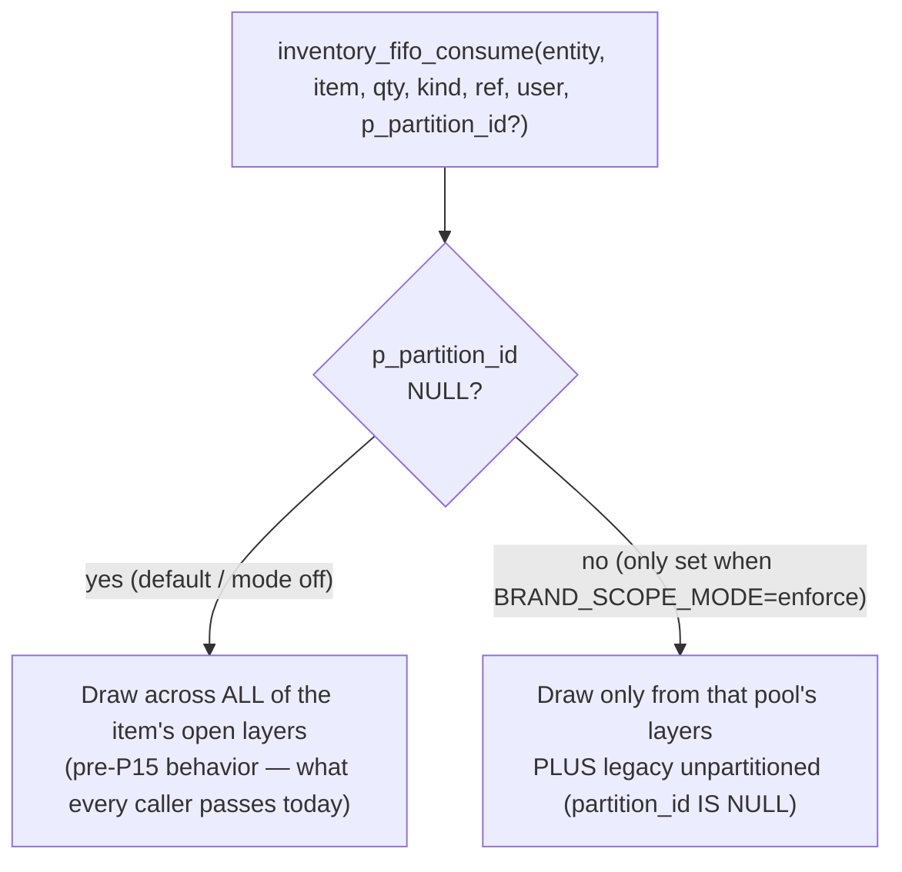
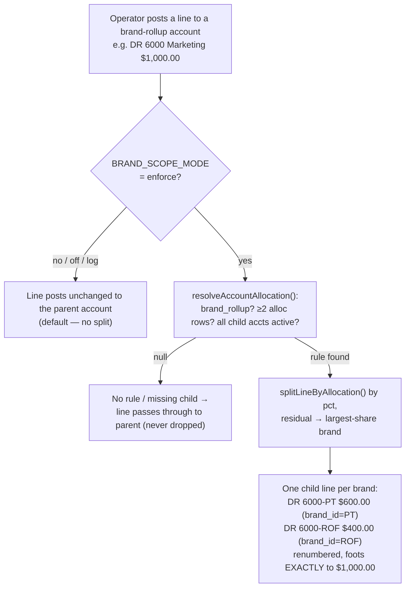

# 26. Brand Master & Brand-Scoped GL Allocation (P15 + M50)

> **Status (built, gated, default OFF):** every brand, channel, inventory-partition and GL-allocation behavior in this chapter is **wired into the code but inert**. It is controlled by one environment variable, **`BRAND_SCOPE_MODE`**, whose default (unset / `off`) is a complete no-op — zero behavior change anywhere in Tangerine. The schema, the master tables, the switchers, the allocation engine and the partition-aware FIFO consume are all merged and tested; flipping `BRAND_SCOPE_MODE=enforce` (after the operator config below) is what turns them on. Until then the books, reports and inventory behave exactly as they did before P15.

P15 adds a **brand** dimension (and a companion **channel** dimension) to Tangerine so the operator can run a per-brand P&L and keep per-brand stock pools — without splitting the company into separate sets of books. Brands live **under** the existing ROF entity and share ROF's chart of accounts. M50 layers the **GL brand allocation** on top: a single shared expense (rent, ad spend, a manual JE) can be split across brands by a saved percentage rule, posting to per-brand child accounts so the Income Statement reads per-brand.

This is the same design philosophy as [Chapter 24 — RBAC](24-user-access-rbac.md): everything ships behind an env gate, defaults to "no change," and is flipped on deliberately after the masters are configured.

---

## 26.1 The Brand Master concept

A **brand** is a sub-dimension of an **entity**, not its own entity. `brand_master` rows FK to `entities` (`brand_master.entity_id REFERENCES entities(id)`, defaulting to `rof_entity_id()`), so all brands under ROF share ROF's COA, currency, fiscal calendar and accounting basis. One brand per entity may be flagged `is_default` (the backfill target — everything that isn't explicitly tagged belongs to the default brand).

Three dimension tables ship together (all **new** tables — the chunk-1 migration touches no existing table, so it is a guaranteed no-op):

| Table | What it is |
|---|---|
| `brand_master` | The brands. Append-only, super-admin / migration-managed. `code` + `name`, unique per entity. |
| `channel_master` | Sales routes (global, entity-agnostic): `DTC`, `WHOLESALE`, `FBA`, `WALMART`, `FAIRE`. |
| `inventory_partition` | A stock pool ("store") owned by one brand — e.g. a brand's Wholesale pool vs its Ecom pool. |
| `brand_channel_partition` | The map: which `(brand, channel)` draws from which `inventory_partition`. |

**Seeded brands under ROF** (`code` → `name`): `ROF` → Ring of Fire (the default), `PT` → Psycho Tuna, `DEPARTED` → Departed, `FORTKNOX` → Fort Knox, `BLUERISE` → Blue Rise, `AXECROWN` → Axe Crown, `MPLEPIC` → MPL Epic, `MPLSUNSTONE` → MPL Sun & Stone. (`MPLEPIC` / `MPLSUNSTONE` are the Macy's private-label brands and are wholesale-only.)

**Brand vs. a separate entity — Axel / Syndicated Apparel Group.** Brands are sub-dimensions of ROF. When a line of business needs its *own* set of books, it becomes a separate **entity** instead — that is exactly what `Syndicated Apparel Group` (entity code `SAG`) is, with `Axel` as a brand *under that entity*. SAG was stood up by cloning ROF's COA via `clone_coa_to_entity()`. So "Axel" is a brand under the SAG entity, not one of the eight ROF brands above. (Entity provisioning is a separate feature; see [Chapter 25 — Sign-in & Identity](25-sign-in-and-identity.md) for the entity model.)

### Where brand shows up day-to-day
- **Style Master / Product Catalog** — `style_master.brand_id` (FK `brand_master`) is the catalog brand; it was backfilled from the ATS sales-order store. A brand picker appears on the Style Master and Product Catalog edit forms.
- **Global search** — brand is a searchable/returned facet (migration `20260713000000_global_search_add_brand.sql`).
- **Global Brand / Channel switcher** — two compact dropdowns in the Tangerine top bar (`<BrandChannelSwitcher>`), each defaulting to **"All."** Selecting a brand/channel records a per-tab choice that the API client attaches as `X-Brand-ID` / `X-Channel-ID` headers on every `/api/internal` call. The switcher only renders when the entity has more than one brand.

---

## 26.2 Activating it — the `BRAND_SCOPE_MODE` gate

Like RBAC's `RBAC_MODE`, brand scoping is governed by a single Vercel environment variable, **`BRAND_SCOPE_MODE`**, read in `api/_lib/brandContext.js` (`brandScopeMode()`):

| `BRAND_SCOPE_MODE` | Behavior |
|---|---|
| _(unset)_ / `off` | **Default.** Total no-op. The switcher headers are ignored, no report filters, the GL allocation engine passes lines through unchanged, FIFO draws across all layers. Identical to pre-P15. |
| `log` | **Silent-log / dry-run.** When a request carries a brand/channel selection, the dispatcher's `brandObserve()` writes a `[brand-scope log-only] … (not filtered)` line to the server logs. **Nothing is filtered or split.** This tells you which reports are actually being viewed under a brand before you turn enforcement on. |
| `enforce` | **Active.** Report list/aging queries gain a `WHERE brand_id = <selected>` when a brand is picked; the GL allocation engine splits rollup lines into per-brand child accounts; partition-aware FIFO restricts the draw to the chosen pool (+ legacy unpartitioned stock). |

The gate is checked in every place that could change behavior — `applyBrandScope()` / `applyChannelScope()` (report queries), `activeBrandId()` (aggregate RPCs), `expandJeLines()` / `expandApExpenseLines()` (the GL split), and the `p_partition_id` argument the inventory consume callers pass. Each one returns the unchanged input unless the mode is `enforce`. A malformed or absent header is always treated as **"All brands" (no filter)** — the safe default, never an error.

Flip it back to `log` or `off` at any time; it is just an env var and changes no data.

---

## 26.3 Stock-pool partitions & partition-aware FIFO

The FIFO inventory ledger (`inventory_layers`, from P3-3) originally lumped all of an item's on-hand into one undifferentiated pool. P15 adds **brand pools** so each brand can hold its own stock — *forward-only*, with no historical re-split:

- `inventory_layers.partition_id` (nullable FK → `inventory_partition`). **Existing layers stay NULL = "unpartitioned / shared,"** mirroring the GL "no retroactive split" rule. Only *new* receipts get stamped.
- **Receipt assignment.** When inventory is received against a PO/AP invoice, the operator picks the brand pool side at receipt time. `invoices.receiving_channel` is `WS` (wholesale) or `EC` (ecom); `NULL` defaults to `WS`. `resolveReceivingPartition(admin, brandId, side)` maps `(brand, side)` to the right `inventory_partition.id`. **PT and wholesale-only brands collapse to their single shared pool** and ignore the side.
- **Adjustment pool.** A positive inventory adjustment (found / correction-up) creates a new layer, and the Inventory Adjustments panel offers the same "Receive into (brand pool)" `WS`/`EC` selector. Single-pool brands ignore it server-side.

### Partition-aware consumption

`inventory_fifo_consume(...)` gained an optional last argument **`p_partition_id uuid DEFAULT NULL`**:

When `p_partition_id` is `NULL` — which is what **every caller passes today** — behavior is byte-for-byte identical to before. A non-NULL partition restricts the scan to that pool's layers plus the still-consumable legacy unpartitioned stock, and records which pool each draw came from on `inventory_consumption.partition_id`. So even under enforcement, old forward-only stock stays sellable.

> **Note — the "On-Hand by Brand Pool" report was removed.** An interim report (`v_inventory_on_hand_by_partition` view + an `inventory-on-hand` handler + panel) shipped in P15 and was later **dropped** (migration `20260713220000_drop_v_inventory_on_hand_by_partition.sql`); a full-codebase grep found no other consumer. The partition stamping on layers and the partition-aware consume remain — only that one read-report was retired. See §26.6.

---

## 26.4 M50 — Per-brand P&L (GL brand allocation)

M50 lets a **shared** P&L account be split across brands by a saved percentage rule, so a single posting lands on per-brand **child** accounts.

### The schema

Two markers on `gl_accounts` plus one rule table:
- `gl_accounts.brand_id` — set on a brand **child** account (e.g. `6000-PT`); `NULL` on normal/parent accounts.
- `gl_accounts.brand_rollup` — `true` on a **parent** that splits across brands (renders as header → children → subtotal on the Income Statement).
- `brand_account_allocations(account_id, brand_id, pct, is_default)` — the rule. A deferred constraint trigger enforces **`SUM(pct) = 100`** per account (±0.01 tolerance); accounts with no rows are simply not split. At most one `is_default` brand per account.

### Configuring a rule (COA panel)

In the **COA** account modal, on a P&L account, the `<BrandAllocationEditor>` offers a brand multi-select, per-brand `%` inputs, a "Split evenly" helper, a one-default radio, and a live "Total: X% (must = 100)" indicator. Saving `PUT`s to `/api/internal/gl-accounts/:id/brand-allocation` (handler `h534`), which:
- **> 1 brand** → sets `brand_rollup = true`, clears the parent's own `brand_id`, and **upserts** `{code}-{BRAND}` child accounts named `"{name} — {Brand}"` (inheriting the parent's type / subtype / normal balance). Children for de-selected brands are **deactivated, never deleted** (history-safe).
- **1 brand** → sets the account's own `brand_id`, `brand_rollup = false`, no children.

Defining the rule does **not** move any money — it just defines the accounts and percentages. The split happens at posting time (next), and only when `BRAND_SCOPE_MODE=enforce`.

### The posting split (the engine)

`api/_lib/glAllocation.js` does the split. It is a no-op unless `brandScopeMode() === "enforce"`. The math (`splitLineByAllocation`) rounds each brand to integer cents and routes the **rounding residual to the largest-share brand**, so the split foots **exactly** to the input — the JE stays balanced and the bill never drifts by a penny.

Two entry points are wired:
- **Manual JE** — `expandJeLines()` runs in the Journal Entries handler before posting. Any line whose account is a brand-rollup is expanded into one child line per brand on whichever side (debit/credit) was non-zero. The child account encodes the brand and `brand_id` is tagged too; no change to the `gl_post_journal_entry` RPC is needed.
- **AP-invoice expense** — `expandApExpenseLines()` runs in the AP-invoice post path. Each **expense** line on a brand-rollup account is replaced by per-brand child lines, then summed back into the single AP credit so the bill stays balanced.

### Brand-aware Income Statement

The Income Statement handler's `enrichWithBrandMeta()` tags each row with its brand/parent metadata, and the panel gains a **per-brand filter** dropdown. "All brands" groups each rollup parent's children under a header → indented children → subtotal; selecting a single brand shows that brand's children plus shared/unallocated accounts as a clean single-brand P&L. A "Hide account #" toggle drops the leading account-number column.

AR/AP **aging** reports were also made brand-aware (`p_brand_id` RPC arg + a gated `.eq(brand_id)`); with the gate off they collapse back to the original per-party output, unchanged.

---

## 26.4a Per-style revenue / COGS / returns routing (always on)

Separate from the gated brand-allocation engine above, **each style can carry its own revenue, COGS and returns GL accounts** so a multi-brand AR invoice books each line to the right brand's accounts. Unlike the rest of this chapter, this routing is **always active** — it is not gated by `BRAND_SCOPE_MODE`.

### Where the accounts live

On the **Style Master**, a style may override three GL accounts:

- **Revenue account** (`style_master.revenue_account_id`)
- **COGS account** (`style_master.cogs_account_id`)
- **Returns account** (`style_master.returns_account_id`)

Each is optional; a blank account just falls back to the customer/entity default (below). The historical set was backfilled from the Xoro item GL export — 1,961 of 2,100 styles were mapped to the matching brand bucket (ROF → 4005 revenue / 5010 COGS / 4236 returns, Boys → 4006 / 5011 / 4234, PT → 4009 / 5012 / 4235, Private Label → 4012 / 5015 / 4201). The ~139 unmapped styles fall back to the defaults.

### How posting picks the account

For each **AR invoice line**, the account resolves in priority order:

1. **Style** account (`style_master.revenue_/cogs_/returns_account_id`), then
2. **Customer** default (`customers.default_revenue_/cogs_/returns_account_id`, set on the Customer Master **GL Accounts** tab), then
3. **Entity** default.

So on a multi-brand invoice, line 1 (a ROF style) books revenue + COGS to ROF's accounts while line 2 (a different brand) books to its own — each line is independent. A line whose style has no override behaves exactly as before. Both revenue and COGS are stored per line on `ar_invoice_lines`, and the resolved account is written at invoice-creation time, then honored by the `arInvoiceSent` posting rule.

### Returns / credit memos

Customer **credit memos** (M23 RMA) route each return line to its **style's returns account** the same way: style returns account → customer `default_returns_account_id` → the entity-level Sales Returns fallback (4100). Previously every return reversed into the single 4100 bucket; now contra-revenue lands against the correct brand (4236 ROF / 4234 Boys / 4235 PT / 4201 Private Label).

> This is the per-line, real-account routing path — it routes to accounts that already exist in the COA, and does **not** percentage-split anything. The gated `glAllocation.js` split (§26.4) is a separate mechanism for sharing one cost across brands by percentage.

---

## 26.5 What is NOT split — AR revenue

**AR revenue is never run through the allocation engine.** This is a deliberate operator decision, stated in the engine itself: an AR invoice already *knows* its brand (`ar_invoices.brand_id`), so revenue posts to that brand directly rather than being percentage-split. The `glAllocation.js` split applies only to **manual JEs** and **AP-invoice expense lines**. Inventory lines on an AP invoice (anything with an `inventory_item_id`) are also never split — inventory capitalizes to the inventory asset account, not a P&L expense.

So the per-brand P&L gets its **revenue** from real per-invoice brand tags and its **shared costs** from the allocation percentages — never a guessed split on the top line.

---

## 26.6 What's NOT yet active

- **Everything in this chapter is inert until `BRAND_SCOPE_MODE=enforce`.** With the default (`off`), brands/channels/partitions/allocations have zero effect.
- **No retroactive split.** Existing `inventory_layers` stay unpartitioned; historical postings are not re-allocated. Brand scoping is forward-only.
- **The "On-Hand by Brand Pool" report has been removed** (see §26.3). There is no per-pool on-hand panel today; the partition data lives on the layers/consumption rows.
- **AR revenue allocation** — intentionally never built (revenue uses the invoice's own brand; §26.5).
- **Channel filtering** beyond the switcher + `applyChannelScope()` plumbing is minimal — the active reporting filter focus is the **brand** axis.

---

## 26.7 Operator go-live checklist

1. **Assign item / style brands.** Make sure `style_master.brand_id` is set for the SKUs you care about (the ATS backfill covered the historical set; tag any new styles).
2. **Configure GL allocation rules.** In the COA panel, for each shared P&L account, open the brand-allocation editor, pick the brands, set the percentages to total 100, and save (this generates the `{code}-{BRAND}` child accounts).
3. **Confirm inventory partitions.** The seed created `{brand}-WS` / `{brand}-EC` pools (and the single `PT` pool) and the `brand_channel_partition` map; adjust the map rows if a channel should draw from a different pool (no schema change needed).
4. **Dry-run with `BRAND_SCOPE_MODE=log`.** Watch the server logs to see which reports are being viewed under a brand selection; nothing is split or filtered yet.
5. **Flip `BRAND_SCOPE_MODE=enforce`** on the Vercel deployment once the rules and brand tags look right. From this point new postings to rollup accounts split, brand-filtered reports filter, and new receipts/consumes are partition-aware.
6. **Receive into pools.** When receiving inventory, choose the `WS`/`EC` brand-pool side so new layers are partitioned.

You can revert to `log` or `off` at any time without touching data.

---

## 26.8 Code map

**Schema (migrations under `supabase/migrations/`):**
- `20260710000000_p15_c1_brand_channel_dims.sql` — `brand_master`, `channel_master`, `inventory_partition`, `brand_channel_partition` + seed.
- `20260710010000_p15_c1b_mpl_wholesale_only.sql` — MPL brands wholesale-only.
- `20260710020000_p15_c1c_brand_id_columns.sql`, `20260710030000_p15_c1d_channel_id_columns.sql` — `brand_id` / `channel_id` on transactional/master tables.
- `20260710040000_p15_c1e_ip_avg_cost_brand.sql` — brand on `ip_item_avg_cost`.
- `20260710050000_p15_c3b_aging_brand.sql` — brand-aware AR/AP aging.
- `20260710060000_m50_chunk_a_gl_brand_allocation_schema.sql` — `gl_accounts.brand_id` / `brand_rollup` + `brand_account_allocations` + SUM=100 trigger.
- `20260712040000_inventory_partition_assignment.sql` — `inventory_layers.partition_id` + `invoices.receiving_channel`.
- `20260712100000_fifo_consume_partition_aware.sql` — `inventory_fifo_consume(..., p_partition_id)` + `inventory_consumption.partition_id`.
- `20260712060000_v_inventory_on_hand_by_partition.sql` — on-hand-by-pool view (later dropped by `20260713220000_drop_v_inventory_on_hand_by_partition.sql`).
- `20260713000000_global_search_add_brand.sql` — brand in global search.
- `20260712170000_p16_masters_foundation.sql` — `style_master.brand_id`; `20260712070000_entity_provisioning_and_sag.sql` — `clone_coa_to_entity()` + SAG/Axel.

**Lib:**
- `api/_lib/brandContext.js` — `brandScopeMode()`, header resolution, `applyBrandScope` / `applyChannelScope`, `activeBrandId`, `collapseAgingByBucket`, `resolveReceivingPartition`, `brandObserve` (dispatcher silent-log).
- `api/_lib/glAllocation.js` — `splitLineByAllocation`, `resolveAccountAllocation`, `expandJeLines`, `expandApExpenseLines`.
- Tests: `api/_lib/__tests__/brandContext.test.js`, `api/_lib/__tests__/glAllocation.test.js`.

**Handlers:**
- `api/_handlers/internal/brands/index.js` — brand list for the switcher.
- `api/_handlers/internal/gl-accounts/[id]/brand-allocation.js` (`h534`) — read/save the allocation rule + generate `{code}-{BRAND}` child accounts.
- Split call sites: `api/_handlers/internal/journal-entries/index.js`, `api/_handlers/internal/ap-invoices/post.js`.
- Brand-aware Income Statement: `api/_handlers/internal/income-statement/index.js` (`enrichWithBrandMeta`).
- Entity provisioning: `api/_handlers/internal/entities/index.js`.

**UI:**
- `src/components/BrandChannelSwitcher.tsx` + `src/hooks/useBrandContext.ts` — global brand/channel pickers.
- `src/tanda/InternalCOA.tsx` — `<BrandAllocationEditor>` in the account modal.
- `src/tanda/InternalIncomeStatement.tsx` — per-brand filter + grouping.
- `src/tanda/InternalAPInvoices.tsx`, `src/tanda/InternalInventoryAdjustments.tsx` — `receiving_channel` (brand-pool) selectors.
