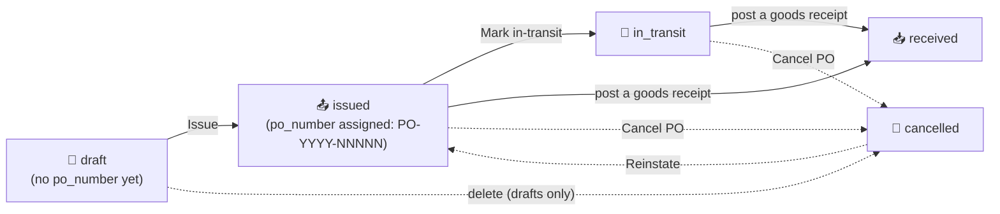

# 28. Purchase Orders & the Size Matrix (M11 + Matrix Initiative)

> **Status (2026-06-02):** All shipped. The matrix primitive that landed in P1 (PR #285, dormant for months) now has four live consumers — the Inventory Matrix view, Sales Order entry, Inventory Adjustments, and the native Purchase Orders module — plus a Size-Scale master, a Prepack-Matrix driver, and a Tangerine-only size-grain on-hand source. Shipped across PRs #727–#738, #743, #746, #747, #749, #754, #757, #759, #760, #762, #766, #786. The by-size on-hand cutover is **rolling out per style** (pilot `RYB0412` #757 → `--batch` #762) and is reversible. The native PO module is origination + status tracking only — it does **not** create FIFO layers on receipt (see §28.5).

This chapter covers the apparel **size matrix** — the color × size grid every apparel operator thinks in — and the native M11 Purchase Orders module that consumes it.

---

## 28.1 The size matrix concept

Apparel inventory is never one SKU; it's a grid. A single style explodes into a `color × size` matrix (and, for denim, a third or fourth axis like inseam or rise). Tangerine models this with a generic 2-to-6-dimensional grid primitive at `src/shared/matrix/`.

### The six axes (`MATRIX_AXES`)

From `src/shared/matrix/types.ts`:

```ts
export const MATRIX_AXES = ["color", "size", "inseam", "length", "fit", "rise"] as const;
```

Six dimensions, in this exact order: `color`, `size`, `inseam`, `length`, `fit`, `rise`. (`rise` was the last added — PR #737 — for denim `HIGH`/`MID`/`LOW`.) The default rendered view is 2-D `color × size`; the pivot control (`MatrixPivotControl`) lets the operator pick any two of the six as the row/column axes, with the remaining four becoming filter chips or layered tabs.

### What renders in a cell

A `MatrixItem` is any object carrying the six dim values plus a `value` (qty, cost, whatever the caller formats). For inventory views the value is on-hand qty; for entry surfaces the cell is an editable input. The primitive itself is presentation-only — it never persists. The caller owns persistence (see §28.4).

### The key lesson — pass `axisValues`

> **MatrixGrid consumers MUST pass `axisValues={{ size: scaleSizes }}` for correct column order.**

By default `useMatrixData` derives each axis's distinct values *from the items present*, which yields **alphabetical** size columns (`L, M, S, XL` instead of `S, M, L, XL`). To force scale order — and to render columns for sizes that have zero items — the caller passes the scale's ordered size list explicitly via the `axisValues` prop:

```tsx
<MatrixGrid items={skuItems} axisValues={{ size: scaleSizes }} />
```

`scaleSizes` comes from the style's Size Scale (§28.2). This was the recurring bug behind PR #733 ("size columns render in scale order, not alphabetical"). The read-only Inventory Matrix panel (§28.6) achieves the same result a different way — it builds its own poMatrixTab-style table and iterates `payload.sizes`, which the server already returns in scale order — but any direct `MatrixGrid` consumer must pass `axisValues`.

---

## 28.2 Size Scale master (`SCALE-NNNNN`)

**Where:** `/tangerine?m=size_scales` · group **📚 Master Data** · icon 📏

A **size scale** is an *ordered* list of size labels — e.g. `ALPHA-XS-3XL = [XS, S, M, L, XL, 2XL, 3XL]` — stored as a Postgres `text[]` on the `size_scales` table. Order is preserved exactly as typed; this ordered array is the single source of truth for matrix column order everywhere.

A style links to one scale via `style_master.size_scale_id`. When a matrix surface needs size columns, `enumerateStyleMatrix` reads `size_scales.sizes` for that style's scale (falling back to the distinct sizes on existing SKUs only when the style has no scale assigned).

**Inseams (bottoms).** A scale also carries an *optional* ordered `inseams` `text[]` (migration `20260838000000`), entered exactly like sizes — comma-separated, order preserved — in the same create/edit modal. Leave it blank for tops and accessories (a *size-only* scale); fill it for pants and shorts (e.g. `30, 32, 34`). A style on that scale inherits both axes. The **Inseams** column in the panel (and export) shows `—` for size-only scales. When inseam is active on an entry/view screen, the matrix renders **one row per style × inseam × color**, with a **subtotal row** rolling up all inseams for the same style × color _(rendering sweep — phased rollout)_.

**Assigning a scale to a style.** Two ways:
- **Per style** — Master Data → **Style Master** → edit a style → the **Size Scale** field (a searchable picker of the `size_scales` master). This is the manual override and always wins. Each style's assigned scale shows in the **Size Scale column** of the Style Master list (and its export), so you can see/sort/confirm what's assigned.
- **Bulk auto-assign** — Style Master header → **🎯 Auto-assign size scales**. It matches every *unscaled* style to the **best-available** scale by its actual size variants (the distinct non-PPK sizes on its SKUs), using its gender to disambiguate look-alike runs (e.g. an `S–XL` run goes to KIDS for a kids' gender, MENS for a men's). Size tokens are normalised first (`SML`→S, `LRG`→L, `XLG`→XL, `XXL`→2XL, combined `L/12` matches alpha *or* numeric scales). It **previews** the per-scale breakdown before writing, only fills styles that have **no scale yet** (never overwrites), and assigns only **full size runs (≥3 sizes)** — styles with **fewer than 3 sizes** (a single or a weak pair) or **no good match** (<60% of variants covered) are skipped and stay unassigned for you to set by hand. Matcher: pure `api/_lib/sizeScaleMatch.js` (unit-tested); writes via `apply_size_scale_assignments`. This is what makes the **Prepack "Download all PPK"** workbook consolidate styles onto one tab per scale (§28.5). The **⬇ Skipped styles** button (next to it) downloads an xlsx of every style the auto-assign skipped, with the reason, so you can hand-assign those. _(A first bulk run on 2026-06-04 assigned **681** styles — MENS-S-2XL 404, DENIM-WAIST 119, KIDS 54, WOMENS-NUM 52, EVEN-NUM-WAIST 44, TODDLER 8.)_

### The panel

`src/tanda/InternalSizeScales.tsx` is a standard master CRUD: search by code/name, "Show inactive" toggle, create/edit modal, hard-delete (rejected with a 409 + reference detail if any `style_master` row still points at the scale — deactivate instead). It carries the suite-standard `ExportButton` + `TablePrefsButton` + row-click-to-edit. A right-click context menu offers **"Add size scale below"** (PR #735), which shifts every lower scale's `sort_order` by +1 so the new one slots cleanly into the ordered list. The modal has two ordered-list fields — **Sizes** (required) and **Inseams** (optional, for bottoms) — each with a live chip preview; inseams may be cleared at any time to revert a scale to size-only.

### Codes are server-generated and read-only

Per the auto-coded-master pattern (operator item 14), the `code` is **`SCALE-NNNNN`** — assigned server-side by `insertWithAutoCode` (`api/_handlers/internal/size-scales/index.js`, prefix `SCALE-`). The create modal shows *"(auto-generated on save)"*; any client-supplied code is ignored. The code field renders greyed/dashed and is never editable.

The migration seeds the common scales (`ALPHA-XS-3XL`, `MENS-S-2XL`, `EVEN-NUM-WAIST`, etc.).

---

## 28.3 How matrix grids appear across the app

The same `color × size` grid shows up on four surfaces, all reading the one shared endpoint `GET /api/internal/style-matrix?style_id=<uuid>` (→ `enumerateStyleMatrix` in `api/_lib/styleMatrix.js`):

| Surface | Where | Matrix role | PR |
|---|---|---|---|
| **Inventory Matrix** | `/tangerine?m=inventory_matrix` | Read-only on-hand view | #729, #737, #759 |
| **Sales Order entry** | SO modal (chapter 27) | Editable qty grid + unit-price header | #730, #743 |
| **Inventory Adjustments** | `/tangerine?m=inventory_adjustments` | Editable signed +/- grid + per-row unit cost | #731, #749 |
| **Native Purchase Orders** | `/tangerine?m=purchase_orders` | Editable qty grid + per-row unit cost | #732, #747 |

The editable surfaces use the `EditableSizeMatrix` component (`src/shared/matrix/EditableSizeMatrix.tsx`), with one grid row per color and size columns from the scale. The read-only Inventory Matrix renders its own table but draws size order from the same payload.

### SKUs auto-create per cell

A `color × size` cell may not yet have a SKU row in `ip_item_master`. When the operator types a qty into a cell and clicks "Add to PO / SO / adjustment", the surface calls `POST /api/internal/style-matrix/resolve-sku` → `resolveOrCreateSku(admin, entityId, { style_id, style_code, color, size, inseam })`. That helper **finds or creates** the sized SKU (composing a unique `sku_code` like `RYB0412-BLACK-32`, retrying with a numeric suffix on a `23505` unique collision). Matrix cells materialize SKUs on first use — so the operator never has to pre-create every size variant.

### Classification source (important caveat)

Style group/category/sub-category come from **`ip_item_master.attributes`** (JSONB), backfilled into `style_master` by migration `20260712240000_p16_classify_backfill_rise_sizes.sql`:

- `attributes.product_category` → `style_master.group_name` (e.g. `BOTTOMS`)
- `attributes.group_name` → `style_master.category_name` (e.g. `DENIM`)
- `attributes.category_name` → `style_master.sub_category_name` (e.g. `STRAIGHT`)

> The `ip_category_master` table and `category_id` column are **EMPTY** — do not use them for classification. The JSONB `attributes` is the truth.

---

## 28.4 The cross-link map

- Sales Order entry and its matrix line entry → see [chapter 27 — Sales Orders, Allocations & Shipping](27-sales-orders-allocations-shipping.md).
- FIFO layers, Inventory Adjustments posting mechanics, and Cycle Counts → see [chapter 11 — Inventory Operations](11-inventory-operations.md).

---

## 28.5 Native Purchase Orders (M11)

**Where:** `/tangerine?m=purchase_orders` · group **📦 Inventory** · icon 📦

The first native PO origination module in Tangerine (PR #732), replacing the read-only Xoro-mirrored PO view. It's brand- and entity-scoped, writes via the service role (anon-read RLS).

### Status lifecycle



The order-lifecycle statuses are enforced by a DB `CHECK` on `purchase_orders.status` (`draft`, `issued`, `partially_received`, `received`, `cancelled`, plus legacy `in_transit`). **`received` is no longer a manual flip** — a PO becomes `received` (or **`partially_received`** for a partial) **only when a goods receipt is posted** in Receiving (§28.5, step 6); a direct manual `status:'received'` is rejected. **`partially_received` replaces the old misuse of `in_transit` for partial receipts** — Xoro "Partially Received" now maps to `partially_received`, and *in transit* (goods physically on the water/air) is a **separate shipment overlay** (see below) — a PO can be e.g. *issued · in transit* or *partially received · in transit*. Existing `in_transit` POs were migrated to `partially_received`.

**In-transit overlay — Shipments (ASN).** In transit is **not a status** — it's an overlay recorded as one or more **shipment records** on the PO (`po_shipments` / `po_shipment_lines`). Open a PO → footer **🚚 Shipments…** to add a shipment: **method** (sea / air / ground), **carrier**, **tracking / BOL**, **ASN ref**, **shipped date**, **ETA**, and the **per-line quantities on the way** (defaults to each line's remaining qty). A PO shows an **✈ in transit** chip (with the earliest ETA) next to its status whenever it has **≥1 shipment still `in_transit`** — so it reads *issued · ✈ in transit* / *partially received · ✈ in transit*. Per shipment you can **Edit**, mark **Arrived** or **Cancel** (both clear the overlay), or delete it — recording a shipment never changes received quantities (receiving still happens in §28.5). A grid **✈ In transit only** checkbox filters to POs with an active shipment (separate from the Status multi-select, since it's an overlay). Shipments are **buyer-entered** here today; a **vendor ASN** feed (`source = 'vendor_asn'`) that sets them from the Vendor Portal is the next step.

**Remaining to Ship** (grid column + Totals) = Σ over lines of `(qty_ordered − qty_received) × PO unit cost` — the **open commitment** still on order. Unlike **Total** (the PO's full ordered value), this nets out what's already been received. It prices each outstanding unit at **its own line cost**, so it's the *true* open value — it ties to Xoro's "$ Remaining to Ship" on fully-open POs, and is **more accurate** on partially-received POs (Xoro's export column there uses a blended average cost × remaining qty, which misprices leftover units that aren't average-priced). The PO WIP dashboard's headline value is the same measure (labelled **Remaining to Ship**), and matches the grid Total to the penny.

**📊 Remaining-to-ship rollup** (button next to *Totals*, above the grid) opens a planning breakdown of the open commitment — **group by expected month** (the receiving / cash-outflow pipeline, chronological) or **by vendor** (largest first). It sums over the **currently-filtered** POs, so combine it with the date-window and status/vendor filters to answer e.g. "how much is due to arrive next quarter" or "which vendor carries the most open value". Each group shows its PO count, a bar, and the remaining $.

### Day-to-day

1. **New PO** → fill the **rich document header**, grouped into bordered boxes (the boxes have no titles; all lookups show the **name only**, no codes):
   - **Identity & status** — PO type (stock / replenishment / made-to-order / sample / drop-ship), Customer (type an unknown name → **"+ Add customer '<name>'"** typeahead row creates it on the fly + sends a complete-the-info reminder — item 8), and the read-only PO number / status. **The PO number is fully automatic** — assigned as `PO-<order-year>-NNNNN` when the order is issued (there is **no prefix field** to fill; it was removed). The **status here carries the same colour coding as the grid status chip** (draft grey · issued blue · in-transit amber · received green · cancelled red) — both the modal title and the PO-number/status chip — so the open PO matches the list at a glance. Every status is shown **without its underscore** (`in_transit` renders as *in transit*).
   - **Vendor / supplier** — Vendor (lookup), vendor contact + email, vendor PO / ref #, factory / production location, COO (country lookup). **+ New** next to the Vendor picker opens an **Add vendor** popup right here (name + optional contact/email/phone/country); on Save the new vendor is created and selected without leaving the PO (operator item 1).
   - **Dates** — two rows: row 1 = order, **Requested in DC**, port, expected; row 2 = ship-window start, ship-window end, cancel, vendor-confirmed / acknowledged. The header **Requested in DC** date pre-fills each style's per-line date (see the matrix notes below). **Item 15:** the **Cancel date** can't be **earlier than the Ship window start** — an inline warning shows and the save is blocked until it's fixed.
   - **Logistics & destination** — ship-to location / warehouse, bill-to entity (multi-entity), ship method (sea / air / ground), consolidator / freight forwarder.
   - **Classification & terms** — brand, season (from the Season master), channel, **Department** (main category from the Category master), payment terms.
   - **Roll-up (read-only)** — **total weight / cartons / CBM**, computed from each style's **Pack / logistics** fields in Style Master (units × unit weight; units ÷ units-per-carton, rounded up; cartons × carton CBM). It populates after the first save; a note appears if any style is missing those fields. *(The status flow itself is unchanged — draft → issued → in_transit → received → cancelled.)*

   **Collapsible header.** A **▴ Hide header details** / **▾ Show header details** toggle sits at the top of the modal; collapsing the header hides all the boxes and leaves just the **vendor name** so the size matrix has the full width. The header **auto-collapses** the moment you add a style (matrix) or a non-matrix line, and you can reopen it any time with the toggle.
1a. **Create from a Sales Order** (new PO) — the **📋 Create from Sales Order** button (above the matrix) opens a dynamic SO search. Pick an SO and its **styles / colors / sizes / quantities** fill the PO matrix, and the customer / brand / channel / dates carry over to the header. The header **Requested in DC** is computed from the SO's **cancel date**: the **1st of the cancel-date's month** when that's at least **20 days before** the cancel date, otherwise **cancel date − 20 days** (e.g. cancel 03/25 → 03/01; cancel 03/15 → 02/23). **Only qualifying SOs are listed** — a PO can only be created from a **draft or confirmed** sales order. Anything further along (allocated / fulfilling / shipped / invoiced / closed) has committed or billed stock, and cancelled orders are dead — those are excluded from the picker and refused with a warning if selected. **Unit costs stay blank** (the SO holds selling prices, not costs — set them by hand or via *Get PO price*). The PO records `sales_order_id` for traceability. **Lots inherit the SO's customer PO** — each line's Lot defaults to the sales order's **customer PO number** (rather than the at-issue PO# stamp), so the production order carries the customer's reference; the lot stays editable, and a blank customer PO falls back to the PO# stamp at issue (see [chapter 45](45-lot-numbers.md)). The **SO picker** shows each candidate order's **customer PO (🏷)** and fulfillment source so you can spot production orders awaiting a PO.

1b. **Get PO price** (new PO) — the **💲 Get PO price** button pulls the **awarded** cost from the costing module's RFQs. It first asks *"Is this PO being created from a Sales Order?"*:
   - **Yes** → it opens the SO picker first (1a), fills the matrix from the SO, then looks up the awarded RFQ for each of those styles.
   - **No** → it lists all awarded styles to choose from.
   The **awarded-quotes** lookup (`GET /api/internal/costing/awarded-quotes`) joins `costing_lines` (status `awarded`) → the selected `costing_line_vendors` quote → vendor, returning **vendor name, awarded date, and price** (newest first). When a style has **more than one** award, you pick which to use. **Apply** stamps the awarded cost onto every color row of that style and sets the PO **vendor**. (If the picks span vendors — a PO is to one vendor — you're warned to set it manually.) Always review before saving.
2. **Add lines — the body IS the size matrix** (the same `LineMatrixBody` the Sales Order modal uses, in `mode="po"`). It opens with the matrix ready:
   - **➕ Add style (matrix)** — pick a style → fill its color × size grid inline, with a per-row **Unit Cost $** column + a "set all rows" header field. The new style picker is inserted at the **top** of existing styles. (PO mode shows cost, not margin or on-hand.)
   - **Qty quick-fill** — each row (color, or color × inseam) has a **Qty** box (between the lead columns and the first size). Type one total (e.g. `1200`) and press **Enter/Tab**: the qty is split across sizes using the style's stored **size scale** pack ratio (set in Style Master → **📐 Scale**) — the **matching inseam's** curve when the style runs multiple inseams (the Scale window becomes a per-inseam pack matrix) — then **each size is rounded up to a full carton of 24**. The grand total can land slightly above what you typed (the round-up); that's expected. The box is disabled for styles with no Scale set (tooltip explains).
   - **Carton check** — if any color × size cell ends up a partial carton (a positive qty not divisible by 24) — typically from hand-editing a size — one **⚠️ not full cartons of 24** banner under the grid lists the offending cells so you can accept as-is or adjust.
   - **Collapse empty size columns** — once any cell carries a quantity the **first size column header turns green** and is clickable; click it to **hide the all-zero columns before/after the sizes you're buying** (mid-range zeros stay visible), so a wide scale collapses to the ordered range. A `⋯` marker shows where columns are hidden; click again to show all. (Same control on the SO matrix.)
   - **Per-style dates** — each style block has a **Requested in DC** and **Vendor-confirmed ship** date pair (PO only). When you add a style, both **pre-fill from the header "Requested in DC"** date (Vendor-confirmed is copied from Requested in DC); edit either as needed. To keep the screen tidy, **adding another style collapses the previous styles' date pickers** to a one-line summary — **click it to re-open and edit**. The dates are stamped onto every SKU line of that style at save (`purchase_order_lines.requested_ship_date` / `vendor_confirmed_ship_date`) and repopulate when you re-open the PO. **Vendor-confirmed change log:** whenever you change a style's **Vendor-confirmed ship** date, a dated line is appended to the **Notes** automatically — e.g. `[06/15/2026] RYB0412 Vendor-confirmed ship: 03/01/2026 → 03/08/2026` — so every confirmation change is tracked. (The initial copy from Requested-in-DC is not logged; only later edits are.) Notes is a multi-line box that holds the running log.
   - **Lot column (per style + color)** — a **🏷 Show lots / Hide lots** toggle (top-right of the matrix; **shown by default** on a PO) reveals an editable **Lot** column on each color (× inseam) row, plus a "set all rows" field. Leave it blank and the system **auto-stamps the PO number as the lot on every un-lotted line when the PO is issued** (a native PO only gets its `PO-YYYY-NNNNN` at issue); a lot you type by hand always wins and is never overwritten. When the PO was **created from a Sales Order**, each line's lot instead defaults to that SO's **customer PO number** (still editable). The lot then carries onto the FIFO inventory layer at receiving. The lot field uses a **compact font** so a full lot / customer-PO number fits without clipping; the customer-PO chips in the **Split by customer PO** dialog likewise shrink + wrap long numbers to stay inside the bubble. See **[chapter 45 — Lot Numbers](45-lot-numbers.md)** for the full picture.
   - **+ Add non-matrix line** — for the rare one-off SKU, a plain SKU / qty / Unit Cost $ row.
   - At save, every filled cell resolves to an `ip_item_master` SKU and posts with `unit_cost_cents`. The Save / Close buttons sit in a **frozen footer** that stays visible as the matrix grows.
   - **View ▾** (next to Close) is a **dropdown with two choices — PDF and Excel** — that render the **same PO document**: Ring of Fire logo, header fields (vendor, dates, terms, ship-to…), then a **color × size matrix per style** (one block per style: color/inseam rows × size columns, with a per-row Qty, Unit Cost $ and line total, plus a per-style totals row) and grand totals. **PDF** opens the branded printable document in a new window straight into the browser Print / Save-as-PDF dialog (unchanged behavior). **Excel** downloads the PO as an **`.xlsx`** using the suite's standard branded export layout (the shared `downloadOrderExcel` helper — same renderer the Sales Order "Confirmation → Download to Excel" uses, so PO and SO spreadsheets match). Both work for a draft too (show `(draft)` for the number), reflecting whatever is currently entered.
   - **Unsaved-changes guard** — on a **new** PO that already has data (vendor, lines, or any header field), **Close** or a click outside the modal first asks *"This purchase order hasn't been saved. Close and discard your changes?"*, so a PO built from an SO or by hand isn't lost to an accidental click.
3. **Audit trail** — re-open any saved PO to see the **Audit trail** timeline at the bottom (the shared T11 `RowHistory`): every header/line field change is recorded with the changed columns, before/after values, and timestamp (`row_changes`, via the universal audit trigger now attached to `purchase_orders` + `purchase_order_lines`).
3. **Save draft** — header + lines persist; `po_number` stays null.
4. **Issue** — `PATCH {status:'issued'}` assigns the immutable `po_number` = `PO-<order-year>-NNNNN` (zero-padded, entity-unique). The PO number is **never** reassigned.
5. **✎ Edit (revise an issued PO)** — re-open a saved PO and click **✎ Edit** in the footer to unlock **everything** (header *and* lines) for revision — no more cancel-and-recreate. Saving (**💾 Save revision**) sends a **"Purchase order revised" notification** to the vendor's portal users (bell + email) when the vendor is connected to the Vendor Portal (`notifyVendor` over `vendor_users`; a no-op if they have no portal login). The change is recorded in the Audit trail. Server-side this is `PATCH {revise:true, …}`, which lifts the draft-only line lock for that one save. **Cancel edit** discards. _(Note: open-PO commitment rows aren't yet re-derived on a line-changing revision — folded into the receiving/GL rework below.)_
6. **Mark in-transit** — manual logistics flag. **📥 Receive** — opens the **Receiving** panel for this PO (`?m=receiving&po=<id>`). "Received" is **no longer a manual flip**: a PO becomes `received` (or `partially_received` for a partial) **only when a goods receipt is POSTED** in Receiving — which creates the FIFO inventory layers + the GR/IR journal entry and rolls each line's `qty_received`. A direct manual `status:'received'` PATCH is rejected.
7. **Cancel PO / Reinstate** — an **issued** or **in-transit** PO shows a red **Cancel PO** button in the footer → confirm → `PATCH {status:'cancelled'}`. Cancelling **keeps the PO for history** and **releases its open-PO commitments** (the P13/D3 off-balance-sheet rows close). A cancelled PO then shows a green **Reinstate** button → confirm → `PATCH {status:'issued'}`: the status returns to **issued** (the PO **keeps its original number**) and the server **re-opens the commitments** the cancel closed, so the open-PO commitment reflects the live PO again. *(A partially-received PO reinstated this way returns its commitments to `open` rather than `partial` — a rare edge.)* Mirrors the Sales Order **Cancel order / Reinstate** pair (ch27).

**Finding a PO (list search).** The **Search PO #, vendor, style…** box is **all-field**: the server matches the typed text against the **PO number**, the **vendor name / code**, the order **notes**, and any **line's style / SKU / line description** (case-insensitive, substring), alongside the **Vendor** and **Status** filters (all ANDed), updating as you type (200 ms debounce). The whole search runs in the `search_purchase_orders` SQL function, so it spans the entire book — not just the loaded rows — including the line-level style/SKU match.

**Status filter (multi-select).** The **Status** filter is a **multi-select dropdown** (mirrors the Sales Orders grid): tick **any combination** of `draft / issued / partially received / received / cancelled` and the list shows POs in **any** of the picked statuses; leave it empty for **All statuses**. It **defaults to the live set — draft, issued and partially received** — so the grid opens on the POs the buyer is actively working, not the full received/cancelled history; clear or change the ticks to widen it. (The options and the grid chip show each status **without its underscore**.) The dropdown has its own search box + a **Clear** action, and a **Clear filters** button (next to the date pickers) resets status, vendor, search and dates together. The status set is sent to the server as a comma list (`?status=issued,partially_received`) so it narrows the whole book, not just the loaded page.

**Date-range filter (list).** Next to the search box is a **date field selector** — **PO date** (order date) or **Expected date** — followed by a **Presets…** dropdown (This month, Last month, This quarter, YTD, etc.), and **From / To** date pickers. Rows are filtered **client-side** so the row whose chosen date falls inside `[from, to]` stays; a row with no value on the selected field is hidden while a bound is set. A **Clear dates** button removes the window. The filter applies to the visible grid and the **Export** (the export reflects exactly what's shown).

**List columns.** Modelled on the **Sales Orders** grid. The grid carries the universal **⚙ column show/hide** control, and beyond PO #, Vendor, Order date, Expected, **Cancel date** and Status it has five money columns (all 2-decimal, right-aligned). **Avg PO Price** is shown **first, immediately before Avg cost**, so the price-you-pay reads left of the standard-cost benchmark:
- **Avg PO Price** — the **qty-weighted average unit price on THIS PO's own lines** (`Σ unit_cost × qty ÷ Σ qty`). This is what the PO actually pays the vendor. Read side-by-side with **Avg cost** it shows the **PO variance** — whether you're buying above or below standard.
- **Avg cost** — the **qty-weighted average STANDARD (catalog) cost** across the PO's lines, from **`ip_item_avg_cost`** — the *same* cost source the Inventory Snapshot and the Sales Orders grid use. This is what the item *normally* costs, not what this PO paid. The SKU match is done through the **`resolve_avg_cost_by_norm` resolver**, which normalises both sides (upper-case, alphanumeric-only) so the punctuation-collapsed cost-master SKUs still match — lifting standard-cost coverage from ~40% (exact only) to ~89%. (Same resolver now backs the Sales Orders grid's Avg cost.) **Fallback:** for any **SKU-linked** line whose colorway isn't in the cost table yet (e.g. a brand-new wash), the column falls back to **that line's own PO price** as the per-unit cost — so Avg cost is **never blank where Avg PO Price isn't**. It reads `—` only for a PO whose lines are **all unlinked** (SKU-less), where there's no style cost to show at all.
- **Sell price** — the **qty-weighted average selling price** across the PO's lines, resolved per style through a **fallback chain** (first hit wins): **1)** the **M43 customer price** when the PO is tied to a customer (own → assigned → tier → default list); **2)** the style's **brand DEFAULT price list**; **3)** the **most-recent actual sale** — the real price the style last sold for, from wholesale/Xoro sales history + native sales orders (`recent_sell_by_style`); **4)** the SKU's **standard unit price** (`ip_item_avg_cost.standard_unit_price`); **5)** a **provisional placeholder** at a **21% margin** off this PO's own cost, seeded for styles that have **never sold** (see below). A `—` means none of those resolved. Because layer 3 outranks the provisional, a style's Sell/Margin **auto-switches to its real price the moment it has an SO, invoice, or Xoro sale**.

**Provisional selling price (never-sold styles).** When a PO is **issued**, styles on it that have **no selling history** get a **provisional** selling price = *cost ÷ (1 − 0.21)* (a 21% margin off the PO's own line cost) so the grid's Sell/Margin aren't blank for brand-new styles. These live in a **dedicated `provisional_style_prices` table read only by this grid's Sell fallback** — the **M43 quote engine never sees them**, so a placeholder can never be quoted to a customer on a real Sales Order. As soon as the style actually sells (layer 3 above) the real price takes over and the provisional row is deactivated. A one-time backfill (`scripts/backfill-provisional-prices.mjs --apply`) seeds existing issued POs.
- **Margin %** / **Margin $** — `Sell price − Avg PO Price` (the $ column) and `(Sell − Avg PO Price) ÷ Sell` (the % column, one decimal). Priced against the **PO's actual cost** (Avg PO Price), not standard cost, so the margin reflects the real buy — matching the **Sales Orders** Sell − Cost convention. Both coloured **green** when ≥ 0, **red** when negative; `—` when no sell could be resolved.
- **Total** — the PO subtotal/total.

> **Every PO's lines are included.** The money columns are computed from all of each PO's `purchase_order_lines`. The server pages that fetch in 1000-row batches — PostgREST caps any single response at 1000 rows, and the book runs tens of lines per PO (≈68 in prod), so an unpaged fetch previously dropped every line past the first 1000 and left **Avg PO Price / Sell price / Margin blank on most rows** even though the PO carried the data. Paging fixes it — all rows now price correctly. (With the PO-price fallback above, **Avg cost** now reads `—` only for a PO whose lines are **all unlinked** — no style at all to price.)

**Row detail (▸ expander).** Each row has a leading **▸ carrot**; click it to open an inline **per-style size matrix** (color rows × size columns) of that PO's lines without leaving the grid (clicking anywhere else on the row still opens the PO modal). Only **SKU-linked** lines (a real style + size) build the matrix; any **unlinked** lines — SKU-less pack / aggregate rows carried by some Xoro POs, which have no size to place in a grid — are listed separately in an **"Unlinked lines"** panel below the matrix (description, qty, PO unit $, Ext $) so they're visible and correct rather than scattered as broken single-cell rows.

When the PO has any receipts (or is **partially received**), the row-detail header shows a **Remaining / Original** switch — mirroring the **PO WIP** matrix's `itemQty` logic. **Remaining** (the default) shows the quantity **still to ship** per cell (`ordered − received`, floored at 0), tying the matrix to the grid's **Remaining to ship** column; **Original** shows the full ordered quantity. A `· remaining to ship` hint appears in the header while Remaining is active. Non-partial POs don't show the switch (nothing received, so the two agree).

A single **EXPLODE PPK** toggle in the **grid toolbar** (top-right, next to ⚙ columns — shared with the PO/Item Matrix tab, and it drives **every** open row) switches prepack totals between **packs** and **units** (packs × units-per-pack): when exploded, the cell counts and the per-style **Units** total show eaches, and the unit column shows the **per-each cost** (per-pack cost ÷ pack size). The row-detail header echoes the current mode (`· packs` / `· units (PPK exploded)`). The **Ext $** column (`Σ qty × unit cost`) is the same either way. Each style block shows its lot number(s) and a Style-total row.

**Style-scoped money columns.** A deep-link of `?style=<style_code>` (e.g. from a style/inventory drill) **scopes the Avg cost, Avg PO Price, Sell and Margin columns to just that style's lines** across every listed PO, instead of the whole-PO average; a small note above the grid shows the active style. Without it, the columns are the whole-PO averages.

**Sort any column.** Every grid column header is **click-to-sort** (tri-state ▲ ascending → ▼ descending → off; the active column's label brightens). The sort is **client-side** over the loaded rows and **persisted** so it survives a reload. Computed columns (Vendor name, Avg PO Price, Margin % / $) sort on their resolved/displayed value.

**Totals row + Filtered / All toggle.** A pinned **Totals** footer sums the priced columns: **Total** (`Σ`), and the **total-weighted average** Avg cost, Avg PO Price, Sell price, a **weighted Margin %** and **weighted Margin $**. The **Totals:** toggle above the grid switches the row between **Filtered rows** (only the rows the current date window leaves visible) and **All rows** (the whole loaded dataset, ignoring the client-side date window; server search/status/vendor filters still bound it). The footer label states which scope is active. The **Export** carries this same Totals row as its last line, honouring the active scope.

**Frozen header.** The grid's header row is **pinned** (sticky) — it stays visible while the rows scroll inside the table's own scroll area; the Totals footer is pinned to the bottom.

### Receiving → GL → AP 3-way match (P13)

Receiving a native PO posts real accounting through the **Receiving** panel (`m=receiving`, `src/tanda/InternalReceiving.tsx`) and the procurement posting service — **not** a status flip:

1. **Goods receipt** (`POST /api/internal/procurement/receipts` → `…/:id/post`) creates a **FIFO `inventory_layers`** row per accepted line (`source_kind='po_receipt'`) at landed cost and posts the **GR/IR journal entry**: `DR Inventory / CR GR/IR Clearing (2050)` (+ `CR Accrued Landed (2150)` for capitalized freight/duty rollups). It then **rolls the native PO**: bumps each `purchase_order_lines.qty_received`, flips fully-received lines to `received`, and sets the header to `received` (all in) or `in_transit` (partial). **This is the only thing that makes a PO `received`.**
2. **Vendor AP invoice** is matched 3-way (PO ↔ receipt ↔ invoice) via **Vendor Invoice Drafts** (`procurement/vendor-invoice-drafts`). A matched invoice posts `ap_invoice_grir_match`: `DR GR/IR (2050) / CR AP`, clearing the GR/IR liability and booking any price difference to **PO Variance (6320)**. It does **not** re-debit inventory or create a second layer — **so goods are counted once.**
3. **Bookkeeper** finalizes via the **Bookkeeper Queue** (`procurement/bookkeeper-queue`).

**3PL EDI receipt advice (X12 944).** When a 3PL warehouse receives goods against a PO, it can POST an **X12 944 Stock Transfer Receipt Advice** (or a structured `{ po_number, receipt_date?, lines:[{sku, qty_received}] }` / `csv`) to `POST /api/internal/edi/tpl/:provider_id/receipt-advice`. The handler resolves the native PO by number, maps each advice SKU to its PO line (loose `sku_code` match), stores the raw advice in `edi_messages` (`944`, inbound), and creates a **DRAFT** goods receipt. It does **not** auto-post — the draft appears in **Receiving** for the operator to **confirm and post** (which books inventory + GR/IR as above). So an EDI receipt still requires human confirmation. `parse944` is lenient (3PL layouts vary); the structured JSON/CSV body is the reliable path. Unmatched SKUs are returned in the response, not silently dropped.

The `GR/IR Clearing (2050)` account already exists (migration `20260717120000`); no new account was needed. _(This corrects the earlier note that the AP invoice debits inventory — for a PO-matched goods bill the **receipt** debits inventory and the invoice clears GR/IR. Non-PO/expense bills still post `DR Expense / CR AP` via the generic AP flow.)_

### Tables

`purchase_orders` (header: vendor, brand, po_number, order/expected dates, status, currency, payment_terms, subtotal/total cents) + `purchase_order_lines` (line_number, inventory_item_id → `ip_item_master`, description, qty_ordered, qty_received, unit_cost_cents, line_total_cents, line status `open`/`received`/`cancelled`). Both audited via `audit_row_changes_trigger`.

### API surface

| Method | Path | Behavior |
|---|---|---|
| `GET` | `/api/internal/purchase-orders` | List headers, each enriched with **`avg_cost_cents`** (qty-weighted avg unit cost) + **`sell_cents`** (qty-weighted resolved sell — customer price list when tied to a customer, else the style's brand-default list). Filters `status`, `vendor_id`, `q` (all-field RPC), optional **`style`** (scopes the two money aggregates to that `style_code`), `limit` (≤500, default 200). Brand-scoped. |
| `POST` | `/api/internal/purchase-orders` | Create a **draft** (lines with `qty_ordered > 0`; zero/empty lines skipped). |
| `GET` | `/api/internal/purchase-orders/:id` | Header + lines. |
| `PATCH` | `/api/internal/purchase-orders/:id` | Update mutable header fields, replace lines (**drafts**, or any status with **`revise:true`**), and/or change `status`. Issuing assigns `po_number`. A `revise:true` save on a non-draft notifies the vendor's portal users (`notifyVendor`, bell + email) and returns `vendor_notified` (count). |
| `DELETE` | `/api/internal/purchase-orders/:id` | **Drafts only** (409 otherwise — cancel an issued PO instead). Cascades lines. |

---

## 28.6 Inventory Matrix panel

**Where:** `/tangerine?m=inventory_matrix` · group **📦 Inventory** · icon 🧮

A read-only on-hand view (`src/tanda/InternalInventoryMatrix.tsx`, PRs #729/#737/#759). Pick a style → renders a poMatrixTab-style "Item Matrix": one row per color (× rise when the style spans more than one rise), size columns in scale order, an amber **Total**, green **Avg Cost** + **Total Cost**, and a **Last Received** date.

### Inventory Snapshot (the default view)

When you open the panel with **no style picked**, the **Inventory Snapshot** is shown first — a summary table with **one row per style + color** for the current scope (the brand filter + all the filters + style search apply), paginated 25 styles at a time. Switch to **OH matrices** (renamed from "Size matrices") for the stacked per-style grids.

The header is **two rows**: **row 1** = the filter fields (Brand · Search styles · Gender · Group · Category · Sub-Category · Store) plus the **Columns** and **Collapse** controls; **row 2** = the view switch (**Inventory Snapshot · OH matrices**), the **Presets + From/To** date range, **Hide Zeros**, **Explode**, **Merge PPK**, **Export**, the **Styles X–Y of N** count, and the **◀ Prev / Page / Next ▶** pager. A **determinate progress bar** in the app colours fills while the snapshot loads (it's a fast load — see the perf note below).

Each row shows the style's **colour-matched product image** and a **colour swatch**, renders at a comfortable size (double row spacing, larger font), and the rows are **zebra-striped** with a distinct hover highlight. The **Columns** button shows/hides any column (remembered per browser) and **closes when you move the mouse away**; it is **visual only** — hiding a column no longer collapses rows (use **Collapse** for that). The **column header row is frozen** so it stays pinned while you scroll.

Columns: **Image · Style · Color · Name · On Hand · Allocated · On SO · ATS Qty · On PO · ATS Qty (Including PO) · Sold · Purchased · Item Category · In Trnst · Avrg Cost · Avg Mrgn % · Avg Sale**. Click any header to sort. Served by `POST /api/internal/inventory-snapshot` (the page's `style_ids` → per-style-color aggregates, computed as separate set-based queries and merged — never one fan-out join). On Hand is `inventory_layers` (matches the grid); ATS uses the ATS on-hand source clamped ≥ 0 (`on_hand − allocated`), ATS-incl-PO adds open inbound (native + Xoro-mirror POs); In Transit is the in-transit subset of open POs.

**Date range.** A **From / To** date picker in the snapshot header narrows the **Sold** and **Purchased** column totals (the point-in-time columns ignore it). Empty = lifetime. The header range also **seeds the drill popups**, each of which has its own date picker to narrow further.

**Click a quantity to drill:**

| Click | Opens |
|---|---|
| **On Hand** | this Inventory Matrix, focused on that style — new tab (`?m=inventory_matrix&style_id=`) |
| **Allocated** | Allocations workbench searched to the style — new tab (`?m=sales_allocations&q=`) |
| **On SO** | Sales Orders searched to the style — new tab (`?m=sales_orders&q=`) |
| **On PO** | Purchase Orders searched to the style — new tab (`?m=purchase_orders&q=`) |
| **ATS Qty** / **ATS Qty (Including PO)** | the ATS app, filtered to the style — new tab (`/ats?style=`) |
| **Sold** | **Qty Sold popup** — colour totals + grand total, then the invoice list (colour, store, qty, invoice #, customer, unit price, date) with its own date range. `GET /api/internal/inventory-sold-detail` (sales history). |
| **Purchased** | **Purchased popup** — colour totals + grand total, then receipts & bills (colour, vendor, qty, unit price, Ref #, type, receipt/bill dates). `GET /api/internal/inventory-purchased-detail`: Tangerine **AP vendor bills** (full detail + clickable Ref #) plus the **Xoro receipt** mirror for history (qty + receipt date; the receipt feed carries no unit price / bill #). |

In the **Sold** popup the **invoice number** is clickable → a full-invoice popup (header + lines) with an **✎ Edit (new tab)** button that opens the AR Invoice. In the **Purchased** popup the bill **Ref #** is clickable → a full-bill popup with **✎ Edit (new tab)** → the AP Bill. (In Trnst and Avrg Cost are display-only; sorting is within the current page.)

**Filter the Purchased bills by colour.** In the Purchased popup the **colour-totals rows are clickable anywhere on the row** — click a colour to filter the **Receipts & bills** list below to just that colour; the picked row is highlighted (✓ + blue bar) and a "filtered to …" chip with a **Clear ✕** appears above the list. Click the same row again (or **Clear**) to show all colours. The colour rows also use a subtle **alternating (zebra) shade** so a long colour list stays readable as you scroll.

> **Bill ↔ SKU linkage.** The nightly Xoro AP-bill sync (`rest_ap_sync.py` → `/api/ap/sync-bills`) **links each bill line to its SKU** by reconciling the bill's Xoro Item Number against `ip_item_master` (exact sku_code, then `style·color·size` tuple, then a representative SKU of the colour for colour-grain bills) and writes `unit_cost_cents` alongside the legacy `unit_price`. That's what lets the Purchased drill find historical AP bills (vendor, unit price, clickable Ref #, bill date).
>
> **Receipt Date on a bill row.** The sync also captures each bill line's **PO number** (`billItemLineArr[].PoNumber`, e.g. `ROF-P000080`) into `invoice_line_items.po_number` (migration `20260894000000`). The Purchased drill bridges that PO number to the goods-receipt feed (`ip_receipts_history.po_number → received_date`) to show a **Receipt Date** next to the **Bill Date** on bill rows — matching the operator's purchase view. Best-effort: it stays blank when the receipt feed has no matching PO.
>
> **Re-run the AP bill sync once** to re-link + back-fill PO numbers on bills synced before this change (the sync rewrites lines idempotently). The Xoro receipt mirror (`ip_receipts_history`) carries qty + receipt date only — full purchase detail comes from the AP bill. (Operator-confirmed model: historical from Xoro, live from Tangerine.)

### Snapshot toggles, roll-up & merge

- **Hide Zeros** (default on) — hides a snapshot row **only when it is zero across EVERY column** (On Hand, Allocated, On SO, ATS, On PO, ATS-incl-PO, Sold, Purchased, In Transit). If any column has a value the row stays. *This matters for PPK styles: their on-hand is 0 (stock lives on the BASE style), but they have sales / PO / ATS activity — so filtering on on-hand alone wrongly hid every PPK row (#1430). The all-columns rule keeps them.*
- **Explode** — converts PPK packs into **eaches** across **all** quantity columns, plus the Sold/Purchased drills and the On-Hand → matrix link. Units-per-pack is read from the **SKU size token** (`PPK24` → 24), which is reliable: the `prepack_matrices` master keys on inseam-specific codes (`RYB059430PPK`) that don't match the style-grain `ip_item_master` code (`RYB0594PPK`), and some PPK styles have no matrix row at all (#1431). PPK on-hand stays 0 (stock is on the base), so the explode shows up in Sold / Purchased / PO, not On Hand.
- **Merge PPK** (Snapshot only) — collapses a base style **and its PPK sibling** into one row labelled **`BASE/PPK`** (e.g. `RYB0594` + `RYB0594PPK` → **`RYB0594/PPK`**), **per colour**. A colour merges **only when it carries data (any quantity column non-zero) in BOTH the base AND the PPK style** (#1444); a colour with data on only one side stays as its own row. Selecting it **auto-enables Explode** (so the merged numbers are in eaches). Only bases that actually have a PPK sibling merge; every other style is untouched. Merged rows are **tinted purple** (with a purple style code) so they stand out, and their quantities are plain at the merged level (an aggregate of two styles has no single drill target). **Drill-through (▸):** each merged line carries a **▸ expander** next to its style code — click it (or press Enter/Space) to reveal the **two components that summed into it**: a **Base eaches** row (the base style) and a **PPK pack** row (the PPK sibling, exploded to per-unit eaches). The component rows are indented + lightly tinted, label which side they are, show the underlying style code, and **reconcile exactly** to the merged totals (the merge is a plain per-unit sum of these same rows — e.g. a pack of 24 @ $120 reads as $5/each, the basis introduced in #1478). Each component's quantities still drill to **its own** style (On Hand → matrix, On SO/PO/ATS/Allocations → those windows, Sold/Purchased → the detail modals). Click ▾ again to collapse. The drill applies on the **Snapshot** only; when **Collapse onto Style/Item Category** is also active the merged lines fold into multi-style groups that have no single drill target, so the expander is not offered there.
- **Collapse onto** (Snapshot only, the dropdown next to **Columns**) — pick which **text column** to collapse *onto*: **Style** or **Item Category**. The checked column becomes the group-by key; **every other text column folds away** and the numeric columns are **summed** (Avg Cost averaged). A non-key text column is still **shown when it is constant** across the group. So *Collapse onto Style* gives **one line per style** — all of its colours (and everything else) summed into a single row showing the **Style number + its Name** (colour shows **"—"**, #1444). *Collapse onto Item Category* gives **one line per category** showing just the category name (style/colour/name show **"—"**). Check both for one row per style + category. The button turns blue when a collapse is active and closes on mouse-off. (Independent of column show/hide.) *Earlier the control worked the opposite way — a checked column was removed from the key; since #1442 it reads literally as "collapse onto X".*
- **Totals** (Snapshot only, the single **Totals** toggle on the controls row) — modelled on the ATS totals view. Toggle it on to show a totals strip **above the column headers**; each quantity column stacks **all three measures together** (#1446): **Qty** = unit counts, **$ Cost** = quantity × **avg unit cost**, **$ Retail** = quantity × **avg SO sale price** (a Qty / $ Cost / $ Retail legend sits in the first column). The strip is sticky and reflects the rows currently shown (after Hide Zeros / Collapse / Merge PPK), so the totals always match the visible table (#1443).
- **Avg Sale** column (#1445) — the qty-weighted average **sale price** per style+colour, taken from native sales-order lines (`sales_order_lines.unit_price_cents`). It's the price basis behind **$ Retail**. Hidden/shown via **Columns** and included in the export (as currency). Blank for a style+colour with no priced native SO lines yet. *(Cost basis remains **Avrg Cost**.)*
- **Avg Mrgn %** column — the gross margin per row, computed as **(Avg Sale − Avrg Cost) ÷ Avg Sale** and shown as a **percent to two decimals** (e.g. `42.15%`). Positioned **immediately before Avg Sale**. Reuses the row's existing avg-sale and avg-cost values (no new data source); blank (`—`) when the row has no avg sale price (divide-by-zero guard) or no avg cost. Sortable, hidden/shown via **Columns**, and exported as a **percent** column. When **Totals** is on, the strip adds an **Avg Mrgn** line per column (from that column's avg sale & avg cost) and the export appends an **AVG — Margin %** row.
- **Export** reflects the **live filtered set** (all rows matching the active filters + Hide Zeros) **and mirrors the on-screen roll-up** — if Collapse or Merge PPK is active, the export contains the collapsed/merged rows, not the raw rows (#1443). The `Export (n)` badge matches what's on screen. The matrix-view export only appears in **OH matrices**, not the Snapshot.

> **Performance (#1433).** The snapshot's ~10 aggregate queries (on-hand, ATS, SO/alloc, native + Xoro PO, sold wholesale + ecom, receipts, AP bills, avg cost) now run **in parallel** (and `fetchChunked` fetches its id-chunks in parallel) instead of sequentially — load dropped from ~8-10s to roughly the slowest single query (~1-2s). Same totals, purely a concurrency change.

### Product image (PR #969)

Once a style is picked, its **primary product image** appears as a thumbnail **immediately before the style number** in the meta line above the grid. The image comes from the **same source as the PIM Product Catalog** (`GET /api/internal/pim/styles/:style_id` → the style's `images[]`, primary first), so the two views always match. Styles with no image show a 🖼️ placeholder. **Click the thumbnail to enlarge** — a full-screen lightbox shows the full-resolution image with a **⬇ Download** button (saves the image file to your computer); click anywhere outside or **✕ Close** to dismiss. Only the selected style's image is fetched (one request, no list-wide load).

### Controls

- **Brand filter** — scopes the style picker to one brand (client-side, `"" = all brands`).
- **Style picker** — searchable over up to 10k entity styles; searches code, name, description, group/category/sub-category (PR #740), **and the style's brand code/name** (PR #956) so a brand-alone search (e.g. typing `ROF` or `Psycho Tuna` into the Style box) resolves that brand's styles.
- **Show: On-Hand / ATS ↗** — On-Hand is the only metric. The old "Available" toggle was **replaced by a link out to the ATS app** at `/ats` (PR #760), which opens in a new tab (PR #766). ATS is the suite's source of truth for available-to-sell. The link is **deep-linked to the currently-selected style** (PR #21): it carries `?style=<style_code>`, which ATS reads on load and seeds into its free-text search box so ATS opens already filtered to that style.
- **Warehouse filter** — "All" sums every warehouse; individual buttons narrow to one. The breakdown comes from each layer's `notes` `wh=<Store>` token; color-grain layers with no token bucket under `(unassigned)`.
- **Rows: Hide Zero / Show All** — defaults to **Hide Zero** (hides color rows with a zero row-total under the active warehouse). Grand totals are computed over visible rows so they always match what's shown.
- **Prepacks: Off / Explode PPK** — see §28.7.
- **By Inseam** (PR #1096; brand-view in #1098) — appears when the picked style's size scale carries inseams (§28.2) **or**, in the brand/all-styles view, when **any** loaded style does. Toggling it ON splits each color into **one row per inseam** (ordered by the scale's inseam order, with any stray SKU inseams appended) and adds a **per-color Subtotal row** rolling up all inseams for that style + color. A color that has **only one inseam** gets **no subtotal** (it would just duplicate the single row) — PR #1104. A new **Inseam** column (replacing the Rise column in this mode) shows each row's inseam (e.g. `32"`). In the **brand/all-styles view** the toggle is global — each style block with inseams splits the same way; blocks without inseams render unchanged. The Export mirrors the on-screen grid — an Inseam column plus a `{color} — subtotal` row after each multi-inseam color group. The same row-per-inseam + subtotal pattern is being swept across the other matrix surfaces (PO matrix, ATS, allocations).
- **Rise chips** — only when the style spans more than one rise.

The **Avg Cost** column is a qty-weighted blended average across the row's SKUs (cents), sourced from `ip_item_avg_cost` (dollars × 100). **Last Received** is the latest `inventory_layers.received_at` on the row's SKUs. Standard `ExportButton` exports the flat per-row grid.

> **Blend note (PR #20).** `ip_item_avg_cost` is keyed by `sku_code`, and many color/size SKUs have no matching cost row (the master's `sku_code` spelling — e.g. `RYB0412-CREAM-TONAL-GRIZZLY-CAMO-32` — doesn't match the cost table's `RYB0412-CREAMTONALGRIZZLYCAMO-32`). The blend therefore weights **only the qty of SKUs that actually carry a cost** (`costedQty`), not the row's total qty. Weighting by total qty understated the average whenever cost coverage was partial — e.g. RYB0412 "Cream Tonal Grizzly Camo" / "Wither Fade Ashen Camo" showed **$0.81** (one costed size out of five) instead of the real **~$5.72**. The fix keeps the average on the same per-unit basis as the data; zero/near-zero costs are ignored.

### View-mode switch — Matrix / SO / PO / Invoices (PR #1040)

When a single style is picked, a row of **view-mode buttons** appears under the controls: **🧮 Matrix · 🛒 SO · 📦 PO · 🧾 Invoices**. These are buttons (not links) — they swap the panel body in place:

- **Matrix** (default) — the on-hand size matrix described above.
- **SO** — every **Sales Order that contains the style** (across **all statuses**, not just open), one row each: **SO #**, **Customer** (resolved name — no uuid), **Qty (style)** (units of this style on the order), **Order Total**, **Ship Date** (`requested_ship_date`), **Cancel Date**, and **Status**. **Click any row** to drill through to that sales order in the **Sales Orders** module (it opens filtered to that SO #).
- **PO** — every **Purchase Order that contains the style**: **PO #**, **Vendor**, **Qty (style)**, **Order Total**, **DDP Date** (`expected_date`), **Status**. Row-click drills to the **Purchase Orders** module filtered to that PO #.
- **Invoices** — every **AR customer invoice that contains the style**: **Invoice #**, **Customer**, **Qty (style)**, **Total**, **Invoice Date**, **Status** (`gl_status`). Row-click drills to the **AR Invoices** module filtered to that invoice #.

The lists are powered by `GET /api/internal/style-orders?style_id=<uuid>&view=so|po|invoices`, which resolves the style's inventory item ids (`ip_item_master.style_id`), finds the headers whose lines reference one of those items, and returns the rows with all `*_id` fields **already resolved to human labels** (customer/vendor name) server-side. Each list has its own **Export** button. Drill-through reuses the canonical scorecard-drill URL contract (`drillToModule`), so it lands in the real record's module with the panel's search seeded.

### ATS-style inventory filters that scope the style picker (PR #1040)

Mirroring the **ATS app's filter bar**, the controls now include **Gender**, **Group**, and **Category** multi-select chip filters (in addition to the existing **Brand** picker). Each narrows the **style picker** to styles matching the selected values (`style_master.gender_code / group_name / category_name`), so you can browse a brand's Men's tops (etc.) without knowing the exact style code. The filters are derived from the loaded style list and only render when there are values to offer for the current brand scope. They are additive on top of the Brand filter; Brand and Style remain their own pickers (no duplication).

### Per-color image thumbnails (PR #1022)

Each color row now shows a **44 × 44 px thumbnail** in the first column ("Img"). The image for each row comes from the style's PIM images filtered to that color (first image per color wins; falls back to the style's default image if no color-specific image is found). Styles or colors with no PIM image show a dark placeholder square. Image loading is non-fatal — the matrix renders immediately and fills in thumbnails asynchronously.

### Brand-level view (PR #1022)

**Pick a brand but leave the Style picker empty.** Instead of the "Pick a style…" prompt, the panel loads matrices for up to **50 of the brand's styles in parallel** and renders them stacked, each with a header bar showing the style code and name. The active Warehouse and Hide-Zero-Rows filters apply to all sub-matrices. Styles that return no SKUs (or whose every row is zero under the active filters) are omitted. This view gives the operator a quick brand-wide on-hand snapshot without clicking through styles one by one.

### By-size on-hand cutover status

This is the financially-material part. **By default the Inventory Matrix is COLOR-grain**, because planning (ATS) deliberately collapses Xoro REST on-hand to color grain in `scripts/rest_to_ats_inventory.py` + `api/_lib/planning-sync.js` (writing `ip_inventory_snapshot` at color grain). Per-size on-hand needs a size-grain source.

Per operator decision (2026-06-01): **other apps stay color-grain; Tangerine gets its OWN size-grain source.** That source is the `tangerine_size_onhand` table (migration `20260713040000_tangerine_size_onhand.sql`), keyed on the per-size `ip_item_master` SKU and populated by `scripts/ingest-size-onhand.mjs` from the nightly Xoro REST CSV.

The cutover is **per-style and reversible**, with a strict **no-op guarantee**: `api/_lib/xoro-mirror/inventory.js` routes a style to the size-grain layer rebuild *only when that style has rows in `tangerine_size_onhand`*. Every other style keeps the color-grain path. Because the table starts empty, the whole mechanism is inert until rows are landed.

Rollout so far:

- **Pilot:** `RYB0412` (PR #757) — also re-pointed to the correct `EVEN-NUM-WAIST` scale.
- **Batch:** `scripts/ingest-size-onhand.mjs --batch` (PR #762) cuts over **all matched styles** at once.

A style that has been cut over shows true per-size on-hand; one that hasn't still shows color-grain on-hand spread across the size row's first cell (the known limitation). To reverse a style, remove its `tangerine_size_onhand` rows.

---

## 28.7 Prepack matrices + Explode-PPK

**Where:** `/tangerine?m=prepack_matrices` · group **📚 Master Data** · icon 📦 _(moved from Inventory — it's a master, like Size Scales)_

Prepacks (PPK) hold inventory in **packs**, not eaches: a pack SKU has a `style_code` ending in `PPK` (e.g. `RYB059430PPK`) and `size` = the pack token (`PPK24`). Nothing else in Tangerine knows a pack's per-garment-size breakdown. The Prepack Matrix driver master (PR #786) supplies it.

### The master

`src/tanda/InternalPrepackMatrix.tsx` over migration `20260715100000_prepack_matrix_driver.sql`:

- **`prepack_matrices`** — one row per prepack: server-generated `code` (**`PPKM-NNNNN`**, read-only), name, `ppk_style_code` (the PPK `style_code` exactly as in `ip_item_master`), `pack_token`, optional `pack_total`. A partial unique index enforces one matrix per `(entity, lower(ppk_style_code))`.
- **`prepack_matrix_sizes`** — the composition: `(matrix_id, size, qty_per_pack, inner_pack_qty)`. The **Pack Token** (e.g. `PPK24`) names the **carton** contents (24 units); the carton is built from **inner packs**. Per size: **`qty_per_pack`** = "Qty Per Box" (carton units of that size) and **`inner_pack_qty`** = how many inner packs of that size. **Carton total = `SUM(qty_per_pack)`** (24 for PPK24); **inner packs = `SUM(inner_pack_qty)`**. `size` matches the **sized sibling** style's size labels. Seeded example `RYB059430PPK` / PPK24: sizes 30·31·33·36 = 1 inner pack × 3 units, 32·34 = 2 inner packs × 6 → **8 inner packs, 24 units**.

The panel lists existing matrices; **below them, a dashed "PPK styles still needing a matrix" table** surfaces every PPK style that doesn't have one yet (from `v_prepack_ppk_needed`). **The search box filters both** — so typing a style number brings up the style whether or not it has a matrix, and **+ Create** opens the add form pre-filled with that style's PPK code, name and pack token. (The search updates as you type — no Enter needed.)

The panel supports CRUD plus a **styled** xlsx/csv template round-trip that upserts matrices by `ppk_style_code`. The template (xlsx-js-style) is **colour-coded**:
- **White = pre-filled by the system** — PPK Style Code, Matrix Name (from the master), Pack Token, Carton Qty.
- **Yellow = you fill** — one uniform **Units / Inner Pack** for the style, plus each **Size <x>** cell = the **number of inner packs** of that size.
- **Green = auto formula** — **Num Inner Packs** (`= Σ of the per-size inner packs`), **Unit Total** (`= Num Inner Packs × Units/Inner Pack`), **Status** (`OK` when Unit Total = Carton Qty, else `CHECK`).

So **carton units for a size = inner packs × Units/Inner Pack**. Example `RYB059430PPK` / Edge Slim / PPK24: Units/Inner Pack = 3, sizes 30·31·33·36 = 1 inner pack, 32·34 = 2 → 8 inner packs × 3 = **24 units**.

### Bulk seed 2026-06-09 (135 active matrices)

From an operator template (`matrices ppk.csv`) Claude bulk-seeded **116 new** matrices + **refreshed 15** RCB ones (→ **135 active**), matched to PPK styles by **prefix + pack token**:

| Template | Composition (qty/pack per size) | Carton |
|---|---|---|
| **RBB-PPK48** | 8·12, 10·12, 12·12, 14·12 | 48 |
| **RBB-PPK24** | 8·6, 10·6, 12·6, 14·6 | 24 |
| **RCB-PPK60** | 4·15, 5·15, 6·15, 7·15 | 60 |
| **RCB-PPK24** | 4·6, 5·6, 6·6, 7·6 | 24 |
| **RYO-PPK18** | SML·3, MED·6, LRG·6, XLG·3 (1 inner each except MED/LRG·2) | 18 |

These PPK styles now explode in the Inventory Matrix. **83 PPK styles still lack a matrix** and await operator curves — exported to `Producton Orders/PPK_matrices_need_guidance.xlsx` (RYB denim need a waist curve, not the alpha RYB-PPK24; RYG/ACMB/RBG/RBO/etc. have no template yet; some have no pack-token SKU; `RBB1042-PPK` is ambiguous across PPK40/44/48).

- **Download template** ships the one filled Edge Slim example on a single styled sheet.
- **⬇ Download all PPK** fetches every PPK style still lacking a matrix (from `v_prepack_ppk_needed`, via `GET /api/internal/prepack-matrices/needed`) and writes one workbook **grouped by size scale**: every style sharing the same **assigned size scale** (`style_master.size_scale_id` → `size_scales`) lands on **one tab**, with that scale's **canonical ordered sizes** as the columns. Styles with **no scale assigned** fall back to grouping by their raw size-set (one tab per distinct set, as before). White cells pre-filled from the master (names never guessed), yellow cells blank. Fill it in and upload the whole file in one go. **One-size groups are omitted** — a single-column prepack template is useless. Size columns sort **numerically** even for combined alpha/number labels (e.g. `S/8 · M/10 · L/12 · XL/14` order by 8·10·12·14, not by the letter). **To get the consolidated by-scale tabs, assign a Size Scale to each style** (Style Master → 🎯 Auto-assign size scales, §28.2) — unscaled styles fall back to per-size-set tabs.
- **Upload** reads **every sheet** and is section-aware (title / `INNER PACK` band / blank / legend rows skipped; a `PPK Style Code` header re-establishes the columns). It accepts the **inner-pack** format (above), the **long** format (`…| Size | Inner Pack Qty | Qty Per Box`), and **legacy wide** (paired `<size> Inner`/`<size> Box`, or a plain `<size>` = carton units), in `.xlsx` **or `.csv`**. The **+ Add matrix / Edit** modal builds the composition the **same horizontal way it renders in the list** (no typed syntax): an **inner packs** grid (one boxed cell per size, you type the count) **× a Units / Inner Pack** field **= a carton** grid (box qty per size, auto-fills = inner × units, still editable), with live **inner-packs** and **carton** totals above each grid and a **warning when the carton total ≠ the pack token's qty** (e.g. PPK24 → must sum to 24). Type a label + **Add size** to add a column — it **slots into the correct sort order on both grids**; click a size label to remove it. **+ Create** from the "needs a matrix" list pre-loads the sizes. A **Size scale** picker at the top of the composition (a searchable dropdown of the Size Scale Master — search by code, name or sizes) lays the chosen scale's **ordered sizes out as the columns** in one click, so you don't hand-type each size (any inner/box you'd already typed for a matching size is kept); you can still add or remove sizes by hand afterwards. Both Inner Packs and Box Qty are saved per size, so editing a box quantity no longer drops the inner-pack breakdown _(the edit/PATCH path now persists `inner_pack_qty` too — previously a save could silently drop it)_.

**Name from master, never guessed.** On create, a blank `name` is resolved from `style_master.style_name` (the PPK code, then its base sibling), falling back to the sibling's `ip_item_master.description` — exactly what `v_prepack_ppk_needed` exposes.

**Composition display (paired view).** The list **and** the edit-modal preview show the composition the way the carton actually breaks down: the per-size **inner-packs** grid `× Units/Inner Pack` = the per-size **carton** grid, with both totals (`inner packs = N` and `carton total = M`). Legacy matrices that carry no inner-pack data fall back to the single carton grid. The **Search** box filters the list **instantly as you type** (code / name / PPK style) — no button press needed (Enter / the Search button still refresh from the server for large sets).

### Explode-PPK on the Inventory Matrix

Turning the Inventory Matrix's **Explode PPK** toggle on re-fetches with `&explode_ppk=true`. Server-side, `computePpkExplode` (in `styleMatrix.js`):

1. Takes the SIZED style, finds its **PPK sibling** SKUs by stem (`ppkStem` strips a trailing `-?PPK\d*`), reads each pack's on-hand per warehouse.
2. Looks up the pack's composition in `prepack_matrices` / `prepack_matrix_sizes`.
3. Emits exploded eaches = `packs_on_hand × qty_per_pack` per size, folded into the matrix as additive synthetic cells (no per-each cost — a pack has none).

The panel shows an amber indicator: how many packs were exploded, and a **⚠ warning listing any PPK SKUs that have on-hand but no matrix defined** — those are **NOT exploded** (reported, never guessed) with a prompt to add them in **Prepack Matrices**. The PPK grain gate is canonical: a style is a pack iff its `style_code` matches `/PPK/i`.

### Ordering prepacks on a PO / SO — pack entry (#1451)

A prepack is **not** entered as a garment size grid — you buy/sell it in **packs**. When you add a PPK style (`style_code` matches `/PPK/i`) to a **Purchase Order or Sales Order** line matrix, Tangerine renders a **pack-entry grid** instead of the S–XL grid:

- **One column = the pack token** (e.g. `PPK24`). Type the **number of packs** per color. The unit money column is **per pack** (`Unit Cost $ / pack` on a PO, `Unit $ / pack` on an SO).
- A caption states the per-pack composition: *"1 pack = 24 units: 30×2, 32×4, 34×6, …"* sourced from the **Prepack Matrix master**.
- A **▾ Show / Hide size breakdown (explode)** toggle (default shown) renders a read-only table = `packs × qty_per_pack` per size per color, with column and grand-unit totals — so you can see exactly how many garments of each size the order represents.
- The order **line stores PACKS** (native pack grain — consistent with [the canonical PPK grain rule]; the pack SKU's `size` = the pack token). The size breakdown is **derived**, not stored on the line; the rest of the suite (Inventory Matrix Explode-PPK, sales reporting) explodes the packs the same way wherever per-size is needed.

This fixes the prior dead-end where a PPK style either fell into *"no size scale — use + Add non-matrix line"* (no scale) **or** rendered a full garment grid with no way to enter packs (an errant size scale). **Pack entry now takes precedence for any PPK style**, regardless of an assigned size scale.

**Prerequisite — define the matrix first.** The size breakdown comes from a **prepack matrix** for that PPK style (§28.7). A PPK style with **no matrix** still lets you enter packs, but shows an amber hint *"No size breakdown is defined — add one in Masters → Prepack Matrix"* and renders no explode.

**Inseam-infix matching (#1452).** Some matrices are keyed with an **inseam baked into the code** — e.g. the Edge Slim matrix is `RYB059430PPK` (the `30` is an inseam) while the real style, in both `style_master` and `ip_item_master`, is the style-grain **`RYB0594PPK`**. The order-entry matcher (`matchPrepackMatrix`) is **tolerant of this**: after an exact `ppk_style_code` miss it matches when one PPK stem is a prefix of the other and the gap is a short digit run (the inseam), preferring the same pack token and the closest stem. So `RYB0594PPK` correctly picks up the `RYB059430PPK` matrix without re-keying the master. (4 active matrices were mis-keyed in prod; only `RYB059430PPK` was the inseam-infix kind — the other 3 are base codes missing `PPK` entirely and still need fixing in the master.)

**Mechanics.** The shared payload `GET /api/internal/style-matrix?style_id=` now returns an additive **`prepack`** block for PPK styles — `{ pack_token, pack_total, composition:[{size, qty_per_pack}], has_matrix }` (`computePrepackBlock` → pure `matchPrepackMatrix` in `styleMatrix.js`). `LineMatrixBody` (shared by SO/PO/AR) branches on it; the pack→eaches math is the pure `explodePacks` / `packTotal` in `src/shared/prepack` (unit-tested). Resolve reuses the existing pack SKU (size = pack token), so no duplicate SKUs are forked.

---

## 28.8 Adjustments matrix

**Where:** `/tangerine?m=inventory_adjustments` · group **📦 Inventory** · icon 📐

The Inventory Adjustments panel (chapter 11) gained a matrix bulk-entry mode (PRs #731/#749) on top of its single-row create. The operator:

1. Picks `adjustment_type` + counter GL account + reason **once** (applies to every cell).
2. Fills a `color × size` (× inseam) grid (`EditableSizeMatrix`), typing a **signed** `qty_delta` per cell — negative = decrease (FIFO consume), positive = increase (creates a FIFO layer).
3. For **positive** cells, a **per-row "Unit cost (¢)" column is required** (the layer's per-unit cost). Negative cells leave cost blank — FIFO derives it at post.
4. On submit, each non-zero cell resolves a SKU via `resolve-sku`, then POSTs one row to the existing adjustments create endpoint. Posting mechanics (FIFO consume / layer create, GL impact, approval gate, write-off notification) are exactly as documented in [chapter 11 §11.4](11-inventory-operations.md).

The sign convention and per-cell cost rule mirror the single-row CHECK constraint — increase needs a cost, decrease must not have one.

---

## 28.9 What's NOT yet usable

- **EDI auto-post on receipt.** A 3PL X12 944 receipt advice creates a **draft** goods receipt (§28.5) — it still needs an operator to confirm and post it; there is no fully automatic EDI-driven receipt post yet.
- **Open-commitment re-derivation on a line-changing revision.** A ✎ Edit/revise that changes lines doesn't yet re-derive the PO's open-commitment rows (folded into the receiving/GL rework).
- **Size-grain on-hand for most styles.** Only the cut-over styles (`RYB0412` pilot + the `--batch` set) show true per-size on-hand. Every other style is still color-grain in the Inventory Matrix until its `tangerine_size_onhand` rows are landed.
- **Available-to-sell inside Tangerine.** The Inventory Matrix only shows On-Hand; "Available" is an out-link to the ATS app, not a column.
- **MatrixGrid pivot/layers on the Inventory Matrix.** The Inventory Matrix uses a bespoke table, not the pivotable `MatrixGrid`; the 6-axis pivot/filter-chip UX is only exercised by direct `MatrixGrid` consumers.

---

## 28.10 Code map

- **Matrix primitive:** `src/shared/matrix/` — `MatrixGrid.tsx`, `EditableSizeMatrix.tsx`, `MatrixCell.tsx`, `MatrixHeader.tsx`, `MatrixPivotControl.tsx`, `hooks/useMatrixData.ts`, `hooks/useMatrixPivot.ts`, `types.ts` (the `MATRIX_AXES` list), `index.ts` (barrel).
- **Shared matrix lib:** `api/_lib/styleMatrix.js` — `enumerateStyleMatrix` + `computePpkExplode` + `computeSelfPpkExplode` + `computePrepackBlock` (order-entry `prepack` block) + `resolveOrCreateSku`. Endpoints: `/api/internal/style-matrix`, `/api/internal/style-matrix/resolve-sku`.
- **Prepack pack math:** `src/shared/prepack/index.ts` — `explodePacks` / `packTotal` / `packsToUnits` + `PrepackBlock` type (unit-tested). Consumed by `LineMatrixBody.tsx` pack-entry mode (§28.7).
- **Size Scale master:** `src/tanda/InternalSizeScales.tsx`; `api/_handlers/internal/size-scales/index.js` + `[id].js` (handlers h568/h569; `SCALE-NNNNN` via `_lib/autoCode.js`).
- **Native Purchase Orders:** `src/tanda/InternalPurchaseOrders.tsx`; `api/_handlers/internal/purchase-orders/index.js` + `[id].js`; migration `supabase/migrations/20260712230000_p16_m11_purchase_orders.sql`.
- **Inventory Matrix panel:** `src/tanda/InternalInventoryMatrix.tsx` (no new route — reuses style-matrix).
- **Prepack matrices:** `src/tanda/InternalPrepackMatrix.tsx`; `api/_handlers/internal/prepack-matrices/*`; migration `supabase/migrations/20260715100000_prepack_matrix_driver.sql` (`PPKM-NNNNN`).
- **Adjustments matrix:** `src/tanda/InternalInventoryAdjustments.tsx` (matrix sub-panel); posting via `api/_handlers/internal/inventory-adjustments/post.js`.
- **By-size on-hand source:** `supabase/migrations/20260713040000_tangerine_size_onhand.sql`; `scripts/ingest-size-onhand.mjs` (`--batch`); router `api/_lib/xoro-mirror/inventory.js`.
- **Classification backfill:** `supabase/migrations/20260712240000_p16_classify_backfill_rise_sizes.sql` (group/category/sub from `ip_item_master.attributes`).
