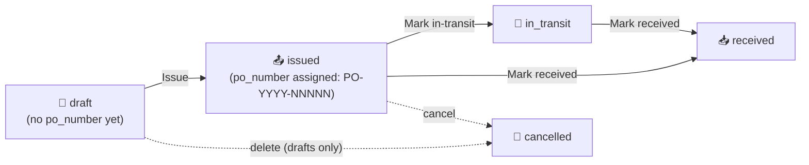

# 28. Purchase Orders & the Size Matrix (M11 + Matrix Initiative)

> **Status (2026-06-02):** All shipped. The matrix primitive that landed in P1 (PR #285, dormant for months) now has four live consumers — the Inventory Matrix view, Sales Order entry, Inventory Adjustments, and the native Purchase Orders module — plus a Size-Scale master, a Prepack-Matrix driver, and a Tangerine-only size-grain on-hand source. Shipped across PRs #727–#738, #743, #746, #747, #749, #754, #757, #759, #760, #762, #766, #786. The by-size on-hand cutover is **rolling out per style** (pilot `RYB0412` #757 → `--batch` #762) and is reversible. The native PO module is origination + status tracking only — it does **not** create FIFO layers on receipt (see §28.5).

This chapter covers the apparel **size matrix** — the color × size grid every apparel operator thinks in — and the native M11 Purchase Orders module that consumes it.

---

## 28.1 The size matrix concept

Apparel inventory is never one SKU; it's a grid. A single style explodes into a `color × size` matrix (and, for denim, a third or fourth axis like inseam or rise). Tangerine models this with a generic 2-to-6-dimensional grid primitive at `src/shared/matrix/`.

### The six axes (`MATRIX_AXES`)

From `src/shared/matrix/types.ts`:

```ts
export const MATRIX_AXES = ["color", "size", "inseam", "length", "fit", "rise"] as const;
```

Six dimensions, in this exact order: `color`, `size`, `inseam`, `length`, `fit`, `rise`. (`rise` was the last added — PR #737 — for denim `HIGH`/`MID`/`LOW`.) The default rendered view is 2-D `color × size`; the pivot control (`MatrixPivotControl`) lets the operator pick any two of the six as the row/column axes, with the remaining four becoming filter chips or layered tabs.

### What renders in a cell

A `MatrixItem` is any object carrying the six dim values plus a `value` (qty, cost, whatever the caller formats). For inventory views the value is on-hand qty; for entry surfaces the cell is an editable input. The primitive itself is presentation-only — it never persists. The caller owns persistence (see §28.4).

### The key lesson — pass `axisValues`

> **MatrixGrid consumers MUST pass `axisValues={{ size: scaleSizes }}` for correct column order.**

By default `useMatrixData` derives each axis's distinct values *from the items present*, which yields **alphabetical** size columns (`L, M, S, XL` instead of `S, M, L, XL`). To force scale order — and to render columns for sizes that have zero items — the caller passes the scale's ordered size list explicitly via the `axisValues` prop:

```tsx
<MatrixGrid items={skuItems} axisValues={{ size: scaleSizes }} />
```

`scaleSizes` comes from the style's Size Scale (§28.2). This was the recurring bug behind PR #733 ("size columns render in scale order, not alphabetical"). The read-only Inventory Matrix panel (§28.6) achieves the same result a different way — it builds its own poMatrixTab-style table and iterates `payload.sizes`, which the server already returns in scale order — but any direct `MatrixGrid` consumer must pass `axisValues`.

---

## 28.2 Size Scale master (`SCALE-NNNNN`)

**Where:** `/tangerine?m=size_scales` · group **📚 Master Data** · icon 📏

A **size scale** is an *ordered* list of size labels — e.g. `ALPHA-XS-3XL = [XS, S, M, L, XL, 2XL, 3XL]` — stored as a Postgres `text[]` on the `size_scales` table. Order is preserved exactly as typed; this ordered array is the single source of truth for matrix column order everywhere.

A style links to one scale via `style_master.size_scale_id`. When a matrix surface needs size columns, `enumerateStyleMatrix` reads `size_scales.sizes` for that style's scale (falling back to the distinct sizes on existing SKUs only when the style has no scale assigned).

### The panel

`src/tanda/InternalSizeScales.tsx` is a standard master CRUD: search by code/name, "Show inactive" toggle, create/edit modal, hard-delete (rejected with a 409 + reference detail if any `style_master` row still points at the scale — deactivate instead). It carries the suite-standard `ExportButton` + `TablePrefsButton` + row-click-to-edit. A right-click context menu offers **"Add size scale below"** (PR #735), which shifts every lower scale's `sort_order` by +1 so the new one slots cleanly into the ordered list.

### Codes are server-generated and read-only

Per the auto-coded-master pattern (operator item 14), the `code` is **`SCALE-NNNNN`** — assigned server-side by `insertWithAutoCode` (`api/_handlers/internal/size-scales/index.js`, prefix `SCALE-`). The create modal shows *"(auto-generated on save)"*; any client-supplied code is ignored. The code field renders greyed/dashed and is never editable.

The migration seeds the common scales (`ALPHA-XS-3XL`, `MENS-S-2XL`, `EVEN-NUM-WAIST`, etc.).

---

## 28.3 How matrix grids appear across the app

The same `color × size` grid shows up on four surfaces, all reading the one shared endpoint `GET /api/internal/style-matrix?style_id=<uuid>` (→ `enumerateStyleMatrix` in `api/_lib/styleMatrix.js`):

| Surface | Where | Matrix role | PR |
|---|---|---|---|
| **Inventory Matrix** | `/tangerine?m=inventory_matrix` | Read-only on-hand view | #729, #737, #759 |
| **Sales Order entry** | SO modal (chapter 27) | Editable qty grid + unit-price header | #730, #743 |
| **Inventory Adjustments** | `/tangerine?m=inventory_adjustments` | Editable signed +/- grid + per-row unit cost | #731, #749 |
| **Native Purchase Orders** | `/tangerine?m=purchase_orders` | Editable qty grid + per-row unit cost | #732, #747 |

The editable surfaces use the `EditableSizeMatrix` component (`src/shared/matrix/EditableSizeMatrix.tsx`), with one grid row per color and size columns from the scale. The read-only Inventory Matrix renders its own table but draws size order from the same payload.

### SKUs auto-create per cell

A `color × size` cell may not yet have a SKU row in `ip_item_master`. When the operator types a qty into a cell and clicks "Add to PO / SO / adjustment", the surface calls `POST /api/internal/style-matrix/resolve-sku` → `resolveOrCreateSku(admin, entityId, { style_id, style_code, color, size, inseam })`. That helper **finds or creates** the sized SKU (composing a unique `sku_code` like `RYB0412-BLACK-32`, retrying with a numeric suffix on a `23505` unique collision). Matrix cells materialize SKUs on first use — so the operator never has to pre-create every size variant.

### Classification source (important caveat)

Style group/category/sub-category come from **`ip_item_master.attributes`** (JSONB), backfilled into `style_master` by migration `20260712240000_p16_classify_backfill_rise_sizes.sql`:

- `attributes.product_category` → `style_master.group_name` (e.g. `BOTTOMS`)
- `attributes.group_name` → `style_master.category_name` (e.g. `DENIM`)
- `attributes.category_name` → `style_master.sub_category_name` (e.g. `STRAIGHT`)

> The `ip_category_master` table and `category_id` column are **EMPTY** — do not use them for classification. The JSONB `attributes` is the truth.

---

## 28.4 The cross-link map

- Sales Order entry and its matrix line entry → see [chapter 27 — Sales Orders, Allocations & Shipping](27-sales-orders-allocations-shipping.md).
- FIFO layers, Inventory Adjustments posting mechanics, and Cycle Counts → see [chapter 11 — Inventory Operations](11-inventory-operations.md).

---

## 28.5 Native Purchase Orders (M11)

**Where:** `/tangerine?m=purchase_orders` · group **📦 Inventory** · icon 📦

The first native PO origination module in Tangerine (PR #732), replacing the read-only Xoro-mirrored PO view. It's brand- and entity-scoped, writes via the service role (anon-read RLS).

### Status lifecycle



The five statuses are enforced by a DB `CHECK` on `purchase_orders.status` (`draft`, `issued`, `in_transit`, `received`, `cancelled`).

### Day-to-day

1. **New PO** → pick vendor (SearchableSelect), brand (defaults to entity brand), order date, expected date, payment terms, notes.
2. **Add lines two ways:**
   - **By matrix** — expand *"➕ Add by matrix (color × size grid)"*, pick a style, fill the `EditableSizeMatrix` (type qtys inline; a "Unit cost $" header field stamps one cost across every color row, then tweak per row). "Add to PO" resolves each non-zero cell to a SKU and appends a line.
   - **Manually** — "+ Add line", pick a SKU, type description / qty / unit $.
3. **Save draft** — header + lines persist; `po_number` stays null.
4. **Issue** — `PATCH {status:'issued'}` assigns the immutable `po_number` = `PO-<order-year>-NNNNN` (zero-padded, entity-unique). Lines become line-locked. The PO number is **never** reassigned.
5. **Mark in-transit / Mark received** — advance status.

### What receiving does NOT do

> **Marking a PO `received` is a pure status flip. It does NOT create FIFO inventory layers, post a JE, or update on-hand.** The `[id].js` PATCH handler only changes `status`; `qty_received` is not written by this path.

FIFO layers and the GL impact (`DR Inventory / CR AP`) are created when the matching **AP invoice** is posted — see [chapter 11 §11.1.x](11-inventory-operations.md). Treat the PO as a *commitment/tracking* document; the receipt-to-inventory bridge is the AP invoice, not the PO status. (This corrects an earlier assumption that PO receipt creates layers — the current code does not.)

### Tables

`purchase_orders` (header: vendor, brand, po_number, order/expected dates, status, currency, payment_terms, subtotal/total cents) + `purchase_order_lines` (line_number, inventory_item_id → `ip_item_master`, description, qty_ordered, qty_received, unit_cost_cents, line_total_cents, line status `open`/`received`/`cancelled`). Both audited via `audit_row_changes_trigger`.

### API surface

| Method | Path | Behavior |
|---|---|---|
| `GET` | `/api/internal/purchase-orders` | List headers. Filters `status`, `vendor_id`, `q` (po_number ilike), `limit` (≤500, default 200). Brand-scoped. |
| `POST` | `/api/internal/purchase-orders` | Create a **draft** (lines with `qty_ordered > 0`; zero/empty lines skipped). |
| `GET` | `/api/internal/purchase-orders/:id` | Header + lines. |
| `PATCH` | `/api/internal/purchase-orders/:id` | Update mutable header fields, replace lines (**drafts only**), and/or change `status`. Issuing assigns `po_number`. |
| `DELETE` | `/api/internal/purchase-orders/:id` | **Drafts only** (409 otherwise — cancel an issued PO instead). Cascades lines. |

---

## 28.6 Inventory Matrix panel

**Where:** `/tangerine?m=inventory_matrix` · group **📦 Inventory** · icon 🧮

A read-only on-hand view (`src/tanda/InternalInventoryMatrix.tsx`, PRs #729/#737/#759). Pick a style → renders a poMatrixTab-style "Item Matrix": one row per color (× rise when the style spans more than one rise), size columns in scale order, an amber **Total**, green **Avg Cost** + **Total Cost**, and a **Last Received** date.

### Controls

- **Brand filter** — scopes the style picker to one brand (client-side, `"" = all brands`).
- **Style picker** — searchable over up to 10k entity styles; searches code, name, description, **and** group/category/sub-category (PR #740).
- **Show: On-Hand / ATS ↗** — On-Hand is the only metric. The old "Available" toggle was **replaced by a link out to the ATS app** at `/ats` (PR #760), which opens in a new tab (PR #766). ATS is the suite's source of truth for available-to-sell.
- **Warehouse filter** — "All" sums every warehouse; individual buttons narrow to one. The breakdown comes from each layer's `notes` `wh=<Store>` token; color-grain layers with no token bucket under `(unassigned)`.
- **Rows: Hide Zero / Show All** — defaults to **Hide Zero** (hides color rows with a zero row-total under the active warehouse). Grand totals are computed over visible rows so they always match what's shown.
- **Prepacks: Off / Explode PPK** — see §28.7.
- **Rise chips** — only when the style spans more than one rise.

The **Avg Cost** column is a qty-weighted blended average across the row's SKUs (cents), sourced from `ip_item_avg_cost` (dollars × 100). **Last Received** is the latest `inventory_layers.received_at` on the row's SKUs. Standard `ExportButton` exports the flat per-row grid.

### By-size on-hand cutover status

This is the financially-material part. **By default the Inventory Matrix is COLOR-grain**, because planning (ATS) deliberately collapses Xoro REST on-hand to color grain in `scripts/rest_to_ats_inventory.py` + `api/_lib/planning-sync.js` (writing `ip_inventory_snapshot` at color grain). Per-size on-hand needs a size-grain source.

Per operator decision (2026-06-01): **other apps stay color-grain; Tangerine gets its OWN size-grain source.** That source is the `tangerine_size_onhand` table (migration `20260713040000_tangerine_size_onhand.sql`), keyed on the per-size `ip_item_master` SKU and populated by `scripts/ingest-size-onhand.mjs` from the nightly Xoro REST CSV.

The cutover is **per-style and reversible**, with a strict **no-op guarantee**: `api/_lib/xoro-mirror/inventory.js` routes a style to the size-grain layer rebuild *only when that style has rows in `tangerine_size_onhand`*. Every other style keeps the color-grain path. Because the table starts empty, the whole mechanism is inert until rows are landed.

Rollout so far:

- **Pilot:** `RYB0412` (PR #757) — also re-pointed to the correct `EVEN-NUM-WAIST` scale.
- **Batch:** `scripts/ingest-size-onhand.mjs --batch` (PR #762) cuts over **all matched styles** at once.

A style that has been cut over shows true per-size on-hand; one that hasn't still shows color-grain on-hand spread across the size row's first cell (the known limitation). To reverse a style, remove its `tangerine_size_onhand` rows.

---

## 28.7 Prepack matrices + Explode-PPK

**Where:** `/tangerine?m=prepack_matrices` · group **📦 Inventory** · icon 📦

Prepacks (PPK) hold inventory in **packs**, not eaches: a pack SKU has a `style_code` ending in `PPK` (e.g. `RYB059430PPK`) and `size` = the pack token (`PPK24`). Nothing else in Tangerine knows a pack's per-garment-size breakdown. The Prepack Matrix driver master (PR #786) supplies it.

### The master

`src/tanda/InternalPrepackMatrix.tsx` over migration `20260715100000_prepack_matrix_driver.sql`:

- **`prepack_matrices`** — one row per prepack: server-generated `code` (**`PPKM-NNNNN`**, read-only), name, `ppk_style_code` (the PPK `style_code` exactly as in `ip_item_master`), `pack_token`, optional `pack_total`. A partial unique index enforces one matrix per `(entity, lower(ppk_style_code))`.
- **`prepack_matrix_sizes`** — the composition: `(matrix_id, size, qty_per_pack, inner_pack_qty)`. The **Pack Token** (e.g. `PPK24`) names the **carton** contents (24 units); the carton is built from **inner packs**. Per size: **`qty_per_pack`** = "Qty Per Box" (carton units of that size) and **`inner_pack_qty`** = how many inner packs of that size. **Carton total = `SUM(qty_per_pack)`** (24 for PPK24); **inner packs = `SUM(inner_pack_qty)`**. `size` matches the **sized sibling** style's size labels. Seeded example `RYB059430PPK` / PPK24: sizes 30·31·33·36 = 1 inner pack × 3 units, 32·34 = 2 inner packs × 6 → **8 inner packs, 24 units**.

The panel supports CRUD plus a **styled** xlsx/csv template round-trip that upserts matrices by `ppk_style_code`. The template (xlsx-js-style) is **colour-coded**:
- **White = pre-filled by the system** — PPK Style Code, Matrix Name (from the master), Pack Token, Carton Qty.
- **Yellow = you fill** — one uniform **Units / Inner Pack** for the style, plus each **Size <x>** cell = the **number of inner packs** of that size.
- **Green = auto formula** — **Num Inner Packs** (`= Carton Qty ÷ Units/Inner Pack`), **Inner Pack Total** (`= Σ size cells`), **Unit Total** (`= Inner Pack Total × Units/Inner Pack`), **Status** (`OK` when Unit Total = Carton Qty, else `CHECK`).

So **carton units for a size = inner packs × Units/Inner Pack**. Example `RYB059430PPK` / Edge Slim / PPK24: Units/Inner Pack = 3, sizes 30·31·33·36 = 1 inner pack, 32·34 = 2 → 8 inner packs × 3 = **24 units**.

- **Download template** ships the one filled Edge Slim example on a single styled sheet.
- **⬇ Download all PPK** fetches every PPK style still lacking a matrix (from `v_prepack_ppk_needed`, via `GET /api/internal/prepack-matrices/needed`) and writes one workbook with **one styled sheet per size scale** — white cells pre-filled from the master (names never guessed), yellow cells blank. Fill it in and upload the whole file in one go.
- **Upload** reads **every sheet** and is section-aware (title / `INNER PACK` band / blank / legend rows skipped; a `PPK Style Code` header re-establishes the columns). It accepts the **inner-pack** format (above), the **long** format (`…| Size | Inner Pack Qty | Qty Per Box`), and **legacy wide** (paired `<size> Inner`/`<size> Box`, or a plain `<size>` = carton units), in `.xlsx` **or `.csv`**. The add/edit modal's composition field (`size:innerPacks:qtyPerBox`, e.g. `32:2:6`) is the manual equivalent.

**Name from master, never guessed.** On create, a blank `name` is resolved from `style_master.style_name` (the PPK code, then its base sibling), falling back to the sibling's `ip_item_master.description` — exactly what `v_prepack_ppk_needed` exposes. The list + editor show composition as **stacked cells (size on top, carton qty below)** — no inner-pack annotation.

### Explode-PPK on the Inventory Matrix

Turning the Inventory Matrix's **Explode PPK** toggle on re-fetches with `&explode_ppk=true`. Server-side, `computePpkExplode` (in `styleMatrix.js`):

1. Takes the SIZED style, finds its **PPK sibling** SKUs by stem (`ppkStem` strips a trailing `-?PPK\d*`), reads each pack's on-hand per warehouse.
2. Looks up the pack's composition in `prepack_matrices` / `prepack_matrix_sizes`.
3. Emits exploded eaches = `packs_on_hand × qty_per_pack` per size, folded into the matrix as additive synthetic cells (no per-each cost — a pack has none).

The panel shows an amber indicator: how many packs were exploded, and a **⚠ warning listing any PPK SKUs that have on-hand but no matrix defined** — those are **NOT exploded** (reported, never guessed) with a prompt to add them in **Prepack Matrices**. The PPK grain gate is canonical: a style is a pack iff its `style_code` matches `/PPK/i`.

---

## 28.8 Adjustments matrix

**Where:** `/tangerine?m=inventory_adjustments` · group **📦 Inventory** · icon 📐

The Inventory Adjustments panel (chapter 11) gained a matrix bulk-entry mode (PRs #731/#749) on top of its single-row create. The operator:

1. Picks `adjustment_type` + counter GL account + reason **once** (applies to every cell).
2. Fills a `color × size` (× inseam) grid (`EditableSizeMatrix`), typing a **signed** `qty_delta` per cell — negative = decrease (FIFO consume), positive = increase (creates a FIFO layer).
3. For **positive** cells, a **per-row "Unit cost (¢)" column is required** (the layer's per-unit cost). Negative cells leave cost blank — FIFO derives it at post.
4. On submit, each non-zero cell resolves a SKU via `resolve-sku`, then POSTs one row to the existing adjustments create endpoint. Posting mechanics (FIFO consume / layer create, GL impact, approval gate, write-off notification) are exactly as documented in [chapter 11 §11.4](11-inventory-operations.md).

The sign convention and per-cell cost rule mirror the single-row CHECK constraint — increase needs a cost, decrease must not have one.

---

## 28.9 What's NOT yet usable

- **PO receipt → inventory.** Marking a PO `received` does not create FIFO layers, post a JE, or update on-hand. Inventory arrives via the AP invoice (chapter 11). There is no PO→layer bridge today.
- **PO line-level receiving.** `qty_received` exists on `purchase_order_lines` but no UI/handler writes it — receiving is header-status only.
- **Size-grain on-hand for most styles.** Only the cut-over styles (`RYB0412` pilot + the `--batch` set) show true per-size on-hand. Every other style is still color-grain in the Inventory Matrix until its `tangerine_size_onhand` rows are landed.
- **Available-to-sell inside Tangerine.** The Inventory Matrix only shows On-Hand; "Available" is an out-link to the ATS app, not a column.
- **MatrixGrid pivot/layers on the Inventory Matrix.** The Inventory Matrix uses a bespoke table, not the pivotable `MatrixGrid`; the 6-axis pivot/filter-chip UX is only exercised by direct `MatrixGrid` consumers.

---

## 28.10 Code map

- **Matrix primitive:** `src/shared/matrix/` — `MatrixGrid.tsx`, `EditableSizeMatrix.tsx`, `MatrixCell.tsx`, `MatrixHeader.tsx`, `MatrixPivotControl.tsx`, `hooks/useMatrixData.ts`, `hooks/useMatrixPivot.ts`, `types.ts` (the `MATRIX_AXES` list), `index.ts` (barrel).
- **Shared matrix lib:** `api/_lib/styleMatrix.js` — `enumerateStyleMatrix` + `computePpkExplode` + `resolveOrCreateSku`. Endpoints: `/api/internal/style-matrix`, `/api/internal/style-matrix/resolve-sku`.
- **Size Scale master:** `src/tanda/InternalSizeScales.tsx`; `api/_handlers/internal/size-scales/index.js` + `[id].js` (handlers h568/h569; `SCALE-NNNNN` via `_lib/autoCode.js`).
- **Native Purchase Orders:** `src/tanda/InternalPurchaseOrders.tsx`; `api/_handlers/internal/purchase-orders/index.js` + `[id].js`; migration `supabase/migrations/20260712230000_p16_m11_purchase_orders.sql`.
- **Inventory Matrix panel:** `src/tanda/InternalInventoryMatrix.tsx` (no new route — reuses style-matrix).
- **Prepack matrices:** `src/tanda/InternalPrepackMatrix.tsx`; `api/_handlers/internal/prepack-matrices/*`; migration `supabase/migrations/20260715100000_prepack_matrix_driver.sql` (`PPKM-NNNNN`).
- **Adjustments matrix:** `src/tanda/InternalInventoryAdjustments.tsx` (matrix sub-panel); posting via `api/_handlers/internal/inventory-adjustments/post.js`.
- **By-size on-hand source:** `supabase/migrations/20260713040000_tangerine_size_onhand.sql`; `scripts/ingest-size-onhand.mjs` (`--batch`); router `api/_lib/xoro-mirror/inventory.js`.
- **Classification backfill:** `supabase/migrations/20260712240000_p16_classify_backfill_rise_sizes.sql` (group/category/sub from `ip_item_master.attributes`).
