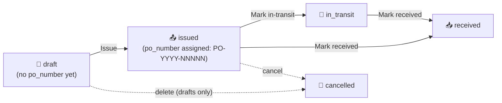

# 28. Purchase Orders & the Size Matrix (M11 + Matrix Initiative)

> **Status (2026-06-02):** All shipped. The matrix primitive that landed in P1 (PR #285, dormant for months) now has four live consumers — the Inventory Matrix view, Sales Order entry, Inventory Adjustments, and the native Purchase Orders module — plus a Size-Scale master, a Prepack-Matrix driver, and a Tangerine-only size-grain on-hand source. Shipped across PRs #727–#738, #743, #746, #747, #749, #754, #757, #759, #760, #762, #766, #786. The by-size on-hand cutover is **rolling out per style** (pilot `RYB0412` #757 → `--batch` #762) and is reversible. The native PO module is origination + status tracking only — it does **not** create FIFO layers on receipt (see §28.5).

This chapter covers the apparel **size matrix** — the color × size grid every apparel operator thinks in — and the native M11 Purchase Orders module that consumes it.

---

## 28.1 The size matrix concept

Apparel inventory is never one SKU; it's a grid. A single style explodes into a `color × size` matrix (and, for denim, a third or fourth axis like inseam or rise). Tangerine models this with a generic 2-to-6-dimensional grid primitive at `src/shared/matrix/`.

### The six axes (`MATRIX_AXES`)

From `src/shared/matrix/types.ts`:

```ts
export const MATRIX_AXES = ["color", "size", "inseam", "length", "fit", "rise"] as const;
```

Six dimensions, in this exact order: `color`, `size`, `inseam`, `length`, `fit`, `rise`. (`rise` was the last added — PR #737 — for denim `HIGH`/`MID`/`LOW`.) The default rendered view is 2-D `color × size`; the pivot control (`MatrixPivotControl`) lets the operator pick any two of the six as the row/column axes, with the remaining four becoming filter chips or layered tabs.

### What renders in a cell

A `MatrixItem` is any object carrying the six dim values plus a `value` (qty, cost, whatever the caller formats). For inventory views the value is on-hand qty; for entry surfaces the cell is an editable input. The primitive itself is presentation-only — it never persists. The caller owns persistence (see §28.4).

### The key lesson — pass `axisValues`

> **MatrixGrid consumers MUST pass `axisValues={{ size: scaleSizes }}` for correct column order.**

By default `useMatrixData` derives each axis's distinct values *from the items present*, which yields **alphabetical** size columns (`L, M, S, XL` instead of `S, M, L, XL`). To force scale order — and to render columns for sizes that have zero items — the caller passes the scale's ordered size list explicitly via the `axisValues` prop:

```tsx
<MatrixGrid items={skuItems} axisValues={{ size: scaleSizes }} />
```

`scaleSizes` comes from the style's Size Scale (§28.2). This was the recurring bug behind PR #733 ("size columns render in scale order, not alphabetical"). The read-only Inventory Matrix panel (§28.6) achieves the same result a different way — it builds its own poMatrixTab-style table and iterates `payload.sizes`, which the server already returns in scale order — but any direct `MatrixGrid` consumer must pass `axisValues`.

---

## 28.2 Size Scale master (`SCALE-NNNNN`)

**Where:** `/tangerine?m=size_scales` · group **📚 Master Data** · icon 📏

A **size scale** is an *ordered* list of size labels — e.g. `ALPHA-XS-3XL = [XS, S, M, L, XL, 2XL, 3XL]` — stored as a Postgres `text[]` on the `size_scales` table. Order is preserved exactly as typed; this ordered array is the single source of truth for matrix column order everywhere.

A style links to one scale via `style_master.size_scale_id`. When a matrix surface needs size columns, `enumerateStyleMatrix` reads `size_scales.sizes` for that style's scale (falling back to the distinct sizes on existing SKUs only when the style has no scale assigned).

**Inseams (bottoms).** A scale also carries an *optional* ordered `inseams` `text[]` (migration `20260838000000`), entered exactly like sizes — comma-separated, order preserved — in the same create/edit modal. Leave it blank for tops and accessories (a *size-only* scale); fill it for pants and shorts (e.g. `30, 32, 34`). A style on that scale inherits both axes. The **Inseams** column in the panel (and export) shows `—` for size-only scales. When inseam is active on an entry/view screen, the matrix renders **one row per style × inseam × color**, with a **subtotal row** rolling up all inseams for the same style × color _(rendering sweep — phased rollout)_.

**Assigning a scale to a style.** Two ways:
- **Per style** — Master Data → **Style Master** → edit a style → the **Size Scale** field (a searchable picker of the `size_scales` master). This is the manual override and always wins. Each style's assigned scale shows in the **Size Scale column** of the Style Master list (and its export), so you can see/sort/confirm what's assigned.
- **Bulk auto-assign** — Style Master header → **🎯 Auto-assign size scales**. It matches every *unscaled* style to the **best-available** scale by its actual size variants (the distinct non-PPK sizes on its SKUs), using its gender to disambiguate look-alike runs (e.g. an `S–XL` run goes to KIDS for a kids' gender, MENS for a men's). Size tokens are normalised first (`SML`→S, `LRG`→L, `XLG`→XL, `XXL`→2XL, combined `L/12` matches alpha *or* numeric scales). It **previews** the per-scale breakdown before writing, only fills styles that have **no scale yet** (never overwrites), and assigns only **full size runs (≥3 sizes)** — styles with **fewer than 3 sizes** (a single or a weak pair) or **no good match** (<60% of variants covered) are skipped and stay unassigned for you to set by hand. Matcher: pure `api/_lib/sizeScaleMatch.js` (unit-tested); writes via `apply_size_scale_assignments`. This is what makes the **Prepack "Download all PPK"** workbook consolidate styles onto one tab per scale (§28.5). The **⬇ Skipped styles** button (next to it) downloads an xlsx of every style the auto-assign skipped, with the reason, so you can hand-assign those. _(A first bulk run on 2026-06-04 assigned **681** styles — MENS-S-2XL 404, DENIM-WAIST 119, KIDS 54, WOMENS-NUM 52, EVEN-NUM-WAIST 44, TODDLER 8.)_

### The panel

`src/tanda/InternalSizeScales.tsx` is a standard master CRUD: search by code/name, "Show inactive" toggle, create/edit modal, hard-delete (rejected with a 409 + reference detail if any `style_master` row still points at the scale — deactivate instead). It carries the suite-standard `ExportButton` + `TablePrefsButton` + row-click-to-edit. A right-click context menu offers **"Add size scale below"** (PR #735), which shifts every lower scale's `sort_order` by +1 so the new one slots cleanly into the ordered list. The modal has two ordered-list fields — **Sizes** (required) and **Inseams** (optional, for bottoms) — each with a live chip preview; inseams may be cleared at any time to revert a scale to size-only.

### Codes are server-generated and read-only

Per the auto-coded-master pattern (operator item 14), the `code` is **`SCALE-NNNNN`** — assigned server-side by `insertWithAutoCode` (`api/_handlers/internal/size-scales/index.js`, prefix `SCALE-`). The create modal shows *"(auto-generated on save)"*; any client-supplied code is ignored. The code field renders greyed/dashed and is never editable.

The migration seeds the common scales (`ALPHA-XS-3XL`, `MENS-S-2XL`, `EVEN-NUM-WAIST`, etc.).

---

## 28.3 How matrix grids appear across the app

The same `color × size` grid shows up on four surfaces, all reading the one shared endpoint `GET /api/internal/style-matrix?style_id=<uuid>` (→ `enumerateStyleMatrix` in `api/_lib/styleMatrix.js`):

| Surface | Where | Matrix role | PR |
|---|---|---|---|
| **Inventory Matrix** | `/tangerine?m=inventory_matrix` | Read-only on-hand view | #729, #737, #759 |
| **Sales Order entry** | SO modal (chapter 27) | Editable qty grid + unit-price header | #730, #743 |
| **Inventory Adjustments** | `/tangerine?m=inventory_adjustments` | Editable signed +/- grid + per-row unit cost | #731, #749 |
| **Native Purchase Orders** | `/tangerine?m=purchase_orders` | Editable qty grid + per-row unit cost | #732, #747 |

The editable surfaces use the `EditableSizeMatrix` component (`src/shared/matrix/EditableSizeMatrix.tsx`), with one grid row per color and size columns from the scale. The read-only Inventory Matrix renders its own table but draws size order from the same payload.

### SKUs auto-create per cell

A `color × size` cell may not yet have a SKU row in `ip_item_master`. When the operator types a qty into a cell and clicks "Add to PO / SO / adjustment", the surface calls `POST /api/internal/style-matrix/resolve-sku` → `resolveOrCreateSku(admin, entityId, { style_id, style_code, color, size, inseam })`. That helper **finds or creates** the sized SKU (composing a unique `sku_code` like `RYB0412-BLACK-32`, retrying with a numeric suffix on a `23505` unique collision). Matrix cells materialize SKUs on first use — so the operator never has to pre-create every size variant.

### Classification source (important caveat)

Style group/category/sub-category come from **`ip_item_master.attributes`** (JSONB), backfilled into `style_master` by migration `20260712240000_p16_classify_backfill_rise_sizes.sql`:

- `attributes.product_category` → `style_master.group_name` (e.g. `BOTTOMS`)
- `attributes.group_name` → `style_master.category_name` (e.g. `DENIM`)
- `attributes.category_name` → `style_master.sub_category_name` (e.g. `STRAIGHT`)

> The `ip_category_master` table and `category_id` column are **EMPTY** — do not use them for classification. The JSONB `attributes` is the truth.

---

## 28.4 The cross-link map

- Sales Order entry and its matrix line entry → see [chapter 27 — Sales Orders, Allocations & Shipping](27-sales-orders-allocations-shipping.md).
- FIFO layers, Inventory Adjustments posting mechanics, and Cycle Counts → see [chapter 11 — Inventory Operations](11-inventory-operations.md).

---

## 28.5 Native Purchase Orders (M11)

**Where:** `/tangerine?m=purchase_orders` · group **📦 Inventory** · icon 📦

The first native PO origination module in Tangerine (PR #732), replacing the read-only Xoro-mirrored PO view. It's brand- and entity-scoped, writes via the service role (anon-read RLS).

### Status lifecycle



The five statuses are enforced by a DB `CHECK` on `purchase_orders.status` (`draft`, `issued`, `in_transit`, `received`, `cancelled`).

### Day-to-day

1. **New PO** → fill the **rich document header**, grouped into sections:
   - **Identity & status** — PO type (stock / replenishment / made-to-order / sample / drop-ship), Customer, an editable **PO number prefix** (overrides `PO-` when the order is issued), and the read-only PO number / status.
   - **Vendor / supplier** — Vendor (lookup), vendor contact + email, vendor PO / ref #, factory / production location, COO (country lookup).
   - **Dates** — order, requested delivery / in-DC, ship-window start–end, port date, vendor-confirmed / acknowledged, expected, cancel.
   - **Logistics & destination** — ship-to location / warehouse, bill-to entity (multi-entity), ship method (sea / air / ground), consolidator / freight forwarder.
   - **Classification & terms** — brand, season (from the Season master), channel, **Department** (main category from the Category master), payment terms.
   - **Roll-up (read-only)** — **total weight / cartons / CBM**, computed from each style's **Pack / logistics** fields in Style Master (units × unit weight; units ÷ units-per-carton, rounded up; cartons × carton CBM). It populates after the first save; a note appears if any style is missing those fields. *(The status flow itself is unchanged — draft → issued → in_transit → received → cancelled.)*
1a. **Create from a Sales Order** (new PO) — the **📋 Create from Sales Order** button (above the matrix) opens a dynamic SO search. Pick an SO and its **styles / colors / sizes / quantities** fill the PO matrix, and the customer / brand / channel / dates carry over to the header. **Unit costs stay blank** (the SO holds selling prices, not costs — set them by hand or via *Get PO price*). The PO records `sales_order_id` for traceability.

1b. **Get PO price** (new PO) — the **💲 Get PO price** button pulls the **awarded** cost from the costing module's RFQs. It first asks *"Is this PO being created from a Sales Order?"*:
   - **Yes** → it opens the SO picker first (1a), fills the matrix from the SO, then looks up the awarded RFQ for each of those styles.
   - **No** → it lists all awarded styles to choose from.
   The **awarded-quotes** lookup (`GET /api/internal/costing/awarded-quotes`) joins `costing_lines` (status `awarded`) → the selected `costing_line_vendors` quote → vendor, returning **vendor name, awarded date, and price** (newest first). When a style has **more than one** award, you pick which to use. **Apply** stamps the awarded cost onto every color row of that style and sets the PO **vendor**. (If the picks span vendors — a PO is to one vendor — you're warned to set it manually.) Always review before saving.
2. **Add lines — the body IS the size matrix** (the same `LineMatrixBody` the Sales Order modal uses, in `mode="po"`). It opens with the matrix ready:
   - **➕ Add style (matrix)** — pick a style → fill its color × size grid inline, with a per-row **Unit Cost $** column + a "set all rows" header field. The new style picker is inserted at the **top** of existing styles. (PO mode shows cost, not margin or on-hand.)
   - **Qty quick-fill** — each color row has a **Qty** box (between Color and the first size). Type one total (e.g. `1200`) and press **Enter/Tab**: the qty is split across sizes using the style's stored **size scale** pack ratio (set in Style Master → **📐 Scale**), then **each size is rounded up to a full carton of 24**. The grand total can land slightly above what you typed (the round-up); that's expected. The box is disabled for styles with no Scale set (tooltip explains).
   - **Carton check** — if any color × size cell ends up a partial carton (a positive qty not divisible by 24) — typically from hand-editing a size — one **⚠️ not full cartons of 24** banner under the grid lists the offending cells so you can accept as-is or adjust.
   - **Per-style dates** — each style block has a **Requested ship** and **Vendor-confirmed ship** date pair (PO only). They're stamped onto every SKU line of that style at save (`purchase_order_lines.requested_ship_date` / `vendor_confirmed_ship_date`) and repopulate when you re-open the PO.
   - **+ Add non-matrix line** — for the rare one-off SKU, a plain SKU / qty / Unit Cost $ row.
   - At save, every filled cell resolves to an `ip_item_master` SKU and posts with `unit_cost_cents`. The Save / Close buttons sit in a **frozen footer** that stays visible as the matrix grows.
3. **Audit trail** — re-open any saved PO to see the **Audit trail** timeline at the bottom (the shared T11 `RowHistory`): every header/line field change is recorded with the changed columns, before/after values, and timestamp (`row_changes`, via the universal audit trigger now attached to `purchase_orders` + `purchase_order_lines`).
3. **Save draft** — header + lines persist; `po_number` stays null.
4. **Issue** — `PATCH {status:'issued'}` assigns the immutable `po_number` = `PO-<order-year>-NNNNN` (zero-padded, entity-unique). Lines become line-locked. The PO number is **never** reassigned.
5. **Mark in-transit / Mark received** — advance status.

**Finding a PO (list search).** The **Search PO #, vendor, style…** box is **all-field**: the server matches the typed text against the **PO number**, the **vendor name / code**, the order **notes**, and any **line's style / SKU / line description** (case-insensitive, substring), alongside the **Vendor** and **Status** filters (all ANDed), updating as you type (200 ms debounce). The whole search runs in the `search_purchase_orders` SQL function, so it spans the entire book — not just the loaded rows — including the line-level style/SKU match.

### What receiving does NOT do

> **Marking a PO `received` is a pure status flip. It does NOT create FIFO inventory layers, post a JE, or update on-hand.** The `[id].js` PATCH handler only changes `status`; `qty_received` is not written by this path.

FIFO layers and the GL impact (`DR Inventory / CR AP`) are created when the matching **AP invoice** is posted — see [chapter 11 §11.1.x](11-inventory-operations.md). Treat the PO as a *commitment/tracking* document; the receipt-to-inventory bridge is the AP invoice, not the PO status. (This corrects an earlier assumption that PO receipt creates layers — the current code does not.)

### Tables

`purchase_orders` (header: vendor, brand, po_number, order/expected dates, status, currency, payment_terms, subtotal/total cents) + `purchase_order_lines` (line_number, inventory_item_id → `ip_item_master`, description, qty_ordered, qty_received, unit_cost_cents, line_total_cents, line status `open`/`received`/`cancelled`). Both audited via `audit_row_changes_trigger`.

### API surface

| Method | Path | Behavior |
|---|---|---|
| `GET` | `/api/internal/purchase-orders` | List headers. Filters `status`, `vendor_id`, `q` (po_number ilike), `limit` (≤500, default 200). Brand-scoped. |
| `POST` | `/api/internal/purchase-orders` | Create a **draft** (lines with `qty_ordered > 0`; zero/empty lines skipped). |
| `GET` | `/api/internal/purchase-orders/:id` | Header + lines. |
| `PATCH` | `/api/internal/purchase-orders/:id` | Update mutable header fields, replace lines (**drafts only**), and/or change `status`. Issuing assigns `po_number`. |
| `DELETE` | `/api/internal/purchase-orders/:id` | **Drafts only** (409 otherwise — cancel an issued PO instead). Cascades lines. |

---

## 28.6 Inventory Matrix panel

**Where:** `/tangerine?m=inventory_matrix` · group **📦 Inventory** · icon 🧮

A read-only on-hand view (`src/tanda/InternalInventoryMatrix.tsx`, PRs #729/#737/#759). Pick a style → renders a poMatrixTab-style "Item Matrix": one row per color (× rise when the style spans more than one rise), size columns in scale order, an amber **Total**, green **Avg Cost** + **Total Cost**, and a **Last Received** date.

### Product image (PR #969)

Once a style is picked, its **primary product image** appears as a thumbnail **immediately before the style number** in the meta line above the grid. The image comes from the **same source as the PIM Product Catalog** (`GET /api/internal/pim/styles/:style_id` → the style's `images[]`, primary first), so the two views always match. Styles with no image show a 🖼️ placeholder. **Click the thumbnail to enlarge** — a full-screen lightbox shows the full-resolution image with a **⬇ Download** button (saves the image file to your computer); click anywhere outside or **✕ Close** to dismiss. Only the selected style's image is fetched (one request, no list-wide load).

### Controls

- **Brand filter** — scopes the style picker to one brand (client-side, `"" = all brands`).
- **Style picker** — searchable over up to 10k entity styles; searches code, name, description, group/category/sub-category (PR #740), **and the style's brand code/name** (PR #956) so a brand-alone search (e.g. typing `ROF` or `Psycho Tuna` into the Style box) resolves that brand's styles.
- **Show: On-Hand / ATS ↗** — On-Hand is the only metric. The old "Available" toggle was **replaced by a link out to the ATS app** at `/ats` (PR #760), which opens in a new tab (PR #766). ATS is the suite's source of truth for available-to-sell. The link is **deep-linked to the currently-selected style** (PR #21): it carries `?style=<style_code>`, which ATS reads on load and seeds into its free-text search box so ATS opens already filtered to that style.
- **Warehouse filter** — "All" sums every warehouse; individual buttons narrow to one. The breakdown comes from each layer's `notes` `wh=<Store>` token; color-grain layers with no token bucket under `(unassigned)`.
- **Rows: Hide Zero / Show All** — defaults to **Hide Zero** (hides color rows with a zero row-total under the active warehouse). Grand totals are computed over visible rows so they always match what's shown.
- **Prepacks: Off / Explode PPK** — see §28.7.
- **By Inseam** (PR #1096; brand-view in #1098) — appears when the picked style's size scale carries inseams (§28.2) **or**, in the brand/all-styles view, when **any** loaded style does. Toggling it ON splits each color into **one row per inseam** (ordered by the scale's inseam order, with any stray SKU inseams appended) and adds a **per-color Subtotal row** rolling up all inseams for that style + color. A color that has **only one inseam** gets **no subtotal** (it would just duplicate the single row) — PR #1104. A new **Inseam** column (replacing the Rise column in this mode) shows each row's inseam (e.g. `32"`). In the **brand/all-styles view** the toggle is global — each style block with inseams splits the same way; blocks without inseams render unchanged. The Export mirrors the on-screen grid — an Inseam column plus a `{color} — subtotal` row after each multi-inseam color group. The same row-per-inseam + subtotal pattern is being swept across the other matrix surfaces (PO matrix, ATS, allocations).
- **Rise chips** — only when the style spans more than one rise.

The **Avg Cost** column is a qty-weighted blended average across the row's SKUs (cents), sourced from `ip_item_avg_cost` (dollars × 100). **Last Received** is the latest `inventory_layers.received_at` on the row's SKUs. Standard `ExportButton` exports the flat per-row grid.

> **Blend note (PR #20).** `ip_item_avg_cost` is keyed by `sku_code`, and many color/size SKUs have no matching cost row (the master's `sku_code` spelling — e.g. `RYB0412-CREAM-TONAL-GRIZZLY-CAMO-32` — doesn't match the cost table's `RYB0412-CREAMTONALGRIZZLYCAMO-32`). The blend therefore weights **only the qty of SKUs that actually carry a cost** (`costedQty`), not the row's total qty. Weighting by total qty understated the average whenever cost coverage was partial — e.g. RYB0412 "Cream Tonal Grizzly Camo" / "Wither Fade Ashen Camo" showed **$0.81** (one costed size out of five) instead of the real **~$5.72**. The fix keeps the average on the same per-unit basis as the data; zero/near-zero costs are ignored.

### View-mode switch — Matrix / SO / PO / Invoices (PR #1040)

When a single style is picked, a row of **view-mode buttons** appears under the controls: **🧮 Matrix · 🛒 SO · 📦 PO · 🧾 Invoices**. These are buttons (not links) — they swap the panel body in place:

- **Matrix** (default) — the on-hand size matrix described above.
- **SO** — every **Sales Order that contains the style** (across **all statuses**, not just open), one row each: **SO #**, **Customer** (resolved name — no uuid), **Qty (style)** (units of this style on the order), **Order Total**, **Ship Date** (`requested_ship_date`), **Cancel Date**, and **Status**. **Click any row** to drill through to that sales order in the **Sales Orders** module (it opens filtered to that SO #).
- **PO** — every **Purchase Order that contains the style**: **PO #**, **Vendor**, **Qty (style)**, **Order Total**, **DDP Date** (`expected_date`), **Status**. Row-click drills to the **Purchase Orders** module filtered to that PO #.
- **Invoices** — every **AR customer invoice that contains the style**: **Invoice #**, **Customer**, **Qty (style)**, **Total**, **Invoice Date**, **Status** (`gl_status`). Row-click drills to the **AR Invoices** module filtered to that invoice #.

The lists are powered by `GET /api/internal/style-orders?style_id=<uuid>&view=so|po|invoices`, which resolves the style's inventory item ids (`ip_item_master.style_id`), finds the headers whose lines reference one of those items, and returns the rows with all `*_id` fields **already resolved to human labels** (customer/vendor name) server-side. Each list has its own **Export** button. Drill-through reuses the canonical scorecard-drill URL contract (`drillToModule`), so it lands in the real record's module with the panel's search seeded.

### ATS-style inventory filters that scope the style picker (PR #1040)

Mirroring the **ATS app's filter bar**, the controls now include **Gender**, **Group**, and **Category** multi-select chip filters (in addition to the existing **Brand** picker). Each narrows the **style picker** to styles matching the selected values (`style_master.gender_code / group_name / category_name`), so you can browse a brand's Men's tops (etc.) without knowing the exact style code. The filters are derived from the loaded style list and only render when there are values to offer for the current brand scope. They are additive on top of the Brand filter; Brand and Style remain their own pickers (no duplication).

### Per-color image thumbnails (PR #1022)

Each color row now shows a **44 × 44 px thumbnail** in the first column ("Img"). The image for each row comes from the style's PIM images filtered to that color (first image per color wins; falls back to the style's default image if no color-specific image is found). Styles or colors with no PIM image show a dark placeholder square. Image loading is non-fatal — the matrix renders immediately and fills in thumbnails asynchronously.

### Brand-level view (PR #1022)

**Pick a brand but leave the Style picker empty.** Instead of the "Pick a style…" prompt, the panel loads matrices for up to **50 of the brand's styles in parallel** and renders them stacked, each with a header bar showing the style code and name. The active Warehouse and Hide-Zero-Rows filters apply to all sub-matrices. Styles that return no SKUs (or whose every row is zero under the active filters) are omitted. This view gives the operator a quick brand-wide on-hand snapshot without clicking through styles one by one.

### By-size on-hand cutover status

This is the financially-material part. **By default the Inventory Matrix is COLOR-grain**, because planning (ATS) deliberately collapses Xoro REST on-hand to color grain in `scripts/rest_to_ats_inventory.py` + `api/_lib/planning-sync.js` (writing `ip_inventory_snapshot` at color grain). Per-size on-hand needs a size-grain source.

Per operator decision (2026-06-01): **other apps stay color-grain; Tangerine gets its OWN size-grain source.** That source is the `tangerine_size_onhand` table (migration `20260713040000_tangerine_size_onhand.sql`), keyed on the per-size `ip_item_master` SKU and populated by `scripts/ingest-size-onhand.mjs` from the nightly Xoro REST CSV.

The cutover is **per-style and reversible**, with a strict **no-op guarantee**: `api/_lib/xoro-mirror/inventory.js` routes a style to the size-grain layer rebuild *only when that style has rows in `tangerine_size_onhand`*. Every other style keeps the color-grain path. Because the table starts empty, the whole mechanism is inert until rows are landed.

Rollout so far:

- **Pilot:** `RYB0412` (PR #757) — also re-pointed to the correct `EVEN-NUM-WAIST` scale.
- **Batch:** `scripts/ingest-size-onhand.mjs --batch` (PR #762) cuts over **all matched styles** at once.

A style that has been cut over shows true per-size on-hand; one that hasn't still shows color-grain on-hand spread across the size row's first cell (the known limitation). To reverse a style, remove its `tangerine_size_onhand` rows.

---

## 28.7 Prepack matrices + Explode-PPK

**Where:** `/tangerine?m=prepack_matrices` · group **📚 Master Data** · icon 📦 _(moved from Inventory — it's a master, like Size Scales)_

Prepacks (PPK) hold inventory in **packs**, not eaches: a pack SKU has a `style_code` ending in `PPK` (e.g. `RYB059430PPK`) and `size` = the pack token (`PPK24`). Nothing else in Tangerine knows a pack's per-garment-size breakdown. The Prepack Matrix driver master (PR #786) supplies it.

### The master

`src/tanda/InternalPrepackMatrix.tsx` over migration `20260715100000_prepack_matrix_driver.sql`:

- **`prepack_matrices`** — one row per prepack: server-generated `code` (**`PPKM-NNNNN`**, read-only), name, `ppk_style_code` (the PPK `style_code` exactly as in `ip_item_master`), `pack_token`, optional `pack_total`. A partial unique index enforces one matrix per `(entity, lower(ppk_style_code))`.
- **`prepack_matrix_sizes`** — the composition: `(matrix_id, size, qty_per_pack, inner_pack_qty)`. The **Pack Token** (e.g. `PPK24`) names the **carton** contents (24 units); the carton is built from **inner packs**. Per size: **`qty_per_pack`** = "Qty Per Box" (carton units of that size) and **`inner_pack_qty`** = how many inner packs of that size. **Carton total = `SUM(qty_per_pack)`** (24 for PPK24); **inner packs = `SUM(inner_pack_qty)`**. `size` matches the **sized sibling** style's size labels. Seeded example `RYB059430PPK` / PPK24: sizes 30·31·33·36 = 1 inner pack × 3 units, 32·34 = 2 inner packs × 6 → **8 inner packs, 24 units**.

The panel lists existing matrices; **below them, a dashed "PPK styles still needing a matrix" table** surfaces every PPK style that doesn't have one yet (from `v_prepack_ppk_needed`). **The search box filters both** — so typing a style number brings up the style whether or not it has a matrix, and **+ Create** opens the add form pre-filled with that style's PPK code, name and pack token. (The search updates as you type — no Enter needed.)

The panel supports CRUD plus a **styled** xlsx/csv template round-trip that upserts matrices by `ppk_style_code`. The template (xlsx-js-style) is **colour-coded**:
- **White = pre-filled by the system** — PPK Style Code, Matrix Name (from the master), Pack Token, Carton Qty.
- **Yellow = you fill** — one uniform **Units / Inner Pack** for the style, plus each **Size <x>** cell = the **number of inner packs** of that size.
- **Green = auto formula** — **Num Inner Packs** (`= Σ of the per-size inner packs`), **Unit Total** (`= Num Inner Packs × Units/Inner Pack`), **Status** (`OK` when Unit Total = Carton Qty, else `CHECK`).

So **carton units for a size = inner packs × Units/Inner Pack**. Example `RYB059430PPK` / Edge Slim / PPK24: Units/Inner Pack = 3, sizes 30·31·33·36 = 1 inner pack, 32·34 = 2 → 8 inner packs × 3 = **24 units**.

### Bulk seed 2026-06-09 (135 active matrices)

From an operator template (`matrices ppk.csv`) Claude bulk-seeded **116 new** matrices + **refreshed 15** RCB ones (→ **135 active**), matched to PPK styles by **prefix + pack token**:

| Template | Composition (qty/pack per size) | Carton |
|---|---|---|
| **RBB-PPK48** | 8·12, 10·12, 12·12, 14·12 | 48 |
| **RBB-PPK24** | 8·6, 10·6, 12·6, 14·6 | 24 |
| **RCB-PPK60** | 4·15, 5·15, 6·15, 7·15 | 60 |
| **RCB-PPK24** | 4·6, 5·6, 6·6, 7·6 | 24 |
| **RYO-PPK18** | SML·3, MED·6, LRG·6, XLG·3 (1 inner each except MED/LRG·2) | 18 |

These PPK styles now explode in the Inventory Matrix. **83 PPK styles still lack a matrix** and await operator curves — exported to `Producton Orders/PPK_matrices_need_guidance.xlsx` (RYB denim need a waist curve, not the alpha RYB-PPK24; RYG/ACMB/RBG/RBO/etc. have no template yet; some have no pack-token SKU; `RBB1042-PPK` is ambiguous across PPK40/44/48).

- **Download template** ships the one filled Edge Slim example on a single styled sheet.
- **⬇ Download all PPK** fetches every PPK style still lacking a matrix (from `v_prepack_ppk_needed`, via `GET /api/internal/prepack-matrices/needed`) and writes one workbook **grouped by size scale**: every style sharing the same **assigned size scale** (`style_master.size_scale_id` → `size_scales`) lands on **one tab**, with that scale's **canonical ordered sizes** as the columns. Styles with **no scale assigned** fall back to grouping by their raw size-set (one tab per distinct set, as before). White cells pre-filled from the master (names never guessed), yellow cells blank. Fill it in and upload the whole file in one go. **One-size groups are omitted** — a single-column prepack template is useless. Size columns sort **numerically** even for combined alpha/number labels (e.g. `S/8 · M/10 · L/12 · XL/14` order by 8·10·12·14, not by the letter). **To get the consolidated by-scale tabs, assign a Size Scale to each style** (Style Master → 🎯 Auto-assign size scales, §28.2) — unscaled styles fall back to per-size-set tabs.
- **Upload** reads **every sheet** and is section-aware (title / `INNER PACK` band / blank / legend rows skipped; a `PPK Style Code` header re-establishes the columns). It accepts the **inner-pack** format (above), the **long** format (`…| Size | Inner Pack Qty | Qty Per Box`), and **legacy wide** (paired `<size> Inner`/`<size> Box`, or a plain `<size>` = carton units), in `.xlsx` **or `.csv`**. The **+ Add matrix / Edit** modal builds the composition the **same horizontal way it renders in the list** (no typed syntax): an **inner packs** grid (one boxed cell per size, you type the count) **× a Units / Inner Pack** field **= a carton** grid (box qty per size, auto-fills = inner × units, still editable), with live **inner-packs** and **carton** totals above each grid and a **warning when the carton total ≠ the pack token's qty** (e.g. PPK24 → must sum to 24). Type a label + **Add size** to add a column — it **slots into the correct sort order on both grids**; click a size label to remove it. **+ Create** from the "needs a matrix" list pre-loads the sizes. A **Size scale** picker at the top of the composition (a searchable dropdown of the Size Scale Master — search by code, name or sizes) lays the chosen scale's **ordered sizes out as the columns** in one click, so you don't hand-type each size (any inner/box you'd already typed for a matching size is kept); you can still add or remove sizes by hand afterwards. Both Inner Packs and Box Qty are saved per size, so editing a box quantity no longer drops the inner-pack breakdown _(the edit/PATCH path now persists `inner_pack_qty` too — previously a save could silently drop it)_.

**Name from master, never guessed.** On create, a blank `name` is resolved from `style_master.style_name` (the PPK code, then its base sibling), falling back to the sibling's `ip_item_master.description` — exactly what `v_prepack_ppk_needed` exposes.

**Composition display (paired view).** The list **and** the edit-modal preview show the composition the way the carton actually breaks down: the per-size **inner-packs** grid `× Units/Inner Pack` = the per-size **carton** grid, with both totals (`inner packs = N` and `carton total = M`). Legacy matrices that carry no inner-pack data fall back to the single carton grid. The **Search** box filters the list **instantly as you type** (code / name / PPK style) — no button press needed (Enter / the Search button still refresh from the server for large sets).

### Explode-PPK on the Inventory Matrix

Turning the Inventory Matrix's **Explode PPK** toggle on re-fetches with `&explode_ppk=true`. Server-side, `computePpkExplode` (in `styleMatrix.js`):

1. Takes the SIZED style, finds its **PPK sibling** SKUs by stem (`ppkStem` strips a trailing `-?PPK\d*`), reads each pack's on-hand per warehouse.
2. Looks up the pack's composition in `prepack_matrices` / `prepack_matrix_sizes`.
3. Emits exploded eaches = `packs_on_hand × qty_per_pack` per size, folded into the matrix as additive synthetic cells (no per-each cost — a pack has none).

The panel shows an amber indicator: how many packs were exploded, and a **⚠ warning listing any PPK SKUs that have on-hand but no matrix defined** — those are **NOT exploded** (reported, never guessed) with a prompt to add them in **Prepack Matrices**. The PPK grain gate is canonical: a style is a pack iff its `style_code` matches `/PPK/i`.

---

## 28.8 Adjustments matrix

**Where:** `/tangerine?m=inventory_adjustments` · group **📦 Inventory** · icon 📐

The Inventory Adjustments panel (chapter 11) gained a matrix bulk-entry mode (PRs #731/#749) on top of its single-row create. The operator:

1. Picks `adjustment_type` + counter GL account + reason **once** (applies to every cell).
2. Fills a `color × size` (× inseam) grid (`EditableSizeMatrix`), typing a **signed** `qty_delta` per cell — negative = decrease (FIFO consume), positive = increase (creates a FIFO layer).
3. For **positive** cells, a **per-row "Unit cost (¢)" column is required** (the layer's per-unit cost). Negative cells leave cost blank — FIFO derives it at post.
4. On submit, each non-zero cell resolves a SKU via `resolve-sku`, then POSTs one row to the existing adjustments create endpoint. Posting mechanics (FIFO consume / layer create, GL impact, approval gate, write-off notification) are exactly as documented in [chapter 11 §11.4](11-inventory-operations.md).

The sign convention and per-cell cost rule mirror the single-row CHECK constraint — increase needs a cost, decrease must not have one.

---

## 28.9 What's NOT yet usable

- **PO receipt → inventory.** Marking a PO `received` does not create FIFO layers, post a JE, or update on-hand. Inventory arrives via the AP invoice (chapter 11). There is no PO→layer bridge today.
- **PO line-level receiving.** `qty_received` exists on `purchase_order_lines` but no UI/handler writes it — receiving is header-status only.
- **Size-grain on-hand for most styles.** Only the cut-over styles (`RYB0412` pilot + the `--batch` set) show true per-size on-hand. Every other style is still color-grain in the Inventory Matrix until its `tangerine_size_onhand` rows are landed.
- **Available-to-sell inside Tangerine.** The Inventory Matrix only shows On-Hand; "Available" is an out-link to the ATS app, not a column.
- **MatrixGrid pivot/layers on the Inventory Matrix.** The Inventory Matrix uses a bespoke table, not the pivotable `MatrixGrid`; the 6-axis pivot/filter-chip UX is only exercised by direct `MatrixGrid` consumers.

---

## 28.10 Code map

- **Matrix primitive:** `src/shared/matrix/` — `MatrixGrid.tsx`, `EditableSizeMatrix.tsx`, `MatrixCell.tsx`, `MatrixHeader.tsx`, `MatrixPivotControl.tsx`, `hooks/useMatrixData.ts`, `hooks/useMatrixPivot.ts`, `types.ts` (the `MATRIX_AXES` list), `index.ts` (barrel).
- **Shared matrix lib:** `api/_lib/styleMatrix.js` — `enumerateStyleMatrix` + `computePpkExplode` + `resolveOrCreateSku`. Endpoints: `/api/internal/style-matrix`, `/api/internal/style-matrix/resolve-sku`.
- **Size Scale master:** `src/tanda/InternalSizeScales.tsx`; `api/_handlers/internal/size-scales/index.js` + `[id].js` (handlers h568/h569; `SCALE-NNNNN` via `_lib/autoCode.js`).
- **Native Purchase Orders:** `src/tanda/InternalPurchaseOrders.tsx`; `api/_handlers/internal/purchase-orders/index.js` + `[id].js`; migration `supabase/migrations/20260712230000_p16_m11_purchase_orders.sql`.
- **Inventory Matrix panel:** `src/tanda/InternalInventoryMatrix.tsx` (no new route — reuses style-matrix).
- **Prepack matrices:** `src/tanda/InternalPrepackMatrix.tsx`; `api/_handlers/internal/prepack-matrices/*`; migration `supabase/migrations/20260715100000_prepack_matrix_driver.sql` (`PPKM-NNNNN`).
- **Adjustments matrix:** `src/tanda/InternalInventoryAdjustments.tsx` (matrix sub-panel); posting via `api/_handlers/internal/inventory-adjustments/post.js`.
- **By-size on-hand source:** `supabase/migrations/20260713040000_tangerine_size_onhand.sql`; `scripts/ingest-size-onhand.mjs` (`--batch`); router `api/_lib/xoro-mirror/inventory.js`.
- **Classification backfill:** `supabase/migrations/20260712240000_p16_classify_backfill_rise_sizes.sql` (group/category/sub from `ip_item_master.attributes`).
