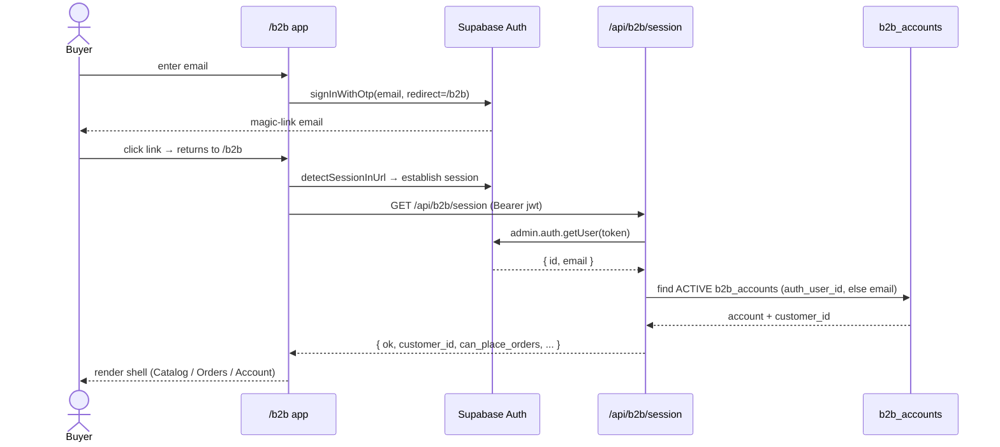
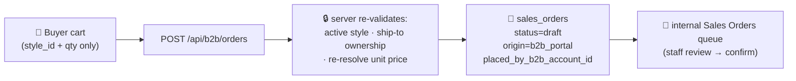

# 29. B2B Wholesale Portal (P18 — M40 + M41)

> **Status (2026-06-01):** MVP shipped (PRs #719–#723). The customer-facing portal at `/b2b` is live in code: passwordless magic-link sign-in, catalog with per-customer wholesale pricing, cart → draft sales order, and account/invoices/reorder pages — plus two internal admin panels (B2B Buyers + B2B Price List). It is **inert until an operator completes the go-live config** (see [§29.8](#298-operator-go-live-checklist)): the Supabase Auth redirect allowlist, magic-link email delivery, at least one active `b2b_accounts` row, and `b2b_price_list` entries. With none of those in place a buyer can't sign in, and even if they did the catalog would be empty.

P18 gives wholesale buyers a self-service storefront that feeds straight into the internal Sales Order pipeline. It is built as a **separate browser app** with its **own authentication**, fully isolated from the internal staff app (which signs in with Microsoft — see [25. Sign-in & Per-User Identity](25-sign-in-and-identity.md)) and from the vendor portal.

---

## 29.1 Portal overview & the `/b2b` URL

The portal lives at **`/b2b`** on the same origin as the rest of the suite. It is a standalone React app (`src/b2b/`) with three buyer pages behind a single authenticated shell:

| Page | What the buyer does |
|---|---|
| **Catalog** | Browse active styles, see *their* wholesale price, add to cart |
| **Orders** | Review the cart, submit an order, see order history, **Reorder** |
| **Account** | See open AR balance + invoice list (status-filterable) |

The header shows the buyer's customer name and display name; when the cart is non-empty a **🛒 cart chip** (units · running $ total) appears in the header and jumps to the Orders tab, and the **Orders** tab carries a live cart-unit badge. The cart is owned by the shell (`B2BShell.tsx`) so it survives tab switches.

Everything the buyer sees is **scoped server-side to exactly one customer**. The browser never sends a `customer_id` or a price — the server derives the customer from the verified session and re-resolves every price itself. This is the load-bearing security property of the whole portal.

---

## 29.2 Magic-link auth & `resolveB2BSession`

### Sign-in is passwordless

The buyer enters their email on `/b2b`; Supabase Auth (`signInWithOtp`) emails a one-time **magic link** that returns to `${origin}/b2b`. There is no password. The portal uses a **dedicated Supabase browser client** (`supabaseB2B`) with its own `storageKey: "sb-b2b-auth"` and `detectSessionInUrl: true`, so a logged-in buyer's session is completely isolated from the internal-app and vendor-portal sessions and the three can coexist in tabs of the same origin.

### Two gates: authentication, then authorization

A valid GoTrue session is **necessary but not sufficient**. After GoTrue establishes the session, the browser calls `GET /api/b2b/session` with `Authorization: Bearer <jwt>`, and the server runs the single chokepoint **`resolveB2BSession`** (`api/_lib/b2b/session.js`):

1. **Authenticate** — verify the bearer token with `admin.auth.getUser(token)` (the same proven path the vendor portal uses). This is a *real* GoTrue buyer session — **not** the staff MS-OAuth app-JWT, which the portal explicitly does not accept.
2. **Authorize** — the verified identity must also have an **active row in `b2b_accounts`**. Lookup is by `auth_user_id` first; on first login it falls back to `lower(email)` and **binds** `auth_user_id` (and stamps `last_login_at`). If the email matches a row already bound to a *different* identity, it refuses (`403`) rather than hijack the binding.
3. No active account, or `is_active = false`, or no linked `customer_id` → **403** (not authorized for the portal). No token → **401**.

The returned `customer_id` is the server-trusted scope used by **every** downstream endpoint. On the client, a `401` signs the buyer out back to the login screen; a `403` shows a "not authorized — contact your rep" notice and signs out so a stale session doesn't loop.

---

## 29.3 Catalog & per-customer pricing

The Catalog page (`GET /api/b2b/catalog`) lists active styles with **search + brand + gender + category filters** and a **sort** control (style code / name / price ↑↓), plus a live **result count**. Search/brand/gender hit the server (debounced 200 ms); category + sort refine the loaded set on the client so browsing 2,000+ styles stays instant. Each card has a **product-image slot** — the API returns a signed URL for the style's primary `product_images` row when one exists (it's empty until images are uploaded / pulled from Shopify), otherwise the card shows a branded placeholder so the grid stays uniform. The `min_qty` floor is shown on priced cards.

Pricing is resolved **server-side only** by `resolvePricesForCustomer` (`api/_lib/b2b/pricing.js`) against the `b2b_price_list` table. The resolver loads only rows that *can* apply to this buyer — its own customer-specific rows plus `customer_id IS NULL` tier/default rows — never another customer's prices. For each style it picks the single best row **most-specific-first**:

1. **customer-specific** — `b2b_price_list.customer_id = session customer_id`
2. **tier** — `customer_id IS NULL AND customer_tier = customers.customer_tier`
3. **default** — `customer_id IS NULL AND customer_tier IS NULL`

Rows are filtered by `is_active` and `effective_from`/`effective_to` against today; ties within a rank break to the lowest `price_cents`. A style with **no resolvable price shows no Add button** (you can't order a "call for price" item). `min_qty` from the winning row pre-fills and floors the quantity input.

---

## 29.4 Cart → draft Sales Order (`origin = 'b2b_portal'`)

Submitting the cart `POST`s `{ lines: [{ style_id, qty }], ship_to_location_id?, notes? }` to `/api/b2b/orders`. The server (`api/_handlers/b2b/orders/index.js`) re-validates everything — the client is never trusted:

- Requires `account.can_place_orders` (else **403**; the Submit button is also disabled client-side with a tooltip).
- Each `style_id` must be an **active, non-deleted** `style_master` style; duplicate style lines are collapsed by summing qty.
- `ship_to_location_id`, if supplied, must belong to the **session customer** (`customer_locations`).
- **Unit prices are re-resolved server-side** via the same pricing engine — client-supplied prices are ignored entirely. Any line with no resolvable price rejects the whole order.

The order lands as a **`draft` `sales_orders` row** stamped `origin = 'b2b_portal'` and `placed_by_b2b_account_id`, with `customer_id` forced to the session customer (never from the body). `code-style` note: because the native SO line has no style FK (it links to inventory items at fulfillment), each line's `description` is prefixed with a `[sid:<uuid>]` tag so the portal can map a placed line back to a style for **Reorder**. The buyer sees a success toast ("Order submitted… Your rep will review it shortly.").

From the draft onward it follows the normal internal Sales Order lifecycle (staff review → confirm → AR invoice). See **[27. Sales Orders](27-sales-orders-allocations-shipping.md)** for that pipeline. Portal-placed orders are identifiable in the queue by `origin = 'b2b_portal'`.

---

## 29.5 Account, invoices & reorder

- **Account** (`GET /api/b2b/account`) returns the customer's open AR balance (Σ `total − paid` over non-void/non-reversed invoices) and an invoice list (`invoice_number`, dates, `gl_status`, total/paid/balance), filterable by status. All scoped to the session customer.
- **Orders → history** (`GET /api/b2b/orders`) lists this customer's SOs newest-first with status + total. Draft orders that have no `so_number` yet display as `Draft <id-prefix>`.
- **Reorder** loads a past order's lines back into the cart (mapping via the `[sid:…]` tag). The historical unit price is shown only as a hint — the server **always re-resolves the authoritative current price** when the reorder is submitted.

The account endpoint also supplies the customer's `customer_locations` as the cart's **Ship to** picker options.

---

## 29.6 Internal admin panels (group: Customers)

Two staff-side panels in Tangerine manage the portal. Both are under the **Customers** group.

| Panel | Menu key / route | Icon | Manages |
|---|---|---|---|
| **B2B Buyers** | `/tangerine?m=b2b_accounts` | 🛍️ | `b2b_accounts` rows |
| **B2B Price List** | `/tangerine?m=b2b_price_list` | 🏷️ | `b2b_price_list` rows |

**B2B Buyers** (`src/tanda/InternalB2BAccounts.tsx`) is the **pre-authorization** step: map a customer + email to a portal `role` (buyer / approver / admin), toggle `is_active` and `can_place_orders`, set a display name. `auth_user_id` and `last_login_at` are **read-only** here — they bind/stamp on the buyer's first magic-link login on the portal side. Until a buyer has an active row here, they get a 403 at sign-in.

**B2B Price List** (`src/tanda/InternalB2BPriceList.tsx`) manages wholesale prices keyed by **(customer | tier | default) × style**, with `price_cents`, `currency`, `min_qty`, and optional `effective_from`/`effective_to`. These rows are exactly what `resolvePricesForCustomer` reads ([§29.3](#293-catalog--per-customer-pricing)).

Both panels carry the standard cross-cutters: column show/hide (TablePrefs), row-click edit, scroll-highlight, searchable selects, and the universal Export button.

---

## 29.7 What's NOT yet usable

- **A real pricing engine (M43).** `b2b_price_list` is the **interim** pricing source — the schema comment calls it a "Placeholder until the M43 Pricing Engine ships." There are no volume breaks, promo logic, contract pricing, or currency conversion beyond a per-row `currency`. Until M43, every catalog price must exist as a `b2b_price_list` row (customer/tier/default).
- **Approver workflow.** `b2b_accounts.role` includes `approver`/`admin`, but there is no in-portal multi-step approval — `can_place_orders` is the only order gate.
- **Payments in the portal.** The Account page is **read-only** AR (balance + invoices). There is no pay-online / card-capture flow here (card processing itself is still interface-only — see [19. Revenue Operations §19.1](19-revenue-operations.md)).
- **Self-registration.** Buyers cannot sign themselves up; an operator must pre-authorize each email in B2B Buyers.

---

## 29.8 Operator go-live checklist

These are **configuration** tasks (no code), all required before a buyer can transact:

1. **Supabase → Auth → URL Configuration → Redirect URLs:** add `<origin>/b2b` to the allowlist. The magic link redirects to `${window.location.origin}/b2b`; if that URL isn't allowlisted, GoTrue refuses the link.
2. **Magic-link email delivery:** configure Auth SMTP (or the chosen email provider) and the magic-link email template, so `signInWithOtp` actually sends.
3. **Authorize buyers:** in **B2B Buyers** (`/tangerine?m=b2b_accounts`), create at least one **active** `b2b_accounts` row per buyer — link the customer, set the email, and confirm `is_active` + `can_place_orders`.
4. **Populate pricing:** in **B2B Price List** (`/tangerine?m=b2b_price_list`), add `b2b_price_list` rows. Styles with no resolvable price are not orderable, so the catalog will look empty until this is done.

> The portal is also a no-op if the public Supabase env vars (`SB_URL`/`SB_KEY`) aren't present — `supabaseB2B` is `null` and the app shows "Portal unavailable." That's the same anon config the rest of the app already uses, so it's typically already set.

---

## 29.9 Code map

- **Schema:** `supabase/migrations/20260712190000_p18a_b2b_foundation.sql` — `b2b_accounts`, `b2b_price_list`, `sales_orders.origin` + `placed_by_b2b_account_id`, the `b2b_current_customer_id()` SECURITY DEFINER RLS helper, and defense-in-depth RLS policies.
- **Auth chokepoint:** `api/_lib/b2b/session.js` (`resolveB2BSession`, `extractBearer`); tests in `api/_lib/__tests__/b2b-session.test.js`.
- **Pricing resolver:** `api/_lib/b2b/pricing.js` (`resolvePricesForCustomer`, `pickBestPrice`).
- **Portal API handlers:** `api/_handlers/b2b/session.js`, `catalog.js`, `account.js`, `orders/index.js` (GET list + POST create), `orders/[id].js` (order detail for reorder).
- **Internal admin API:** `api/_handlers/internal/b2b-accounts/{index,[id]}.js`, `api/_handlers/internal/b2b-price-list/{index,[id]}.js`.
- **Portal app (customer-facing):** `src/b2b/` — `B2BApp.tsx` (session phases), `B2BLogin.tsx` (magic link), `B2BShell.tsx` (tabs + cart), `B2BCatalog.tsx`, `B2BOrders.tsx`, `B2BAccount.tsx`, `useCart.ts`, `apiB2B.ts`, `supabaseB2B.ts` (isolated client), `theme.ts`, `types.ts`.
- **Internal admin UI:** `src/tanda/InternalB2BAccounts.tsx`, `src/tanda/InternalB2BPriceList.tsx`; menu registration in `src/Tangerine.tsx` (keys `b2b_accounts` 🛍️ / `b2b_price_list` 🏷️, group **Customers**).
