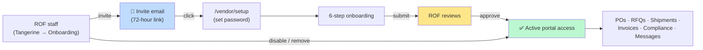

# 10 — Vendor Portal

## Who this chapter is for

This chapter covers the **Vendor Portal** at `/vendor` — the external website your factories and suppliers use to do business with Ring of Fire. It has **two audiences**, and both are covered here:

- **Ring of Fire staff** who invite vendors, approve onboarding, and manage who has portal access. Your tools live inside Tangerine at **🔧 Admin → 🚀 Onboarding**.
- **Vendors** (the suppliers themselves) who sign in at `/vendor` to acknowledge purchase orders, quote RFQs, submit shipments and invoices, upload compliance documents, and message the Ring of Fire team.

> The Vendor Portal is a **separate app** from Tangerine. Vendors sign in with their own email + password (not Microsoft). A Ring of Fire staff member never signs in *as* a vendor — staff manage vendors from the Tangerine side, vendors work from `/vendor`.

---

## Part A — For Ring of Fire staff

Everything in Part A happens in **Tangerine → 🔧 Admin → 🚀 Onboarding**. That one screen has three stacked sections: the **Onboarding review** list at the top, **Outstanding invitations** below it, and **Active vendor access** at the bottom.

### Inviting a vendor to the portal

1. Open **Tangerine → 🔧 Admin → 🚀 Onboarding**.
2. Click **+ Invite vendor to portal** (top-right).
3. In the **Invite vendor to portal** dialog:
   - **Vendor** — search and pick an existing vendor. If they don't exist yet, type the name and choose **+ Add new vendor "…"** to create one on the spot.
   - **Contact name** — optional; the person's name (e.g. "Jane Smith").
   - **Email** — required; the address that will receive the invite.
4. Click **Send invite**. The vendor receives a **magic-link email** that lands on the password-setup page.

> You can also invite from the **PO WIP (Tanda) Vendor Manager** — each vendor card has an **Invite to portal** button that opens the same kind of dialog, pre-filled with that vendor's contact email and name.

The invite link is valid for **72 hours**. (Ring of Fire uses its own invite tokens precisely so the window is a full 72 hours rather than the much shorter default.) If the email service isn't configured, the system returns the link on screen so you can send it to the vendor yourself.

### Outstanding invitations (and resending)

The **Outstanding invitations** section lists everyone who has been invited but **hasn't accepted yet** — one row per vendor + email, showing the latest invite and whether it's still **Pending** or has **Expired**.

| Button | What it does |
|---|---|
| **Resend** | Sends a fresh email with a new 72-hour link to the same address. |
| **Copy link** | Mints a fresh 72-hour link and copies it to your clipboard so you can send it to the vendor directly (also re-sends the email). Use this when the vendor says the email isn't arriving. |
| **Edit** (or click the row) | Fix a mistyped email address. Saving sends a brand-new invite to the corrected address and invalidates the old link. Only works while the invite is still unaccepted. |
| **Delete** | Appears only on **Expired** invites. Removes the invite and the unused login it created. You can re-invite the vendor anytime. |

> Once a vendor accepts their invite (sets a password), they drop off this list and appear under **Active vendor access**.

### Reviewing and approving onboarding

When a vendor finishes all six onboarding steps and submits for review, their workflow appears in the **Onboarding review** list with status **Pending review**.

1. Use the status dropdown (top-right) to filter: **Pending review · In progress · Approved · Rejected · All**.
2. Click **Review →** on a vendor's row to open the review modal. It shows each completed step, the data the vendor entered, and their banking summary (bank name + last 4 digits only).
3. Choose an action:
   - **Approve…** — enter your name (for the audit trail) and confirm. The vendor's access flips to **Active** and they can use the whole portal, including submitting invoices.
   - **Reject…** — tick the specific steps that need to be redone, enter a **rejection reason** (required), and confirm. The vendor sees an "Updates needed" banner with your reason and can fix and resubmit.

You can also export the whole onboarding list to Excel with the **Export** button.

### "Active vendor access" vs. approval — an important distinction

The green **Active** badge means **onboarding has been approved** — *not* simply that the vendor can log in.

A vendor can **sign in** the moment they accept their invite and set a password — that happens *before* you approve anything. Until you approve their onboarding, the **Active vendor access** list shows where they are, not a green "Active":

| Badge | Meaning |
|---|---|
| **Active** (green) | Onboarding approved — full portal access. |
| **Pending review** (blue) | Vendor submitted; waiting for your approval. |
| **Onboarding 3/6** (grey) | Still working through onboarding; the number is steps completed. |
| **Rejected** (red) | You rejected onboarding; vendor needs to fix and resubmit. |
| **Disabled** (amber) | You turned off their access (reversible). |
| **Removed** (red) | Their login was permanently deleted. |

### Disabling or removing vendor access

In the **Active vendor access** section, each row has action buttons:

- **Disable** — signs the vendor out and blocks them from the portal immediately. **Reversible** — the button becomes **Enable** so you can restore access later.
- **Enable** — restores access for a previously disabled vendor.
- **Remove** — **permanently** deletes the login. This cannot be undone, and the vendor would need a fresh invite to come back. **Financial and historical records are kept** (invoices, shipments, documents) — only the login goes away.

> Click any row in this list to open the same review modal and inspect that vendor's onboarding history.

---

## Part B — For vendors

### Accepting your invite and setting a password

1. You'll get an email titled **"You've been invited to the Ring of Fire vendor portal."** Click **Accept invite and set password**. (The link is valid for **72 hours** — if it expired, ask your Ring of Fire contact to resend it.)
2. You land on the **Set your password** page. Enter a password (at least 8 characters) and confirm it.
3. Click **Set password and continue**. You'll see a **"You're all set"** confirmation with your sign-in URL — **bookmark it** for next time, then click **Continue to dashboard**.

### Signing in (and forgotten passwords)

1. Go to your portal URL and you'll see the **Sign in** screen.
2. Enter **the email address that received your invite** and your password, then click **Sign in**.
3. Forgot your password? Click **Forgot password?**, enter your email, and click **Send reset link**. A reset link arrives by email (valid for about 1 hour). For security, the screen always says a link was sent — it never reveals whether an account exists.

> If you can sign in but see "This account is not linked to a vendor," your login isn't tied to a supplier record yet — contact your Ring of Fire admin.

### Onboarding — the 6 steps

The first time you sign in (before approval), the portal walks you through onboarding. **You must complete all six steps, and Ring of Fire must approve them, before you can submit invoices.** A progress bar and numbered step pills at the top show where you are; completed steps get a green check. You can click any completed (or current) step pill to go back and review or edit what you entered.

| # | Step | What you provide |
|---|---|---|
| 1 | **Company info** | Legal business name, address, business type, year founded. Tax ID (EIN/VAT) is optional. |
| 2 | **Banking** | Account holder, bank, account + routing numbers, account type, currency. These are **encrypted at rest** — only the last 4 digits are ever shown back. |
| 3 | **Tax** | Whether you collect/remit sales or VAT tax. If yes, choose your classification (W-9 or W-8BEN) and upload the tax document (PDF). |
| 4 | **Compliance docs** | Upload required documents from the **Compliance** tab, then return and click **I've uploaded everything — verify and continue**. No documents yet? Click **I currently do not have any** — you can continue, and the Ring of Fire team will follow up before you're cleared to invoice. |
| 5 | **Portal tour** | A short overview of the portal's sections; click **I've completed the tour**. |
| 6 | **Agreement** | Read the Vendor Portal Terms of Service, tick the box, and click **Accept and finish**. Your acceptance time and IP are recorded for audit. |

After the last step, click **Submit for review**. You'll see an **"Under review"** banner (typically approved within 1–2 business days). Once approved, an **"Approved"** banner confirms your account is active.

### Finding your way around

After approval, the top navigation tabs are: **🔔 Notifications · Dashboard · Purchase Orders · RFQs · Shipments · Invoices · Payments · Messages · Compliance**, plus a **More ▾** menu (Contracts, Catalog, Finance options, ESG, Disputes, Scorecard, Settings, and more). Your email and a **Sign out** button sit in the top-right.

### Language (🌐) — read the portal in your language

Next to your email in the top-right is a **🌐 language picker**. Choose your language and the **entire portal is translated automatically** by AI — labels, buttons, tables, form fields, and messages — across every screen. Switch back to **English** any time to see the original.

- **It defaults to your country.** On your first visit the portal looks at where you're connecting from and pre-selects a matching language (for example, Chinese in China, Vietnamese in Vietnam, Spanish in Mexico). If it can't tell, it uses your browser's language, otherwise English. Once you pick a language yourself, that choice sticks on this device.
- **Supported languages:** English, Chinese (Simplified & Traditional), Spanish, Vietnamese, Hindi, Bengali, Urdu, Indonesian, Thai, Korean, Japanese, Portuguese, French, German, Italian, Turkish, and Arabic. The picker always shows each language in its own script, and right-to-left languages (Arabic, Urdu) flip the layout automatically.
- **What is *not* translated:** order/PO numbers, SKUs, money, dates, email addresses, and company/brand names are deliberately left as-is so nothing important changes meaning.
- The first time you open a screen in a new language there may be a brief pause while it translates; after that it's cached and instant. A faint 🌐 flicker means a translation is in progress.

> Translation is a reading aid. When you **type** into the portal (messages, invoice fields, notes), Ring of Fire staff see what you typed in your own words — your input is not auto-translated.

### Purchase Orders

**Purchase Orders** is your home tab. The top shows four summary cards — **Open POs**, **Pending acknowledgment**, **Acknowledged**, and **Next shipment ETA** — and you can filter the list with **All / Action needed / Acknowledged**.

> Only current POs appear (anything ordered before December 2025 is older history you don't need to act on).

> Your PO list includes orders from **both** Ring of Fire's systems during the
> transition: legacy synced POs and newer POs created in the current ERP (the
> latter carry a small **TGR** tag next to the PO number). Going forward all POs
> will come from the new system. You can **acknowledge** TGR POs and **submit
> shipments (ASNs) and invoices** against them just like any other.

For each PO the list shows the PO number, issue date, required-by date (with a "(Nd)" countdown or "overdue" flag), amount, date received, quantity received vs. ordered, quantity and amount remaining, status, and your acknowledgment date.

1. Click **Acknowledge** on a row to confirm you've received the PO. The button turns into a green check with the date.
2. Click any **PO row** to open its detail page.

**PO detail** has its own header (PO number, buyer, status, key dates, line count) with:

- **📄 View PO** — a clean, printable view of the order.
- **Acknowledge PO** — same acknowledgment, available here too.
- A green **Shipped/Invoiced** chip once any non-rejected invoice exists for the PO.

Below the header are tabs:

- **Overview** — the order's line items rendered as a **size matrix**: base part + description + color down the rows, sizes across the columns, with per-row totals, average cost, total cost, and a grand-total footer. Closed lines are struck through and excluded from totals.
- **Messages** — a per-PO chat thread with the Ring of Fire team (unread messages from Ring of Fire show a badge).
- **Shipments** — shipments you've linked to this PO.
- **Invoices** — invoices submitted against this PO, color-coded by status.
- **Phases** — Ring of Fire's production milestone reviews for this PO.

### RFQs (Requests for Quote)

The **RFQs** tab lists quote requests Ring of Fire has sent you.

> **Important:** an RFQ only becomes visible to you **after Ring of Fire sends it** — drafts on the Ring of Fire side are not shown.

Each row shows the title, style, style name, quantity, category, due date, and a status badge (**Invited · Viewed · Quote submitted · Awarded · Not awarded · Declined**). Filter with **All / Open / Quoted / Won**. The list refreshes automatically when you return to the tab, so anything Ring of Fire withdraws disappears.

**Opening and quoting an RFQ:**

1. Click an RFQ to open it. You'll see the request details, any **product images** and **📎 Documents** (tech packs, spec sheets) attached to it, and a line-item table.
2. For each line, the table shows the style, style name, wash, size, fabric, **target unit price**, **required quantity**, and unit of measure. Fill in **your unit price**, optionally **your quantity**, and any **notes**. The **total price is calculated automatically** from your prices × quantities.
3. Set **Lead time (days)** and **Valid until** if applicable.
4. Click **Save draft** to keep working, or **Submit quote** to send it. (You can't edit a quote after submitting — but see revisions below.) You can also **Decline** the RFQ.
   - **Above-target check:** if your quoted price comes in higher than Ring of Fire's target, a warning appears — *"Your quoted price is N% higher than Ring of Fire's target."* Choose **Submit anyway** to send it as-is, or **Be more competitive** to go back and sharpen your price (your unit-price field is focused and selected automatically).
5. **⬇ Download Excel** exports the RFQ and your current entries so you can prepare offline.

**Revisions — both directions:**

- **You revise your quote:** while your quote is still open (submitted/under review) and the RFQ deadline hasn't passed, click **Revise quote**. Your current submission is saved as a prior version, the quote reopens as a draft, and you edit and re-submit. Your **revision history** is viewable at the bottom of the quote (each prior version's totals, lead time, and line prices).
- **Ring of Fire revises the RFQ:** if Ring of Fire changes a sent RFQ, you'll get a notification (bell + email) and, when you open the RFQ, a pop-up telling you it was revised. The **changed values are highlighted in green**, and the changed line shows a green **✎ Revised · date** badge so you know exactly what moved.

**Messaging on an RFQ:** every RFQ detail page has a **Messages** thread at the bottom so you can ask Ring of Fire questions about the request — even before any PO exists. (These also appear in your main **Messages** tab.)

### Shipments

Use the **Shipments** tab to submit advance shipping notices (ASNs) with carrier and tracking details, upload your packing list and bill of lading, and track shipment status. You can create a shipment, attach documents, and create an invoice directly from a shipment.

### Invoices

The **Invoices** tab shows summary cards (**Total invoices · Outstanding · Paid**) and the invoice list, filterable with **All / Open / Paid**.

- **Submit invoice** — click **+ Submit invoice** (you can only submit once onboarding is approved). Pick the PO, confirm the line quantities and prices, set dates, payment terms, and currency, and attach your invoice PDF.
- The **Type** column tells you the invoice's origin:
  - **Vendor bill** — an invoice you submitted through the portal.
  - **RoF bill** — a bill created on the Ring of Fire side (for example, synced from accounting).
- **Status** is color-coded (submitted, under review, approved, paid, rejected, disputed). The **Paid** column shows the payment date once it's paid.

Click any invoice to see its full detail and attachments.

### Compliance documents

The **Compliance** tab is a grouped checklist of the document types Ring of Fire requires (insurance, certifications, tax forms, etc.), organized into **Complete / Expiring soon / Missing / Rejected**. Upload a file against each required type (and an expiry date where needed). Each document shows a status badge — **Pending review · Approved · Rejected · Expiring soon · Expired** — and a rejection reason if Ring of Fire sent it back. This is also where step 4 of onboarding sends you.

### Messages, Notifications, and your Dashboard

- **Messages** — your conversations with the Ring of Fire team, both per-PO threads and per-RFQ threads. The tab shows an unread count.
- **🔔 Notifications** — alerts for new POs, RFQ revisions, approvals, and more. Unread alerts show a red badge; a pop-up also surfaces important items as they arrive.
- **Dashboard** — your performance and history at a glance, with date-range presets and clickable PO/invoice history. A **Scorecard** (under **More ▾**) tracks your performance over time.

### Document uploads in general

Throughout the portal you can attach files — invoice PDFs, packing lists, tax documents, compliance certificates, and more. Uploaded files keep their original filename and can be previewed in-app (Excel/CSV/PDF/Office formats) or downloaded. Attachments are limited to **15 MB** each.

---

## Working with the lists

The portal's list screens — Purchase Orders, Invoices, Shipments, RFQs, Contracts, and Disputes — share the same conveniences:

- **Sort any column** — click a column header to sort ascending (▲); click again for descending (▼); a third click clears it and restores the default order. Action and status-only columns stay un-sortable.
- **Search boxes select-all on focus** — clicking into a search box highlights the existing text so you can replace it in one keystroke.

## How your data is kept separate

You only ever see **your own** vendor's data. Every list and detail screen in the portal is scoped to your linked vendor — your POs, RFQs, shipments, invoices, and documents are filtered to your company and never show another vendor's records. Banking and tax-ID details you enter during onboarding are encrypted and only ever shown back as the last few digits.

---

## Quick reference

| I want to… | Where |
|---|---|
| Invite a vendor (ROF staff) | Tangerine → 🔧 Admin → 🚀 Onboarding → **+ Invite vendor to portal** |
| Resend / fix an invite (ROF staff) | Onboarding → **Outstanding invitations** → Resend / Copy link / Edit |
| Approve or reject onboarding (ROF staff) | Onboarding → **Onboarding review** → **Review →** |
| Disable or remove a vendor login (ROF staff) | Onboarding → **Active vendor access** → Disable / Remove |
| Accept my invite (vendor) | Invite email → **Accept invite and set password** |
| Acknowledge a PO (vendor) | Purchase Orders → **Acknowledge** |
| Quote an RFQ (vendor) | RFQs → open RFQ → enter prices → **Submit quote** |
| Revise my quote (vendor) | RFQ detail → **Revise quote** |
| Submit an invoice (vendor) | Invoices → **+ Submit invoice** |
| Upload compliance docs (vendor) | Compliance tab |
| Reset my password (vendor) | Sign-in screen → **Forgot password?** |
